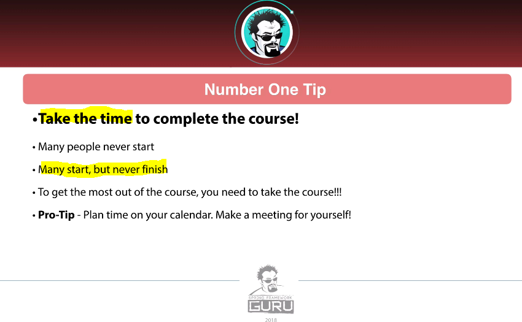
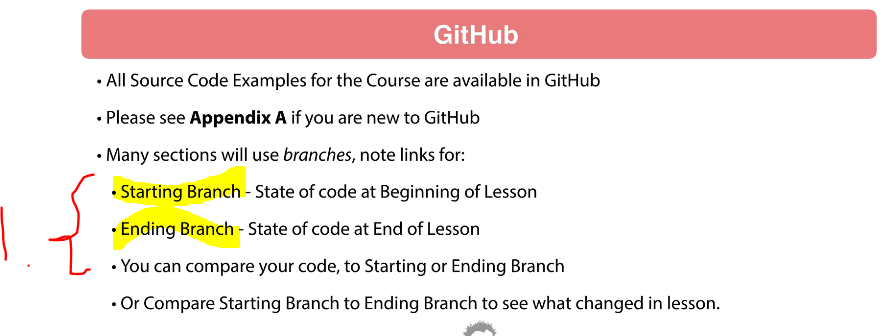
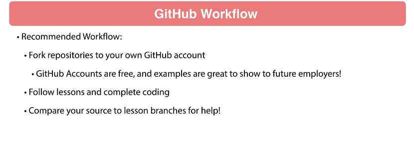
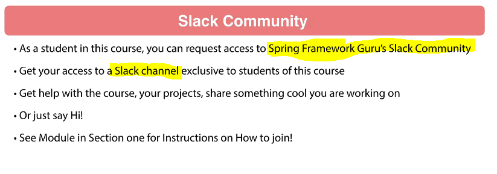
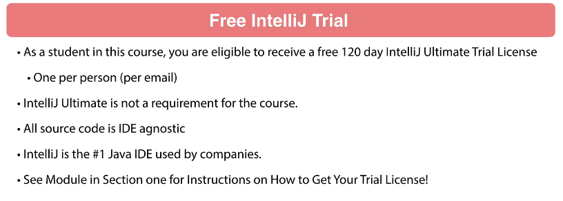
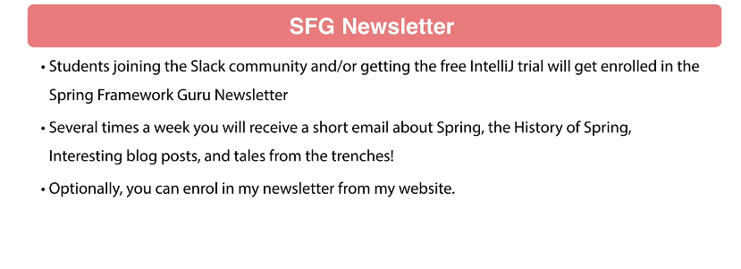
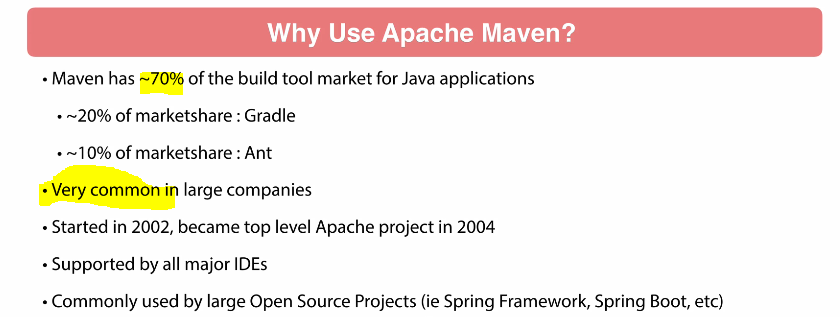
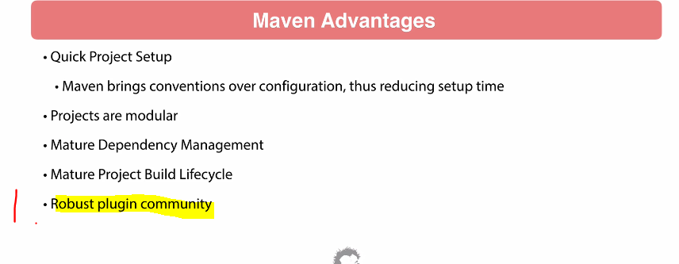
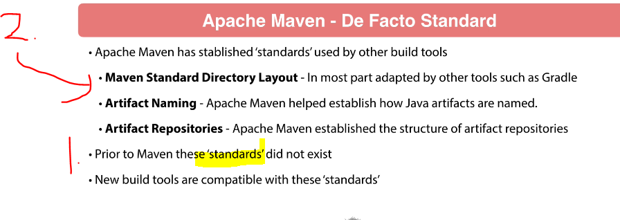
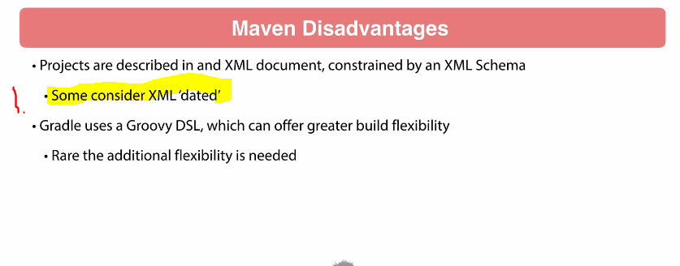

# Section 1: Apache Maven Introduction.

Apache Maven Introduction.

# What I Learned.

# 1. Welcome to Apache Maven - Beginner to Guru course.

- Lot of stuff. ✅

# 2. Meet your Instructor.

- He does stuff. ✅

# 3. Getting the Most Out of this Course.

1. If there is some **small typo** in project, we can compare versions.

# 4. Why Use Apache Maven?

- Maven stable.

1. Like **spring tools**.

1. Before **Maven**, there was no project **structure**.
2. With **Maven Directory Layout** brought a lot of maturity for Java community in General.

1. **XML** in general considered "old".

- **Maven** and **Gradle** have their own benefits. 

# 5. Slack Group for Apache Maven: Beginner to Guru.

- Check. ✅

# 6. Is your IDE Free Like a Puppy?

- When weird things happening in **IntelliJ**, try to **Invalid Caches**.
    - There is very fast and good support.

# 7. Free 120 Day IntelliJ IDEA Trial!

- Get Free license key for IntelliJ.

# 8. GitHub Workflow.

- Check. ✅

- The course is using the **GitHub** workflow.
    - There will be end and start checkpoint.
        - You can `compare` the solutions.