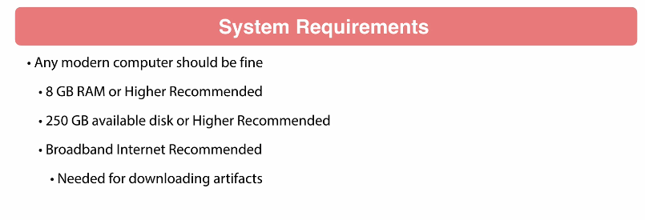
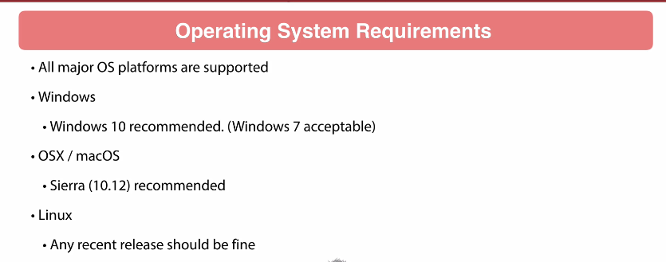
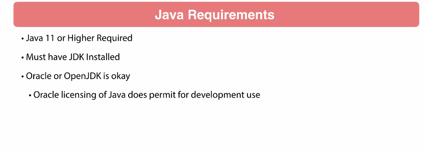
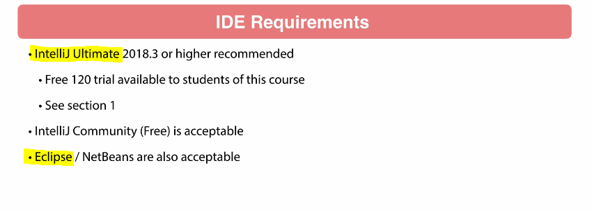

# Section 2: Getting Started.

Getting Started.

# What I Learned.

# 9. Introduction.

- Check ✅.

# 10. System Requirements.

- OpenJDK in the past were really buggy, now it's fine.

# 11. Maven Installation.

- Check ✅.

# 12. Environment Verification.

- Verifying `Java` < `11` is needed!
    - Runtime `java --version`
    - JDK `javac --version`
- Verifying `Maven` < `3.6`!
    - `mvn -v`

# 13. Conclusion.

- Check ✅.
