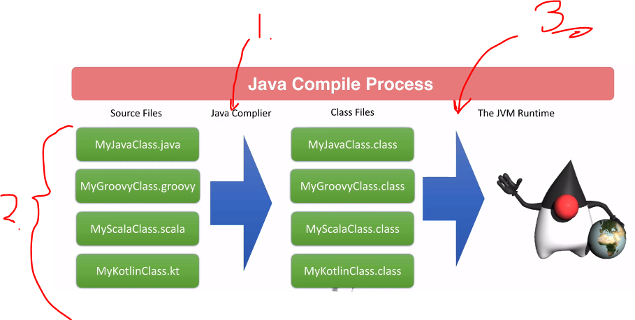
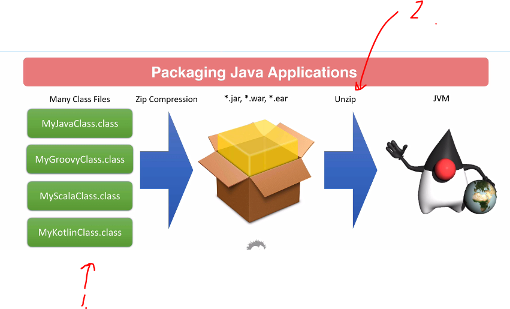
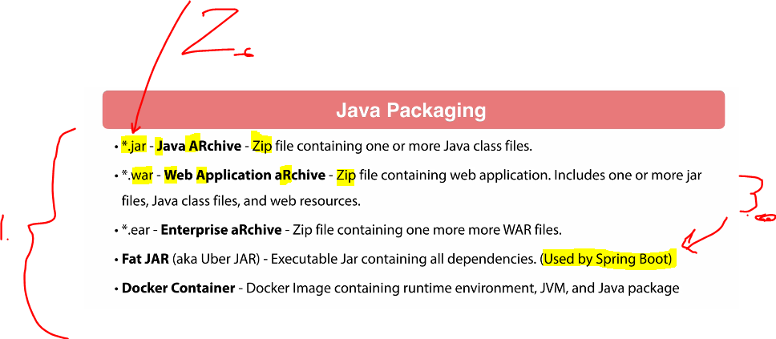
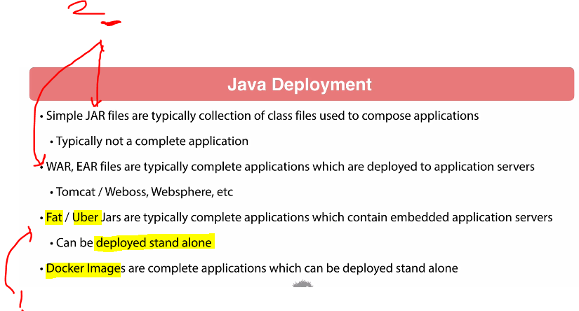
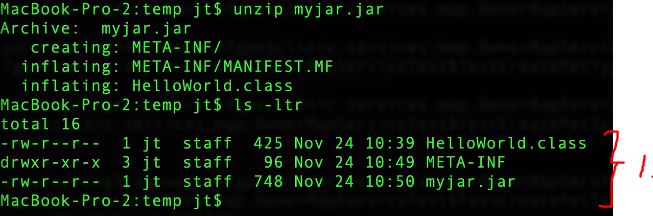
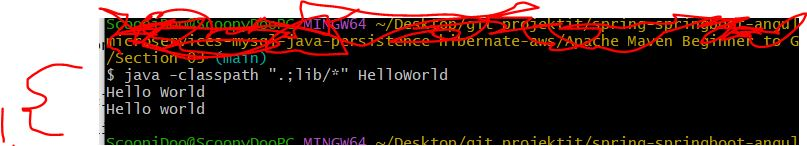

# Section 03: Compiling Java.

Compiling Java.

# What I Learned.

# Introduction.

- Check ✅.

# Review of Java Compile and Packaging.



1. These files are getting into **javac**.
2. Maven can handle multiple compilation tasks.
3. `.class` files are given into the JVM runtime.



1. Java project will have many files.
2. Unzip will happen and **JVM** will run these.



1. There are many ways to back Java application.
2. The most popular one is `.jar` zip file and the simplest one.
3. **FAT JAR** contains **all the dependencies**, Used by **Spring Boot**.



1. Nowadays, industry is moving more into **Deployable Stand-Alone** format.
2. Old school deployables.

# Hello World Java Command Line.

- Basic hello world.

```
public class HelloWorld {
    public static void main(String[] args) {
        System.out.println("Hello World");
    }
}
```

- **Maven** will be doing compiling to `.class` file and packing them.

# Creating Java jar files from Command Line.

- Packaging into the `.jar` file from the **class** file.
    - `cf` for creating file.
```
jar cf myjar.jar HelloWorld.class
```

> [!NOTE]  
> 
> In Java, setting the **classpath** means telling the Java Virtual Machine
> (JVM) or compiler **where to look for compiled** `.class` files (or `.jar`
> files) that your program needs to run.


- Running the **Java** file from the `.jar` file. 

> This sets the `classpath` to `myjar.jar`, and **Java** will look for the `HelloWorld.class` file inside that **JAR**. 

```
java -classpath myjar.jar HelloWorld
```

- The Output:

```
Hello World
```

- We are inspecting the `.jar` file next:

```
unzip myjar.jar
mkdir temp
cd temp
cd  ..
cp myjar.jar ./temp/
cd temp
unzip myjar.jar
```



1. Notice the **unzipped** files, there is more than one file!
    - `META-INF` folder.

- There will be **manifest file** named `MANIFEST.MF`, as following: 
    - This is part of **JAR** specification!

```
Manifest-Version: 1.0
Created-By: 21.0.5 (Eclipse Adoptium)
```

- When we're building **Java** with the **Maven**, we will be packing different files into the same package!

#  Using 3rd Party Jars with Command Line Java.

- We will be using the same, but will be using **third party libs**.

- We will be improving the 3rd party library from the **Apache** library and compiling it!

```
import org.apache.commons.lang3.StringUtils;

public class HelloWorld {
    public static void main(String[] args) {

        System.out.println("Hello World");
        System.out.println(StringUtils.capitalize("hello world"));
    }
}
```

- Telling Java compiler about the library `javac -classpath ./lib/* HelloWorld.java`
    - We need to **import** the `commons-lang3-3.8.1.jar` file into the local folder.

- To **Run** this in the **Windows**, we can run the:
    - `java -classpath ".;lib/*" HelloWorld`.



1. As you can see, the imported library working, the second print is in **lower** cases.

- Summary, we need to tell where the **external** libraries are when **compiling** and **running** the files:
    - **Compiling**: `javac -classpath ./lib/* HelloWorld.java`, here is the place where is the `commons-lang3-3.8.1.jar`.
    - **Running**: `java -classpath ".;lib/*" HelloWorld`, here is the place where is the `commons-lang3-3.8.1.jar`.


> [!NOTE]
> All this can be simplified using of **Maven** build tool!

# Quiz 1: Quiz: Compiling Java

- ✅.

# Conclusion.

- ✅.
