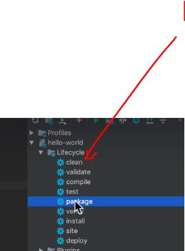
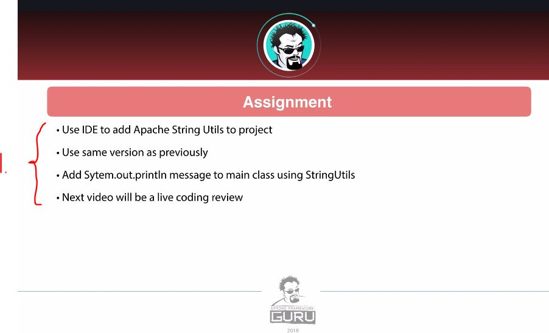

# Section 04: Getting Started with Maven.

Getting Started with Maven.

# What I Learned.

# Introduction.

- We will build Maven tool project.

# Compiling and Packaging with Maven.

- Example of the minimum **POM** for the **Java** project.
    -  The maven schema **4.0.0**`maven-4.0.0.xsd`.

```
<?xml version="1.0" encoding="UTF-8"?>
<project xmlns="http://maven.apache.org/POM/4.0.0" xmlns:xsi="http://www.w3.org/2001/XMLSchema-instance" xsi:schemaLocation="http://maven.apache.org/POM/4.0.0 http://maven.apache.org/xsd/maven-4.0.0.xsd">
    <modelVersion>4.0.0</modelVersion>

    <groupId>guru.springframework</groupId>
    <artifactId>hello-world</artifactId>
    <version>0.0.1-SNAPSHOT</version>
    
    <properties>
        <project.build.sourceEncoding>UTF-8</project.build.sourceEncoding>
        <project.reporting.outputEncoding>UTF-8</project.reporting.outputEncoding>
        <java.version>11</java.version>
        <maven.compiler.source>${java.version}</maven.compiler.source>
        <maven.compiler.target>${java.version}</maven.compiler.target>
    </properties>
    
</project>
```

- These are called **coordinates** for the **Maven**.
```
    <groupId>guru.springframework</groupId>
    <artifactId>hello-world</artifactId>
    <version>0.0.1-SNAPSHOT</version>
```


- `mvn clean` will the environment.
- `mvn package` will compile your code, run tests, and package the compiled code into a JAR or WAR file.

- We will make the `.jar` file with the `mvn package`.


1. You can see that **target** folder is made, also there is `SNAPSHOT` version in folder.

- `MANIFEST.MF` will be following, with the **POM** file.

```
Manifest-Version: 1.0
Created-By: Maven JAR Plugin 3.4.1
Build-Jdk-Spec: 21
```

- We can chain the **mvn** commands after each other, like so `mvn clean pacakage`. This will be running:
    - Maven **Clean**.
    - Maven **Package**.
        - Once the Maven package is executed. We can see the `.class` file will be compiled into the `.jar` file, **no** need for separate compiled command!

# Including Dependencies with Maven.

- We need to add following into the POM, for the decencies:
    - Check the latest [mvn repo](`https://mvnrepository.com/artifact/org.apache.commons/commons-lang3`) for the **Apache Commons Lang**.

```
<dependency>
    <groupId>org.apache.commons</groupId>
    <artifactId>commons-lang3</artifactId>
    <version>3.18.0</version>
</dependency>
```

- Our **POM** looks like such now:

```
<?xml version="1.0" encoding="UTF-8"?>
<project xmlns="http://maven.apache.org/POM/4.0.0" xmlns:xsi="http://www.w3.org/2001/XMLSchema-instance" xsi:schemaLocation="http://maven.apache.org/POM/4.0.0 http://maven.apache.org/xsd/maven-4.0.0.xsd">
    <modelVersion>4.0.0</modelVersion>

    <groupId>guru.springframework</groupId>
    <artifactId>hello-world</artifactId>
    <version>0.0.1-SNAPSHOT</version>
    
    <properties>
        <project.build.sourceEncoding>UTF-8</project.build.sourceEncoding>
        <project.reporting.outputEncoding>UTF-8</project.reporting.outputEncoding>
        <java.version>11</java.version>
        <maven.compiler.source>${java.version}</maven.compiler.source>
        <maven.compiler.target>${java.version}</maven.compiler.target>
    </properties>
	 <dependencies>
	<dependency>
		<groupId>org.apache.commons</groupId>
		<artifactId>commons-lang3</artifactId>
		<version>3.18.0</version>
	</dependency>
    </dependencies>
</project>
```

 - Running `mvn clean package`, we can see that there are **no dependencies** included.
    - This is not **included** in compile time only!


# Creating a new Maven Project with IntelliJ.

- Hello World [project](https://github.com/springframeworkguru/helloworld)!

- Archives are **start projects**.

- **Enable Auto-import** can be making pc slower for bigger projects, where there are multiple decencies.


    
1. Running the **mvn clean** is fundamentally the same as running inside the **IntelliJ** maven lifecycle methods.

# Assignment - Add StringUtils Dep to Project.



1. **Question 1:**
    - Use IDE to add **Apache StringUtils** to the project  
    - Use the **same version** as previously  
    - Add `System.out.println` message to main class using `StringUtils`  
    - Next video will be a **live coding review**

- **Answer:** My answer is below:
    - We add following into the **POM**. 

```
<?xml version="1.0" encoding="UTF-8"?>
<project xmlns="http://maven.apache.org/POM/4.0.0"
         xmlns:xsi="http://www.w3.org/2001/XMLSchema-instance"
         xsi:schemaLocation="http://maven.apache.org/POM/4.0.0 http://maven.apache.org/xsd/maven-4.0.0.xsd">
    <modelVersion>4.0.0</modelVersion>

    <groupId>guru.springframework</groupId>
    <artifactId>hello-world</artifactId>
    <version>1.0-SNAPSHOT</version>

    <properties>
        <project.build.sourceEncoding>UTF-8</project.build.sourceEncoding>
        <project.reporting.outputEncoding>UTF-8</project.reporting.outputEncoding>
        <java.version>11</java.version>
        <maven.compiler.source>${java.version}</maven.compiler.source>
        <maven.compiler.target>${java.version}</maven.compiler.target>
    </properties>

    <dependencies>
        <dependency>
            <!-- https://mvnrepository.com/artifact/org.apache.commons/commons-lang3 -->
                <groupId>org.apache.commons</groupId>
                <artifactId>commons-lang3</artifactId>
                <version>3.18.0</version>
        </dependency>


    </dependencies>
</project>
```

- The **Main** class, looks following: 

```
import org.apache.commons.lang3.StringUtils;

/**
 * Created by jt on 2018-11-26.
 */
public class HelloWorld {

    public static void main(String[] args) {
        

        System.out.println("Hello World");
        System.out.println(StringUtils.capitalize("hello world"));

    }
}
```

# Assignment Review - Add StringUtils Dep to Project

- The same stuff as in upper. ✅

# Conclusion.

- We built just minimal project. 