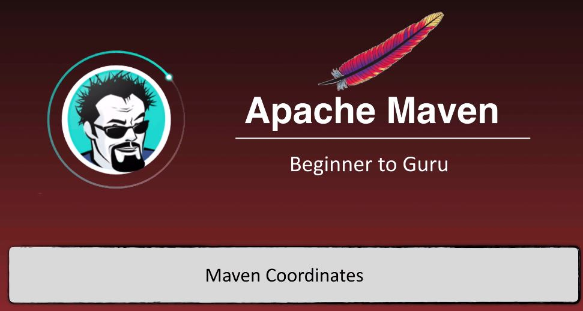
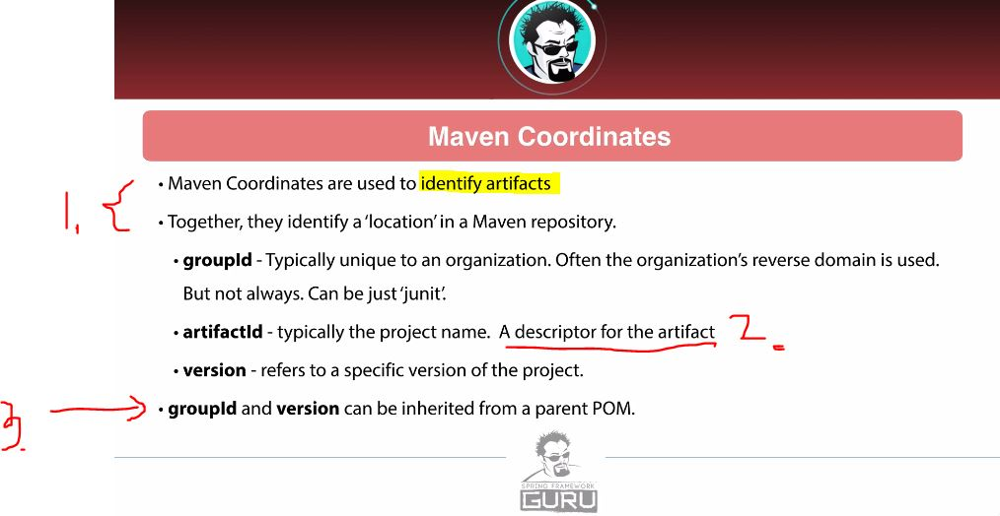
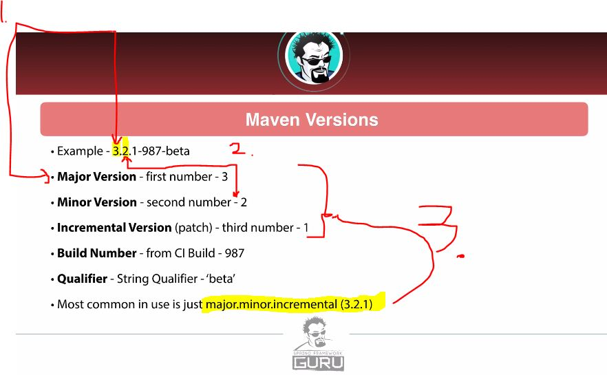
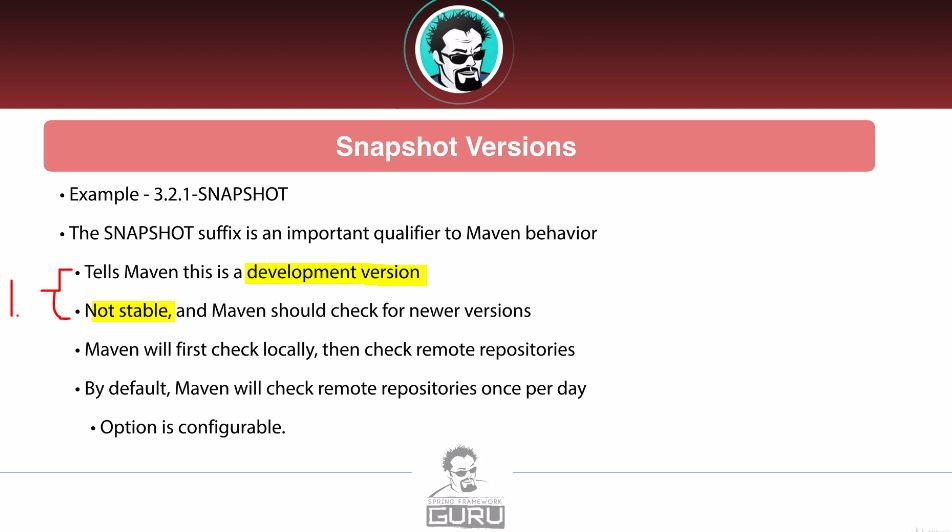

# Section 5: Maven Basics.

Section 5: Maven Basics

# What I Learned.

# Introduction.

- Lot of power points and less practical work at work!  

# Maven Coordinates.

1. **Maven coordinates** are used to **identify artifact** and can be used to **identify position** in **maven repository**.
    - When we build **JAR** or **WAR** its **organized** into repository using the **maven coordinates**!
2. `artifactId` We want some **unique descriptor** for **artifact**!
3.  `groupId` and `version` **can be** inherited from **parent POM**!
    - **Most of the time**, there will be **version** inherited!

1. First number, will be **major version**!
2. Second number, will be **minor version**!
3. Most of the time there will be `major.minor.inceremntal` → `3.2.1`!

1. `SNAPSHOT` tells this is **development version**.
    - It tells that, **maven** should be checking **newer versions** as configured(**once per day**) 

# Maven Repositories.