# Section 05: Maven Basics.

Maven Basics.

# What I Learned.

# Introduction.

- There will be a lot of power points and less practical work at work!  

# Maven Coordinates.


1. **Maven coordinates** are used to **identify artifact** and can be used to **identify position** in **maven repository**.
    - When we build **JAR** or **WAR** its **organized** into repository using the **maven coordinates**!
2. `artifactId` We want some **unique descriptor** for **artifact**!
3.  `groupId` and `version` **can be** inherited from **parent POM**!
    - **Most of the time**, there will be **version** inherited!


1. First number, will be **major version**!
2. Second number, will be **minor version**!
3. Most of the time there will be `major.minor.inceremntal` → `3.2.1`!


1. `SNAPSHOT` tells this is **development version**.
    - It tells that, **maven** should be checking **newer versions** as configured(**once per day**).

# Maven Repositories.

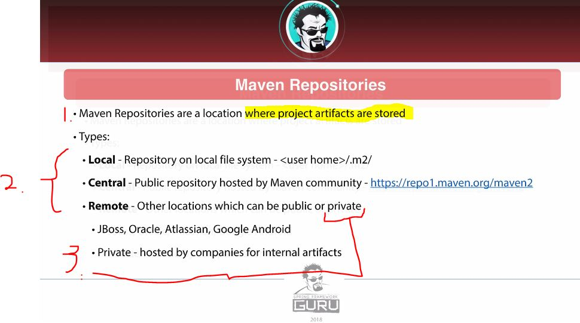

1. These **repositories** are for the **artifacts**, where they are stored!
2. There are different types:
    - **Local** – Repository on **local file system** – `<user home>/.m2/`
    - **Central** – **Public repository** hosted by Maven community, where the public ones are stored – `https://repo1.maven.org/maven2`
        - This one of the main place where artifacts are stored for **Maven** and **Java**. 
    - **Remote** – Other locations which can be public or private.
        - Big companies have this "other place to look", called **remote**.
            - Example. **JBoss**, **Oracle**, **Atlassian**, **Google Android**.
        - Private – hosted by companies for internal artifacts.
3. These **Remote** and **Private** can be used inside company, for sharing internal artifacts inside company.

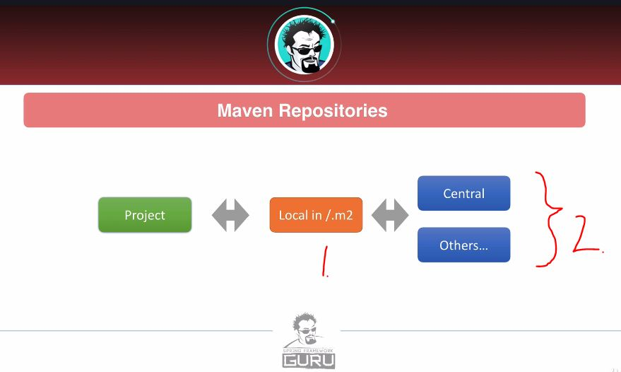

1. Artifacts are checked inside first `.m2`.
2. Then inside the `central` or if as per configuration.

> **RELEASE artifacts** in Maven are cached in the local repository `(~/.m2)` once, and never downloaded again, unless manually deleted.

> **SNAPSHOT artifacts**
Maven checks **remote repositories** for **newer versions** of snapshots, even if one already exists in your local `.m2`.
They are **not** cached permanently like releases

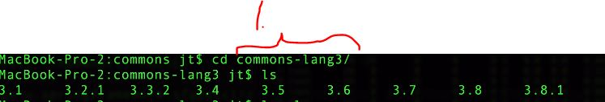

1. We can see that **artifact** has different versions, in the local repository.

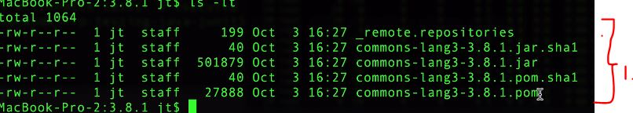

1. At **local repository**. There is not only `POM` and `.jar` file inside included dependency. **Most** often, there is only `POM` and `.jar`.
    - That dependency can have dependencies, that's why it has **POM**.

- In **POM**:

```
        <dependency>
            <!-- https://mvnrepository.com/artifact/org.apache.commons/commons-lang3 -->
                <groupId>org.apache.commons</groupId>
                <artifactId>commons-lang3</artifactId>
                <version>3.8.1</version>
        </dependency>
```

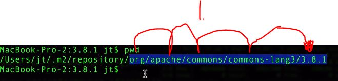

1. You can see **Maven coordinates** playing out, **as defined**!

- You can see, that there is much more **files** in the **central repository** for given dependency `https://repo1.maven.org/maven2/org/apache/commons/commons-lang3/3.8/`.
    - This also uses the **Maven coordinates** for navigating!

# Maven Wagon.

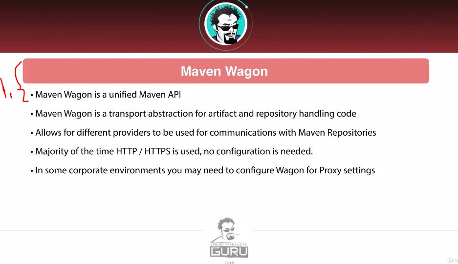

1. **Maven Wagon** is for uploading and downloading **artifacts** from maven repository.

- These are not been problem lately!
    - Network engineer usually have taken care of this. In practice just use **Maven Wagon**.

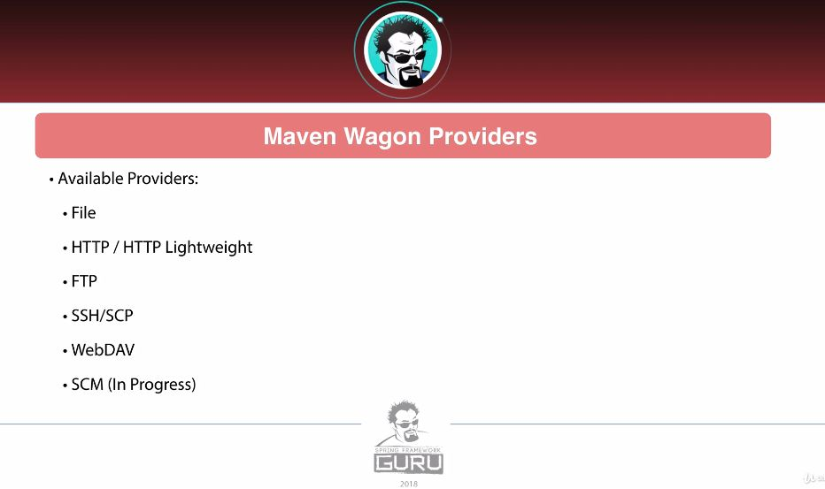

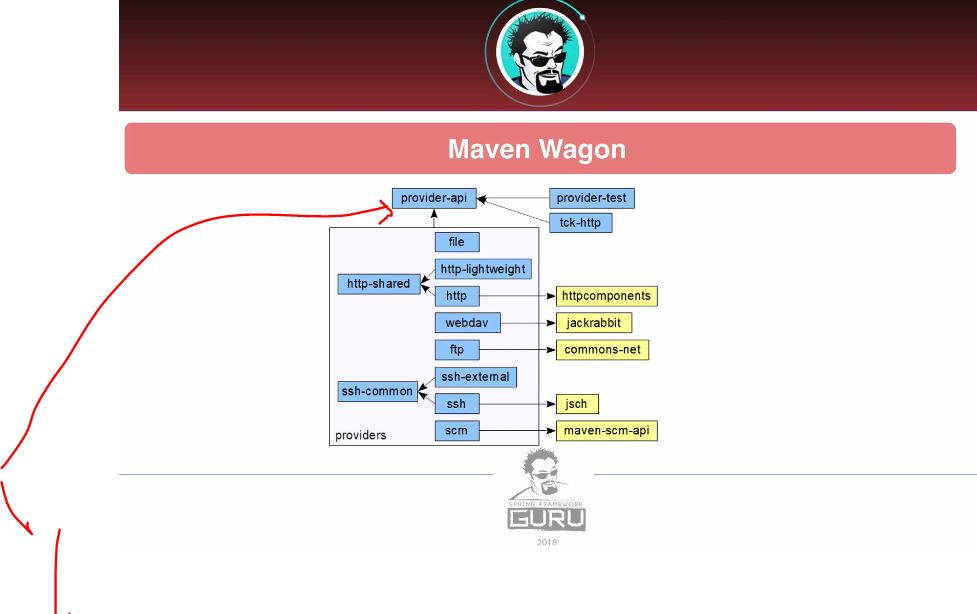

1. **Maven** team has implemented **common API** to communicate.
    - Maven has a lot of tool implemented already.
        - Such as, if one needs proxy, this can be found already inside **Maven**.

# Maven Project Object Model.


1. **POM** is standing for the **P**roject **O**bject **M**odel.
    - POM is used to describe build process!

2. The `maven-4.0.0.xsd` **schema** defines what can be inside **POM**.
    - This is **pretty** huge file!
3. In **spring** projects, some are inheriting from the parent project.

- **Effective POM** is the **POM** that gets used when there is compilation.
    - In **IntelliJ** its, when click the `show effective POM`. 
    - In **Maven** this can be called with: `mvn help:effective-pom`.

# Maven Dependencies.


1. **Transitive Dependency** is called, if you have dependency and that dependency has dependency!
2. **Maven Management** feature of **Maven**, allows authors to specify certain of dependency to use!

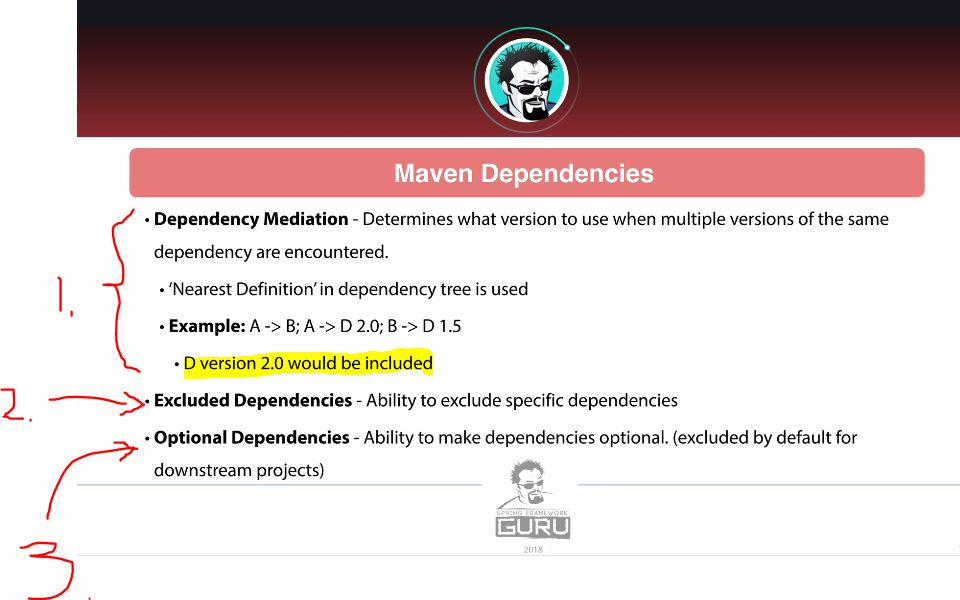

1. When there is multiple version of same **dependency**, which one gets applied?
    - In Maven terms: `Nearest Defination` in dependency tree is used!

2. We can **Exclude Dependencies**!
3. We can make **Optional Dependencies**, for example if we use build multiple **JAR** files. Furthermore, we can optionally exclude this from the other **JAR**.

> In **Java** and **Maven context**, there is **Three** main class paths.
>
> **Run Class Path**:
> Tells Java Virtual Machine (JVM) where to find your **compiled classes** and **libraries**.
>
> **Compile Class Path**:
> Tells where to find **compiled classes** and **libraries** for the **Java compiler**!
>
> **Test Class Path**:
> For the test runners. This is for **compile** and **run tests**.

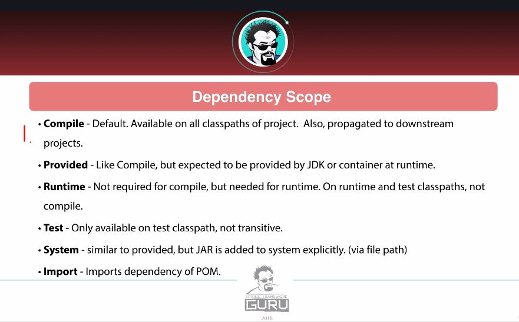

1. These **keywords** define the **scopes** for the **dependencies**!
2. **Compile** is the default scope. This projected into to the inherited **dependencies**!
3. **Provided** is expecting to provide dependencies, by the **JDK** or the **container** at runtime!
4. **Runtime** the dependency is **not needed at compile** time, but in the **Runtime**. For example:
> JDBC Drivers, logging backends, or other libraries that are only called > via reflection or injected at **runtime**.
5. **Test** makes only available in **Test Classpath**.
    - One **common mistake**, is that the is being omitted from the test decencies. This will be **prograded** into the child dependencies, which is not wanted.
> **Test Dependencies**. Be included in the test classpath (for compiling 
and running tests).
6. **System** is similar to the **Provided**, but `.jar` is added to the system **explicitly** (**file path**).
> [!WARNING]
> **Scope** is mostly discouraged. It's inflexible, doesn't work well across teams or CI environments, and has better alternatives.
7. **Import** Used to import **version number management** inside `<dependencyManagement>`.
    - It lets you import a **BOM** (Bill of Materials), which is a Maven feature that **manages dependency versions** in one place.
    - It does **not add** any actual dependencies to your project — it only brings in version information and centralizes dependency management.

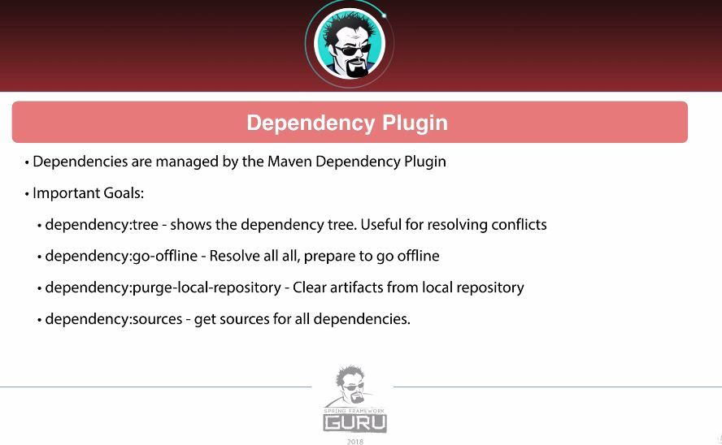

- **Dependency Plugins**.

1. **Shows** dependency tree. **Command:** `mvn dependency:tree`. This will be useful when **resolving conflict**! You can see the versions and where it's coming from. Example of the output:

```
[INFO] com.example:my-app:jar:1.0
[INFO] +- org.springframework:spring-context:jar:5.3.27:compile
[INFO] |  +- org.springframework:spring-core:jar:5.3.27:compile
[INFO] |  \- org.springframework:spring-beans:jar:5.3.27:compile
[INFO] +- junit:junit:jar:4.13.2:test
[INFO] \- com.fasterxml.jackson.core:jackson-databind:jar:2.15.2:compile
```

2. **Preloads** all projects decencies **into the local** repository. **Command:** `mvn dependency:go-offline`.
    - Useful for the **CircleCI** build to cache your dependencies. 
3. **Clears** the artifacts form local repository. **Command:** `mvn dependency:purge-local-repository`.
    - Useful if there are some dependencies **corrupted**.
4. **Source file** are being downloaded. This especially the case, when **open-source** project are published into **maven central**.  **Command:** `mvn dependency:sources`.

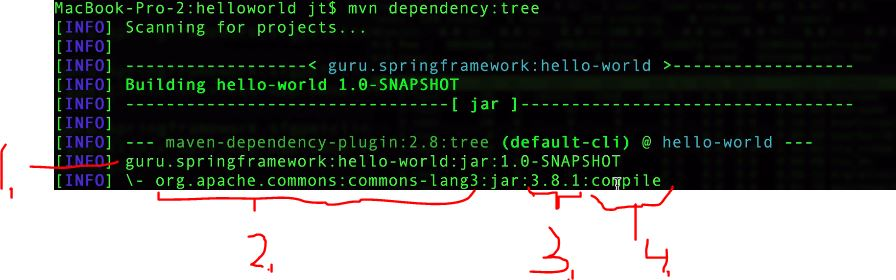

1. The **project**.
2. The **coordinates**.
3. The **version**.
4. The **scope**.

# Maven Standard Directory Layout.

- In **beginning** there was **no** common `Java standard directory layout`!
    - Apache maven set the standard as **defacto**.
    
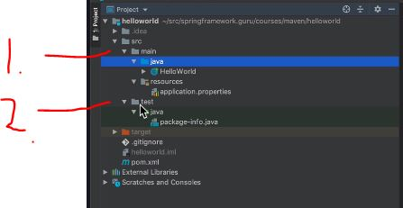

1. `Main` for the for files. 
2. `Test` for test related things.
3. Under `Main` is **usually** categorized with **Language**.

- You can check the latest standard from here: [Standard Directory Layout](https://maven.apache.org/guides/introduction/introduction-to-the-standard-directory-layout.html).

- If you **need** to override the standard layout, you **should** ask why? 

# Maven Build Lifecycles.

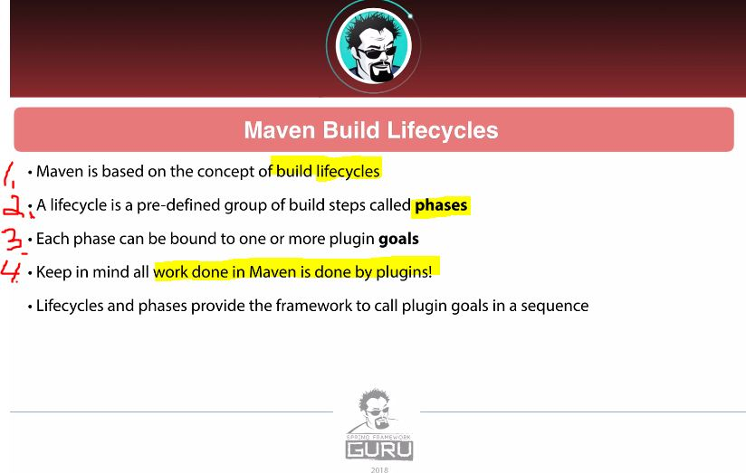

1. Mavens building block is **build lifecycle**.
2. **Lifecycle** is pre-defined group of the **steps** called **phases**.
3. These **phases** can bound to one or more **plugin goals**!
4. Work is done by **Maven plugins**!

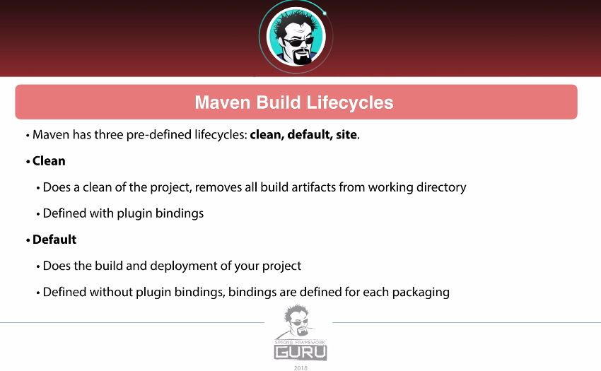

1. Maven has **three** pre-defined **lifecycles**.

- Todo tee udestaan.

# Maven Wrapper.

- Todo

# Maven Archetypes.

- Todo

# Conclusion.