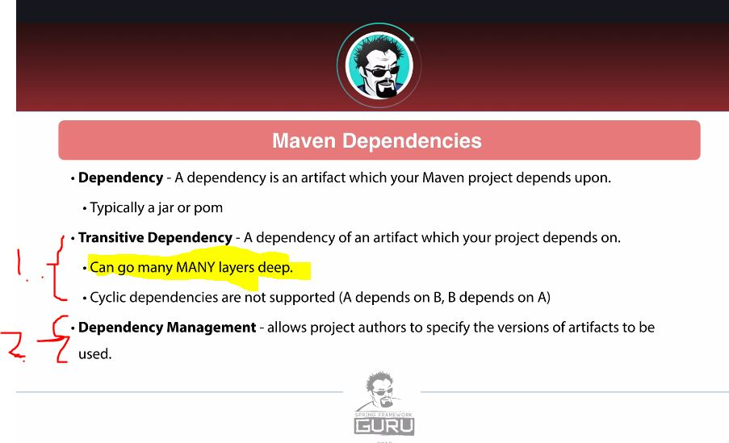
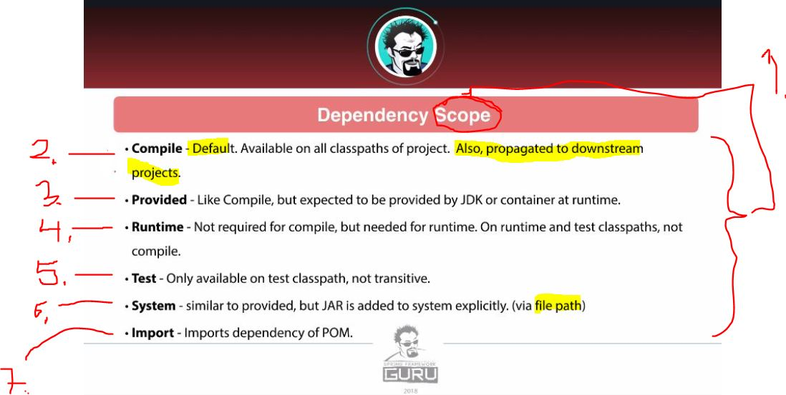
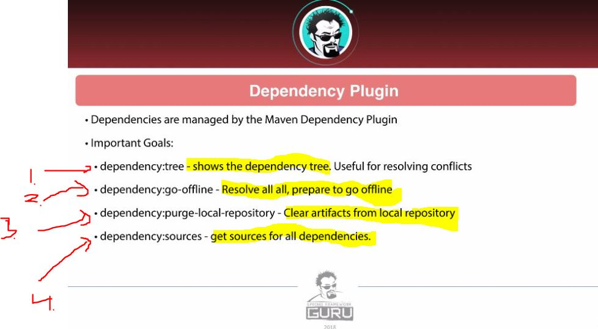

# Section 5: Maven Basics.

Section 5: Maven Basics

# What I Learned.

# Introduction.

- Lot of power points and less practical work at work!  

# Maven Coordinates.


1. **Maven coordinates** are used to **identify artifact** and can be used to **identify position** in **maven repository**.
    - When we build **JAR** or **WAR** its **organized** into repository using the **maven coordinates**!
2. `artifactId` We want some **unique descriptor** for **artifact**!
3.  `groupId` and `version` **can be** inherited from **parent POM**!
    - **Most of the time**, there will be **version** inherited!


1. First number, will be **major version**!
2. Second number, will be **minor version**!
3. Most of the time there will be `major.minor.inceremntal` → `3.2.1`!


1. `SNAPSHOT` tells this is **development version**.
    - It tells that, **maven** should be checking **newer versions** as configured(**once per day**).

# Maven Repositories.


1. These **repositories** are for the **artifacts**, where they are stored!
2. There are different types:
    - **Local** – Repository on **local file system** – `<user home>/.m2/`
    - **Central** – **Public repository** hosted by Maven community, where the public ones are stored – `https://repo1.maven.org/maven2`
        - This one of the main place where artifacts are stored for **Maven** and **Java**. 
    - **Remote** – Other locations which can be public or private.
        - Big companies have this "other place to look", called **remote**.
            - Example. **JBoss**, **Oracle**, **Atlassian**, **Google Android**.
        - Private – hosted by companies for internal artifacts.
3. These **Remote** and **Private** can be used inside company, for sharing internal artifacts inside company.


1. Artifacts are checked inside first `.m2`.
2. Then inside the `central` or if as per configuration.

> **RELEASE artifacts** in Maven are cached in the local repository `(~/.m2)` once, and never downloaded again, unless manually deleted.

> **SNAPSHOT artifacts**
Maven checks **remote repositories** for **newer versions** of snapshots, even if one already exists in your local `.m2`.
They are **not** cached permanently like releases


1. We can see that **artifact** has different versions, in the local repository.


1. At **local repository**. There is not only `POM` and `.jar` file inside included dependency. **Most** often, there is only `POM` and `.jar`.
    - That dependency can have dependencies, that's why it has **POM**.

- In **POM**:

```
        <dependency>
            <!-- https://mvnrepository.com/artifact/org.apache.commons/commons-lang3 -->
                <groupId>org.apache.commons</groupId>
                <artifactId>commons-lang3</artifactId>
                <version>3.8.1</version>
        </dependency>
```


1. You can see **Maven coordinates** playing out, **as defined**!

- You can see, that there is much more **files** in the **central repository** for given dependency `https://repo1.maven.org/maven2/org/apache/commons/commons-lang3/3.8/`.
    - This also uses the **Maven coordinates** for navigating!

# Maven Wagon.


1. **Maven Wagon** is for uploading and downloading **artifacts** from maven repository.

- These are not been problem lately!
    - Network engineer usually have taken care of this. In practice just use **Maven Wagon**.


1. **Maven** team has implemented **common API** to communicate.
    - Maven has a lot of tool implemented already.
        - Such as, if one needs proxy, this can be found already inside **Maven**.

# Maven Project Object Model.


1. **POM** is standing for the **P**roject **O**bject **M**odel.
    - POM is used to describe build process!

2. The `maven-4.0.0.xsd` **schema** defines what can be inside **POM**.
    - This is **pretty** huge file!
3. In **spring** projects, some are inheriting from the parent project.

- **Effective POM** is the **POM** that gets used when there is compilation.
    - In **IntelliJ** its, when click the `show effective POM`. 
    - In **Maven** this can be called with: `mvn help:effective-pom`.

# Maven Dependencies.



1. **Transitive Dependency** is called, if you have dependency and that dependency has dependency!
2. **Maven Management** feature of **Maven**, allows authors to specify certain of dependency to use!


1. When there is multiple version of same **dependency**, which one gets applied?
    - In Maven terms: `Nearest Defination` in dependency tree is used!

2. We can **Exclude Dependencies**!
3. We can make **Optional Dependencies**, for example if we use build multiple **JAR** files. Furthermore, we can optionally exclude this from the other **JAR**.

- Todo tee tämä uudestaan.



1. **Compile** is the default scope.



