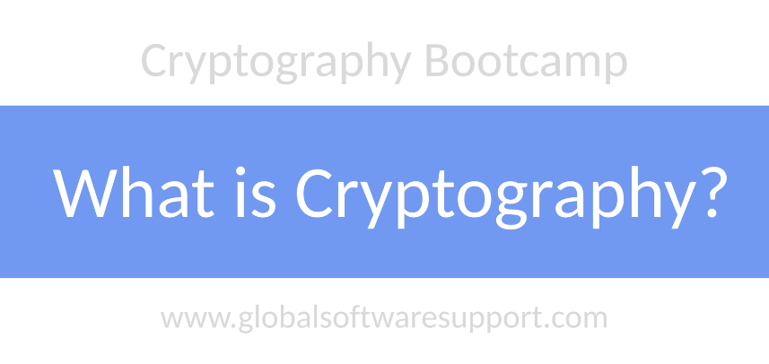
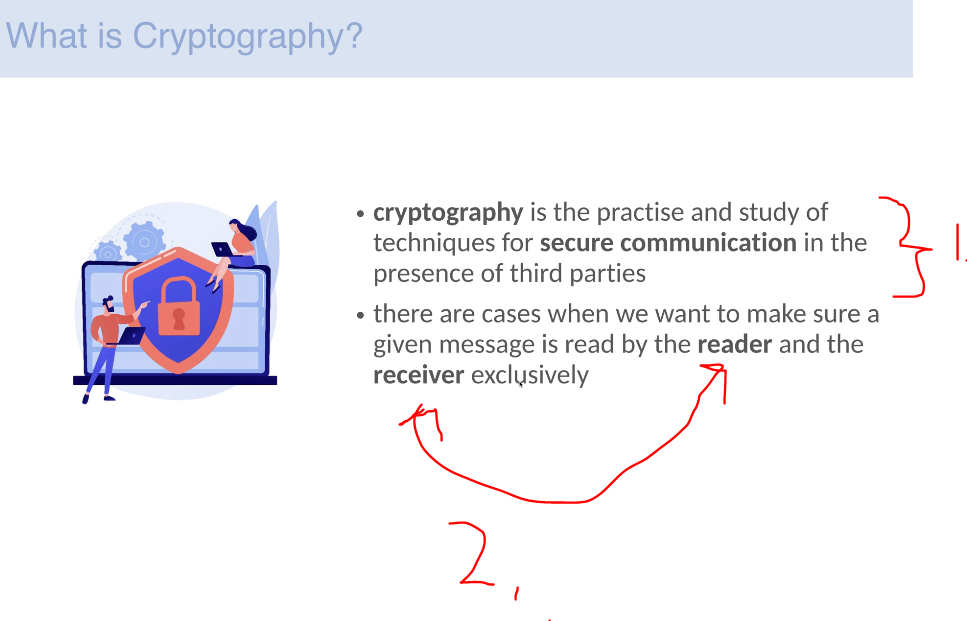
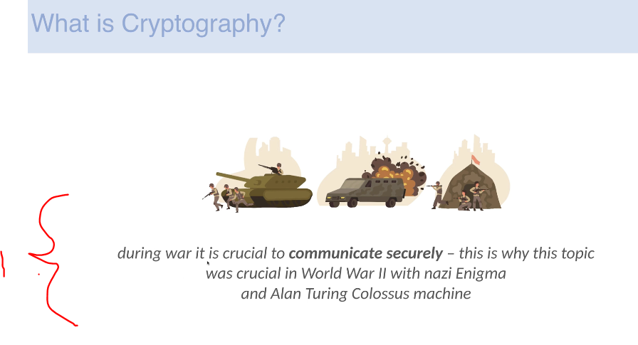
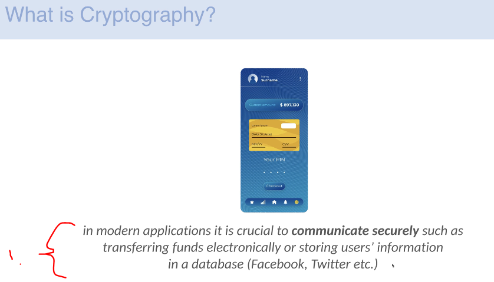
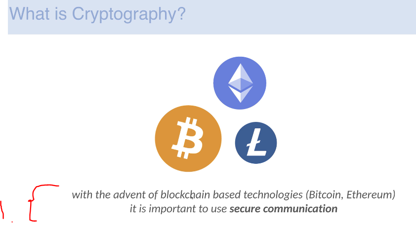
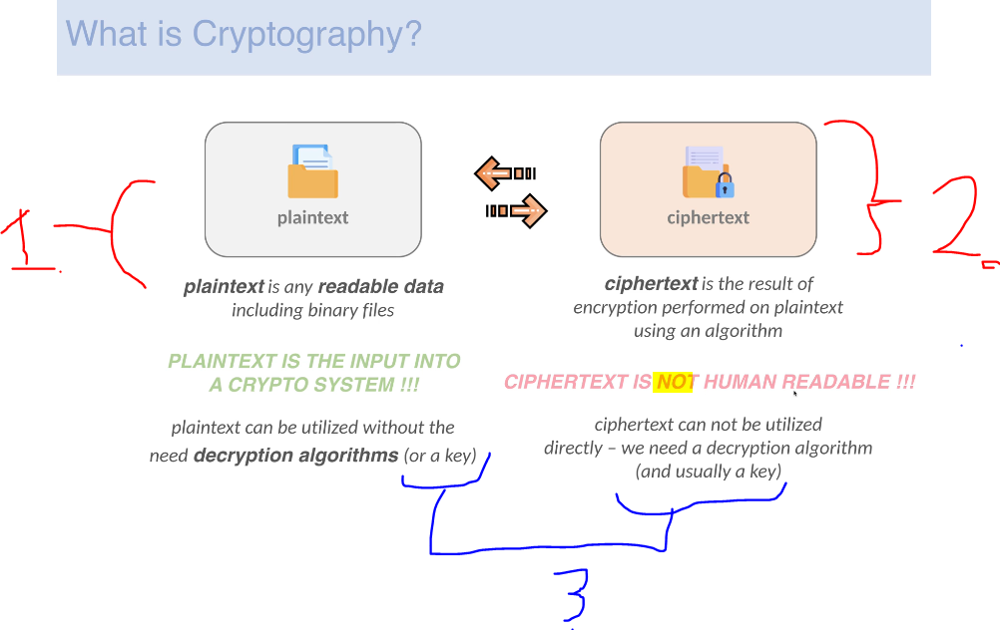

# Section 02: Cryptography Fundamentals.

Cryptography Fundamentals.

# What I Learned.

# What is cryptography?.

    

    

1. The act of **secure** communication in presence of **third party**.

2. The **reader** and **receiver** can read this message only!

    

1. One application for the **Cryptology** is for war!

    

1. Also when saving data to database or sending data over internet!

    

1. This is **heavily** useful when applying them in **Blockchain**, like **Bitcoin** and **Ethereum**.
    - These are using **E**lliptic **C**urve **C**ryptography.

    

1. **Plain Text** is any **readable data**!
    - This will be the **input** for the **crypto system**!
2. **Ciphertext** is outcome of using an **algorithm** for the **Plain Text**!

3. We can **decrypt** and **crypt** messages. These usually involves **key** and **algorithm** should be known!

# Symmetric encryption.

# Asymmetric encryption.

