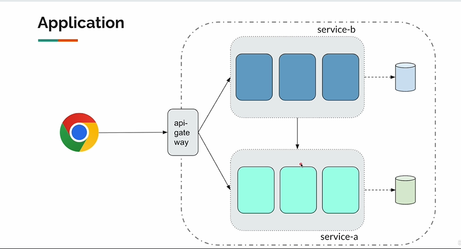
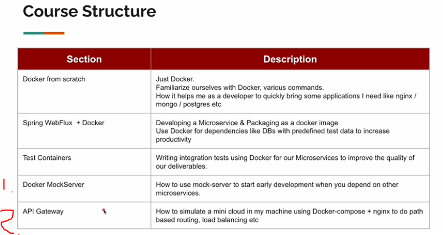

# Section 01: Introduction

Introduction.

# What I Learned

# 1. Introduction.

- This is for Java Spring developers.
    - Docker improves development speed. 

- We will manage all these blocks with docker, to bring up dependencies. 

1. We can start early development with **Docker MockSererver**. 
2. API Gateway, for simulating **mini cloud**