# Section 2: Need For Docker

What need for Docker.

# What I Learned

# 2. Story Behind Docker.

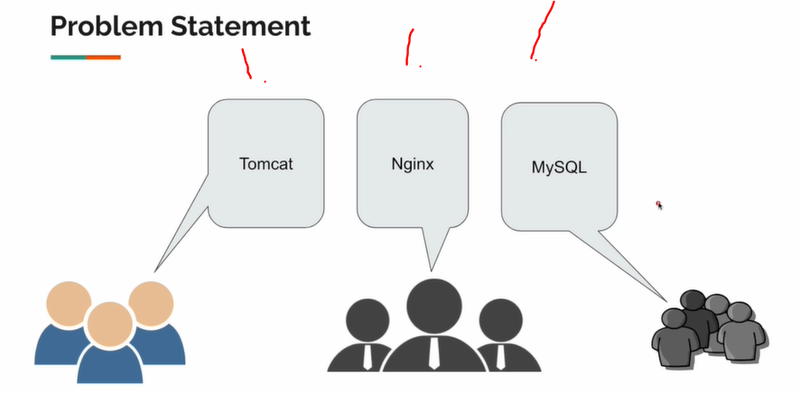

1. Every team had their own software.

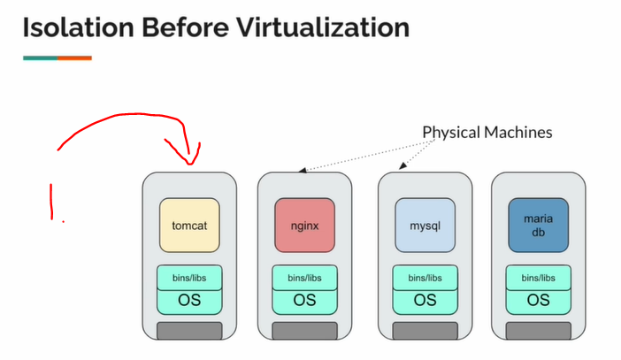

1. They used to buy own Hardware for everything.

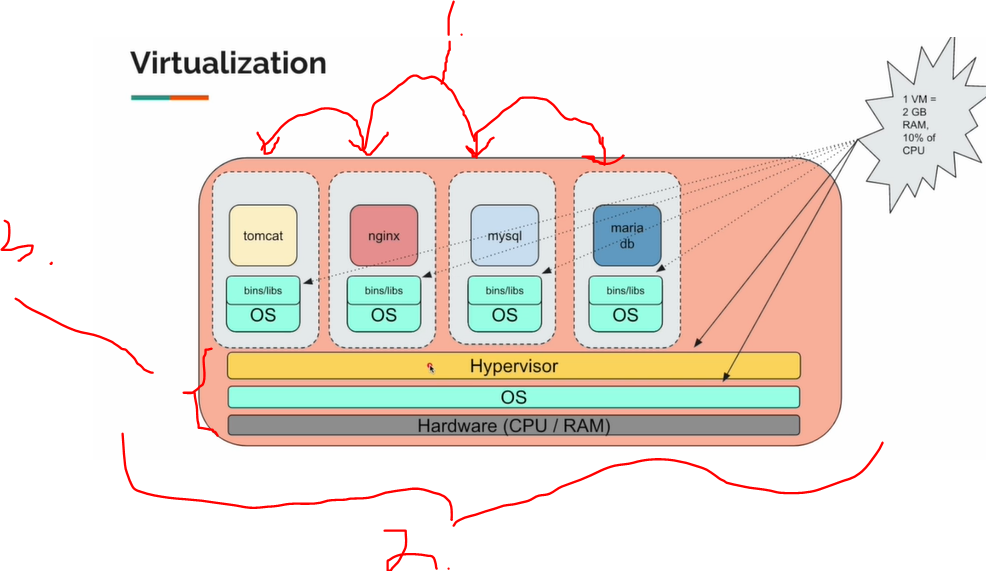

1. These individuals are **virtual machines**.
2. New strategy used to buy one big computer.

- Nice isolation!
    - Not perfect. Not efficient.

3. These resources allocations are not perfect. They being used without prioritization.

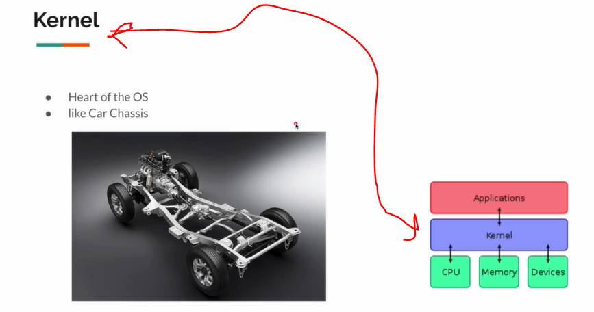

- **Kernel** is loaded into memory. This cannot be accessed thought normal means. This can be accessed **API layer**. 

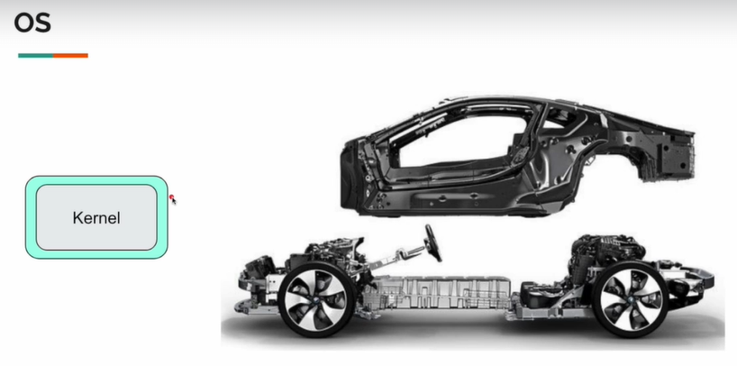

- We have **OS** for accessing **kernel** layer.

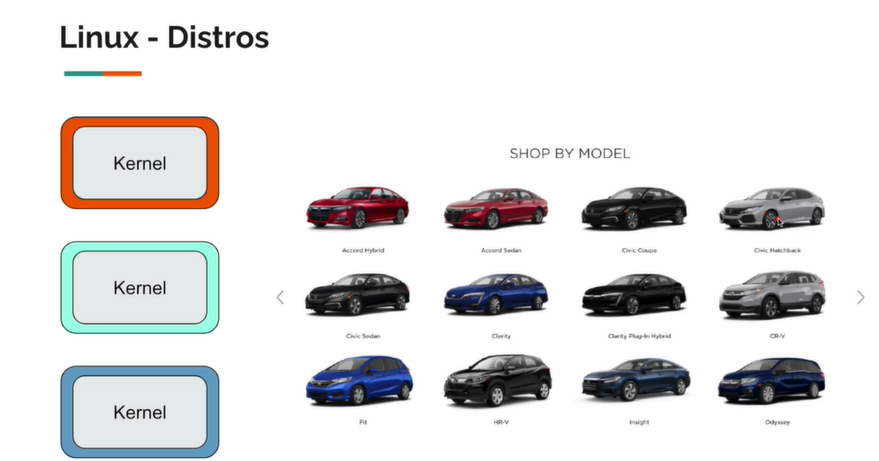

- We have different distros for different Linux. They have still the same **Kernel**, but different covering. 

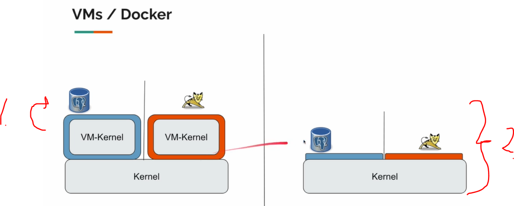

1. **VM** has own **kernel** and db installed into these **vm's**. These are super heavy. 

2. Docker has only one layer.

# 3. Why Developer needs to learn Docker.

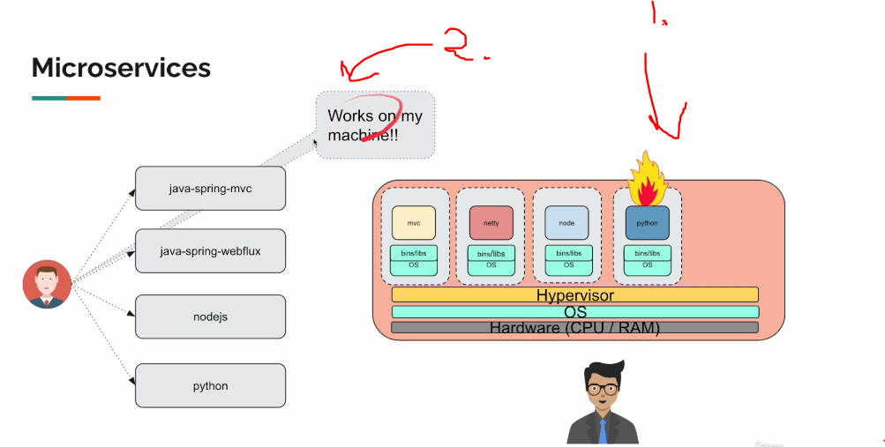

1. Problem in production detected!
2. It works on developers machine!

- This what **Docker** solves for us.
    - You can define dependencies in file.

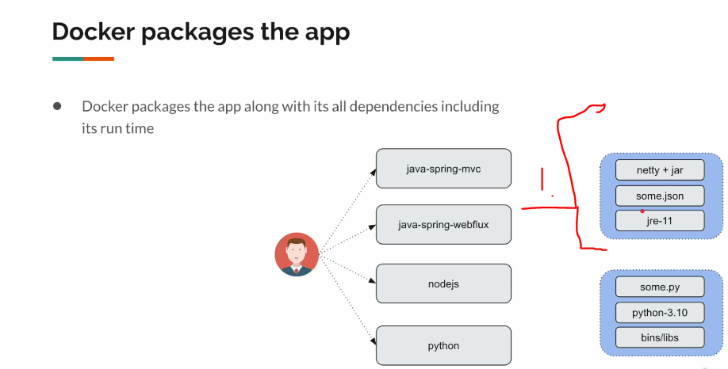

1. You define dependencies, by yourself.

- In old days we packed application with **.war** or **.jar**.
    - Nowadays, its **Docker** file.

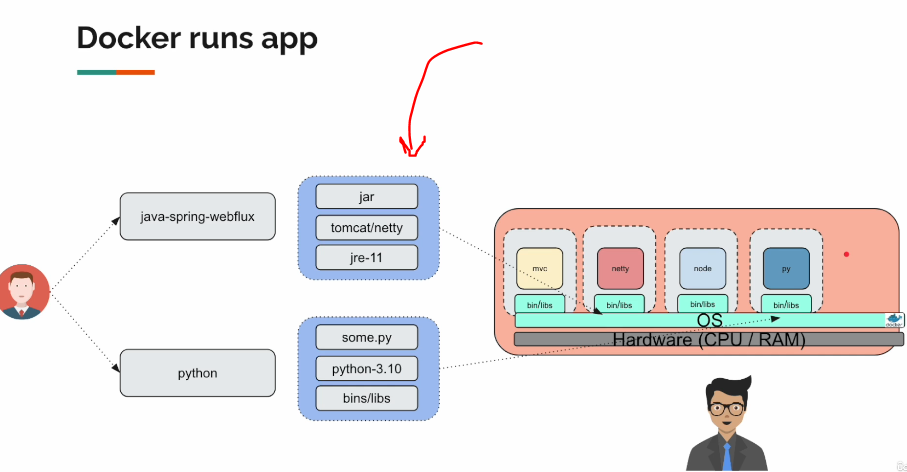

- Docker can run these just fine.

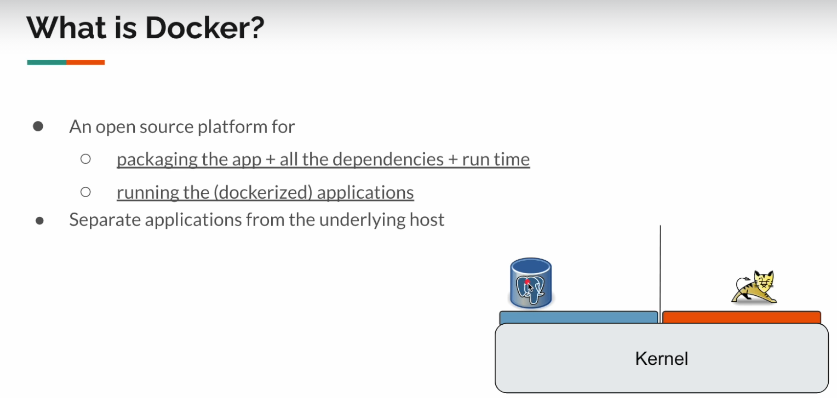

# 4. How Docker works on Mac/Windows.

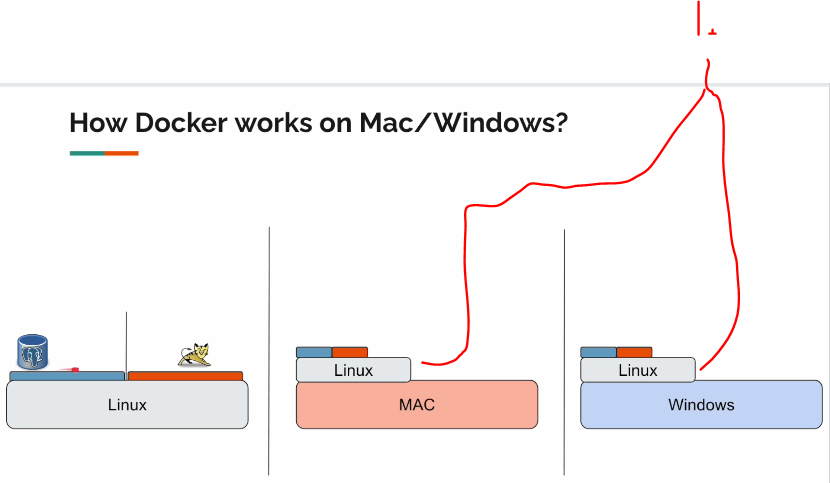

1. Docker will share **Linux** lightweight layer in these other operating systems. For Linux distros it is included all ready.