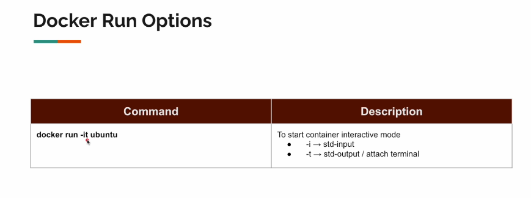

# Section 04: Docker Crash Course.

Docker crash course.

# What I Learned.

# 6. Installing Docker.

- [Source](https://www.docker.com/) Normal install ✅.

# 7. Install Verification.


1. Server application will be running.
2. Client will be interacting with the server.

- We can verify docker working with `docker --version`.
    - Also, we can check `docker --version`.

# 8. Docker Terminologies.


1. **Image** is output of **Build**.
2. **Tag** is the version.
3. **Containers** are running instances of image with certain tag/version.

# 9. Docker System Prune.

- These commands are for **cleaning temp files**.


1. `-f` for **forcefully remove** and `-a` including **images**.
2. `-f` for **forcefully remove**.

# 10. Hello World.


1. `docker run` makes instance of the image.

- `docker run hello-world`
    - If image **not** found, this will be pulled from **Docker Hub**.
        - So `pull` command is included inside `run`.


1. First time, it will look for local installation, then it will be pulling it from registry.


1. Second time, when the image is found in local, this is being used!

# 11. Docker Pull.

- `run` command will do the `pulling` indirectly.

- We have the following command `docker pull hello-world`. Does the pulling.


1. `Docker run` will check local **v1**, if someone have been updated the registery with **v2**, **v1** will be prioritized.

> Should we use `pull` or `run` ?


- Once in the while, `pull` should be used. It can update local images.

# 12. Creating Ubuntu Container.

- Listing all **containers** `docker ps -a`.

- Executing commands **inside** Ubuntu **container**.
    - `docker run ubuntu ls`.

- Each of docker images are different, so they execute differently!

# 13. Interactive Mode.



- Interacting with Ubuntu **Container**. `docker run -it ubuntu`.

- We can launch **Linux** commands in this state.

- Every time you run new container. Everything will be gone.

# 14. Docker Start Command.

- Starting container with **name** `docker run -it -name=c1 ubuntu`.


- We can launch existing container with `docker start`.
    - This is not very frequent command!

# 15. Docker Stop / Kill Command.

- We had `start` command, so we will have `stop` command.

- We can stop using `docker stop c1`.
    - This will wait and kill process slowly.

- Also, we can kill **imminently** using `docker kill c2`.
    - This will be instantaneous.

# 16. Docker Exec Command.


1. This is the same with the `run`, but with `exec` it does not create **new container**.

- We can use this to execute **commands** in **pre-existing containers**.


1. You can see that, you can **execute** commands on **pre-existent** **containers** without using the terminal which was used to start the **container**.

- Also, with the interactive mode `exec -it`, jumps to the terminal when starting.

# 17. Image Name Format.

- This is format, when starting `docker run`.


1. Some of the these parameters are **optional**. In this case if this is private image, this can be useful.

- You can have option to store images in **AWS ECR**.

- Hello world image [hello world](https://hub.docker.com/_/hello-world).

- **Tag** can specify, different purpose images.

- Latest is not mean latest date stamp, but maintainers choice to use **tag** **latest**.

# 18. Creating Nginx Container.

- Docker image of this image `docker pull nginx:perl`.
    - **Perl** tag.

- You can use commands inside container with `docker exec -it admiring_yonath bash`.

# 19. Port Mapping.


1. This container is running inside virtual machine.
2. To make port listening same port as in inside your **chrome** with **VM** is done with **port mapping**.


1. Localhost port is mapped to the **VM** with **Nginx port**.


1. For single instance.
2. For multiple instances.

- Container are **lightweight**, we can launch many at same time.

# 20. Checking Mapped Ports.

- What are the port, what docker is exposing.
    - Done, with `docker ps`.

# 21. Detached Mode.

- Running with **detached mode**. `docker run -d nginx`.

# 22. Accessing Container Log.

- We can get logs out of container. `docker logs e74`, with start hash from container.

# 23. Volume Mapping - Theory.


1. **Container** and own computer has its **own file structure**. Also, containers are **stateless**.
2. **Volume mapping** can be pointing folder from folder.


- When sharing in **Mac** or **Windows**, there is security settings to be checked. They must follow specific folder pattern.


# 24. Volume Mapping - Demo Part 1.

- **Volume Mapping** with Ubuntu inside **Windows** is `docker run -it -v C:\Docker\Volume\Data:/data ubuntu`
    - We use following volume mapping inside Windows.

- Now, when we create folder/or do some other modifications inside container, will reflect to the mapped Windows folder.

- We can make this **stateful** with following. 

# 26. Volume Mapping - Nginx.

- [DockerHub nginx](https://hub.docker.com/_/nginx).

- Official hosting documentation.


- We create `Index.html` in local file system.
    - Then we just map this one, `docker run -p 80:80 -v PathInLocal:PathInNginxContainer nginx`

# 27. Volume Mapping - Single File.

- We can map only some files, not whole folders.
    - We just point to the file. 
    -`docker run -p 80:80 -v PathInLocalToTheFile:PathInNginxContainerToTheSingleFile nginx` 

# 28. Volume Mapping - Read Only Mode.

- Same, but with **read only**.
    - So, if host files are deleted. Won't delete container files.
- `docker run -it -v C:\Docker\Volume\Data:/data:ro ubuntu`
    - With argument **:ro** in the end.

# 29. Network - Theory.


- Docker container can talk to each others.


1. Docker will place container in default network called **bridge network**.
    - Container can talk to each others.   
        - Problem comes with when there is no **name server**.
            - These can talk to each other only if these containers know each others IP-address.
        


1. For **Docker** default is **Bridge**.  
2. **None** disables all network.
3. **Overlay** is option for **K8**.

# 30. Network - Demo.

- We will demonstrate here, that bridge network does not have **DNS** name server.

- We are going to use this **Docker** image `docker pull vinsdocker/util`.

- Then we launch the **disto** with ping tools `docker run -it vinsdocker/util`.
    - We cannot ping `ping nginx`, since name nginx is not known inside container.

- We can use **Docker command** for figuring out the **IP** address of the container `docker inspect nginx`.

```
[
    {
        "Id": "35c720c04b053d27e2a4ff458db89f7c8074f7b3156ec8e931f31cb96a9b3ec0",
        "Created": "2025-01-10T10:46:00.573396381Z",
        "Path": "/docker-entrypoint.sh",
        "Args": [
            "nginx",
            "-g",
            "daemon off;"
        ],
        "State": {
            "Status": "exited",
            "Running": false,
            "Paused": false,
            "Restarting": false,
            "OOMKilled": false,
            "Dead": false,
            "Pid": 0,
            "ExitCode": 0,
            "Error": "",
            "StartedAt": "2025-01-10T10:46:01.646982197Z",
            "FinishedAt": "2025-01-10T10:46:24.695510913Z"
        },
        "Image": "sha256:42e917aaa1b5bb40dd0f6f7f4f857490ac7747d7ef73b391c774a41a8b994f15",
        "ResolvConfPath": "/var/lib/docker/containers/35c720c04b053d27e2a4ff458db89f7c8074f7b3156ec8e931f31cb96a9b3ec0/resolv.conf",
        "HostnamePath": "/var/lib/docker/containers/35c720c04b053d27e2a4ff458db89f7c8074f7b3156ec8e931f31cb96a9b3ec0/hostname",
        "HostsPath": "/var/lib/docker/containers/35c720c04b053d27e2a4ff458db89f7c8074f7b3156ec8e931f31cb96a9b3ec0/hosts",
        "LogPath": "/var/lib/docker/containers/35c720c04b053d27e2a4ff458db89f7c8074f7b3156ec8e931f31cb96a9b3ec0/35c720c04b053d27e2a4ff458db89f7c8074f7b3156ec8e931f31cb96a9b3ec0-json.log",
        "Name": "/nginx",
        "RestartCount": 0,
        "Driver": "overlayfs",
        "Platform": "linux",
        "MountLabel": "",
        "ProcessLabel": "",
        "AppArmorProfile": "",
        "ExecIDs": null,
        "HostConfig": {
            "Binds": null,
            "ContainerIDFile": "",
            "LogConfig": {
                "Type": "json-file",
                "Config": {}
            },
            "NetworkMode": "bridge",
            "PortBindings": {},
            "RestartPolicy": {
                "Name": "no",
                "MaximumRetryCount": 0
            },
            "AutoRemove": false,
            "VolumeDriver": "",
            "VolumesFrom": null,
            "ConsoleSize": [
                30,
                120
            ],
            "CapAdd": null,
            "CapDrop": null,
            "CgroupnsMode": "host",
            "Dns": [],
            "DnsOptions": [],
            "DnsSearch": [],
            "ExtraHosts": null,
            "GroupAdd": null,
            "IpcMode": "private",
            "Cgroup": "",
            "Links": null,
            "OomScoreAdj": 0,
            "PidMode": "",
            "Privileged": false,
            "PublishAllPorts": false,
            "ReadonlyRootfs": false,
            "SecurityOpt": null,
            "UTSMode": "",
            "UsernsMode": "",
            "ShmSize": 67108864,
            "Runtime": "runc",
            "Isolation": "",
            "CpuShares": 0,
            "Memory": 0,
            "NanoCpus": 0,
            "CgroupParent": "",
            "BlkioWeight": 0,
            "BlkioWeightDevice": [],
            "BlkioDeviceReadBps": [],
            "BlkioDeviceWriteBps": [],
            "BlkioDeviceReadIOps": [],
            "BlkioDeviceWriteIOps": [],
            "CpuPeriod": 0,
            "CpuQuota": 0,
            "CpuRealtimePeriod": 0,
            "CpuRealtimeRuntime": 0,
            "CpusetCpus": "",
            "CpusetMems": "",
            "Devices": [],
            "DeviceCgroupRules": null,
            "DeviceRequests": null,
            "MemoryReservation": 0,
            "MemorySwap": 0,
            "MemorySwappiness": null,
            "OomKillDisable": false,
            "PidsLimit": null,
            "Ulimits": [],
            "CpuCount": 0,
            "CpuPercent": 0,
            "IOMaximumIOps": 0,
            "IOMaximumBandwidth": 0,
            "MaskedPaths": [
                "/proc/asound",
                "/proc/acpi",
                "/proc/kcore",
                "/proc/keys",
                "/proc/latency_stats",
                "/proc/timer_list",
                "/proc/timer_stats",
                "/proc/sched_debug",
                "/proc/scsi",
                "/sys/firmware",
                "/sys/devices/virtual/powercap"
            ],
            "ReadonlyPaths": [
                "/proc/bus",
                "/proc/fs",
                "/proc/irq",
                "/proc/sys",
                "/proc/sysrq-trigger"
            ]
        },
        "GraphDriver": {
            "Data": null,
            "Name": "overlayfs"
        },
        "Mounts": [],
        "Config": {
            "Hostname": "35c720c04b05",
            "Domainname": "",
            "User": "",
            "AttachStdin": false,
            "AttachStdout": true,
            "AttachStderr": true,
            "ExposedPorts": {
                "80/tcp": {}
            },
            "Tty": false,
            "OpenStdin": false,
            "StdinOnce": false,
            "Env": [
                "PATH=/usr/local/sbin:/usr/local/bin:/usr/sbin:/usr/bin:/sbin:/bin",
                "NGINX_VERSION=1.27.3",
                "NJS_VERSION=0.8.7",
                "NJS_RELEASE=1~bookworm",
                "PKG_RELEASE=1~bookworm",
                "DYNPKG_RELEASE=1~bookworm"
            ],
            "Cmd": [
                "nginx",
                "-g",
                "daemon off;"
            ],
            "Image": "nginx",
            "Volumes": null,
            "WorkingDir": "",
            "Entrypoint": [
                "/docker-entrypoint.sh"
            ],
            "OnBuild": null,
            "Labels": {
                "maintainer": "NGINX Docker Maintainers \u003cdocker-maint@nginx.com\u003e"
            },
            "StopSignal": "SIGQUIT"
        },
        "NetworkSettings": {
            "Bridge": "",
            "SandboxID": "",
            "SandboxKey": "",
            "Ports": {},
            "HairpinMode": false,
            "LinkLocalIPv6Address": "",
            "LinkLocalIPv6PrefixLen": 0,
            "SecondaryIPAddresses": null,
            "SecondaryIPv6Addresses": null,
            "EndpointID": "",
            "Gateway": "",
            "GlobalIPv6Address": "",
            "GlobalIPv6PrefixLen": 0,
            "IPAddress": "",
            "IPPrefixLen": 0,
            "IPv6Gateway": "",
            "MacAddress": "",
            "Networks": {
                "bridge": {
                    "IPAMConfig": null,
                    "Links": null,
                    "Aliases": null,
                    "MacAddress": "",
                    "DriverOpts": null,
                    "NetworkID": "62ef60e184fbf77601b915981ba6abfdd2075bcb936c3a1e65ac7e01f029cecf",
                    "EndpointID": "",
                    "Gateway": "",
                    "IPAddress": "",
                    "IPPrefixLen": 0,
                    "IPv6Gateway": "",
                    "GlobalIPv6Address": "",
                    "GlobalIPv6PrefixLen": 0,
                    "DNSNames": null
                }
            }
        }
    }
]
```
- So with the **bridge network**, we need to figure out **IP-address** manually.


# 31. [Quick Note] - Nginx in Docker Network.

- ✅.

# 32. Network - Custom Bridge Demo.

- We will build **custom bridge network**.

- Network can be created using **network** command, like such with name of dummy `docker network create dummy`.

- Looking networks `docker network ls`.

- Launching container with network`docker run --name=nginx --network=dummy nginx`.
    - Launching **tool** under same network `docker run -it --network=dummy vinsdocker/util`.

- Now when container is inside **same network**, can ping only using **name only**. 
    - `ping nginx` or `curl nginx`.

# 33. DockerFile - Intro.


1. Simple commands to create **Dockerfile**.
2. **Base Image**, you always need some kind **base image**.
    - **Top of this**, you will be adding your stuff.
3. **ADD** and **COPY** are more or less the same.
    - With **ADD** you can use URL.
4. Used to **RUN** commands during image build process.
5. Everything will be worked on, in this folder.
    - So after `WORKDIR` command, following `ADD` command will add file from **local** file project and place it inside the docker image, under `/a/b/c`.
        - We don't usually use **root directory**.
6.  Process or command to be started at end of the build process.

# 34. Building Hello World Image.

- **Command** for building docker image `docker build -t my-hello-world .`
    - last one, from current directory.

- Our simple **Dockerfile**.

```
FROM ubuntu

WORKDIR /vins/welcome

# Adding txt file form project folder to inside docker file.
ADD welcomeMessage.txt welcomeMessage.txt

# Output of txt file.
CMD cat welcomeMessage.txt
```

# 35. Exploring Our Image.


- `docker run -it my-hello-world bash`
    - Stops execution and gives bash.
- `docker run my-hello-world`

- You can override **docker file commands** with argument!
    - `docker run my-hello-world date`
        - This gives **Date** and not defaults behavior of container image.

# 36. Building Image With ENTRYPOINT.

> Difference between `ENTRYPOINT` and `CMD` in docker file.

```
FROM ubuntu

WORKDIR /vins/welcome

# Adding txt file form project folder to inside docker file.
ADD welcomeMessage.txt welcomeMessage.txt

# Output of txt file.
ENTRYPOINT cat welcomeMessage.txt
```
- **but**, if you use `ENTRYPOINT` this won't work! Executes container image normally.
    - `docker run my-hello-world-entry date`.

# 37. Installing Java Manually in Ubuntu Container.

- We are installing Java 17 in Ubuntu container.

- To identify what process base is being used inside container `uname -m`.
    - This will tell what you're going to use.

- Dockerfile with **Java23** installed inside Ubuntu container.

```
FROM ubuntu

WORKDIR java

RUN apt-get update

# Downloading curl
RUN apt-get install curl

# Downloading JDK
RUN curl https://download.java.net/java/GA/jdk23.0.1/c28985cbf10d4e648e4004050f8781aa/11/GPL/openjdk-23.0.1_linux-x64_bin.tar.gz --output java23.tar.gz

# Unizpping
tar -xvzf java23.tar.gz
rm java23.tar.gz

# In linux we will bind to env varible.
# export PATH=$PATH:/jdk-23.0.1/bin

ENV PATH $PATH:/java/jdk-23.0.1/bin
```

- In a Dockerfile, the `ENV` instruction is used to set environment variables inside the container.

- We are building our new Docker file `docker build -t my-java-23 .`.

# 38. Building Java Base Image - Part 1.

- Creating image of our Ubuntu container.

```
FROM ubuntu

WORKDIR java

RUN apt-get update

# Downloading curl
RUN apt-get install curl -y
# -y for inputting yes, when asking in setup

# Downloading JDK
RUN curl https://download.java.net/java/GA/jdk23.0.1/c28985cbf10d4e648e4004050f8781aa/11/GPL/openjdk-23.0.1_linux-x64_bin.tar.gz --output java23.tar.gz

# Unizpping
tar -xvzf java23.tar.gz
rm java23.tar.gz

# In linux we will bind to env varible.
# export PATH=$PATH:/jdk-23.0.1/bin

ENV PATH $PATH:/java/jdk-23.0.1/bin
```

- Building our new image with Ubuntu and Java JDK installed `docker build -t my-java-23 .`.

# 39. Building Java Base Image - Part 2 - With ADD Command.

- We can achieve this using same `ADD` command. It will indirectly download package.

```

FROM ubuntu

WORKDIR java

# Downloading JDK
ADD https://download.java.net/java/GA/jdk23.0.1/c28985cbf10d4e648e4004050f8781aa/11/GPL/openjdk-23.0.1_linux-x64_bin.tar.gz java23.tar.gz

# Unizpping
RUN tar -xvzf java23.tar.gz
RUN rm java23.tar.gz

# In linux we will bind to env varible.
# export PATH=$PATH:/jdk-23.0.1/bin

ENV PATH $PATH:/java/jdk-23.0.1/bin

``` 

# 40. NONE Images.

- Using `ADD` can bring less size benefit when making docker image.
    - Comparing to the manual installing all the `curl` tools for example.

- If we assign same name for image, the older one will get replaced by `None` tag.


1. We are making same image, but with extra stuff. Old image gets named as **None**, where new one gets the name.

# 41. [Quick Note] - COPY Usage.


1. Copying whole folder content into another folder.
2. Copies all `.txt` ending files to the `text` folder and `/` if not created, docker will create the folder.

# 42. Passing Environment Variable.

- We are creating Table Java class.

```
public class Table
{
	public static void main(String[] args) {

        String input = System.getenv("input");
        System.out.println("Received Input : " + input);

        if (null == input) return;

        int value = Integer.parseInt(input);
        for (int i = 1; i <= value; i++) {
            System.out.printf("%d * %d = %d\n", i, value, (i * value));
			}
	}
}
```

- And docker file of Table.

```
# Base image has Java, which we have made allready.
FROM my-java-23

WORKDIR /users/vinoth/table

COPY Table.java Table.java

# Run command and after this, execute table.
CMD javac Table.java && java Table
```

- Building our image form top of another one. `docker build -t my-table .`.

- Executing will result in `null`.

```
C:\Users\ScoopiDoo\Desktop\git projektit\spring-springboot-angular-microservices-mysql-java-persistence-hibernate-aws\Docker Masterclass For Java Spring Boot Developers\Section 04>docker run my-table
Received Input : null
```

- With `-e input=3` tells pass the environment variable.
    - Example execution `docker run -e input=3 my-table`.

```
C:\Users\ScoopiDoo\Desktop\git projektit\spring-springboot-angular-microservices-mysql-java-persistence-hibernate-aws\Docker Masterclass For Java Spring Boot Developers\Section 04>docker run -e input=3 my-table
Received Input : 3
1 * 3 = 3
2 * 3 = 6
3 * 3 = 9
```

# 43. Exec vs Shell Form.


1. Process to be executed is `Shell Form`.
2. Process to be executed is `Exec Form`.

- Example of `ps` command inside docker file.

```
FROM ubuntu

CMD ps

```

- `docker build -t test` running following command.


1. This will be executed as child process.
    - **Shell** will be executing what command you are giving it. This is **Shell Form**.

- This will be the **Exec form**.

```
FROM ubuntu


# Exec form
CMD ["ps"]

```


1. Only one process. `ps` is run one as one process.

- TODO luo tämä uudestaan.

# 44. How Docker Builds Image - Theory.


1. When we make **change** in docker file, we create branch. When this gets **merged** into the main **branch**. It creates another hash.


1. Docker will build from bottom to up the image. These commands are applied layer by layer.
2. After every added layer, the **hash** will be different.

- Docker image is list of **layers** or **hashes**.


1. When **rebuilding** the image or **changing** the image, docker sees these layers, which are not changed and will not try to build **again** these! 
2. Instead, it will only **build** these one which are changed!


Jäin 4:10