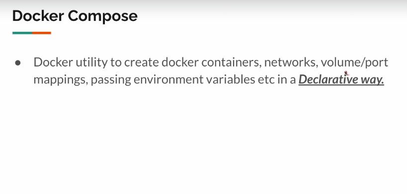
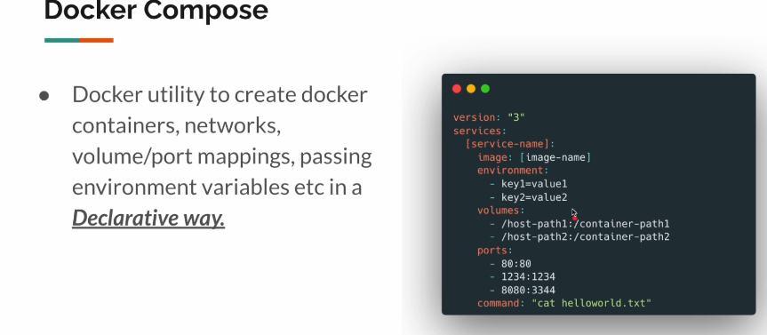
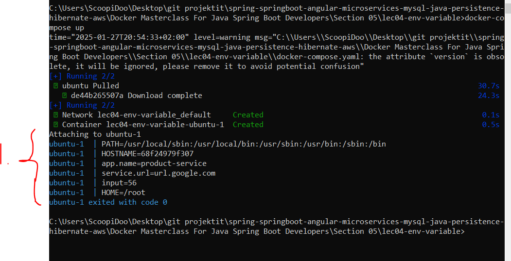

# Section 5: Docker Compose.

Docker Compose.

# What I Learned.

# 48. Intro.



- We have many commands for **Docker**. The **Docker Compose** is doing this, but in the **Declarative way**.
    - This will be **yaml** file.

- Example of **Yaml** file.



# 49. Docker Compose - Demo - Part 1.

```

version : "3.0" # Spesification, which the Docker Copose will be following.
services: # Lisf of Applications! 
  web-app: # Apllication! Name of the application.
    image: nginx # Configurations for the the Applcitions! Image is the what image you will be using.
    ports: # List of ports.
    - "80:80" # - (dash) will be List! Better to use Stiring for better parising.

```

- **Docker Compose** have version number from specification. `version : "3.0"`

- `services:` Will get list of **Applications**! 
    - `web-app:` Will be the **name** of the application.
        - `image:` Will be **imaged**, which we will be using. 
        - `ports:` Will be the ports for this application.
            - `"80:80"` For this it's better to use **String** for the interpreter.
  
  - Running the **Container** `docker compose up` or the other syntax `docker-compose up`.
    - You could see the page with `localhost`.

# 50. Docker Compose - Demo - Part 2.

- If we're not specifying the name(in `yaml`), it will use **folder name** with **service** name.

- Also, `compose up` will be creating **bridge network**.

- We can inspect the **running compose file** with following command `docker-compose ps`. It will tell the **components** its **being part of**.

- `docker-compose down` or `docker compose down` will stop the all the **services** which were created form **compose** file.
    - Also, will be removing `netowroks` with the **images** which the compose file have created.

# 51. Docker Compose - File Option.

- Name will be most time `docker-compose.yaml`!
    - This is just convention.

- `docker compose up` command will be looking for the name **docker-compose.yaml** or similar to start the containers.

- Will be starting, but with the specific **yaml** file `docker-compose -f nginx.yaml up`
    - Just specify your own file name.

# 52. Detached Mode / Accessing Logs.

- Starting container in **Detach mode** `docker-compose up -d`.

# 53. Volume Mapping.

- We will make mapping with following mapping. `- ./data:/usr/share/nginx/html`.
    - We will have following `data` folder and then map it into the `nginx` folder.

- With following config, **data volume** will be shared:
    - Remember to create `data` folder locally, and `index.html` with `nginx.yaml`.
 
```
version : "3.0" # Spesification, which the Docker Copose will be following.
services: # Lisf of Applications! 
  web-app: # Apllication! Name of the application.
    image: nginx # Configurations for the the Applcitions! Image is the what image you will be using.
    ports: # List of ports.
    - "80:80" # - (dash) will be List! Better to use Stiring for better parising.
    volumes:
      - ./data:/usr/share/nginx/html # This Path will be pointing to the nginx html.
      # We want to map data foloder to the ngnix index folder.
```

- Start normally `docker-compose up -d`.

# 54. Network.

- `command: "curl http://web-app"` # We just want to call other service, we need to use service name, not the image name.

- We can use `depends_on` to make application to wait for another one.

```
depends_on: # Other service, needs to start first.
      - web-app

```

- Working **.yaml**.

```
version : "3.0" 
services: 
  web-app: # One application!
    image: nginx
    ports: 
    - "80:80"
  util: # Second application!
    image: vinsdocker/util
    depends_on: # Other service, needs to start first.
      - web-app
    command: "curl http://web-app" # We just wan't to call other service, we need to use service name, not the image name.
    
```

- This **Compose** file, will place applications inside **one** **network**, it will work.

- By **default**, containers can talk to each other without of any **port mapping**.
    - The port mapping only for **browser support** or for external access.

# 55. Container Environment Variable Via Docker Compose.

- Run env variables `docker run ubuntu env`.
    - Setting while running `docker run -e INPUT=55 ubuntu env`
        - Where `INPUT` is the user made variable.

- You can put following to docker-compose file for **environment** variables.

```
environment:
    - app.name=product-service 
    - service.url=url.google.com 
    - input=56
```



1. As you can see the following configuration will provide startup variables to the image.

- Full **docker-compose** file.

```
version : "3.0" 
services: 
  ubuntu:
    image: ubuntu
    command: "env"
    environment:
    - app.name=product-service 
    - service.url=url.google.com 
    - input=56
```

# 56. Env File.

- You can do this also to the **file** and even mix these.

```
version : "3.0" 
services: 
  ubuntu:
    image: ubuntu
    command: "env"
    env_file:
      - app.env
    environment:
    - app.name=product-service 
    - service.url=url.google.com 
    - input=56
```

# 57. Variable Substitution In Compose File.

- We can also substitute variables versions inside **compose file**.

- Example below:

```

version : "3.0" 
services: 
  web-app:
    image: nginx:${TAG:-latest}
    ports:
    - "80:80"
    
```

