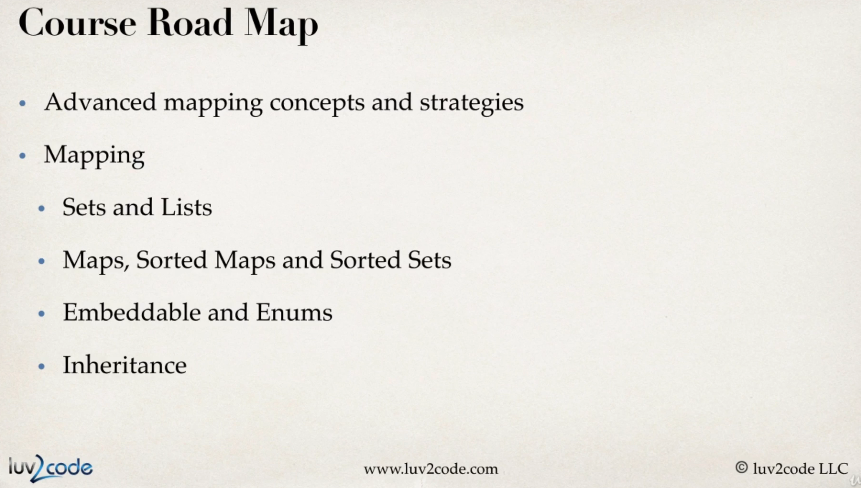
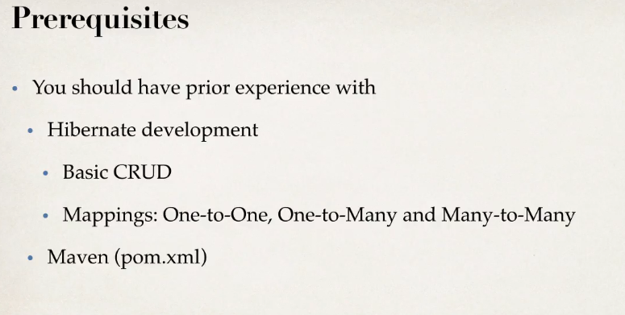
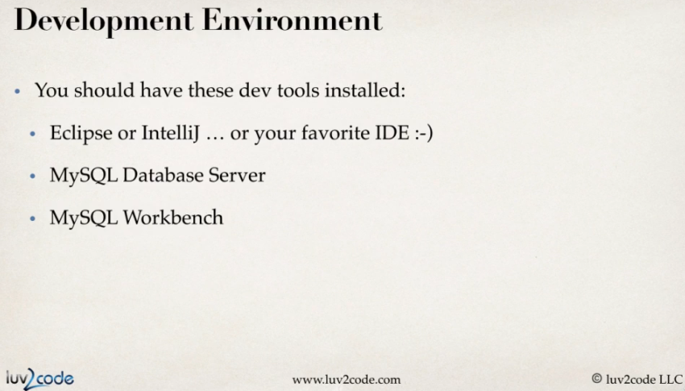
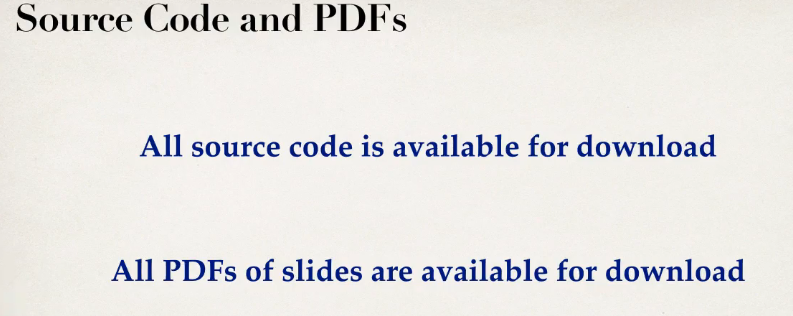

# Section 01: Introduction.

 Introduction.

# What I Learned.

# Introduction.




- Best team!



- All check.





# How To Take This Course and How To Get Help.

```

How To Get Help

Just be active! :-)

```

# Downloading the Source Code and PDF Files.

- You can download the source code [here](https://github.com/darbyluv2code/hibernate-advanced-development-techniques/archive/refs/heads/main.zip).