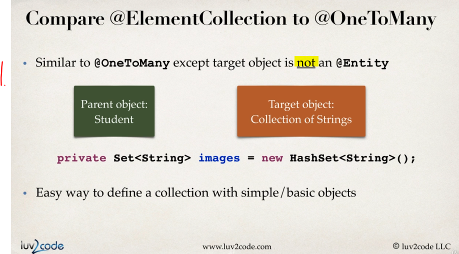

# Section 02: Mapping Collections - Sets and Lists

Mapping Collections - Sets and Lists.

# What I Learned.

# Mapping Overview - Section Roadmap.


1. In **Hibernate** we can need to persist **collections**.


1. **List** that can contain **duplicates**.
2. **Set** that cannot have **duplicates**.
3. **Map** key-value pairs that cannot have **duplicates**.


1. **List** preserves the ordering and allows duplicates. 
2. **Set** does not preserve the ordering and does not allow duplicates.
3. **Map** does not preserve the ordering. Allow duplicates:
    - For **keys**, **no**.
    - For **values**, **yes**.
    


1. Main point, there are many collection types in **Java**.
    - These needs to be mapped into the **Hibernate**.

# Mapping Sets - Overview.
    
> **Set**
> Is Collection of items that cannot **contain duplicates**.


1. Does this **contain** this particular one.
    - `“Is X present?”`
    - Does the deck of card contains **Heart ace**?
2. Ordering does not matter, **set** does not **preserve** order. 

- Examples:
    - Poker cards:
        - `Order of your cards in your hand does not matter.`
    - Guest list:
        - `"Is my name on the list?"`.


1. Example of usage, **Student** have **Images**.
    - This can be in **Set**.
        - We don't care about the order of these images, as long they are there.
        - There should **not** be any **duplicates**.
        


1. Image has `key` for **Student**.


1. `filename` for given `image`.


1. Basic **CRUD** work.


1. Mapping in **Java**.


- **@Annotations** used for the mapping.


1. The mappings for the **set**, which we were discussing in previous slide.


1. Getting reference for the **Set**.
2. Adding **photos** to the **Set**.
3. Begins the **Transaction**.
4. Transferring the Objects into **Persistence Context**.
5. Ending transaction, and **executing queries**.

- Same as code:

```
/ create the object
Student tempStudent = new Student("Paul", "Wall", "paul@luv2code.com");
Set<String> theImages = tempStudent.getImages();

theImages.add("photo1.jpg");
theImages.add("photo2.jpg");
theImages.add("photo3.jpg");

// start a transaction
session.beginTransaction();

// save the object
System.out.println("Saving the student and images..");
session.persist(tempStudent);

// commit the transaction
session.getTransaction().commit();
```


- We can see the mapped **Student** to multiple **Images** in the **Collection** (collection are mapped in separate table!).

# Mapping Sets - Going Deep!


1. `name=image` What table we are using.
2. `joinColumns = @JoinColumn(name="student_id")` Where to join on. It hooks up in `student` table for `id`.
3. `@ElementCollection` Tells that we are mapping **collection**.
4. `@Column(name="file_name")` The column where we are mapping on.


1. `@ElementCollection` can be used for define **relationships**.
    - This can be used for the **One-to-many** to the `@Embeddable` **object**.
    - This can be used for the **One-to-many** to the ` **object**.
        - These can be **Integer**, **Double** etc...
2. Example here is using `Set` of `String`:s.



1. This behaves like **One-to-many**, but with the **collection** of the simple/basic objects.


- Since these are included into the parent objects, they have some limitations.

1. You cannot perform any operations on these **independently**.
2. No support for the **cascades**!
    - These are **ALWAYS** persisted, merged or removed when parent object is receiving the operation.


1. For **simple** cases!
2. For more **fine-grained** control!

# Mapping Sets - Project Set Up.


1. We will use the `maven-archetype-quickstart`.

- We are having the following dependencies:

```
<!-- Hibernate's core ORM functionality -->
		<dependency>
			<groupId>org.hibernate</groupId>
			<artifactId>hibernate-core</artifactId>
			<version>5.3.6.Final</version>
		</dependency>

<!-- JDBC driver for MySQL -->
		<dependency>
			<groupId>mysql</groupId>
			<artifactId>mysql-connector-java</artifactId>
			<version>8.0.12</version>
		</dependency>

<!-- Support for Java 9/10/11 -->
		<dependency>
			<groupId>javax.xml.bind</groupId>
			<artifactId>jaxb-api</artifactId>
			<version>2.3.0</version>
		</dependency>

		<dependency>
			<groupId>com.sun.xml.bind</groupId>
			<artifactId>jaxb-core</artifactId>
			<version>2.3.0</version>
		</dependency>

		<dependency>
			<groupId>com.sun.xml.bind</groupId>
			<artifactId>jaxb-impl</artifactId>
			<version>2.3.0</version>
		</dependency>

		<dependency>
			<groupId>com.sun.activation</groupId>
			<artifactId>javax.activation</artifactId>
			<version>1.2.0</version>
		</dependency>
```


- We are using following **SQL** script for the tables:

```
CREATE DATABASE  IF NOT EXISTS `hb_student_tracker`;
USE `hb_student_tracker`;
--
-- Table structure for tables `student` and `image`
--

DROP TABLE IF EXISTS `student`;

CREATE TABLE `student` (
  `id` int(11) NOT NULL AUTO_INCREMENT,
  `first_name` varchar(45) DEFAULT NULL,
  `last_name` varchar(45) DEFAULT NULL,
  `email` varchar(45) DEFAULT NULL,
  PRIMARY KEY (`id`)
) ENGINE=InnoDB AUTO_INCREMENT=101 DEFAULT CHARSET=latin1;

DROP TABLE IF EXISTS `image`;

CREATE TABLE `image` (
  `student_id` int(11) NOT NULL,
  `file_name` varchar(45) DEFAULT NULL
) ENGINE=InnoDB DEFAULT CHARSET=latin1;
```


- Tee loppuun