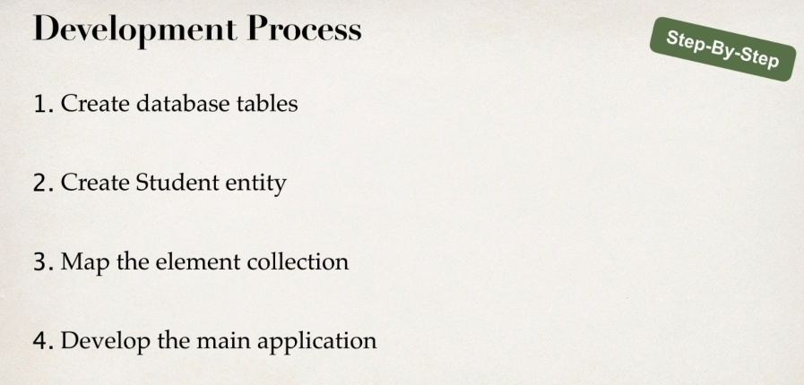

# Section 02: Mapping Collections - Sets and Lists

Mapping Collections - Sets and Lists.

# What I Learned.

# Mapping Overview - Section Roadmap.

1. In **Hibernate** we can need to persist **collections**.

1. **List** that can contain **duplicates**.
2. **Set** that cannot have **duplicates**.
3. **Map** key-value pairs that cannot have **duplicates**.

1. **List** preserves the ordering and allows duplicates. 
2. **Set** does not preserve the ordering and does not allow duplicates.
3. **Map** does not preserve the ordering. Allow duplicates:
    - For **keys**, **no**.
    - For **values**, **yes**.
    

1. Main point, there are many collection types in **Java**.
    - These needs to be mapped into the **Hibernate**.

# Mapping Sets - Overview.
    
> **Set**
> Is Collection of items that cannot **contain duplicates**.

1. Does this **contain** this particular one.
    - `“Is X present?”`
    - Does the deck of card contains **Heart ace**?
2. Ordering does not matter, **set** does not **preserve** order. 

- Examples:
    - Poker cards:
        - `Order of your cards in your hand does not matter.`
    - Guest list:
        - `"Is my name on the list?"`.

1. Example of usage, **Student** have **Images**.
    - This can be in **Set**.
        - We don't care about the order of these images, as long they are there.
        - There should **not** be any **duplicates**.
        

1. Image has `key` for **Student**.

1. `filename` for given `image`.

1. Basic **CRUD** work.

1. Mapping in Java.

4:20
