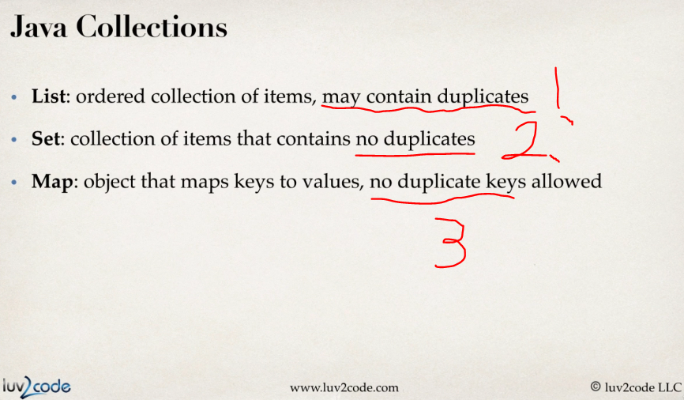
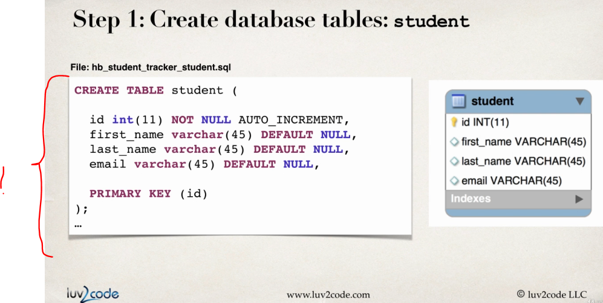
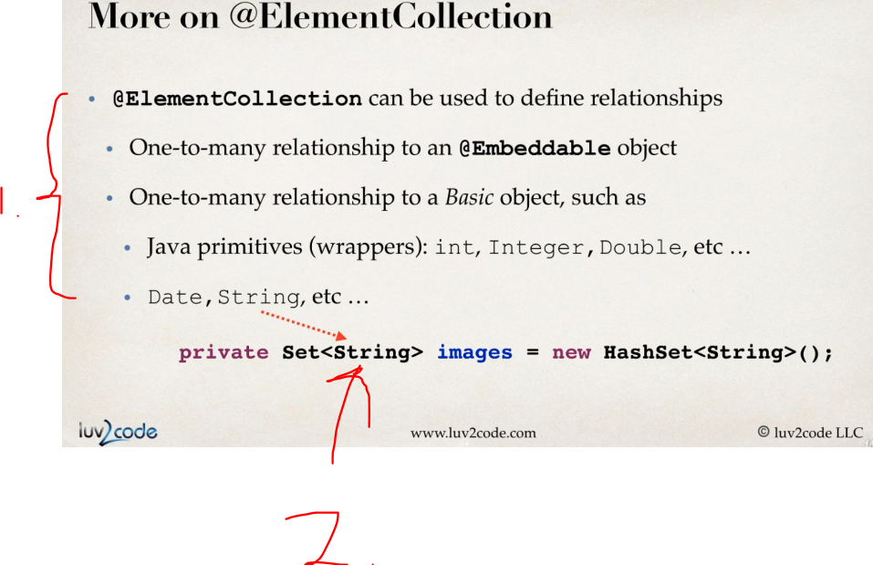
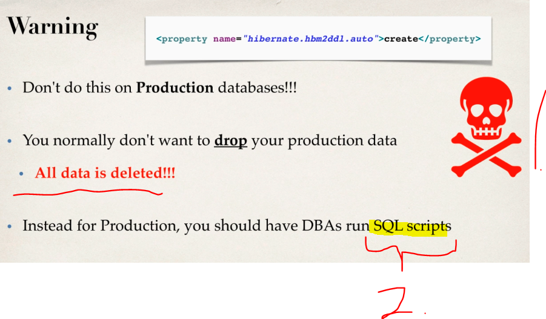
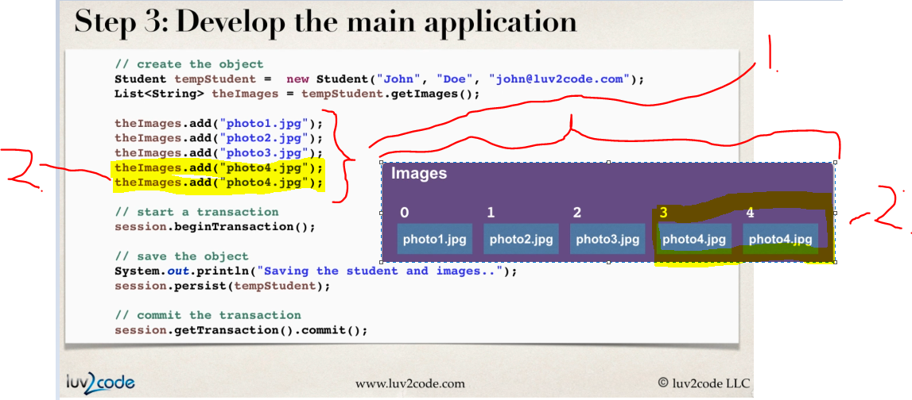

# Section 02: Mapping Collections - Sets and Lists.

Mapping Collections - Sets and Lists.

## Summary:

#### [Mapping Overview - Section Roadmap](#).
#### [Mapping Sets - Overview](#).
#### [Mapping Sets - Going Deep!](#)
#### [Mapping Sets - Project Set Up](#).
#### [Mapping Sets - Code the Entity](#).
#### [Mapping Sets - Apply the @ElementCollection](#).
#### [Mapping Sets - Create and Run the Main App](#).
#### [Mappings Lists - Write Some Code](#).
 
# What I Learned.

# Mapping Overview - Section Roadmap.


1. In **Hibernate** we can need to persist **collections**.



1. **List** that can contain **duplicates**.
2. **Set** that cannot have **duplicates**.
3. **Map** key-value pairs that cannot have **duplicates**.


1. **List** preserves the ordering and allows duplicates. 
2. **Set** does not preserve the ordering and does not allow duplicates.
3. **Map** does not preserve the ordering. Allow duplicates:
    - For **keys**, **no**.
    - For **values**, **yes**.
    


1. Main point, there are many collection types in **Java**.
    - These needs to be mapped into the **Hibernate**.

# Mapping Sets - Overview.
    
> **Set**
> Is Collection of items that **cannot contain duplicates**!


1. Does this **contain** this particular one.
    - `“Is X present?”`
    - Does the deck of card contains **Heart ace**?
2. Ordering does not matter, **set** does not **preserve** order. 

- Examples:
    - Poker cards:
        - `Order of your cards in your hand does not matter.`
    - Guest list:
        - `"Is my name on the list?"`.


1. Example of usage, **Student** have **Images**.
    - This can be in **Set**.
        - We don't care about the order of these images, as long they are there.
        - There should **not** be any **duplicates**.
        


1. Image has `key` for **Student**.




1. `filename` for given `image`.


1. Basic **CRUD** entity setup.


1. Mapping in **Java**.


1. **@Annotations** used for the mapping.


1. The mappings for the **set**, which we were discussing in previous slide.


1. Getting reference for the **Set**.
2. Adding **photos** to the **Set**.
3. Begins the **Transaction**.
4. Transferring the Objects into **Persistence Context**.
5. Ending transaction, and **executing queries**.

- Same as code:

```
/ create the object
Student tempStudent = new Student("Paul", "Wall", "paul@luv2code.com");
Set<String> theImages = tempStudent.getImages();

theImages.add("photo1.jpg");
theImages.add("photo2.jpg");
theImages.add("photo3.jpg");

// start a transaction
session.beginTransaction();

// save the object
System.out.println("Saving the student and images..");
session.persist(tempStudent);

// commit the transaction
session.getTransaction().commit();
```


- We can see the mapped **Student** to multiple **Images** in the **Collection** (collection are mapped in separate table!).

# Mapping Sets - Going Deep!


1. `name=image` What table we are using.
2. `joinColumns = @JoinColumn(name="student_id")` Where to join on. It hooks up in `student` table for `id`.
	- We need this because **Set** **need** to have **position saved**!
3. `@ElementCollection` Tells that we are mapping **collection**.
4. `@Column(name="file_name")` The column where we are mapping on.



1. `@ElementCollection` can be used for define **relationships**.
    - This can be used for the **One-to-many** to the `@Embeddable` **object**.
    - This can be used for the **One-to-many** to the ` **object**.
        - These can be **Integer**, **Double** etc...
2. Example here is using `Set` of `String`:s.


1. This behaves like **One-to-many**, but with the **collection** of the simple/basic objects.


- Since these are included into the parent objects, they have some limitations.

1. You cannot perform any operations on these **independently**.
2. No support for the **cascades**!
    - These are **ALWAYS** persisted, merged or removed when parent object is receiving the operation.


1. For **simple** cases!
2. For if you want more **fine-grained** control!

# Mapping Sets - Project Set Up.


1. We will use the `maven-archetype-quickstart`.

- We are having the following dependencies:

```
<!-- Hibernate's core ORM functionality -->
		<dependency>
			<groupId>org.hibernate</groupId>
			<artifactId>hibernate-core</artifactId>
			<version>5.3.6.Final</version>
		</dependency>

<!-- JDBC driver for MySQL -->
		<dependency>
			<groupId>mysql</groupId>
			<artifactId>mysql-connector-java</artifactId>
			<version>8.0.12</version>
		</dependency>

<!-- Support for Java 9/10/11 -->
		<dependency>
			<groupId>javax.xml.bind</groupId>
			<artifactId>jaxb-api</artifactId>
			<version>2.3.0</version>
		</dependency>

		<dependency>
			<groupId>com.sun.xml.bind</groupId>
			<artifactId>jaxb-core</artifactId>
			<version>2.3.0</version>
		</dependency>

		<dependency>
			<groupId>com.sun.xml.bind</groupId>
			<artifactId>jaxb-impl</artifactId>
			<version>2.3.0</version>
		</dependency>

		<dependency>
			<groupId>com.sun.activation</groupId>
			<artifactId>javax.activation</artifactId>
			<version>1.2.0</version>
		</dependency>
```

- We are using following **SQL** script for the tables:

```
CREATE DATABASE  IF NOT EXISTS `hb_student_tracker`;
USE `hb_student_tracker`;
--
-- Table structure for tables `student` and `image`
--

DROP TABLE IF EXISTS `student`;

CREATE TABLE `student` (
  `id` int(11) NOT NULL AUTO_INCREMENT,
  `first_name` varchar(45) DEFAULT NULL,
  `last_name` varchar(45) DEFAULT NULL,
  `email` varchar(45) DEFAULT NULL,
  PRIMARY KEY (`id`)
) ENGINE=InnoDB AUTO_INCREMENT=101 DEFAULT CHARSET=latin1;

DROP TABLE IF EXISTS `image`;

CREATE TABLE `image` (
  `student_id` int(11) NOT NULL,
  `file_name` varchar(45) DEFAULT NULL
) ENGINE=InnoDB DEFAULT CHARSET=latin1;
```

# Mapping Sets - Create our Entity class.

- Remember to use `javax` version, which implement **JPA** rather than `hibernate` version.
	- `import javax.persistence.Entity;`
	- `import org.hibernate.annotations.Entity;`

- The **entity**:

```
package com.love2code.hibernate.entity;

import java.util.HashSet;
import java.util.Set;

import javax.persistence.CollectionTable;
import javax.persistence.Column;
import javax.persistence.ElementCollection;
import javax.persistence.Entity;
import javax.persistence.GeneratedValue;
import javax.persistence.GenerationType;
import javax.persistence.Id;
import javax.persistence.JoinColumn;
import javax.persistence.Table;


@Entity
@Table(name="student")
public class Student {
	
	@Id
	@GeneratedValue(strategy = GenerationType.IDENTITY)
	private int id;

	@Column(name="first_name")
	private String firstName;
	
	@Column(name="lasat_name")
	private String lastName;
	@Column(name="email")
	private String email;
	
	@ElementCollection
	@CollectionTable(name = "image",
					joinColumns = @JoinColumn(name = "student_id"))
	@Column(name="file_name") // Defaults to images.
	private Set<String> images = new HashSet<String>();
	
	public Student(String firstName, String lastName, String email) {
		this.firstName = firstName;
		this.lastName = lastName;
		this.email = email;
	}

	public int getId() {
		return id;
	}

	public void setId(int id) {
		this.id = id;
	}

	public String getFirstName() {
		return firstName;
	}

	public void setFirstName(String firstName) {
		this.firstName = firstName;
	}

	public String getLastName() {
		return lastName;
	}

	public void setLastName(String lastName) {
		this.lastName = lastName;
	}

	public String getEmail() {
		return email;
	}

	public void setEmail(String email) {
		this.email = email;
	}


	public Set<String> getImages() {
		return images;
	}

	public void setImages(Set<String> images) {
		this.images = images;
	}

	@Override
	public String toString() {
		return "Student [id=" + id + ", firstName=" + firstName + ", lastName=" + lastName + ", email=" + email + "]";
	}
	
}
```

- Hibernate config:

```
<!DOCTYPE hibernate-configuration PUBLIC
        "-//Hibernate/Hibernate Configuration DTD 3.0//EN"
        "http://hibernate.sourceforge.net/hibernate-configuration-3.0.dtd">

<hibernate-configuration>
    <session-factory>

        <!-- DB connection -->
        <property name="hibernate.connection.driver_class">com.mysql.cj.jdbc.Driver</property>
        <property name="hibernate.connection.url">jdbc:mysql://localhost:3306/hb_student_tracker?useSSL=false&amp;serverTimezone=UTC</property>
        <property name="connection.username">root</property>
        <property name="connection.password">password</property>


        <!-- Dialect -->
        <property name="hibernate.dialect">org.hibernate.dialect.MySQL8Dialect</property>

        <!-- Hibernate behavior -->
        <property name="hibernate.show_sql">true</property>
        <property name="hibernate.format_sql">true</property>
        <property name="hibernate.hbm2ddl.auto">update</property>

	<!-- Set the current session context -->
		<property name="current_session_context_class">thread</property>
		
    </session-factory>
</hibernate-configuration>
```

# Mapping Sets - Apply the @ElementCollection.


1. Here we will map the **images**.

- The **Student** **entity**.

```
package com.love2code.hibernate.entity;

import java.util.HashSet;
import java.util.Set;

import javax.persistence.CollectionTable;
import javax.persistence.Column;
import javax.persistence.ElementCollection;
import javax.persistence.Entity;
import javax.persistence.GeneratedValue;
import javax.persistence.GenerationType;
import javax.persistence.Id;
import javax.persistence.JoinColumn;
import javax.persistence.Table;


@Entity
@Table(name="student")
public class Student {
	
	@Id
	@GeneratedValue(strategy = GenerationType.IDENTITY)
	private int id;

	@Column(name="first_name")
	private String firstName;
	
	@Column(name="lasat_name")
	private String lastName;
	@Column(name="email")
	private String email;
	
	@ElementCollection
	@CollectionTable(name = "image",
					joinColumns = @JoinColumn(name = "student_id"))
	@Column(name="file_name") // Defaults to images.
	private Set<String> images = new HashSet<String>();
	
	public Student(String firstName, String lastName, String email) {
		this.firstName = firstName;
		this.lastName = lastName;
		this.email = email;
	}

	public int getId() {
		return id;
	}

	public void setId(int id) {
		this.id = id;
	}

	public String getFirstName() {
		return firstName;
	}

	public void setFirstName(String firstName) {
		this.firstName = firstName;
	}

	public String getLastName() {
		return lastName;
	}

	public void setLastName(String lastName) {
		this.lastName = lastName;
	}

	public String getEmail() {
		return email;
	}

	public void setEmail(String email) {
		this.email = email;
	}


	public Set<String> getImages() {
		return images;
	}

	public void setImages(Set<String> images) {
		this.images = images;
	}

	@Override
	public String toString() {
		return "Student [id=" + id + ", firstName=" + firstName + ", lastName=" + lastName + ", email=" + email + "]";
	}
	
}
```

# Mapping Sets - Create and Run the Main App.

- Client for **saving** this Entity:

```
package com.love2code.hibernate.demo;

import java.util.Set;

import org.hibernate.Session;
import org.hibernate.SessionFactory;
import org.hibernate.cfg.Configuration;

import com.love2code.hibernate.entity.Student;


public class CreateStudentImagesSetDemo {

	public static void main(String[] args) {

		// Create session factory.
		SessionFactory factory = new Configuration()
									.configure("hibernate.cfg.xml")
									.addAnnotatedClass(Student.class)
									.buildSessionFactory();

		// Create session.
		Session session = factory.getCurrentSession();
		
		try {
			
			// Create the object.
			Student tempStudent = new Student("FirstName", "SecondName", "paul@luv2code.com");
			Set<String> theImages = tempStudent.getImages();
			
			theImages.add("SomePic1.jpg");
			theImages.add("SomePic2.jpg");
			theImages.add("SomePic3.jpg");
			theImages.add("SomePic4.jpg");
			theImages.add("SomePic5.jpg");
			theImages.add("SomePic5.jpg"); // Will not be in Set, no duplicates in Set.
		
			// Start transaction.
			session.beginTransaction();
			
			// Save the object.
			System.out.println("Saving the student with images..");
			session.persist(tempStudent);
			
			// Commit the transaction.
			session.getTransaction().commit();
			System.out.println("Done!!");
			
		} finally {
			// Cleanup the code.
			session.close();
			factory.close();
		}
				
	}
	
}
```


1. As you can see, there are no **duplicates**.

# Mapping Lists - Overview.

> **List**
> Is Collection of items that **can contain duplicates**!


1. When the **order** is important.
2. We want to access our **email** in order.
3. Customers are server how they came to restaurant! **Order** is important.


1. We will do store the **images** with in the **list**, With these:
	- We want to **keep** the **order**!
	- We want to **allow** **duplicates** images!


1. We can also use **hibernate** for the creating the database!

> [!IMPORTANT]  
> The point **2** is **good** for testing and developing!


1. We need to add following. `<property name="hibernate.hbm2ddl.auto">create</property>`.

- The value `create` will:
	- Hibernate will `DROP` all existing tables in the database.
    - Then it will `CREATE` them again based on your JPA annotations.


1. These will be read and created into the database.
2. Following **SQL** will be executed!


1. These can have **different** values! This will take place when there will be **startup action**.
2. Some of the **options**.
	- `none` No action will be performed!
	- `create-only` Database will be only created!
	- `drop` Database tables are dropped! **Notice**, all the **data** will be **lost**!
	- `create` Tables are dropped and created!
	- `create-drop` Notice the difference! There will be **DROP** at shutdown.
		- Good for **UNIT TESTING**!
	- `update`, when there will be update on the **db** schema! 

| Property       | Drops tables at startup | Creates tables at startup | Drops tables at shutdown |
|----------------|--------------------------|-----------------------------|----------------------------|
| `create`       | ✅                        | ✅                           | ❌                          |
| `create-drop`  | ✅                        | ✅                           | ✅                          |


1. **NOTICE** the tables are dropped, so all **data will be lost!!**
	- Good for **developing** and **testing**!
	


1. ❌❌❌❌❌❌❌❌❌ **NOT** for the production ❌❌❌❌❌❌❌.
2. Its ✔️✔️✔️**Recommended** to have **SQL script** for the production ✔️✔️✔️✔️✔️.
	


1. We will have the following list for having **order**.


1. Used to **store** the position for the **order**.
	- We can name it how we want.


1. We can use following **annotation** for the mapping images.
	- **Notice** that we don't need to have to **mapping** to the **external ID**, since it's in the **List** and we are using the `@OrderColumn`.
2. Also, we **don't** need to use `images_` prefix name, we can use custom naming for this.


1. The column for the **image** name.



1. We are adding the images to the list.
2. **Notice**, we can add **duplicates**, into the list.


1. Notice the **List** can have **duplicates**.

#  Mappings Lists - Write Some Code.

- The **Entity** for the **Student**.

```
package com.love2code.hibernate.entity;

import java.util.ArrayList;
import java.util.HashSet;
import java.util.List;
import java.util.Set;

import javax.persistence.CollectionTable;
import javax.persistence.Column;
import javax.persistence.ElementCollection;
import javax.persistence.Entity;
import javax.persistence.GeneratedValue;
import javax.persistence.GenerationType;
import javax.persistence.Id;
import javax.persistence.JoinColumn;
import javax.persistence.OrderColumn;
import javax.persistence.Table;


@Entity
@Table(name="student")
public class Student {
	
	@Id
	@GeneratedValue(strategy = GenerationType.IDENTITY)
	private int id;

	@Column(name="first_name")
	private String firstName;
	
	@Column(name="lasat_name")
	private String lastName;
	@Column(name="email")
	private String email;
	
	@ElementCollection
	@CollectionTable(name = "image")
	@OrderColumn
	@Column(name="file_name") // Defaults to images.
	private List<String> images = new ArrayList<String>();
	
	public Student(String firstName, String lastName, String email) {
		this.firstName = firstName;
		this.lastName = lastName;
		this.email = email;
	}

	public int getId() {
		return id;
	}

	public void setId(int id) {
		this.id = id;
	}

	public String getFirstName() {
		return firstName;
	}

	public void setFirstName(String firstName) {
		this.firstName = firstName;
	}

	public String getLastName() {
		return lastName;
	}

	public void setLastName(String lastName) {
		this.lastName = lastName;
	}

	public String getEmail() {
		return email;
	}

	public void setEmail(String email) {
		this.email = email;
	}


	public List<String> getImages() {
		return images;
	}

	public void setImages(List<String> images) {
		this.images = images;
	}

	@Override
	public String toString() {
		return "Student [id=" + id + ", firstName=" + firstName + ", lastName=" + lastName + ", email=" + email + "]";
	}
	
}
```

- The **client** code for persisting the **list** of collection of the images, with the **order** column.

```
package com.love2code.hibernate.demo;

import java.util.List;

import org.hibernate.Session;
import org.hibernate.SessionFactory;
import org.hibernate.cfg.Configuration;

import com.love2code.hibernate.entity.Student;


public class CreateStudentImagesSetDemo {

	public static void main(String[] args) {

		// Create session factory.
		SessionFactory factory = new Configuration()
									.configure("hibernate.cfg.xml")
									.addAnnotatedClass(Student.class)
									.buildSessionFactory();

		// Create session.
		Session session = factory.getCurrentSession();
		
		try {
			
			// Create the object.
			Student tempStudent = new Student("FirstName", "SecondName", "paul@luv2code.com");
			List<String> theImages = tempStudent.getImages();
			
			theImages.add("SomePic1.jpg");
			theImages.add("SomePic2.jpg");
			theImages.add("SomePic3.jpg");
			theImages.add("SomePic4.jpg");
			theImages.add("SomePic4.jpg");
		
			// Start transaction.
			session.beginTransaction();
			
			// Save the object.
			System.out.println("Saving the student with images..");
			session.persist(tempStudent);
			
			// Commit the transaction.
			session.getTransaction().commit();
			System.out.println("Done!!");
			
		} finally {
			// Cleanup the code.
			session.close();
			factory.close();
		}
				
	}
	
}
```


1. As you can see, the **images** have been saved into to the db and the **order** is saved as well.