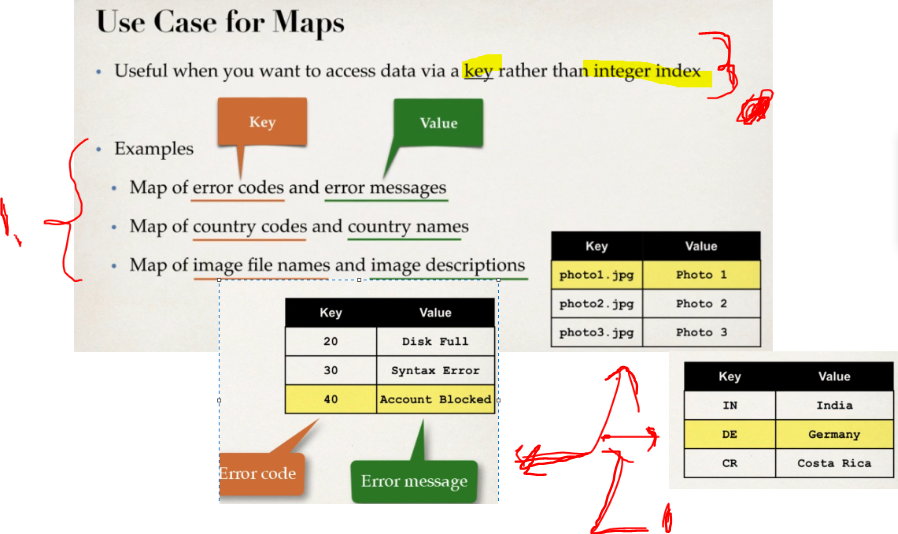
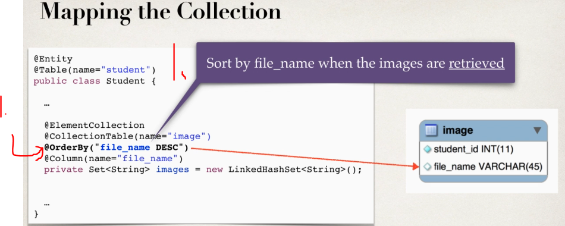
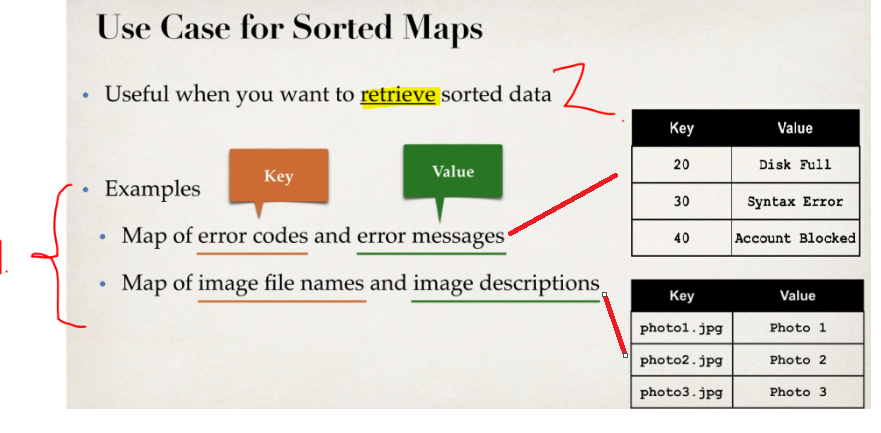
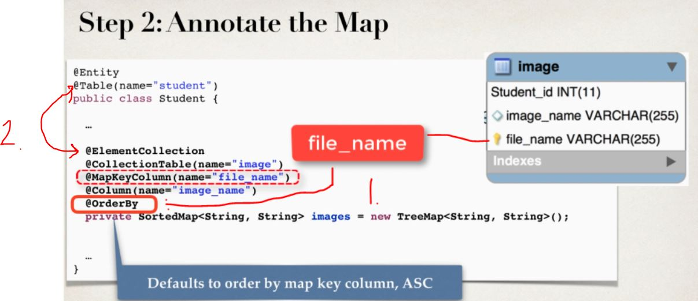
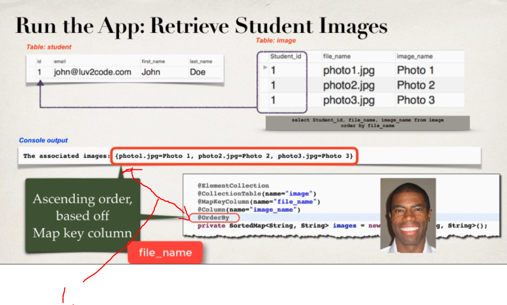
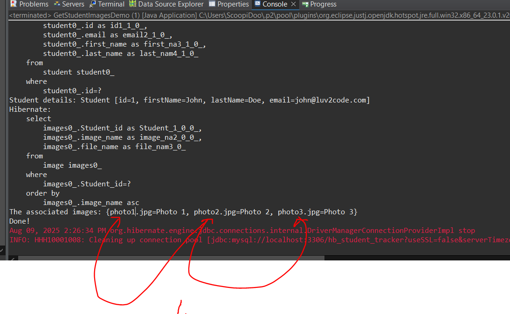

# Section 03: Mapping Collections - Maps, Sorted Maps and Sorted Sets.

Mapping Collections - Maps, Sorted Maps and Sorted Sets.

# What I Learned.

# Maps - Overview.

> **Map**
>   Object that maps unique **keys** to **values**.
>   Cannot contain **duplicates**.
>   **Key** is used to store values and retrieving values.



1. Examples of usage:
	- Map of error codes and error messages.
	- Map of country codes and country names.
	- Map of image file names and image descriptions.
2. Example of using **maps**, there will be **keys** mapped to **value**.
3. When you want access using **key** rather than using **integer** index.


1. We will have **map** that maps to **images**.
2. Map **keys cannot** have **duplicates**!


1. `@MapKeyColumn` for mapping
    - For the given **key** in map, mapped into the database.

- Example of usage for the **map**.


```
@Entity
public class Department {
    @Id
    private Long id;

    private String name;

    @ElementCollection
    @MapKeyColumn(name = "employee_name") // this column stores the map's keys
    @Column(name = "employee_salary")     // this column stores the map's values
    @CollectionTable(name = "department_employees", 
                     joinColumns = @JoinColumn(name = "department_id"))
    private Map<String, Integer> employees = new HashMap<>();
}
```

- This maps the **map** key to the database column `department_id`.
    - `employee_name` is used to as **key**.

| `department_id` | `employee_name` | `employee_salary` |
|---------------|----------------|-----------------|
| 1             | Alice          | 90000           |
| 1             | Bob            | 95000           |
| 2             | Charlie        | 70000           |


1. **Maps** the **key** of the **map** for given column in the database. `@MapKeyColumn(name="file_name")`
2. The database column where the mapped value will be. In this example `image_name`.


1. Like in the code, we will map **one** value for the **three** images in database.

# Maps - Write Some Code.

- We are **mapping** :D the **map** in Hibernate.

- The Student Entity:

```
package com.luv2code.hibernate.demo.entity;

import java.util.HashMap;
import java.util.Map;

import javax.persistence.CollectionTable;
import javax.persistence.Column;
import javax.persistence.ElementCollection;
import javax.persistence.Entity;
import javax.persistence.GeneratedValue;
import javax.persistence.GenerationType;
import javax.persistence.Id;
import javax.persistence.MapKeyColumn;
import javax.persistence.Table;

@Entity
@Table(name="student")
public class Student {

	@Id
	@GeneratedValue(strategy=GenerationType.IDENTITY)
	private int id;
	
	@Column(name="first_name")
	private String firstName;
	
	@Column(name="last_name")
	private String lastName;
	
	@Column(name="email")
	private String email;
		
	@ElementCollection
	@CollectionTable(name="image")
	@MapKeyColumn(name="file_name")
	@Column(name="image_name")
	private Map<String, String> images = new HashMap<String, String>();
	
	
	public Student(String firstName, String lastName, String email) {
		this.firstName = firstName;
		this.lastName = lastName;
		this.email = email;
	}

	public int getId() {
		return id;
	}

	public void setId(int id) {
		this.id = id;
	}

	public String getFirstName() {
		return firstName;
	}

	public void setFirstName(String firstName) {
		this.firstName = firstName;
	}

	public String getLastName() {
		return lastName;
	}

	public void setLastName(String lastName) {
		this.lastName = lastName;
	}

	public String getEmail() {
		return email;
	}

	public void setEmail(String email) {
		this.email = email;
	}


	public Map<String, String> getImages() {
		return images;
	}

	public void setImages(Map<String, String> images) {
		this.images = images;
	}

	@Override
	public String toString() {
		return "Student [id=" + id + ", firstName=" + firstName + ", lastName=" + lastName + ", email=" + email + "]";
	}
	
}
```

- The Client:


```
package com.luv2code.hibernate.demo;

import java.util.Map;

import org.hibernate.Session;
import org.hibernate.SessionFactory;
import org.hibernate.cfg.Configuration;

import com.luv2code.hibernate.demo.entity.Student;

public class CreateStudentImagesMapDemo {


	public static void main(String[] args) {
		
		//create session factory
		SessionFactory factory = new Configuration()
									.configure("hibernate.cfg.xml")
									.addAnnotatedClass(Student.class)
									.buildSessionFactory();
		

		//create session
		Session session = factory.getCurrentSession();
		
		try {
		//create the object
			Student tempStudent = new Student("John","Doe","john@luv2code.com");
			Map<String, String> theImages = tempStudent.getImages();
			
			theImages.put("photo1.jpg", "Photo 1");
			theImages.put("photo2.jpg", "Photo 2");
			theImages.put("photo3.jpg", "Photo 3");

		//start a transaction
			session.beginTransaction();
			
		//save the object
			System.out.println("Saving the student and images..");
			session.persist(tempStudent);
			
		//commit the transaction
			session.getTransaction().commit();
			System.out.println("Done!!");
		}
		finally {
		//clean up code
			session.close();
			factory.close();
		}
		

	}

}
```


1. `image_name` is used as **key**.
2. `file_name` **value** is being saved.
3. `image` is the table name.

# Sorted Sets - Overview.

> **Sorted Set**
> **Collection** that does **not** contain **duplicates**.
> When, get, the order is given.


1. When you are interested in `yes`**/**`no` answers from the `.contains()`. Also, when getting the **element** the **order** is important!
2. Take the examples here.


1. We will have the `images` in the **set**. We want **get** image in the **descending** order. This cannot contain **duplicates**!


1. **Notice** that we will not have the external **Entity**.


1. We will be using `update`, for the **Hibernate** configuration!
2. The properties for the update:


1. `@OrderBy` specifies the **ordering** of the **elements when** a collection is **retrieved**.
2.  **Syntax**: `@OrderBy (" [field name or property name] [ASC | DESC]")`
**Example**: `@OrderBy ("file_name DESC")`.
3. Close comparison is for the **SQL** ordering syntax. Example [SQL Keyword](https://www.w3schools.com/sql/sql_orderby.asp).
	- SQL: `select * from image order by file_name`.
4. If `ASC` or `DESC` is **not specified** then `ASC` is the **default**.

<br>

- This will be **second** annotation for **ordering**:
	- With the **Collection type** it was `@OrderColumn` and as following:
	```
	@ElementCollection
	@CollectionTable(name = "image")
	@OrderColumn
	@Column(name="file_name") // Defaults to images.
	private List<String> images = new ArrayList<String>();¨
	```
	- With the **Sorted Set** it was `@OrderBy`.
	```
	@ElementCollection
	@CollectionTable(name="image")
	@org.hibernate.annotations.OrderBy(clause = "file_name") //default asc
	@Column(name="file_name") //defaults to images
	private Set<String> images = new LinkedHashSet<String>();
	
	```



1. We are using the `@OrderBy"file_name DESC")`. This will **order** by `file_name`.


- Code as following:

```
// create the object
Student tempStudent = new Student("Paul", "Wall", "paul@luv2code.com");
Set<String> theImages = tempStudent.getImages();

theImages.add("photo1.jpg");
theImages.add("photo2.jpg");
theImages.add("photo3.jpg");
theImages.add("photo4.jpg");
theImages.add("photo5.jpg");

// start a transaction
session.beginTransaction();

// save the object
System.out.println("Saving the student and images...");
session.persist(tempStudent);
```


1. These will be **saved** into the database as in order like in the database as in **Sorted Set**.

# Sorted Sets - Write Some Code - Part 1.

- The **Hibernate** configuration:

```
<!DOCTYPE hibernate-configuration PUBLIC
        "-//Hibernate/Hibernate Configuration DTD 3.0//EN"
        "http://www.hibernate.org/dtd/hibernate-configuration-3.0.dtd">

<hibernate-configuration>

    <session-factory>


        <property name="hibernate.connection.driver_class">com.mysql.cj.jdbc.Driver</property>
        <property name="hibernate.connection.url">jdbc:mysql://localhost:3306/hb_student_tracker?useSSL=false&amp;serverTimezone=UTC</property>
        <property name="connection.username">root</property>
        <property name="connection.password">password</property>
        <!-- JDBC connection pool settings ... using built-in test pool -->
        <property name="connection.pool_size">1</property>
        <!-- Select our SQL dialect -->
        <property name="hibernate.dialect">org.hibernate.dialect.MySQL8Dialect</property>
        <!-- Echo the SQL to stdout -->
        <property name="show_sql">true</property>
        <!-- Auto create tables -->
        <property name="hibernate.hbm2ddl.auto">update</property>
		<!-- Set the current session context -->
		<property name="current_session_context_class">thread</property>
 
    </session-factory>

</hibernate-configuration>
```

- The student **Entity**:

```
package com.luv2code.hibernate.demo.entity;

import java.util.LinkedHashSet;
import java.util.Set;

import javax.persistence.CollectionTable;
import javax.persistence.Column;
import javax.persistence.ElementCollection;
import javax.persistence.Entity;
import javax.persistence.GeneratedValue;
import javax.persistence.GenerationType;
import javax.persistence.Id;
import javax.persistence.Table;

@Entity
@Table(name="student")
public class Student {

	@Id
	@GeneratedValue(strategy=GenerationType.IDENTITY)
	private int id;
	
	@Column(name="first_name")
	private String firstName;
	
	@Column(name="last_name")
	private String lastName;
	
	@Column(name="email")
	private String email;
		
	@ElementCollection
	@CollectionTable(name="image")
@org.hibernate.annotations.OrderBy(clause = "file_name") //default asc
	@Column(name="file_name") //defaults to images
	private Set<String> images = new LinkedHashSet<String>();
	
	
	public Student() {
		
	}
	
	public Student(String firstName, String lastName, String email) {
		this.firstName = firstName;
		this.lastName = lastName;
		this.email = email;
	}

	public int getId() {
		return id;
	}

	public void setId(int id) {
		this.id = id;
	}

	public String getFirstName() {
		return firstName;
	}

	public void setFirstName(String firstName) {
		this.firstName = firstName;
	}

	public String getLastName() {
		return lastName;
	}

	public void setLastName(String lastName) {
		this.lastName = lastName;
	}

	public String getEmail() {
		return email;
	}

	public void setEmail(String email) {
		this.email = email;
	}


	public Set<String> getImages() {
		return images;
	}

	public void setImages(Set<String> images) {
		this.images = images;
	}

	@Override
	public String toString() {
		return "Student [id=" + id + ", firstName=" + firstName + ", lastName=" + lastName + ", email=" + email + "]";
	}
	
}
```


- The **client** for creating the students:

```
package com.luv2code.hibernate.demo;

import java.util.Set;

import org.hibernate.Session;
import org.hibernate.SessionFactory;
import org.hibernate.cfg.Configuration;

import com.luv2code.hibernate.demo.entity.Student;

public class CreateStudentImagesSortedSetDemo {


	public static void main(String[] args) {
		
		//create session factory
		SessionFactory factory = new Configuration()
									.configure("hibernate.cfg.xml")
									.addAnnotatedClass(Student.class)
									.buildSessionFactory();
		

		//create session
		Session session = factory.getCurrentSession();
		
		try {
		//create the object
			Student tempStudent = new Student("John","Doe","john@luv2code.com");
			Set<String> theImages = tempStudent.getImages();
			
			theImages.add("photo1.jpg");
			theImages.add("photo2.jpg");
			theImages.add("photo3.jpg");
			theImages.add("photo4.jpg");
			theImages.add("photo4.jpg"); //Duplicate, filtered at java level by HashSet!!!
			theImages.add("photo5.jpg");
			theImages.add("photo5.jpg"); //Duplicate, filtered at java level by HashSet!!!
			
		//start a transaction
			session.beginTransaction();
			
		//save the object
			System.out.println("Saving the student and images..");
			session.persist(tempStudent);
			
		//commit the transaction
			session.getTransaction().commit();
			System.out.println("Done!!");
		}
		finally {
		//clean up code
			session.close();
			factory.close();
		}
		

	}

}

```


1. We can see we have saved into to the database, thought to the **Ordered Set**.

# Sorted Sets - Write Some Code - Part 2.

- The student **Entity**:

```
package com.luv2code.hibernate.demo.entity;

import java.util.LinkedHashSet;
import java.util.Set;

import javax.persistence.CollectionTable;
import javax.persistence.Column;
import javax.persistence.ElementCollection;
import javax.persistence.Entity;
import javax.persistence.GeneratedValue;
import javax.persistence.GenerationType;
import javax.persistence.Id;
import javax.persistence.OrderBy;
import javax.persistence.Table;

@Entity
@Table(name="student")
public class Student {

	@Id
	@GeneratedValue(strategy=GenerationType.IDENTITY)
	private int id;
	
	@Column(name="first_name")
	private String firstName;
	
	@Column(name="last_name")
	private String lastName;
	
	@Column(name="email")
	private String email;
		
	@ElementCollection
	@CollectionTable(name="image")
//	@OrderBy we could use the the @orderBy form package import javax.persistence.OrderBy;
@org.hibernate.annotations.OrderBy(clause = "file_name") //default asc
	@Column(name="file_name") //defaults to images
	private Set<String> images = new LinkedHashSet<String>();
	
	
	public Student() {
		
	}
	
	public Student(String firstName, String lastName, String email) {
		this.firstName = firstName;
		this.lastName = lastName;
		this.email = email;
	}

	public int getId() {
		return id;
	}

	public void setId(int id) {
		this.id = id;
	}

	public String getFirstName() {
		return firstName;
	}

	public void setFirstName(String firstName) {
		this.firstName = firstName;
	}

	public String getLastName() {
		return lastName;
	}

	public void setLastName(String lastName) {
		this.lastName = lastName;
	}

	public String getEmail() {
		return email;
	}

	public void setEmail(String email) {
		this.email = email;
	}


	public Set<String> getImages() {
		return images;
	}

	public void setImages(Set<String> images) {
		this.images = images;
	}

	@Override
	public String toString() {
		return "Student [id=" + id + ", firstName=" + firstName + ", lastName=" + lastName + ", email=" + email + "]";
	}
	
}
```


- The **client** for getting the students:

```
package com.luv2code.hibernate.demo;

import org.hibernate.Session;
import org.hibernate.SessionFactory;
import org.hibernate.cfg.Configuration;

import com.luv2code.hibernate.demo.entity.Student;

public class GetStudentImagesDemo {

	public static void main(String[] args) {

		//create session factory
		SessionFactory factory = new Configuration()
									.configure("hibernate.cfg.xml")
									.addAnnotatedClass(Student.class)
									.buildSessionFactory();
		

		//create session
		Session session = factory.getCurrentSession();
		
		try {
			
			//start a transaction
			session.beginTransaction();
			
			// get the student id
			int theId = 1;
			Student student = session.get(Student.class, theId);
			
			//print the student detail
			System.out.println("Student details: "+student);
			
			//print the associated images
			System.out.println("The associated images: "+student.getImages());
			
			//commit the transaction
			session.getTransaction().commit();
			
			//done
			System.out.println("Done!");
		}
		finally {
			//close the transaction
			session.close();
			factory.close();
			
		}
		
		
	}

}
```

- You can get the **ordered images**, using with `@OrderBy` annotation.

```
Hibernate: select student0_.id as id1_1_0_, student0_.email as email2_1_0_, student0_.first_name as first_na3_1_0_, student0_.last_name as last_nam4_1_0_ from student student0_ where student0_.id=?
Student details: Student [id=1, firstName=John, lastName=Doe, email=john@luv2code.com]
Hibernate: select images0_.Student_id as Student_1_0_0_, images0_.file_name as file_nam2_0_0_ from image images0_ where images0_.Student_id=? order by images0_.file_name
The associated images: [photo1.jpg, photo2.jpg, photo3.jpg, photo4.jpg, photo5.jpg]
Done!
```

# Sorted Maps - Overview.

> **Sorted Map**
> Elements are **sorted** when insert happen!
> This can be used for mapping **unique** key:s to value:s.
> We can also, specify **sorting order**.



1. Map can be used, **example of error codes** and **error messages**.
2. Map can be used, **example image file names** and **images description**.


 
 1. We will be sorted by the **filename** or sort based on **key**. 

- High level diagram.


1. The `@OrderBy` is applied when the **collection** is **retrieved**. This is done in database level, not in **Java** level.



1. `@OrderBy` **defaults** by `file_name` as ASCENDING.
2. Remember, there will be no separate **Entity**. The `@ElementCollection`, will be telling that it is **Embeddable type** and owned the parent Entity. This will be in its **own table**.

- Example of the Entity definition:

```
	@ElementCollection
	@CollectionTable(name="image")
	@MapKeyColumn(name="file_name") //Maps Key
	@Column(name="image_name") //Maps Value
	@OrderBy
	private SortedMap<String, String> images = new TreeMap<String, String>();
	
```




1. We will be having **Sorting** based on Maps **key columns**.

# Sorted Maps - Write Some Code.

> [!IMPORTANT]  
> Remember to create the db, if It's not here `CREATE DATABASE IF NOT EXISTS hb_student_tracker;`.

> For this lab, we will be using. This is sake for backwards compatibility:
> `System.setProperty("com.sun.xml.bind.v2.bytecode.ClassTailor.noOptimize", "true");` 

- Our **Entity** for both examples:

```
package com.luv2code.hibernate.demo.entity;

import java.util.Comparator;
import java.util.SortedMap;
import java.util.TreeMap;

import javax.persistence.CollectionTable;
import javax.persistence.Column;
import javax.persistence.ElementCollection;
import javax.persistence.Entity;
import javax.persistence.GeneratedValue;
import javax.persistence.GenerationType;
import javax.persistence.Id;
import javax.persistence.MapKeyColumn;
import javax.persistence.OrderBy;
import javax.persistence.Table;


@Entity
@Table(name="student")
public class Student {

	@Id
	@GeneratedValue(strategy=GenerationType.IDENTITY)
	private int id;
	
	@Column(name="first_name")
	private String firstName;
	
	@Column(name="last_name")
	private String lastName;
	
	@Column(name="email")
	private String email;
		
	@ElementCollection
	@CollectionTable(name="image")
	@MapKeyColumn(name="file_name") //Maps Key
	@Column(name="image_name") //Maps Value
	@OrderBy
//	@SortComparator(ReverseStringComparator.class)
	private SortedMap<String, String> images = new TreeMap<String, String>();
	
	
	//Reverse String
	public static class ReverseStringComparator implements Comparator<String>{

		@Override
		public int compare(String o1, String o2) {
			
			return o2.compareTo(o1);
		}
		
	}
	
	
	public Student() {
		
	}
	
	public Student(String firstName, String lastName, String email) {
		this.firstName = firstName;
		this.lastName = lastName;
		this.email = email;
	}

	public int getId() {
		return id;
	}

	public void setId(int id) {
		this.id = id;
	}

	public String getFirstName() {
		return firstName;
	}

	public void setFirstName(String firstName) {
		this.firstName = firstName;
	}

	public String getLastName() {
		return lastName;
	}

	public void setLastName(String lastName) {
		this.lastName = lastName;
	}

	public String getEmail() {
		return email;
	}

	public void setEmail(String email) {
		this.email = email;
	}


	public SortedMap<String, String> getImages() {
		return images;
	}

	public void setImages(SortedMap<String, String> images) {
		this.images = images;
	}

	@Override
	public String toString() {
		return "Student [id=" + id + ", firstName=" + firstName + ", lastName=" + lastName + ", email=" + email + "]";
	}
	
}
```

- The Configuration for both examples:

```
<!DOCTYPE hibernate-configuration PUBLIC
        "-//Hibernate/Hibernate Configuration DTD 3.0//EN"
        "http://hibernate.sourceforge.net/hibernate-configuration-3.0.dtd">

<hibernate-configuration>
    <session-factory>

        <!-- DB connection -->
        <property name="hibernate.connection.driver_class">com.mysql.cj.jdbc.Driver</property>
        <property name="hibernate.connection.url">jdbc:mysql://localhost:3306/hb_student_tracker?useSSL=false&amp;serverTimezone=UTC</property>
        <property name="connection.username">root</property>
        <property name="connection.password">password</property>


        <!-- Dialect -->
        <property name="hibernate.dialect">org.hibernate.dialect.MySQL8Dialect</property>

        <!-- Hibernate behavior -->
        <property name="hibernate.show_sql">true</property>
        <property name="hibernate.format_sql">true</property>
        <property name="hibernate.hbm2ddl.auto">create</property>

	<!-- Set the current session context -->
		<property name="current_session_context_class">thread</property>
		
    </session-factory>
</hibernate-configuration>
```

- The Client code for the `CreateStudentImagesSortedMapDemo` creating the **Student**, with the **Map**:

```
package com.luv2code.hibernate.demo;

import java.util.Map;

import org.hibernate.Session;
import org.hibernate.SessionFactory;
import org.hibernate.cfg.Configuration;

import com.luv2code.hibernate.demo.entity.Student;

public class CreateStudentImagesSortedMapDemo {


	public static void main(String[] args) {
		
		System.setProperty("com.sun.xml.bind.v2.bytecode.ClassTailor.noOptimize", "true"); // This is temporary fix.
		   
		   
		//create session factory
		SessionFactory factory = new Configuration()
									.configure("hibernate.cfg.xml")
									.addAnnotatedClass(Student.class)
									.buildSessionFactory();
		

		//create session
		Session session = factory.getCurrentSession();
		
		try {
		//create the object
			Student tempStudent = new Student("John","Doe","john@luv2code.com");
			Map<String, String> theImages = tempStudent.getImages();
			
			theImages.put("photo1.jpg", "Photo 1");
			theImages.put("photo2.jpg", "Photo 2");
			theImages.put("photo3.jpg", "Photo 3");

		//start a transaction
			session.beginTransaction();
			
		//save the object
			System.out.println("Saving the student and images..");
			session.persist(tempStudent);
			
		//commit the transaction
			session.getTransaction().commit();
			System.out.println("Done!!");
		}
		finally {
		//clean up code
			session.close();
			factory.close();
		}
		

	}

}
```

- Running `CreateStudentImagesSortedMapDemo` for creating the **Student** we get the **logs**:

```
Aug 09, 2025 2:22:28 PM org.hibernate.Version logVersion
INFO: HHH000412: Hibernate Core {5.3.6.Final}
Aug 09, 2025 2:22:28 PM org.hibernate.cfg.Environment <clinit>
INFO: HHH000206: hibernate.properties not found
Aug 09, 2025 2:22:28 PM org.hibernate.boot.jaxb.internal.stax.LocalXmlResourceResolver resolveEntity
WARN: HHH90000012: Recognized obsolete hibernate namespace http://hibernate.sourceforge.net/hibernate-configuration. Use namespace http://www.hibernate.org/dtd/hibernate-configuration instead.  Support for obsolete DTD/XSD namespaces may be removed at any time.
Aug 09, 2025 2:22:28 PM com.sun.xml.bind.v2.runtime.reflect.opt.AccessorInjector <clinit>
INFO: The optimized code generation is disabled
Aug 09, 2025 2:22:29 PM org.hibernate.annotations.common.reflection.java.JavaReflectionManager <clinit>
INFO: HCANN000001: Hibernate Commons Annotations {5.0.4.Final}
Aug 09, 2025 2:22:29 PM org.hibernate.engine.jdbc.connections.internal.DriverManagerConnectionProviderImpl configure
WARN: HHH10001002: Using Hibernate built-in connection pool (not for production use!)
Aug 09, 2025 2:22:29 PM org.hibernate.engine.jdbc.connections.internal.DriverManagerConnectionProviderImpl buildCreator
INFO: HHH10001005: using driver [com.mysql.cj.jdbc.Driver] at URL [jdbc:mysql://localhost:3306/hb_student_tracker?useSSL=false&serverTimezone=UTC]
Aug 09, 2025 2:22:29 PM org.hibernate.engine.jdbc.connections.internal.DriverManagerConnectionProviderImpl buildCreator
INFO: HHH10001001: Connection properties: {user=root, password=****}
Aug 09, 2025 2:22:29 PM org.hibernate.engine.jdbc.connections.internal.DriverManagerConnectionProviderImpl buildCreator
INFO: HHH10001003: Autocommit mode: false
Aug 09, 2025 2:22:29 PM org.hibernate.engine.jdbc.connections.internal.DriverManagerConnectionProviderImpl$PooledConnections <init>
INFO: HHH000115: Hibernate connection pool size: 20 (min=1)
Aug 09, 2025 2:22:29 PM org.hibernate.dialect.Dialect <init>
INFO: HHH000400: Using dialect: org.hibernate.dialect.MySQL8Dialect
Aug 09, 2025 2:22:30 PM org.hibernate.resource.transaction.backend.jdbc.internal.DdlTransactionIsolatorNonJtaImpl getIsolatedConnection
INFO: HHH10001501: Connection obtained from JdbcConnectionAccess [org.hibernate.engine.jdbc.env.internal.JdbcEnvironmentInitiator$ConnectionProviderJdbcConnectionAccess@37468787] for (non-JTA) DDL execution was not in auto-commit mode; the Connection 'local transaction' will be committed and the Connection will be set into auto-commit mode.
Saving the student and images..
Hibernate: 
    insert 
    into
        student
        (email, first_name, last_name) 
    values
        (?, ?, ?)
Hibernate: 
    insert 
    into
        image
        (Student_id, file_name, image_name) 
    values
        (?, ?, ?)
Hibernate: 
    insert 
    into
        image
        (Student_id, file_name, image_name) 
    values
        (?, ?, ?)
Hibernate: 
    insert 
    into
        image
        (Student_id, file_name, image_name) 
    values
        (?, ?, ?)
Done!!
Aug 09, 2025 2:22:30 PM org.hibernate.engine.jdbc.connections.internal.DriverManagerConnectionProviderImpl stop
INFO: HHH10001008: Cleaning up connection pool [jdbc:mysql://localhost:3306/hb_student_tracker?useSSL=false&serverTimezone=UTC]
```

- The Client code for the `GetStudentImagesDemo`:

```
package com.luv2code.hibernate.demo;

import org.hibernate.Session;
import org.hibernate.SessionFactory;
import org.hibernate.cfg.Configuration;

import com.luv2code.hibernate.demo.entity.Student;

public class GetStudentImagesDemo {

	public static void main(String[] args) {
		

		System.setProperty("com.sun.xml.bind.v2.bytecode.ClassTailor.noOptimize", "true"); // This is temporary fix.
		
		//create session factory
		SessionFactory factory = new Configuration()
									.configure("hibernate.cfg.xml")
									.addAnnotatedClass(Student.class)
									.buildSessionFactory();
		

		//create session
		Session session = factory.getCurrentSession();
		
		try {
			
			//start a transaction
			session.beginTransaction();
			
			// get the student id
			int theId = 1;
			Student student = session.get(Student.class, theId);
			
			//print the student detail
			System.out.println("Student details: "+student);
			
			//print the associated images
			System.out.println("The associated images: "+student.getImages());
			
			//commit the transaction
			session.getTransaction().commit();
			
			//done
			System.out.println("Done!");
		}
		finally {
			//close the transaction
			session.close();
			factory.close();
			
		}
		
		
	}

}
```


- Running `GetStudentImagesDemo` for getting the **Student** we get the **logs**:


```
Aug 09, 2025 2:18:02 PM org.hibernate.Version logVersion
INFO: HHH000412: Hibernate Core {5.3.6.Final}
Aug 09, 2025 2:18:02 PM org.hibernate.cfg.Environment <clinit>
INFO: HHH000206: hibernate.properties not found
Aug 09, 2025 2:18:02 PM org.hibernate.boot.jaxb.internal.stax.LocalXmlResourceResolver resolveEntity
WARN: HHH90000012: Recognized obsolete hibernate namespace http://hibernate.sourceforge.net/hibernate-configuration. Use namespace http://www.hibernate.org/dtd/hibernate-configuration instead.  Support for obsolete DTD/XSD namespaces may be removed at any time.
Aug 09, 2025 2:18:02 PM com.sun.xml.bind.v2.runtime.reflect.opt.AccessorInjector <clinit>
INFO: The optimized code generation is disabled
Aug 09, 2025 2:18:02 PM org.hibernate.annotations.common.reflection.java.JavaReflectionManager <clinit>
INFO: HCANN000001: Hibernate Commons Annotations {5.0.4.Final}
Aug 09, 2025 2:18:02 PM org.hibernate.engine.jdbc.connections.internal.DriverManagerConnectionProviderImpl configure
WARN: HHH10001002: Using Hibernate built-in connection pool (not for production use!)
Aug 09, 2025 2:18:02 PM org.hibernate.engine.jdbc.connections.internal.DriverManagerConnectionProviderImpl buildCreator
INFO: HHH10001005: using driver [com.mysql.cj.jdbc.Driver] at URL [jdbc:mysql://localhost:3306/hb_student_tracker?useSSL=false&serverTimezone=UTC]
Aug 09, 2025 2:18:02 PM org.hibernate.engine.jdbc.connections.internal.DriverManagerConnectionProviderImpl buildCreator
INFO: HHH10001001: Connection properties: {user=root, password=****}
Aug 09, 2025 2:18:02 PM org.hibernate.engine.jdbc.connections.internal.DriverManagerConnectionProviderImpl buildCreator
INFO: HHH10001003: Autocommit mode: false
Aug 09, 2025 2:18:02 PM org.hibernate.engine.jdbc.connections.internal.DriverManagerConnectionProviderImpl$PooledConnections <init>
INFO: HHH000115: Hibernate connection pool size: 20 (min=1)
Aug 09, 2025 2:18:03 PM org.hibernate.dialect.Dialect <init>
INFO: HHH000400: Using dialect: org.hibernate.dialect.MySQL8Dialect
Aug 09, 2025 2:18:04 PM org.hibernate.resource.transaction.backend.jdbc.internal.DdlTransactionIsolatorNonJtaImpl getIsolatedConnection
INFO: HHH10001501: Connection obtained from JdbcConnectionAccess [org.hibernate.engine.jdbc.env.internal.JdbcEnvironmentInitiator$ConnectionProviderJdbcConnectionAccess@714f3da4] for (non-JTA) DDL execution was not in auto-commit mode; the Connection 'local transaction' will be committed and the Connection will be set into auto-commit mode.
Hibernate: 
    select
        student0_.id as id1_1_0_,
        student0_.email as email2_1_0_,
        student0_.first_name as first_na3_1_0_,
        student0_.last_name as last_nam4_1_0_ 
    from
        student student0_ 
    where
        student0_.id=?
Student details: Student [id=1, firstName=John, lastName=Doe, email=john@luv2code.com]
Hibernate: 
    select
        images0_.Student_id as Student_1_0_0_,
        images0_.image_name as image_na2_0_0_,
        images0_.file_name as file_nam3_0_ 
    from
        image images0_ 
    where
        images0_.Student_id=? 
    order by
        images0_.image_name asc
The associated images: {photo1.jpg=Photo 1, photo2.jpg=Photo 2, photo3.jpg=Photo 3}
Done!
Aug 09, 2025 2:18:04 PM org.hibernate.engine.jdbc.connections.internal.DriverManagerConnectionProviderImpl stop
INFO: HHH10001008: Cleaning up connection pool [jdbc:mysql://localhost:3306/hb_student_tracker?useSSL=false&serverTimezone=UTC]
```



1. We can see `@OrderBy` is working with the logs. This is based on the **keys**!


- Todo palaa tähän jos jaksta, joku 7:00, joku eri tapa tehdä sorttaus itse!