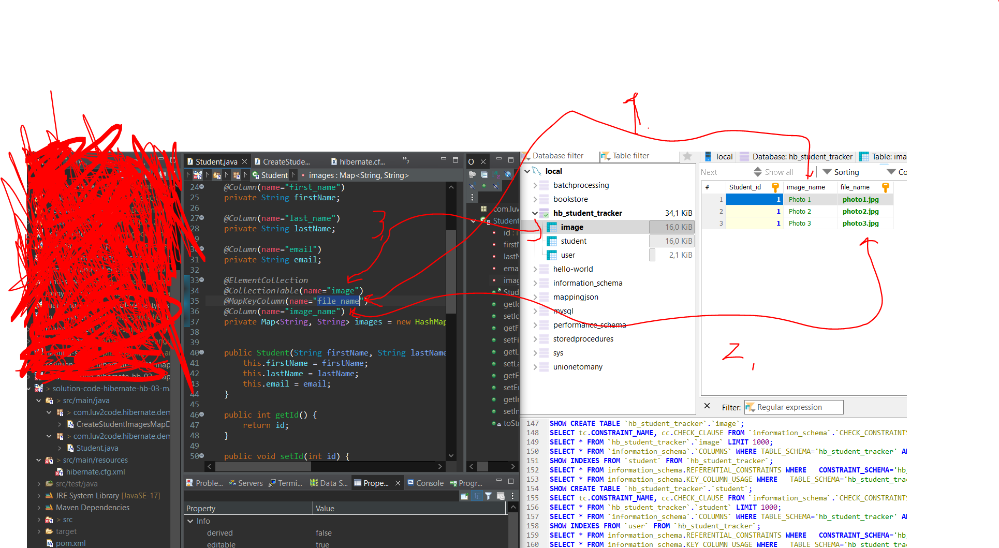

# Section 03: Mapping Collections - Maps, Sorted Maps and Sorted Sets.

Mapping Collections - Maps, Sorted Maps and Sorted Sets.

# What I Learned.

# Maps - Overview.

> **Map**
>   Object that maps unique **keys** to **values**.
>   Cannot contain **duplicates**.
>   **Key** is used to store values and retrieving values.


1. insert examples here.s
2. Example of using **maps**, there will be **keys** mapped to **value**.
3. When you want access using **key** rather than using **integer** index.


1. We will have **map** that maps to **images**.
2. Map **keys cannot** have **duplicates**!


1. `@MapKeyColumn` for mapping
    - For the given **key** in map, mapped into the database.

- Example of usage for the **map**.


```
@Entity
public class Department {
    @Id
    private Long id;

    private String name;

    @ElementCollection
    @MapKeyColumn(name = "employee_name") // this column stores the map's keys
    @Column(name = "employee_salary")     // this column stores the map's values
    @CollectionTable(name = "department_employees", 
                     joinColumns = @JoinColumn(name = "department_id"))
    private Map<String, Integer> employees = new HashMap<>();
}
```

- This maps the **map** key to the database column `department_id`.
    - `employee_name` is used to as **key**.

| `department_id` | `employee_name` | `employee_salary` |
|---------------|----------------|-----------------|
| 1             | Alice          | 90000           |
| 1             | Bob            | 95000           |
| 2             | Charlie        | 70000           |


1. **Maps** the **key** of the **map** for given column in the database. `@MapKeyColumn(name="file_name")`
2. The database column where the mapped value will be. In this example `image_name`.


1. Like in the code, we will map **one** value for the **three** images in database.

# Maps - Write Some Code.

- We are **mapping** :D the **map** in Hibernate.

- The Student entity:

```
package com.luv2code.hibernate.demo.entity;

import java.util.HashMap;
import java.util.Map;

import javax.persistence.CollectionTable;
import javax.persistence.Column;
import javax.persistence.ElementCollection;
import javax.persistence.Entity;
import javax.persistence.GeneratedValue;
import javax.persistence.GenerationType;
import javax.persistence.Id;
import javax.persistence.MapKeyColumn;
import javax.persistence.Table;

@Entity
@Table(name="student")
public class Student {

	@Id
	@GeneratedValue(strategy=GenerationType.IDENTITY)
	private int id;
	
	@Column(name="first_name")
	private String firstName;
	
	@Column(name="last_name")
	private String lastName;
	
	@Column(name="email")
	private String email;
		
	@ElementCollection
	@CollectionTable(name="image")
	@MapKeyColumn(name="file_name")
	@Column(name="image_name")
	private Map<String, String> images = new HashMap<String, String>();
	
	
	public Student(String firstName, String lastName, String email) {
		this.firstName = firstName;
		this.lastName = lastName;
		this.email = email;
	}

	public int getId() {
		return id;
	}

	public void setId(int id) {
		this.id = id;
	}

	public String getFirstName() {
		return firstName;
	}

	public void setFirstName(String firstName) {
		this.firstName = firstName;
	}

	public String getLastName() {
		return lastName;
	}

	public void setLastName(String lastName) {
		this.lastName = lastName;
	}

	public String getEmail() {
		return email;
	}

	public void setEmail(String email) {
		this.email = email;
	}


	public Map<String, String> getImages() {
		return images;
	}

	public void setImages(Map<String, String> images) {
		this.images = images;
	}

	@Override
	public String toString() {
		return "Student [id=" + id + ", firstName=" + firstName + ", lastName=" + lastName + ", email=" + email + "]";
	}
	
}
```

- The Client:


```
package com.luv2code.hibernate.demo;

import java.util.Map;

import org.hibernate.Session;
import org.hibernate.SessionFactory;
import org.hibernate.cfg.Configuration;

import com.luv2code.hibernate.demo.entity.Student;

public class CreateStudentImagesMapDemo {


	public static void main(String[] args) {
		
		//create session factory
		SessionFactory factory = new Configuration()
									.configure("hibernate.cfg.xml")
									.addAnnotatedClass(Student.class)
									.buildSessionFactory();
		

		//create session
		Session session = factory.getCurrentSession();
		
		try {
		//create the object
			Student tempStudent = new Student("John","Doe","john@luv2code.com");
			Map<String, String> theImages = tempStudent.getImages();
			
			theImages.put("photo1.jpg", "Photo 1");
			theImages.put("photo2.jpg", "Photo 2");
			theImages.put("photo3.jpg", "Photo 3");

		//start a transaction
			session.beginTransaction();
			
		//save the object
			System.out.println("Saving the student and images..");
			session.persist(tempStudent);
			
		//commit the transaction
			session.getTransaction().commit();
			System.out.println("Done!!");
		}
		finally {
		//clean up code
			session.close();
			factory.close();
		}
		

	}

}
```



1. `image_name` is used as **key**.
2. `file_name` **value** is being saved.
3. `image` is the table name.

# Sorted Sets - Overview.

> **Sorted Set**
> **Collection** that does **not** contain **duplicates**.
> When, get, the order is given.


1. When you are interested in `yes`**/**`no` answers from the `.contains()`. Also, when getting the **element** the **order** is important!
2. Take the examples here.


1. We will have the `images` in the **set**. We want **get** image in the **descending** order. This cannot contain **duplicates**!


1. **Notice** that we will not have the external **Entity**.


1. We will be using `update`, for the **Hibernate** configuration!
2. The properties for the update:


1. `@OrderBy` specifies the **ordering** of the **elements when** a collection is **retrieved**.
2.  **Syntax**: `@OrderBy (" [field name or property name] [ASC | DESC]")`
**Example**: `@OrderBy ("file_name DESC")`.
3. Close comparison is for the **SQL** ordering syntax. Example [SQL Keyword](https://www.w3schools.com/sql/sql_orderby.asp).
	- SQL: `select * from image order by file_name`.
4. If `ASC` or `DESC` is **not specified** then `ASC` is the **default**.

<br>

- This will be **second** annotation for **ordering**:
	- With the **Collection type** it was `@OrderColumn` and as following:
	```
	@ElementCollection
	@CollectionTable(name = "image")
	@OrderColumn
	@Column(name="file_name") // Defaults to images.
	private List<String> images = new ArrayList<String>();¨
	```
	- With the **Sorted Set** it was `@OrderBy`.
	```
	@ElementCollection
	@CollectionTable(name="image")
	@org.hibernate.annotations.OrderBy(clause = "file_name") //default asc
	@Column(name="file_name") //defaults to images
	private Set<String> images = new LinkedHashSet<String>();
	
	```


1. We are using the `@OrderBy"file_name DESC")`. This will **order** by `file_name`.


- Code as following:

```
// create the object
Student tempStudent = new Student("Paul", "Wall", "paul@luv2code.com");
Set<String> theImages = tempStudent.getImages();

theImages.add("photo1.jpg");
theImages.add("photo2.jpg");
theImages.add("photo3.jpg");
theImages.add("photo4.jpg");
theImages.add("photo5.jpg");

// start a transaction
session.beginTransaction();

// save the object
System.out.println("Saving the student and images...");
session.persist(tempStudent);
```
