# Section 04: Mapping Components - Embeddable.

Mapping Components - Embeddable.

# What I Learned.

# Embeddable Overview.

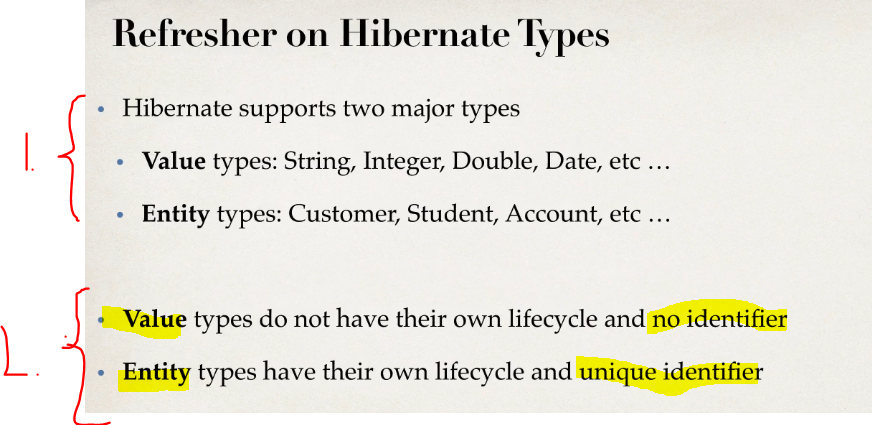

1. **Hibernate** has **two main** types:
    - **Value** types: String, Integer, Double, Date, etc …
    - **Entity** types: Customer, Student, Account, etc …
2. **Value** types have **no identity** nor the own **lifecycle**.
**Entity** has **unique identifier**.

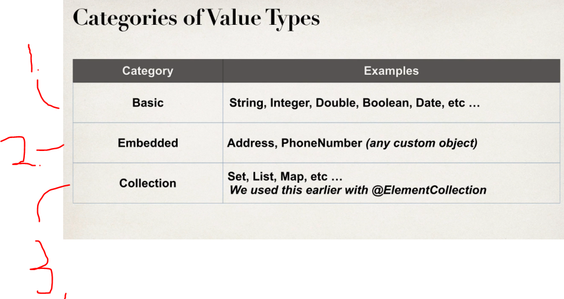
	
1. **Basic type**: `String`, `Integer`, `Double`, `Boolean`, `Date`, etc ...

2. **Embedded type**: `Address`, `PhoneNumber` (any custom object).

3. **Collections**: `Set`, `List`, `Map`, etc ... We used this earlier with `@ElementCollection`.

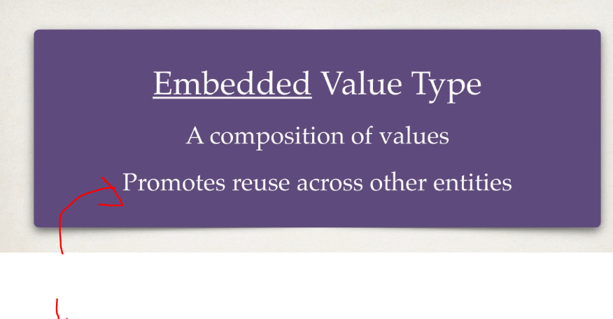

1. This **encourages**, for multiple uses inside other objects.	


1. This will be **Address** will be composition of `street`, `city`, `zip code`. These fields will be same in the **database**!

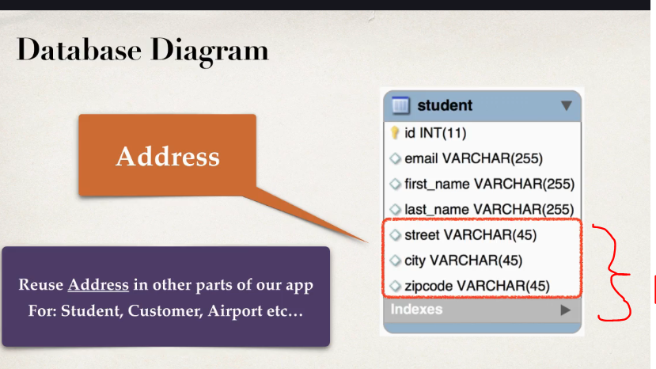

1. These will be included as we previously mentioned : `street`, `city`, `zip code`.
    - We can **re-use** in multiple tables!

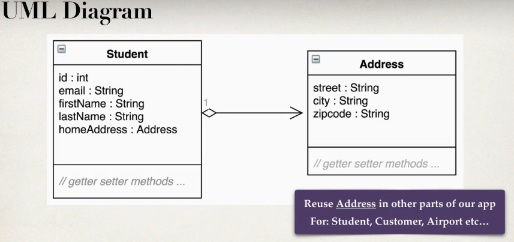

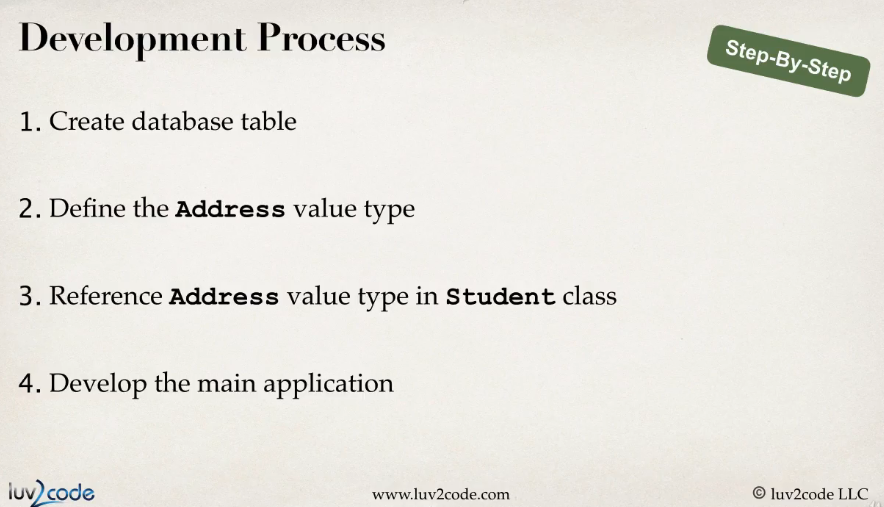

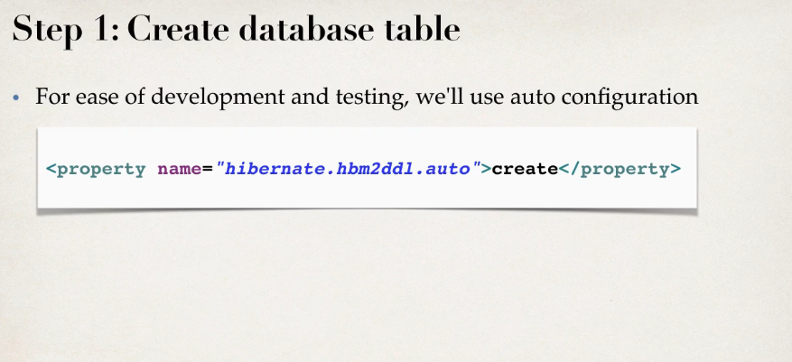

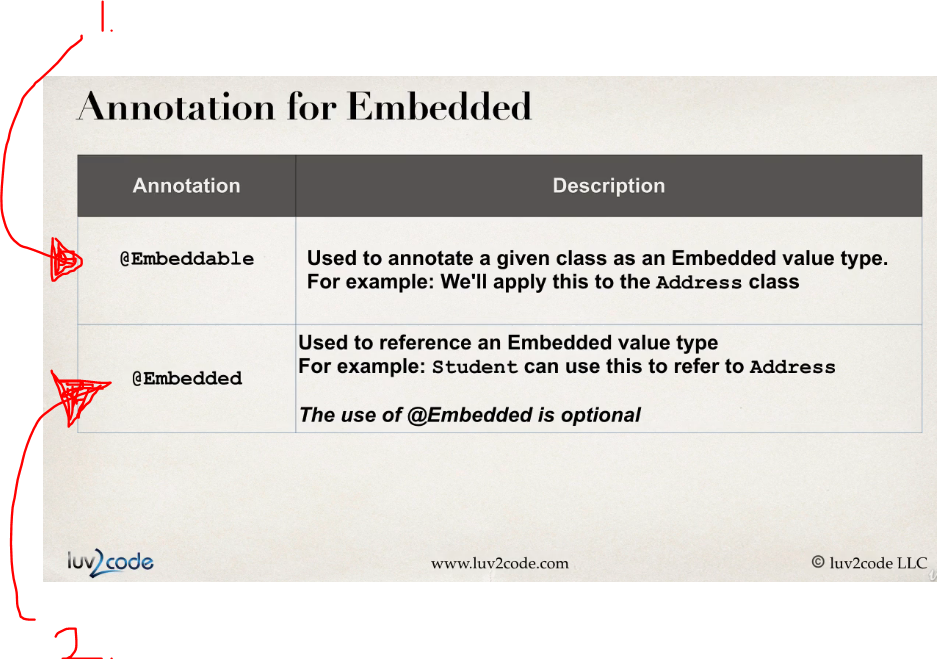

1. `@Embeddable` For identifying, that this is **Embeddable value type**. Example of `Adress`.
2. For referencing this, we use `@Embedded`.

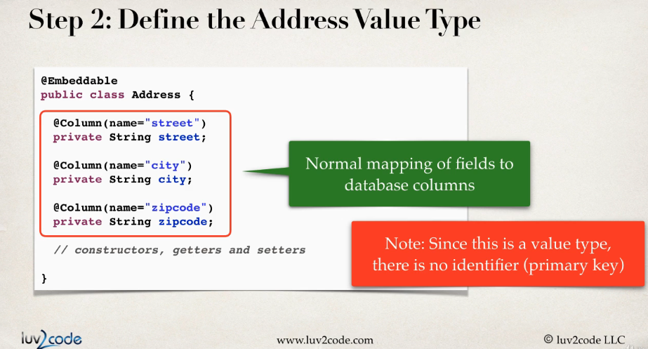

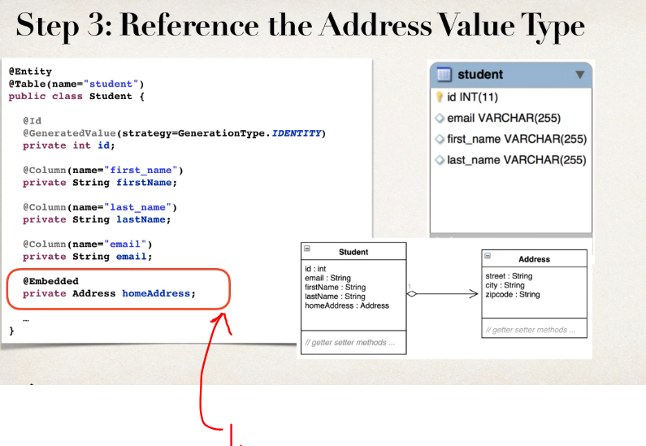

1. We have The `@Embedded private Address homeAddress;` in the `Student`.

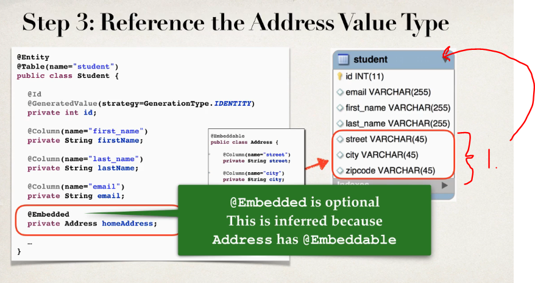

1. Table `student` will have these fields included. 

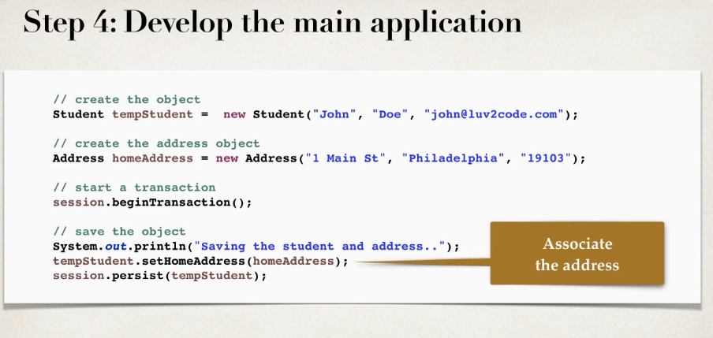

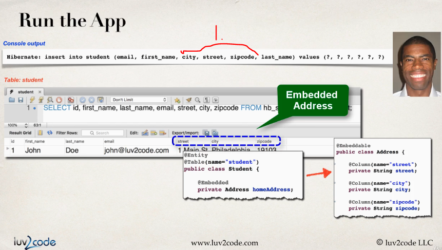

1. The new field will be logged.

# Embeddable - Develop an Embedded Component.

- The `Adress` **Entity** will be following:

```
package com.luv2code.hibernate.demo.entity;

import javax.persistence.Column;
import javax.persistence.Embeddable;

@Embeddable //instead of @Entity
public class Address {

    @Column
    protected String street;

    @Column
    protected String zipcode;

    @Column
    protected String city;

    /**
     * Hibernate will call this no-argument constructor to create an instance, and then
     * populate the fields directly.
     */
    protected Address() {
    }

    /**
     * You can have additional (public) constructors for convenience.
     */
    public Address(String street, String zipcode, String city) {
        this.street = street;
        this.zipcode = zipcode;
        this.city = city;
    }

    public String getStreet() {
        return street;
    }

    public void setStreet(String street) {
        this.street = street;
    }

    public String getZipcode() {
        return zipcode;
    }

    public void setZipcode(String zipcode) {
        this.zipcode = zipcode;
    }

    public String getCity() {
        return city;
    }

    public void setCity(String city) {
        this.city = city;
    }
}

```

- The `Student` **Entity** will be following:

```
package com.luv2code.hibernate.demo.entity;

import javax.persistence.AttributeOverride;
import javax.persistence.AttributeOverrides;
import javax.persistence.Column;
import javax.persistence.Embedded;
import javax.persistence.Entity;
import javax.persistence.GeneratedValue;
import javax.persistence.GenerationType;
import javax.persistence.Id;
import javax.persistence.Table;

@Entity
@Table(name="STUDENT")
public class Student {

	@Id
	@GeneratedValue(strategy=GenerationType.IDENTITY)
	@Column(name="id")
	private int id;
	
	@Column(name="first_name")
	private String firstName;
	
	@Column(name="last_name")
	private String lastName;
	
	@Column(name="email")
	private String email;
	
	// The Address is @Embedded, no annotation needed here...
	@Embedded
	private Address homeAddress;
	
	//Overriding Embedded attributes
	@AttributeOverrides({
		@AttributeOverride(name="street", column=@Column(name="BILLING_STREET")),
		@AttributeOverride(name="zipcode", column=@Column(name="BILLING_ZIPCODE")),
		@AttributeOverride(name="city", column=@Column(name="BILLING_CITY")),
	})
	private Address billingAddress;
	

	public Student() {
		
	}

	public Student(String firstName, String lastName, String email) {
		this.firstName = firstName;
		this.lastName = lastName;
		this.email = email;
	}

	public int getId() {
		return id;
	}

	public void setId(int id) {
		this.id = id;
	}

	public String getFirstName() {
		return firstName;
	}

	public void setFirstName(String firstName) {
		this.firstName = firstName;
	}

	public String getLastName() {
		return lastName;
	}

	public void setLastName(String lastName) {
		this.lastName = lastName;
	}

	public String getEmail() {
		return email;
	}

	public void setEmail(String email) {
		this.email = email;
	}
	
	public Address getAddress() {
		return homeAddress;
	}

	public void setAddress(Address address) {
		this.homeAddress = address;
	}
	

	public Address getBillingAddress() {
		return billingAddress;
	}

	public void setBillingAddress(Address billingAddress) {
		this.billingAddress = billingAddress;
	}

	@Override
	public String toString() {
		return "Student [id=" + id + ", firstName=" + firstName + ", lastName=" + lastName + ", email=" + email + "]";
	}

	
	
}
```

- The client code for the `@Embedded`.

```
package com.luv2code.hibernate.demo;

import org.hibernate.Session;
import org.hibernate.SessionFactory;
import org.hibernate.cfg.Configuration;

import com.luv2code.hibernate.demo.entity.Address;
import com.luv2code.hibernate.demo.entity.Student;

public class CreateStudentAddressDemo {

	public static void main(String[] args) {
		
		System.setProperty("com.sun.xml.bind.v2.bytecode.ClassTailor.noOptimize", "true"); // This is temporary fix.

		// create session factory
		SessionFactory factory = new Configuration()
								.configure("hibernate.cfg.xml")
								.addAnnotatedClass(Student.class)
								.addAnnotatedClass(Address.class)
								.buildSessionFactory();
		
		// create session
		Session session = factory.getCurrentSession();
		
		try {			
			
			// create the objects			
			 Student tempStudent = new Student("Paul", "Doe", "paul@luv2code.com");
			 Address homeAddress = new Address("Some Street 123", "12345", "Some City");
			
			 //2nd example:  Overriding embedded attributes
			 Address billingAddress = new Address("Some Billing Street 123", "67890", "Some Billing City");
			
			 tempStudent.setAddress(homeAddress);
			 
			 tempStudent.setBillingAddress(billingAddress);
			// start a transaction
			session.beginTransaction();
			
	
			// save the student object
			System.out.println("Saving the student and address...");
			session.persist(tempStudent);	
			
			// commit transaction
			session.getTransaction().commit();
			
			System.out.println("Done!");
		}
		finally {
			
			// add clean up code
			session.close();
			
			factory.close();
		}
	}

}
```

- The Configuration:

```
<!DOCTYPE hibernate-configuration PUBLIC
        "-//Hibernate/Hibernate Configuration DTD 3.0//EN"
        "http://hibernate.sourceforge.net/hibernate-configuration-3.0.dtd">

<hibernate-configuration>
    <session-factory>

        <!-- DB connection -->
        <property name="hibernate.connection.driver_class">com.mysql.cj.jdbc.Driver</property>
        <property name="hibernate.connection.url">jdbc:mysql://localhost:3306/hb_student_tracker?useSSL=false&amp;serverTimezone=UTC</property>
        <property name="connection.username">root</property>
        <property name="connection.password">password</property>


        <!-- Dialect -->
        <property name="hibernate.dialect">org.hibernate.dialect.MySQL8Dialect</property>

        <!-- Hibernate behavior -->
        <property name="hibernate.show_sql">true</property>
        <property name="hibernate.format_sql">true</property>
        <property name="hibernate.hbm2ddl.auto">update</property>

	<!-- Set the current session context -->
		<property name="current_session_context_class">thread</property>
		
    </session-factory>
</hibernate-configuration>
```

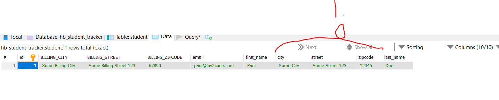s

1. You can see that the `@Embedded` working.

# Embeddable - Reuse the Address and Override the Attributes.

- We can **override** the fields, using `@AttributeOverrides`.

```
//Overriding Embedded attributes
	@AttributeOverrides({
		@AttributeOverride(name="street", column=@Column(name="BILLING_STREET")),
		@AttributeOverride(name="zipcode", column=@Column(name="BILLING_ZIPCODE")),
		@AttributeOverride(name="city", column=@Column(name="BILLING_CITY")),
	})
	private Address billingAddress;
```

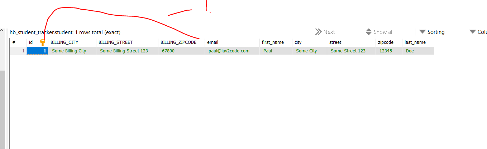

1. You can see the **override** working.
