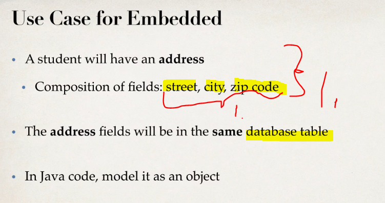

# Section 04: Mapping Components - Embeddable.

Mapping Components - Embeddable.

# What I Learned.

# Embeddable Overview.

1. **Hibernate** has **two main** types:
    - **Value**.
    - **Entity**.
2. **Value** types have **no identity** nor the own **lifecycle**.
**Entity** has **unique identifier**.

- Todo copy here.

	
1. **Basic type**: `String`, `Integer`, `Double`, `Boolean`, `Date`, etc ...

2. **Embedded type**: `Address`, `PhoneNumber` (any custom object).

3. **Collections**: `Set`, `List`, `Map`, etc ... We used this earlier with `@ElementCollection`.

1. This **encourages**, for multiple uses inside other objects.	

1. This will be **Address** will be composition of `street`, `city`, `zip code`. These fields will be same in the **database**!

1. These will be included as we previously mentioned : `street`, `city`, `zip code`.
    - We can **re-use** in multiple tables!

1. `@Embeddable` For identifying, that this is **Embeddable value type**. Example of `Adress`.
2. For referencing this, we use `@Embedded`.

1. We have The `@Embedded private Address homeAddress;` in the `Student`.

1. Table `student` will have these fields included. 

1. The new field will be logged.

# Embeddable - Develop an Embedded Component.