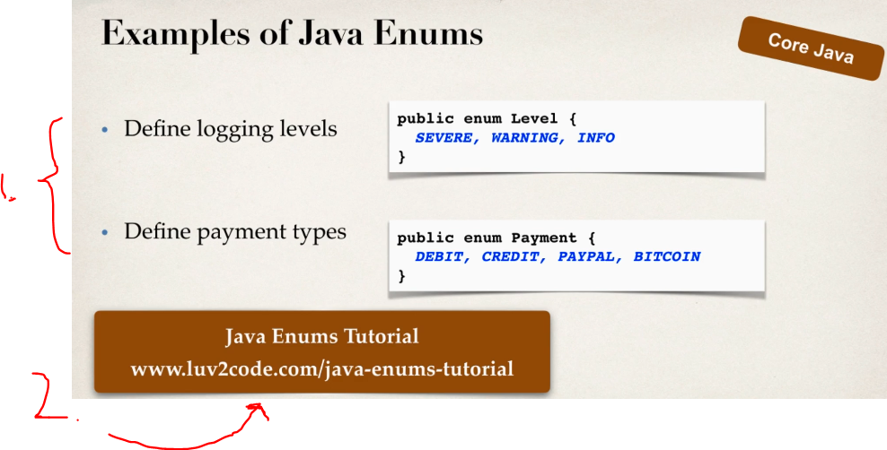
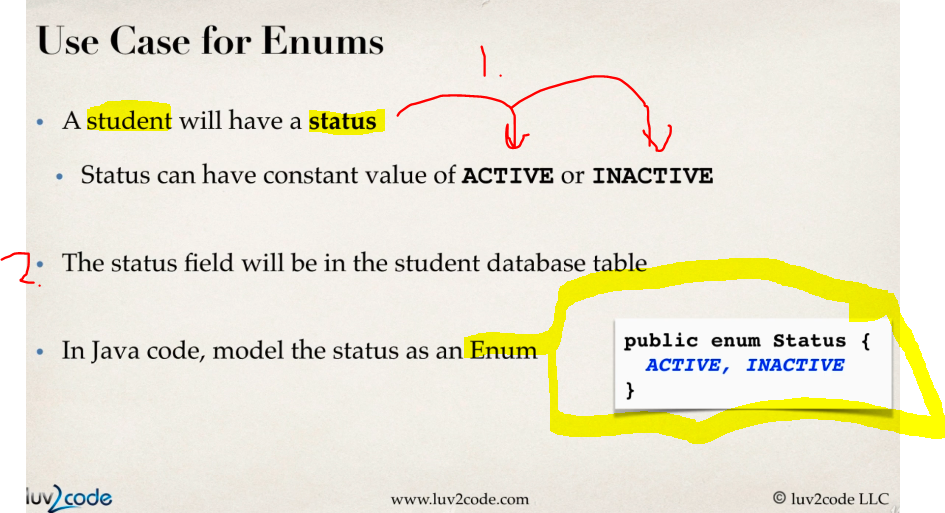
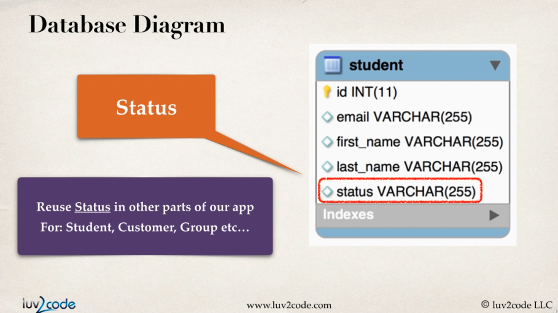
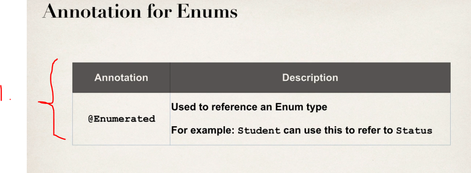
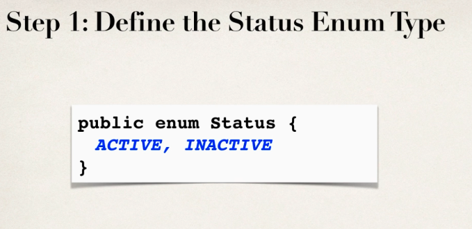
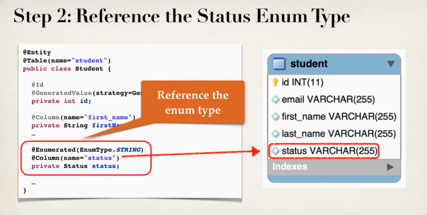
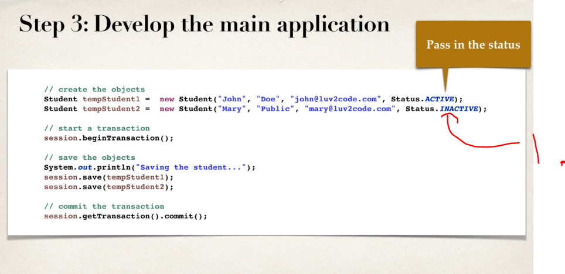
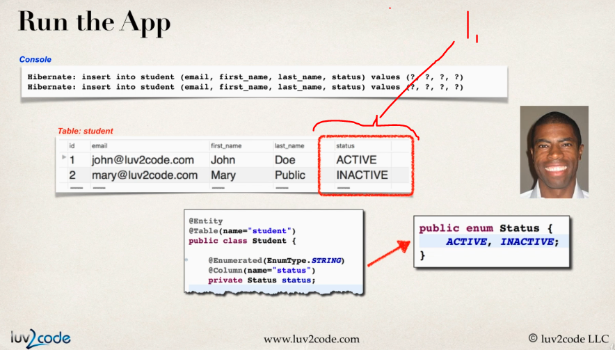

# Section 05: Mapping Enums.

Mapping Enums.

# What I Learned.

# Mapping Enums - Overview.

> **Enum**
> Java data type for set of **predefined constants**!

1. Examples. todo.
2. Extract todo.

1. **Student** will have `status`
    - These statuses are: `ACTIVE` or `INACTIVE`.
2. This will be in debase as **enum**.

1. `@Enumerated` use for enums.

1. Pass the enum status. `Status.ACTIVE`.

- Todo get the code.

1. Saving into database, will looks like such as **string**.