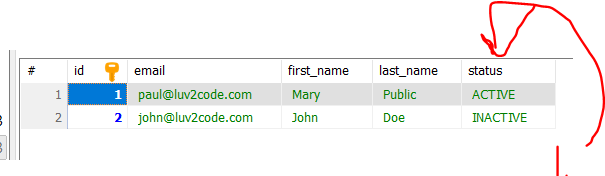

# Section 05: Mapping Enums.

Mapping Enums.

# What I Learned.

# Mapping Enums - Overview.

> **Enum**
> Java data type for set of **predefined constants**!


1. Examples. todo.
2. Extract todo.


1. **Student** will have `status`
    - These statuses are: `ACTIVE` or `INACTIVE`.
2. This will be in debase as **enum**.


1. `@Enumerated` use for enums.


1. Pass the enum status. `Status.ACTIVE`.

- Todo get the code.


1. Saving into database, will looks like such as **string**.

# Mapping Enums - Write Some Code.

- Entity with **enum**:

```
package com.luv2code.hibernate.demo.entity;

import javax.persistence.Column;
import javax.persistence.Entity;
import javax.persistence.EnumType;
import javax.persistence.Enumerated;
import javax.persistence.GeneratedValue;
import javax.persistence.GenerationType;
import javax.persistence.Id;
import javax.persistence.Table;

@Entity
@Table(name="USER")
public class User {

	@Id
	@GeneratedValue(strategy=GenerationType.IDENTITY)
	@Column(name="id")
	private int id;
	
	@Column(name="first_name")
	private String firstName;
	
	@Column(name="last_name")
	private String lastName;
	
	@Column(name="email")
	private String email;
	

	@Enumerated(EnumType.STRING)
	@Column(name="status")
	private Status status;
	
	public User() {
		
	}

	public User(String firstName, String lastName, String email, Status status) {
		this.firstName = firstName;
		this.lastName = lastName;
		this.email = email;
		this.status = status;
	}

	public int getId() {
		return id;
	}

	public void setId(int id) {
		this.id = id;
	}

	public String getFirstName() {
		return firstName;
	}

	public void setFirstName(String firstName) {
		this.firstName = firstName;
	}

	public String getLastName() {
		return lastName;
	}

	public void setLastName(String lastName) {
		this.lastName = lastName;
	}

	public String getEmail() {
		return email;
	}

	public void setEmail(String email) {
		this.email = email;
	}

	
	public Status getStatus() {
		return status;
	}

	public void setStatus(Status status) {
		this.status = status;
	}


	
	@Override
	public String toString() {
		return "Student [id=" + id + ", firstName=" + firstName + ", lastName=" + lastName + ", email=" + email + "]";
	}
	
}

```

- **Enum** in the Java:

```
package com.luv2code.hibernate.demo.entity;

public enum Status {
	
	ACTIVE, INACTIVE;

}
```

- The **client**:

```
package com.luv2code.hibernate.demo;

import org.hibernate.Session;
import org.hibernate.SessionFactory;
import org.hibernate.cfg.Configuration;

import com.luv2code.hibernate.demo.entity.Status;
import com.luv2code.hibernate.demo.entity.User;

public class CreateUserDemo {

	public static void main(String[] args) {

		// create session factory
		SessionFactory factory = new Configuration()
								.configure("hibernate.cfg.xml")
								.addAnnotatedClass(User.class)
								.buildSessionFactory();
		
		// create session
		Session session = factory.getCurrentSession();
		
		try {			
			
			// create the objects			
			
			 User student1 = new User("Mary", "Public", "paul@luv2code.com",Status.ACTIVE);
			 User student2 = new User("John", "Doe", "john@luv2code.com",Status.INACTIVE);
			 			 
			 
			// start a transaction
			session.beginTransaction();
			
	
			// save the student object
			System.out.println("Saving the users...");
			session.persist(student1);
			session.persist(student2);
			
			// commit transaction
			session.getTransaction().commit();
			
			System.out.println("Done!");
		}
		finally {
			
			// add clean up code
			session.close();
			
			factory.close();
		}
	}

}
```



1. We can see the entries in the database, with the following **enums** as string.