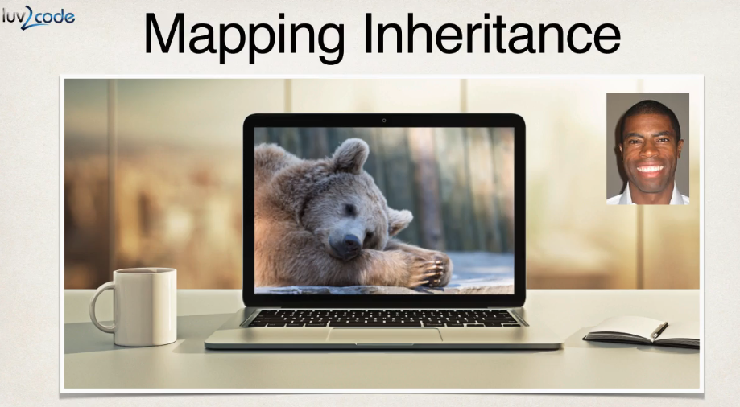
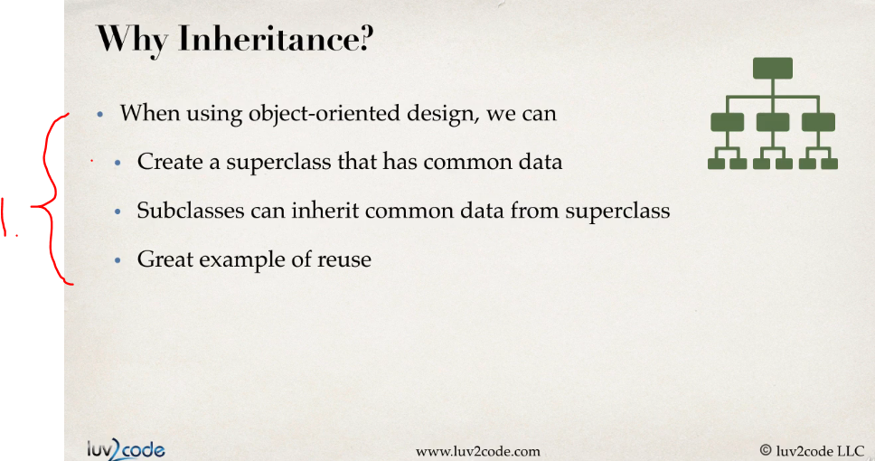
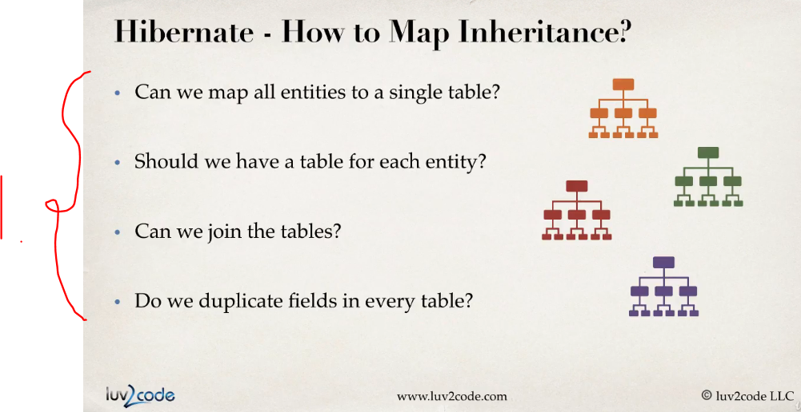
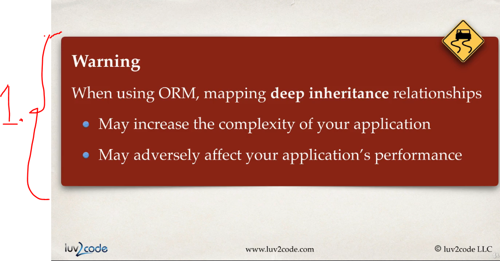
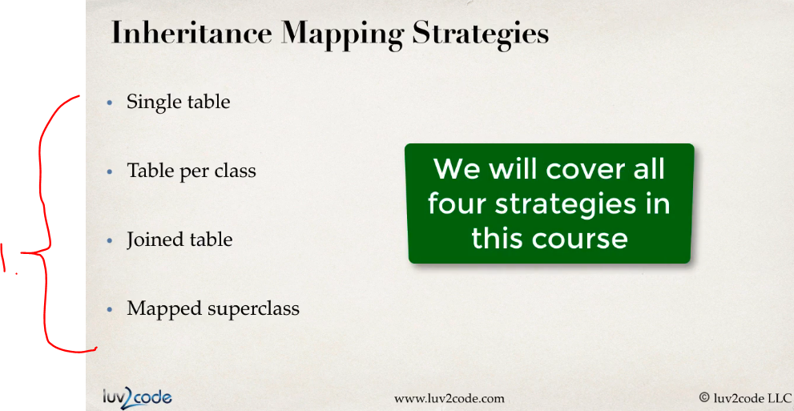
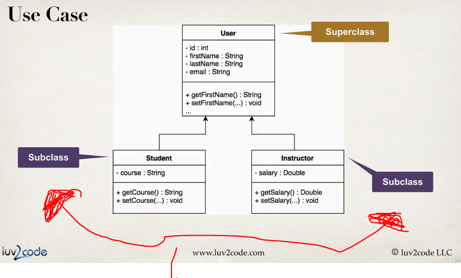
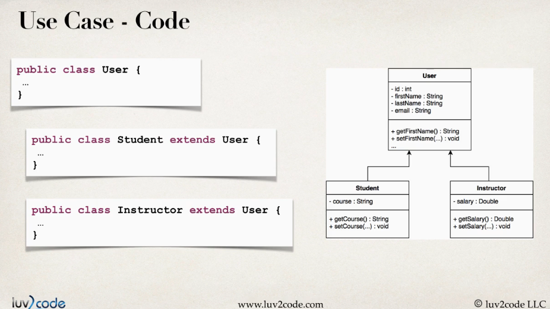
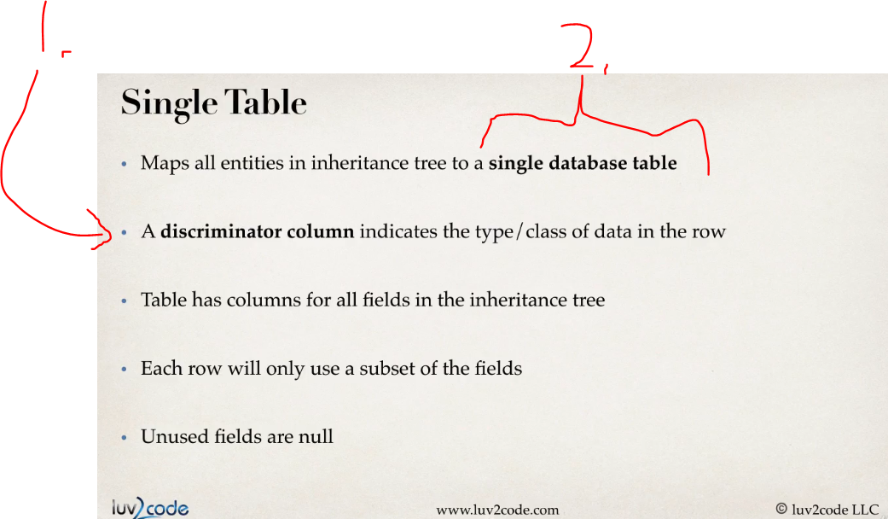
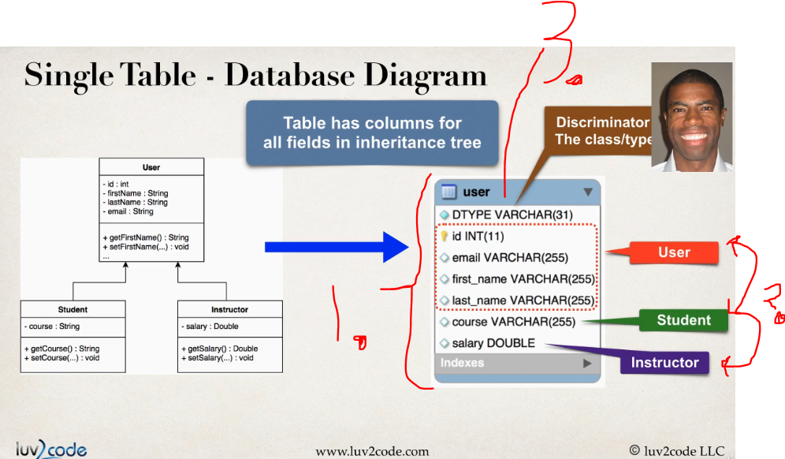

# Section 06: Inheritance Mapping - Single Table Strategy.

Inheritance Mapping - Single Table Strategy-

# What I Learned.

# Inheritance Mapping - Single Table - Overview - Part 1.

1. This is for great **re-use** of classes!

1. Since the **ORM** has different inheritance behavior than then normal OOP model in **Java**. There are different strategies for **ORM** to achieve this.

1. There **will** be performance **penalty**, when mapping **ORM**. You might need to run your own profiling tools, to be aware of this till **what level** the performance hit **is acceptable**.

1. **Hibernate** has **four** different **mapping strategies**:
    - Single table.
    - Table per class.
    - Joined table.
    - Mapped superclass.

1. We will use **inheritance** on these **subclasses** as an example!

- Let's proceed with the **Single table** strategy first!
    - Everything will be **mapped** into **one table**!

1. **Discriminator column:**
    This is a special column in a single table used to identify the type of the entity (or subclass) stored in each row. Every row has a value in this column that “discriminates” or differentiates which subclass it belongs to.
2. **Single database table** will be used for the inheritance tree.

1. The Inheritance is mapped into to **whole table**.
2. `User`, `Student` and `Intstructor` will be mapped into one table as here.
3. The **Discriminator row**. 

# Inheritance Mapping - Single Table - Overview - Part 2.