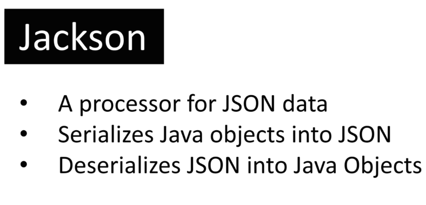
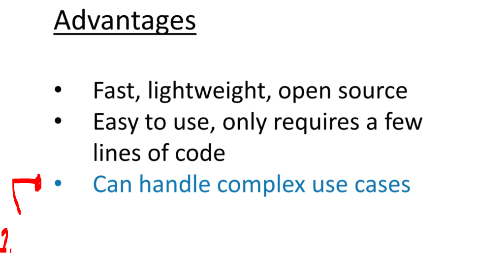
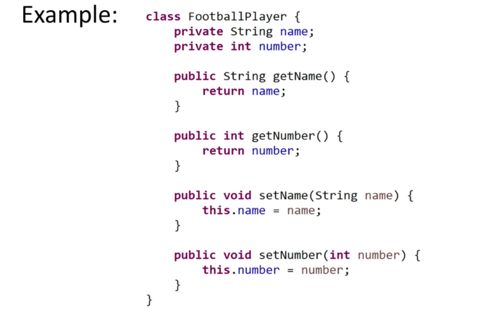
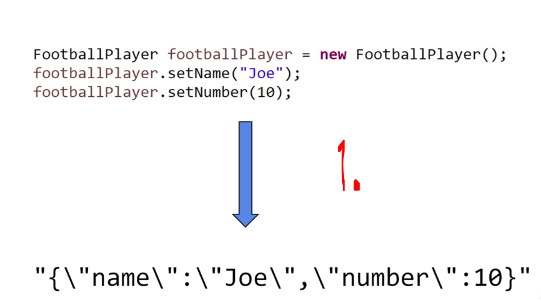
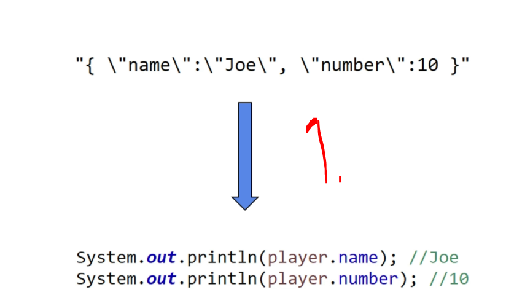
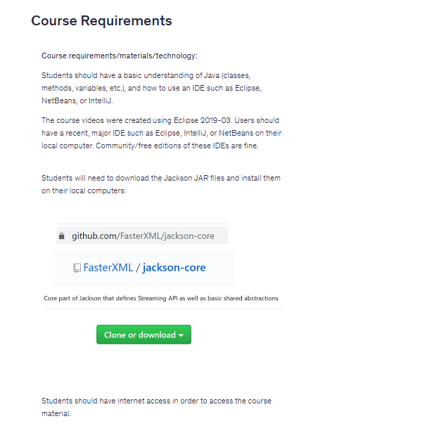

# Section 01: Introduction.

Introduction.

# What I Learned.

# Introduction.

	

1. Jackson is processor for JSON data!

	

1. Jackson can hand handle complex data types **Java Object** inside **Java Objects**!

- We have following Java object!

	

	

1. Jackson API call will change Java Object into JSON! This is called **serialization**!

	

1. Converting **JSON** converting into the **Java Object** is called is **deserialization**!

# Course Requirements!

	

