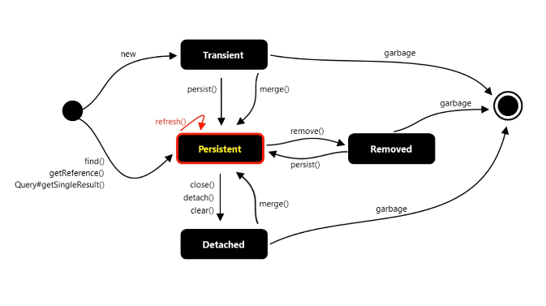

# Section 01: About this Course.

Introduction.

# What I Learned.

# 1. Introduction.

- Different JPA mappings.

- **Object model** difference **Relational model**.

- Some example of the concept.

