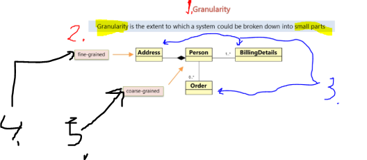
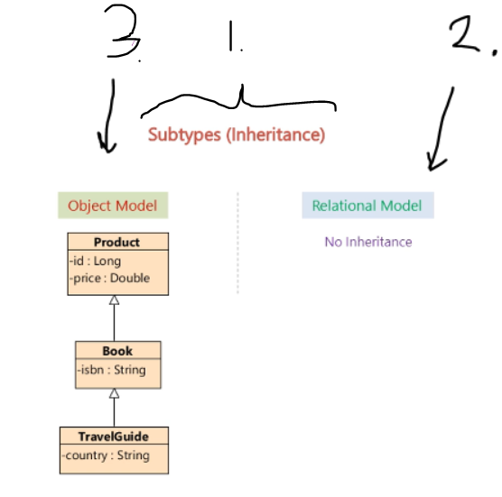
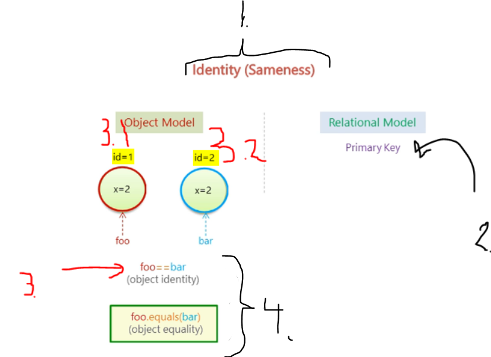
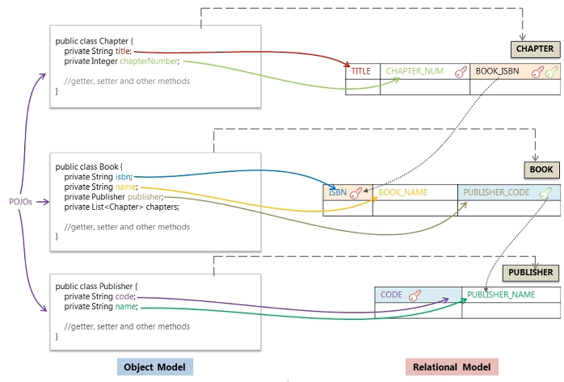

# Section 02: Understanding object/relational persistence.

Understanding object/relational persistence.

# What I Learned.

# Object Relational Impedance Mismatch.

> [!NOTE]  
> **Object-Oriented** languages represent data in different format that the **Relational Databases**. 

<div align="center">
    
</div>

1. This will represent **OOP**.
    - One of OOP language is **Java** language.
        - These will have interconnected relations objects.
2. This will represent the **Database relational model**.
    - The data here is **table** like format.

- There will be different relations with **Object Relational** and **Relational database**!

3. Since these models are **different**, these will have **mismatch** of **relationship**.
    - We will call this `Object Relational Impedance Mismatch`. **(Paradigm Mismatch)**
        - There are **five main** different mismatches!
            - First: **Granularity Mismatch**!
            - Second: **Inheritance Mismatch(Subtype Mismatch)**!
            - Third: **Identity Mismatch**!
            - Fourth: **Association Mismatch**.
            - Fifth: **Data navigation**.

4. We can say this, **Object Model** and **Relational Model** do not work very well together.

- Below picture is in context is **e-commerce application**.

<div align="center">
    
</div>

1. First mismatch is **Granularity** mismatch.
2. One can think, **system** can be broke down into **smaller pieces**.
3. **Person** can be broken down into smaller pieces: 
    - **Address**.
    - **Order**.
    - **Billing Details**.
4. The `fine-grained`, mean it only contains the **Address** specific details on this.
5. The `coarse-grained` **Person**, means it contains a lot of information about the **Person**, details, **Address** etc...

<div align="center">
    
</div>

1. In **Object Model** we can have **various level** **granularity**.
    - In **Relational Model** this is restricted to **two level**
        - `Tables`.
        - `Columns`.
    - While in Object Model this is on **Various levels**.

- This means sometimes, there will be more **Object Model** classes than the **Database Model**
    - Meaning more `Java Classes`, than `Relational Model Tables`.
2. Two **Java classes**.
3. Only **One** Table in database.
4. By definition the `granular` means **more depth** of info.

<div align="center">
    
</div>

1. Second **Inheritance mismatch(Subtype Mismatch)**!
2. ❌ No inheritance in **Relational Model**. ❌
3. In **Object Model**, there is Concept of the **Inheritance**. 
    - Example Java and its OOP.

<div align="center">
    
</div>

1. The Third is **Identity Mismatch**.
2. In **Relational Model** the **identity** is can be defined by **Primary key**.   
    - If two keys are the same, they are **considered** to be **identical**!
3. **Object Identity** is being checked here, as result of following will be **false**, `foo==bar`. Explained below:
    - **3.1** `id` of `foo` will be `1`.
    - **3.2** `id` of `bar` will be `2`.
4. In Java, there is **Object Identity** and **Object equality**.

<div align="center">
    
</div>

1. Fourth mismatch is **Association Mismatch**.
2. In **Object Model** or in Java the **association** is handled by **Object References**.
3. In **Relational Model** this is handled by **Foreign Key**
4. To say that classes have **bidirectional**, this relationship needs to be defined in **both way!**

> [!IMPORTANT]
> **5.** ❌ **Foreign Keys** are not bidirectional. ❌
### Example of bidirectional relationship.

- Here is example of **birational** reference!

>  **Order.java**

```
    @OneToMany(mappedBy = "order", cascade = CascadeType.ALL, orphanRemoval = true)
    private Set<OrderItemInCart> orderItems = new HashSet<>(); // Initialized to an empty set.
```

>  **OrderItemInCart.java**

```
    @ManyToOne
    @JoinColumn(name = "order_id", nullable = false) 
    private Order order;
```

<div align="center">
    
</div>

1. Fifth mismatch is **Data Navigation Mismatch**.
2. In **Java** one access the **object route**, `y: foo.getBar().getY()` and `z: foo.getBar().getY().getZ()`.
3. Obvious way to make query more performant, is to minimize number of queries to the database.  This can be done using `SQL JOIN Query` from **two different tables**.
4. The navigation in data is totally different in **Object Model** and in **Relational Model**.  

<div align="center">
    
</div>

# Object Relational Mapping.

<div align="center">
    
</div>


1. We will model **Book Store** object graph
2. We will **persist** it into database. 

<div align="center">
    
</div>

1. We will retrieve the Book **object**.

<div align="center">
    
</div>


1. We will do this by writing **JDBC** code!
    - We will see if there are **problems** using this **approach**.
        - How will **ORM** mapping solves these closes :).

<div align="center">
    
</div>


1. We will have **3** classes:
    - `Publisher` class.
    - `Book` class.
    - `Chapter` class.
2. `Book` has **one or more** `Chapter` on it!
3. `Book` has `Publisher` class on it.
4. In **Relation Database** this achieved by **Foreign Key** reference.

- We will have the following Java **POJO** classes.

<div align="center">
    
</div>

<div align="center">
    
</div>

1. One thing to notice is that, **CHAPTER_NUM** and **BOOK_ISBN** is marked as **PRIMARY KEY**, they make **CHAPTER** unique.

<div align="center">
    
</div>

1. We are using **JDBC** to write into database.
    - We need `.jar` driver.

<div align="center">
    
</div>

1. Notice we **associate** `Book` object with the `Publisher` Object, before **persisting**.
2. We **associate** the `List<Chapter>` with `book` object.
3. In the end we **persist** one object with **associates** with the `BookStoreService` class.
4. Result of **persisting** will be following in the database.

<div align="center">
    
</div>


1. We load the driver and make connection.
2. Then we create `PreparedStatement` and load the **PreparedStatement** with query and data, then execute to the database. In the end we call **close** for releasing resources made from `PreparedStatment`.
3. We do this same with all **Chapter** objects.
4. We wrap this around `try-catch` for closing the connection when we don't need it.  

- This approach brings ❌ **negatives** ❌:
    - If we are a java developer, we need to know SQL ❌ **SQL Knowledge** ❌.
    - For simple task of **persisting**, we are writing pretty much code ❌ **Too Many SQL Statements** ❌.
        - Think if the book object would be **complex**.
    - Book details need to be copied to `PreparedStatement` one more time. ❌ **Too Many Copy Codes** ❌.
    - SQL code is dependent to the **MySQL system**. ❌ **Database Dependent** ❌.

<div align="center">
    
</div>

1. Printing will be looking, when printing Book object.

<div align="center">
    
</div>

1. Reads from two different tables.
2. We get following **ResultSet** from database.
3. Then we manually associate data from result set to the `Book` and `Publisher`.  
4. Then we query and **assosiate** `Chapters` with the `Book` Object.

- Same problems as previously and as extra.
    - We are manually association with the Object. ❌ **Manually Handled Associations** ❌.
        - This is fairly simple, but when it **gets bigger** and **complex!** 

> **ResultSet** represents the result of a query executed on a database using **JDBC** in **Java**.

- Example codes before:

```
public class BookStoreService {
    private Connection connection = null;

    public Book retrieveObjectGraph(String isbn) {
        Book book = null;
        try {
            Class.forName("com.mysql.jdbc.Driver");
            connection = DriverManager.getConnection("jdbc:mysql://localhost:3306/bookstore", "root", "password");

            PreparedStatement stmt = connection.prepareStatement(
                "SELECT * FROM BOOK, PUBLISHER WHERE BOOK.PUBLISHER_CODE = PUBLISHER.CODE AND BOOK.ISBN = ?");
            stmt.setString(1, isbn);
            ResultSet rs = stmt.executeQuery();

            book = new Book();
            if (rs.next()) {
                book.setIsbn(rs.getString("ISBN"));
                book.setName(rs.getString("BOOK_NAME"));

                Publisher publisher = new Publisher();
                publisher.setCode(rs.getString("CODE"));
                publisher.setName(rs.getString("PUBLISHER_NAME"));
                book.setPublisher(publisher);
            }

            rs.close();
            stmt.close();

            List<Chapter> chapters = new ArrayList<Chapter>();
            stmt = connection.prepareStatement("SELECT * FROM CHAPTER WHERE BOOK_ISBN = ?");
            stmt.setString(1, isbn);
            rs = stmt.executeQuery();

            while (rs.next()) {
                Chapter chapter = new Chapter();
                chapter.setTitle(rs.getString("TITLE"));
                chapter.setChapterNumber(rs.getInt("CHAPTER_NUM"));
                chapters.add(chapter);
            }

            book.setChapters(chapters);

            rs.close();
            stmt.close();
        } catch (ClassNotFoundException e) {
            e.printStackTrace();
        } catch (SQLException e) {
            e.printStackTrace();
        } finally {
            try { connection.close(); } catch (SQLException e) { e.printStackTrace(); }
        }
        return book;
    }
}
```

<div align="center">
    
</div>


1. These problems presented here could be solved by using **ORM**.

<div align="center">
    
</div>


- This will be done with following associations.

<div align="center">
    
</div>


1. Now saving can be done by calling `save(book)` and Java Object with required associations. Getting Book`.get(identifier of book)`. No need to write **SQL** or **JDSBC** codes.

# Installing MySQL.

- Install all. ✅.
- Connector [ConnectorJ](https://dev.mysql.com/downloads/connector/j/).

# Installing Eclipse IDE.

- Install. ✅.

# Lab - Object Relational Mapping.

<div align="center">
    
</div>

- We create following tables, `PUBLISHER`, `BOOK` and `CHAPTER`.

```
DROP DATABASE IF EXISTS bookstore;
CREATE DATABASE bookstore;

USE bookstore;

CREATE TABLE PUBLISHER (
	CODE VARCHAR(4) NOT NULL,
	PUBLISHER_NAME VARCHAR(100) NOT NULL,
	PRIMARY KEY (CODE)
);

CREATE TABLE BOOK (
	ISBN VARCHAR(50) NOT NULL,
	BOOK_NAME VARCHAR(100) NOT NULL,
	PUBLISHER_CODE VARCHAR(4),
	PRIMARY KEY (ISBN),
	FOREIGN KEY (PUBLISHER_CODE) REFERENCES PUBLISHER (CODE)
);

CREATE TABLE CHAPTER (
	BOOK_ISBN VARCHAR(50) NOT NULL,
	CHAPTER_NUM INT NOT NULL,
	TITLE VARCHAR(100) NOT NULL,
	PRIMARY KEY (BOOK_ISBN, CHAPTER_NUM),
	FOREIGN KEY (BOOK_ISBN) REFERENCES BOOK (ISBN)
);
```

- Check the **POM** dependency for the `mysql-connector-java`.
    - If using the later **Mysql** server, you need to update the **Connector**.
```
<dependency>
			    <groupId>mysql</groupId>
			    <artifactId>mysql-connector-java</artifactId>
			    <version>5.1.29</version>
</dependency>
```

> [!IMPORTANT]
> When using the **MySQL80**, you need to update the MySQL drivers!!


- New drivers `Class.forName("com.mysql.cj.jdbc.Driver");`.


<div align="center">
    
</div>

- We are calling following for saving the object!

```

		//persisting object graph
		Publisher publisher = new Publisher("MANN", "Manning Publications Co.");

		Book book = new Book("9781617290459", "Java Persistence with Hibernate, Second Edition", publisher);

		List<Chapter> chapters = new ArrayList<Chapter>();
		Chapter chapter1 = new Chapter("Introducing JPA and Hibernate", 1);
		chapters.add(chapter1);
		Chapter chapter2 = new Chapter("Domain Models and Metadata", 2);
		chapters.add(chapter2);

		book.setChapters(chapters);

		bookStoreService.persistObjectGraph(book);

```

- We call following to get the saved object.

```
	//This is for retrieving object graph
		Book book = bookStoreService.retrieveObjectGraph("9781617290459");
		System.out.println(book);
```
<div align="center">
    
</div>

1. We can easily see the problem of **Object relational mismatch**.
    - Two classes, in their corresponding system!
        - We need to **handle** manually association between models.
2. In **Relational Database system** there is **FK** `BOOK_ISBN` inside `CHAPTER` **Table** referencing `ISBN` field to the **Table** `BOOK`.  
3. You can see, that `Chapter` does not have any relationship to the `Book` class in **Java** world!

# Lab Exercise - Object Relational Mapping.

<div align="center">
    
</div>

1. Answer to this the **Identity mismatch**.

- Remember to driver the settings for what ever MySQL serer you have!

- **Lab exercise**.
    - We will get following **exception** `SQLIntegrityConstraintViolationException`.

```
java.sql.SQLIntegrityConstraintViolationException: Duplicate entry 'MANN' for key 'publisher.PRIMARY'
	at com.mysql.cj.jdbc.exceptions.SQLError.createSQLException(SQLError.java:109)
	at com.mysql.cj.jdbc.exceptions.SQLExceptionsMapping.translateException(SQLExceptionsMapping.java:114)
	at com.mysql.cj.jdbc.ClientPreparedStatement.executeInternal(ClientPreparedStatement.java:990)
	at com.mysql.cj.jdbc.ClientPreparedStatement.executeUpdateInternal(ClientPreparedStatement.java:1168)
	at com.mysql.cj.jdbc.ClientPreparedStatement.executeUpdateInternal(ClientPreparedStatement.java:1103)
	at com.mysql.cj.jdbc.ClientPreparedStatement.executeLargeUpdate(ClientPreparedStatement.java:1450)
	at com.mysql.cj.jdbc.ClientPreparedStatement.executeUpdate(ClientPreparedStatement.java:1086)
	at service.BookStoreService.persistObjectGraph(BookStoreService.java:27)
	at client.BookStoreClient.main(BookStoreClient.java:30)

```