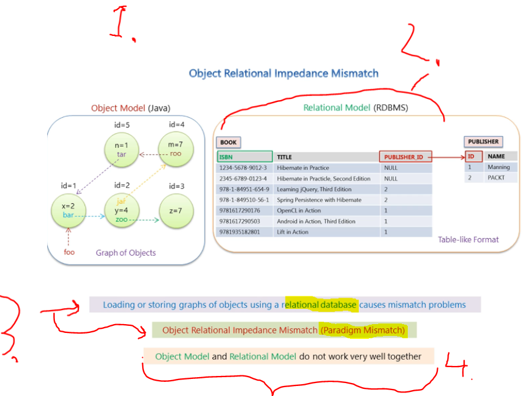
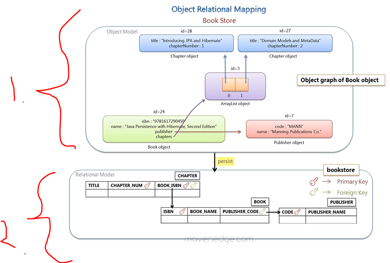
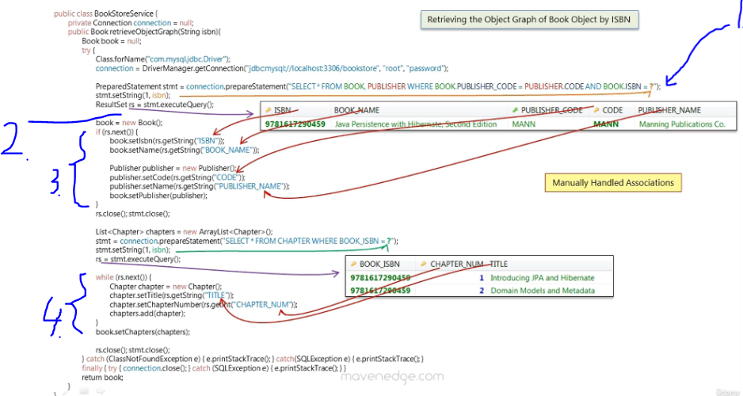

# Section 02: Understanding object/relational persistence.

Understanding object/relational persistence.

# What I Learned.

# 02. Object Relational Impedance Mismatch.



1. This will represent **OOP**.
    - One of OOP language is **Java** language.
        - These will have interconnected relations objects.
2. This will represent the **Database relational model**.
    - Like in **table** format.

- There will be different relations with **Object Relational** and **Relational database**!

3. Since these models are **different**, these will have **mismatch** of **relationship**.
    - We will call this `Object Relational Impedance Mismatch`. **(Paradigm Mismatch)**

> [!IMPORTANT]
> We can say this, **Object Model** and **Relational Model** do not work very well together.

- This context is **e-commerce application**.


1. First mismatch is **Granularity** mismatch.
2. One can think, **system** can be broke down into **smaller pieces**.
3. **Person** can be broken down into smaller pieces: 
    - **Address**.
    - **Order**.
    - **Billing Details**.


1. In **Object Model** we can have **various level** **granularity**.
    - In **Relational Model** this is restricted to **two level**
        - `Tables`.
        - `Columns`.

- This means sometimes, there will be more **Object Model** classes than the **Database Model**
    - Meaning more `Java Classes` than `Relational Model Tables`.
2. Two **Java classes**.
3. Only **One** Table in database.
4. By definition the `granular` means more depth of info.


1. In **Object Model**, there is **Inheritance**. 
    - Example Java and OOP.
2. ❌ No inheritance in **Relational Model**. ❌

- Third is **identity mismatch**.


1. In Java, there is **Object Identity** and **Object equality**.
2. In **Relational Model** the **identity** is can be defined by **Primary key**.   
    - If two keys are the same, they are **thought** to be **identical**.
3. Result of following will be **false**, `foo==bar`.
    - **3.1** `id` of `foo` will be `1`.
    - **3.2** `id` of `bar` will be `2`.

- Third mismatch is **Association mismatch**.


1. In Java the **association** is handled by **Object References**.
2. In **Relational Model** this is handled by **Foreign Key**
3. To say that classes have **bi-directional**, this relationship needs to be defined in **both way!**
> [!IMPORTANT]
> **4.**❌**Foreign Keys** are not bidirectional.❌
### Example of bidirectional relationship.

- Here is example of **birational** reference!

>  **Order.java**

```
    @OneToMany(mappedBy = "order", cascade = CascadeType.ALL, orphanRemoval = true)
    private Set<OrderItemInCart> orderItems = new HashSet<>(); // Initialized to an empty set.
```

>  **OrderItemInCart.java**

```
    @ManyToOne
    @JoinColumn(name = "order_id", nullable = false) 
    private Order order;
```


1. In **Java** one access the **object route**, `y: foo.getBar().getY()` and `z: foo.getBar().getY().getZ()`.

2. Obvious way to make query more performant, is to minimize number of queries to the database.  This can be done using `SQL JOIN Query` from **two different tables**.

- **Summary:** We come to 5 different mismatch problems when we load **Java Objects** into **Relational Database**.

- Todo all mismathhes 

# 3. Object Relational Mapping.



1. We will model **Book Store** object graph
2. We will **persist** it into database. 


1. We will retrieve the Book **object**.


1. We will do this by writing **JDBC** code!
    - We will see if there are **problems** using this **approach**.
        - How will **ORM** mapping solves these closes :).


1. We will have **3** classes:
    - `Publisher` class.
    - `Book` class.
    - `Chapter` class.
2. `Book` has **one or more** `Chapter` on it!
3. `Book` has `Publisher` class on it.
4. In **Relation Database** this achieved by **Foreign Key** reference.

- We will have the following Java **POJO** classes.


1. One thing to notice is that, **CHAPTER_NUM** and **BOOK_ISBN** is marked as **PRIMARY KEY**, they make **CHAPTER** unique.


1. We are using **JDBC** to write into database.
    - We need `.jar` driver.


1. Notice we **associate** `Book` object with the `Publisher` Object, before **persisting**.
2. We **associate** the `List<Chapter>` with `book` object.
3. In the end we **persist** one object with **associates** with the `BookStoreService` class.
4. Result of **persisting** will be following in the database.


1. We load the driver and make connection.
2. Then we create `PreparedStatement` and load the **PreparedStatement** with query and data, then execute to the database. In the end we call **close** for releasing resources made from `PreparedStatment`.
3. We do this same with all **Chapter** objects.
4. We wrap this around `try-catch` for closing the connection when we don't need it.  

- This approach brings ❌ **negatives** ❌:
    - If we are a java developer, we need to know SQL ❌ **SQL Knowledge** ❌.
    - For simple task of **persisting**, we are writing pretty much code ❌ **Too Many SQL Statements** ❌.
        - Think if the book object would be **complex**.
    - Book details need to be copied to `PreparedStatement` one more time. ❌ **Too Many Copy Codes** ❌.
    - SQL code is dependent to the **MySQL system**. ❌ **Database Dependent** ❌.


1. Printing will be looking, when printing Book object.



1. Reads from two different tables.
2. We get following **ResultSet** from database.
3. Then we manually associate data from result set to the `Book` and `Publisher`.  
4. Then we query and **assosiate** `Chapters` with the `Book` Object.

- Same problems as previously and as extra.
    - We are manually association with the Object. ❌ **Manually Handled Associations** ❌.
        - This is fairly simple, but when it **gets bigger** and **complex!** 

> **ResultSet** represents the result of a query executed on a database using **JDBC** in **Java**.

- Example codes before:

```
public class BookStoreService {
    private Connection connection = null;

    public Book retrieveObjectGraph(String isbn) {
        Book book = null;
        try {
            Class.forName("com.mysql.jdbc.Driver");
            connection = DriverManager.getConnection("jdbc:mysql://localhost:3306/bookstore", "root", "password");

            PreparedStatement stmt = connection.prepareStatement(
                "SELECT * FROM BOOK, PUBLISHER WHERE BOOK.PUBLISHER_CODE = PUBLISHER.CODE AND BOOK.ISBN = ?");
            stmt.setString(1, isbn);
            ResultSet rs = stmt.executeQuery();

            book = new Book();
            if (rs.next()) {
                book.setIsbn(rs.getString("ISBN"));
                book.setName(rs.getString("BOOK_NAME"));

                Publisher publisher = new Publisher();
                publisher.setCode(rs.getString("CODE"));
                publisher.setName(rs.getString("PUBLISHER_NAME"));
                book.setPublisher(publisher);
            }

            rs.close();
            stmt.close();

            List<Chapter> chapters = new ArrayList<Chapter>();
            stmt = connection.prepareStatement("SELECT * FROM CHAPTER WHERE BOOK_ISBN = ?");
            stmt.setString(1, isbn);
            rs = stmt.executeQuery();

            while (rs.next()) {
                Chapter chapter = new Chapter();
                chapter.setTitle(rs.getString("TITLE"));
                chapter.setChapterNumber(rs.getInt("CHAPTER_NUM"));
                chapters.add(chapter);
            }

            book.setChapters(chapters);

            rs.close();
            stmt.close();
        } catch (ClassNotFoundException e) {
            e.printStackTrace();
        } catch (SQLException e) {
            e.printStackTrace();
        } finally {
            try { connection.close(); } catch (SQLException e) { e.printStackTrace(); }
        }
        return book;
    }
}
```


1. These problems presented here could be solved by using **ORM**.


- This will be done with following associations.


1. Now saving can be done by calling `save(book)` and Java Object with required associations. Getting Book`.get(identifier of book)`. No need to write **SQL** or **JDSBC** codes.

# 4. Installing MySQL.