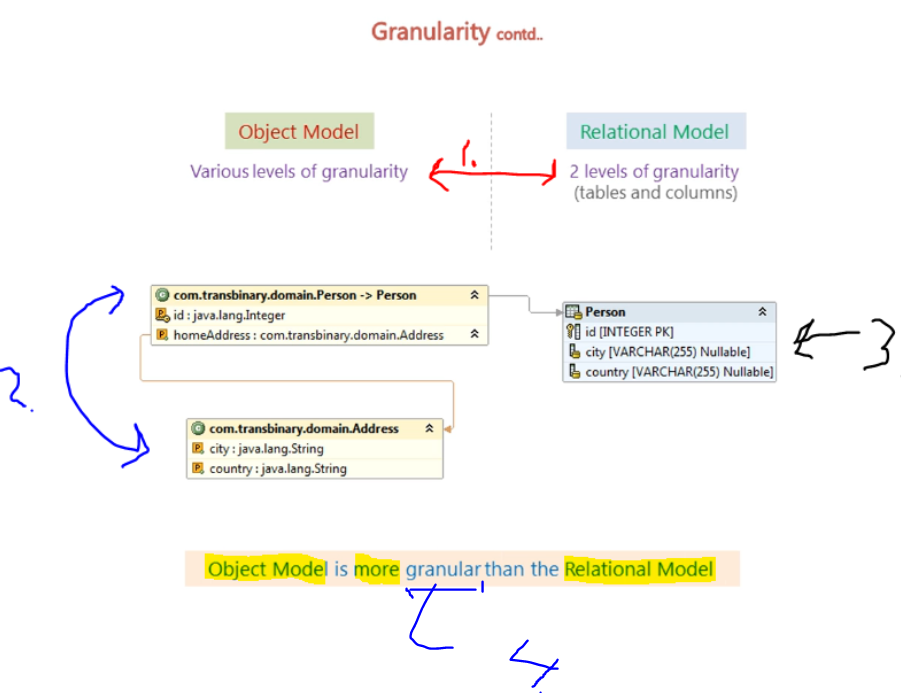
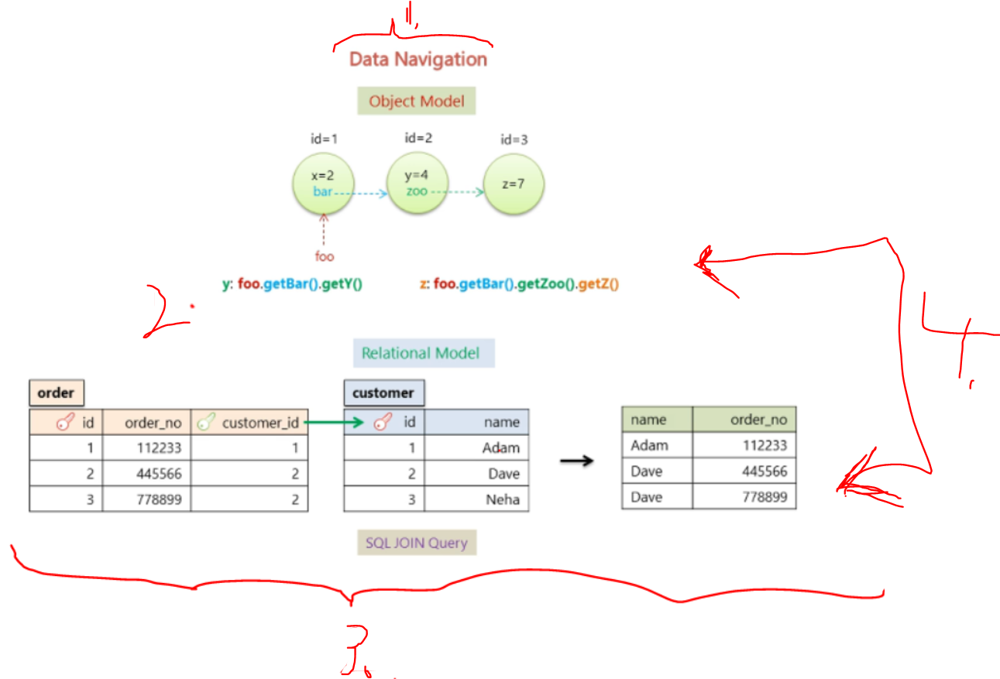

# Section 02: Understanding object/relational persistence.

Understanding object/relational persistence.

# What I Learned.

# 02. Object Relational Impedance Mismatch.


1. This will represent **OOP**.
    - One of OOP language is **Java** language.
        - These will have interconnected relations objects.
2. This will represent the **Database relational model**.
    - Like in **table** format.

- There will be different relations with **Object Relational** and **Relational database**!

3. Since these models are **different**, these will have **mismatch** of **relationship**.
    - We will call this `Object Relational Impedance Mismatch`. **(Paradigm Mismatch)**

> [!IMPORTANT]
> We can say this, **Object Model** and **Relational Model** do not work very well together.

- This context is **e-commerce application**.


1. First mismatch is **Granularity** mismatch.
2. One can think, **system** can be broke down into **smaller pieces**.
3. **Person** can be broken down into smaller pieces: 
    - **Address**.
    - **Order**.
    - **Billing Details**.



1. In **Object Model** we can have **various level** **granularity**.
    - In **Relational Model** this is restricted to **two level**
        - `Tables`.
        - `Columns`.

- This means sometimes, there will be more **Object Model** classes than the **Database Model**
    - Meaning more `Java Classes` than `Relational Model Tables`.
2. Two **Java classes**.
3. Only **One** Table in database.
4. By definition the `granular` means more depth of info.


1. In **Object Model**, there is **Inheritance**. 
    - Example Java and OOP.
2. ❌ No inheritance in **Relational Model**. ❌

- Third is **identity mismatch**.


1. In Java, there is **Object Identity** and **Object equality**.
2. In **Relational Model** the **identity** is can be defined by **Primary key**.   
    - If two keys are the same, they are **thought** to be **identical**.
3. Result of following will be **false**, `foo==bar`.
    - **3.1** `id` of `foo` will be `1`.
    - **3.2** `id` of `bar` will be `2`.

- Third mismatch is **Association mismatch**.


1. In Java the **association** is handled by **Object References**.
2. In **Relational Model** this is handled by **Foreign Key**
3. To say that classes have **bi-directional**, this relationship needs to be defined in **both way!**
> [!IMPORTANT]
> **4.**❌**Foreign Keys** are not bidirectional.❌
### Example of bidirectional relationship.

- Here is example of **birational** reference!

>  **Order.java**

```
    @OneToMany(mappedBy = "order", cascade = CascadeType.ALL, orphanRemoval = true)
    private Set<OrderItemInCart> orderItems = new HashSet<>(); // Initialized to an empty set.
```

>  **OrderItemInCart.java**

```
    @ManyToOne
    @JoinColumn(name = "order_id", nullable = false) 
    private Order order;
```



1. In **Java** one access the **object route**, `y: foo.getBar().getY()` and `z: foo.getBar().getY().getZ()`.

2. Obvious way to make query more performant, is to minimize number of queries to the database.  This can be done using `SQL JOIN Query` from **two different tables**.

- **Summary:** We come to 5 different mismatch problems when we load **Java Objects** into **Relational Database**.

- Todo all mismathhes 

# 3. Object Relational Mapping.


1. We will model **Book Store** object graph
2. We will **persist** it into database. 


1. We will retrieve the Book **object**.


1. We will do this by writing **JDBC** code!
    - We will see if there are **problems** using this **approach**.
        - How will **ORM** mapping solves these closes :).


1. We will have **3** classes:
    - `Publisher` class.
    - `Book` class.
    - `Chapter` class.
2. `Book` has **one or more** `Chapter` on it!
3. `Book` has `Publisher` class on it.
4. In **Relation Database** this achieved by **Foreign Key** reference.