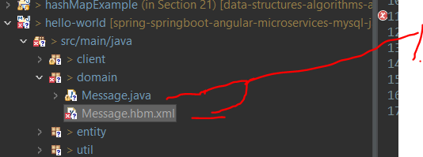

# Section 3: Getting Started with Hibernate and JPA Annotations.

Getting Started with Hibernate and JPA Annotations.

# What I Learned.

# 8. What is Hibernate.


1. These **mappings** will be solved by **Hibernate**.
    - Idea is that Java developers, are using **POJOS** rather than **SQL** language to persist objects.

- If **Object Mode** mapping is done correctly. We don't need to use low level languages or **JDBC** at all.

- **Hibernate** handles the 5 different mismatch problems.

# 9. Hello World with Hibernate and JPA Annotations.


1. We are going create **Java object** into memory and persist it with **Hibernate**.
    - **Primary Key** get auto-generated for us.
    - `ID` will be mapped to `id` in POJO.
    - `TEXT` will be mapped to `text` in POJO.

- We are going to need **JDBC** connection, if we want to persist the object.
    - **Hibernate** gives us **Session** object for us.
        - It represents communication between **Server and Client**.


1. We are using **Session** object to `persist` Message POJO to `Message Table`.


1. `Session` object is build by `SessionFactory` from configuration.
2. Configuration for hibernate to connect to database.
3. Tells hibernate to optimize SQL for specific database.


1. Finally, we provide **mapping** file, which tells how to map Java object to database table.
2. This file can hold many **configurations** for **Hibernate**.
3. `<session-factory></session-factory>` building **session-factory** is **resource intense** process, that why this is limited to **one instance per datasource**.


1. We will build **Session Factory** object in `HibernateUtil` helper class.
2. Only **single** instance of `SessionFactory` object is created.
3. We need to add these dependencies for `classpath` for Hibernate.


1. Mapping for `Message` class for the `Message` table. `package` tells where are the classes for mapping, we are having them in `domain` package.
2. `id` in Message class for `ID` in database table.
3. We have decide how values needs to be **generated**.
    - **Hibernate** support many ID generation strategies.
        - We are using `native` strategy here. Example in picture `<`
            - It gives **generation** responsibility for the underlying database.
            - **3.1**, `AUTO_INCREMENT` in database MySQL table, tells that `ID` is **auto incremented** by the database. So **unique** `ID` is **autogenerated** for every column.


1. Now, when new row is inserted into `Message` table.
    - **Unique primary key** is generated and this `ID` is mapped into `id` of Message object by **Hibernate**.
2. **NOTICE**, no `id` is given here in **Java object**, therefore it comes from **MySQL**.
3. `text` is mapped into `TEXT` of database.
4. **NOTICE** the `string` datatype is ❌not❌:
    - ❌ SQL datatype ❌.
    - ❌ Java datatype ❌.
    - ✔️ Its **Hibernate Mapping Type** ✔️.
        - Takes care of **mapping** from **Java datatype** to **MySQL datatype**.
            - In practical sense, takes care of `String` to `VARCHAR`.
5. Also, **Hibernate** is smart to map without configuration `long` to the `BIGINT` type.

> Why use `BIGINT` for `ID` in db and `Long` for `id` in Java object? One could use `INT` and `int`.

- Many relational databases use `BIGINT` (64-bit integer) for primary keys to support large-scale data.

- Using `Long` in Java ensures compatibility with `BIGINT` in SQL databases.


1. The mapping file is called `Object/Relational Mapping Metadata` file.
2. The Java class is called `Persistent class`.

- ⚠️ Two classes needs to be in same **package**, here they are in `domain` **package** ⚠️.


1. The state of the `Message` Object at this point.


1. When calling `.save`, **Hibernate** will execute following **SQL query** behind the scenes.
    - Notice that the `id=1` of Java object is **not null** anymore, but the **Message** object is not inserted into the database yet.
    - Where is this `id=1` comes from, if there is no record in db?
        - Behind the scenes **Hibernate** is using **JDBC Transactions**.
            - This means `id` is generated by **MySQL**. These values are yet to be committed to the database, because nature of **transactions**.
2. This will be finished after calling `session.getTranaction().commit()` and the database will be also be updated.     


1. We can also do the `JPA @annotation` mapping.
2. These two configuration types will have same kind of information.
3. Example of **@annotation** to do mappings in the Java object with `@Entity` annotation.
4. When using **annotation** remember to add, the configuration to the `<mapping> class="entity.Message"/>`. 
    - With **annotations**, we don't need the **XML** definition of mapping as in the top with ❌.

# 10. Lab - Hello World with Hibernate and JPA Annotations.

- In this lab we will have the following db. We will do `hello-word` application.

```
DROP DATABASE IF EXISTS `hello-world`; 
CREATE DATABASE `hello-world`; 

USE `hello-world`; 

CREATE TABLE `message` ( 
	`ID` BIGINT(20) NOT NULL AUTO_INCREMENT, 
	`TEXT` VARCHAR(255) NULL DEFAULT NULL, 
	PRIMARY KEY (`ID`) 
); 
```

- We will run the project **twice**.
    - Once for **legacy** `.xml` mapping.
    - Other run with the most **up to date** `@annotations`.

- Example of **legacy** `.xml` mapping files. Here the `<mapping resource="domain/Message.hbm.xml"/>` part.

```
<?xml version='1.0' encoding='utf-8'?>
<!DOCTYPE hibernate-configuration PUBLIC
        "-//Hibernate/Hibernate Configuration DTD 3.0//EN"
        "http://www.hibernate.org/dtd/hibernate-configuration-3.0.dtd">

<hibernate-configuration>
    <session-factory>

        <!-- Database connection settings -->
        <property name="connection.driver_class">com.mysql.jdbc.Driver</property>
        <property name="connection.url">jdbc:mysql://localhost:3306/hello-world</property>
        <property name="connection.username">root</property>
        <property name="connection.password">password</property>

        <!-- SQL dialect -->
        <property name="dialect">org.hibernate.dialect.MySQLDialect</property>

        <!-- Echo all executed SQL to stdout -->
        <property name="show_sql">true</property>
        
        <!-- Use XML-based mapping metadata -->	
         <mapping resource="domain/Message.hbm.xml"/>
        
        <!-- Use Annotation-based mapping metadata -->
        <!-- <mapping class="entity.Message"/> -->
        
    </session-factory>
</hibernate-configuration>
```

- And the mapping for the `Message` **Object** to the `MESSAGE` **Table**.

```
<?xml version="1.0"?>
<!DOCTYPE hibernate-mapping PUBLIC
        "-//Hibernate/Hibernate Mapping DTD 3.0//EN"
        "http://www.hibernate.org/dtd/hibernate-mapping-3.0.dtd">

<hibernate-mapping package="domain">
	<class name="Message" table="MESSAGE">
		<id name="id" column="ID">
			<generator class="native" />
		</id>
		<property name="text" type="string" column="TEXT"/>
	</class>
</hibernate-mapping>
```



1. **NOTICE** the same domain package for **Java object** and the `.xml` configuration.


1. As you can see, the `Message` Java class, does not have `id` yet, before its `save` is called.


1. As you can see, the `Message` Java class, have now the `id`.


1. Before transaction is `commit`:ed, there is no **Entry** in the Message table.


1. Now after `.commit()`, also the db will have the row entry!

- All this easiness is achieved by **Hibernate**, no need to write any **JDBC** code.

- Below example code, which were used for illustrating the workflow:

```
package client;

import org.hibernate.Session;

import domain.Message;
import util.HibernateUtil;

public class HelloWorldClient {
	public static void main(String[] args) {
		
				Session session = HibernateUtil.getSessionFactory().openSession();
        		session.beginTransaction();
        
        		Message message = new Message( "Hello World with Hibernate and JPA Annotations" );
        
        		session.save(message);    
        
        		session.getTransaction().commit();
        		session.close();
	
	}
}
```

- The same does works with `@Annotations`.

# 11. Note for Hibernate 5+ Users.

- **Hibernate** got released `Mar 2015`, we have included following `.jar` files.
    - We will be using **Hibernate 6** jars 

> Hibernate 6 release the `javax.*` package got changed to the `jakarta.*` package.


- If using **hibernate 5**, you might have the following mapping error.


- After Hibernate 5, `GenerationType.AUTO` have been changed.

<p align="center">
    
</p>


```
package entity;

import jakarta.persistence.Column;
import jakarta.persistence.Entity;
import jakarta.persistence.GeneratedValue;
import jakarta.persistence.GenerationType;
import jakarta.persistence.Id;
import jakarta.persistence.Table;

@Entity
@Table(name="message")
public class Message {

	//1. Before Hibernate 5.x, GenerationType.AUTO used GenerationType.IDENTITY as default strategy
	//2. After Hibernate 5.x, GenerationType.AUTO used GenerationType.SEQUENCE as default strategy
	//3. To follow the course with Hibernate 6.y, use GenerationType.IDENTITY strategy explicitly
	//4. Q&A on AUTO vs IDENTITY: https://www.udemy.com/course/hibernate-and-jpa-fundamentals/learn/lecture/26324154#questions/937412
	//5. In the lecture on "Pre-INSERT Identifier Generation", we talk more about AUTO, IDENTITY, SEQUENCE and TABLE strategies
	@Id
	@GeneratedValue(strategy=GenerationType.IDENTITY) 
	@Column(name="ID")	
	private Long id;

	@Column(name="TEXT")	
	private String text;
	
	public Message() {}
	public Message(String text) {
		this.text = text;
	}
	
	@Override
	public String toString() {
		return "Message [id=" + id + ", text=" + text + "]";
	}	
	
}
```

# 12. Note for Hibernate 6 Users.

> [!IMPORTANT]
> Note when using Hibernate 6 minimum version of Java is 11.

- And for **Hibernate 6** `Session Factory` we are using **Metadata**. Below example.

```
package util;

import org.hibernate.SessionFactory;
import org.hibernate.boot.Metadata;
import org.hibernate.boot.MetadataSources;
import org.hibernate.boot.registry.StandardServiceRegistry;
import org.hibernate.boot.registry.StandardServiceRegistryBuilder;

public class HibernateUtil {
	
    private static final SessionFactory sessionFactory = buildSessionFactory();
    
    private static SessionFactory buildSessionFactory() {
        try {        	
            // Create the SessionFactory from hibernate.cfg.xml            
            StandardServiceRegistry serviceRegistry = new StandardServiceRegistryBuilder().configure("hibernate.cfg.xml").build();
            Metadata metadata = new MetadataSources(serviceRegistry).getMetadataBuilder().build();
            return metadata.getSessionFactoryBuilder().build();
            
        }
        catch (Throwable ex) {
            // Make sure you log the exception, as it might be swallowed
            System.err.println("Initial SessionFactory creation failed." + ex);
            throw new ExceptionInInitializerError(ex);
        }
    }

    public static SessionFactory getSessionFactory() {
        return sessionFactory;
    }
	
}
```

- Also **Hibernate 6** will be using `.persist()` instead of `.save()`.

- Moreover, you can see `jakarta.` packages form **Hibernate 6** on.
    - Before **Hibernate 5** it will have `.javax`.

```
import jakarta.persistence.Column;
import jakarta.persistence.Entity;
import jakarta.persistence.GeneratedValue;
import jakarta.persistence.GenerationType;
import jakarta.persistence.Id;
import jakarta.persistence.Table;
```

# 13. Lab Exercise - Hello World with Hibernate and JPA Annotations.


1. The `12` line gets executed, and the **Transaction is started**. At `14` the Java object is having `null` value. At `16` the underlying database is called and `id` get inserted. At `18` the **Transaction** will be `committed` and the **row** will be inserted into the database.

<p align="center">
    
</p>


1. At line `14` the **Message** object is created, it's called **Transient object**
    - **Message** object is called `Transient State`.
        - This **state** is **lost** and will be **garbage collected**, as soon as the object is **not** referenced!

> A **Transient** object is an object that exists temporarily and is not persisted to a database or storage system. 


1. At line `16` **Message object** is not called anymore `Transient Object`, it will be called `Persisten State`, since It's **associated** with the **database row**.
    - **Persistent Object** with the database identity.
2. As soon the object is **Persistent Object**, it will be manged by ⚠️**Session**⚠️.

- At the `18` the **database connection** will be **closed**, but the `Session` object will still manage the `Message` Object.


1. At the `19` at **Session** will be **closed**.
    - After this the object will be **Detached Object**, so we call it having **Detach State**.
        - No longer manged by the **Session Object**.

- Summary:

> [!NOTE]
>**Three** states were:
>1. **Transient State**.
>2. **Persistent State**.
>3. **Detached State**.

- There is more, but these are the most popular.
# 14. Logging.

- These **Hibernate** logs `Hibernate: insert into message (TEXT) values (?)`.
    - These are **not enough**, we don't see the values!
        - If we were debugging some problem.

- **Hibernate** `4.0` has started using **JBoss logging** framework.
    - You can choose you favorite logging framework <3.
        - We are using **log4j** framework.

- You can tell logger **lot of levels**.


1. If you want to log all, you choose `ALL` level.
2. If you want **fine-grained details**, you choose `DEBUG` level.

- Example of `ALL` logging. 

```
# Log everything (this will also include the logging information configured by "log4j.logger.org.hibernate.SQL=ALL" and "log4j.
# logger.org.hibernate.type.descriptor.sql.BasicBinder=TRACE")
log4j.logger.org.hibernate=ALL
```

- Example of full logging file:

```
# Direct to file.
log4j.appender.file=org.apache.log4j.RollingFileAppender
log4j.appender.file.File=hello-world.log
log4j.appender.file.MaxFileSize=2MB
log4j.appender.file.MaxBackupIndex=1
log4j.appender.file.layout=org.apache.log4j.PatternLayout
log4j.appender.file.layout.ConversionPattern=%d{ABSOLUTE} %5p %c{1}:%L - %m%n

# Direct to stdout.
log4j.appender.stdout=org.apache.log4j.ConsoleAppender
log4j.appender.stdout.Target=System.out
log4j.appender.stdout.layout=org.apache.log4j.PatternLayout
log4j.appender.stdout.layout.ConversionPattern=%d{ABSOLUTE} %5p %c{1}:%L - %m%n

# Root logger option.
log4j.rootLogger=OFF, stdout, file

# Log everything (this will also include the logging information configured by "log4j.logger.org.hibernate.SQL=ALL" and "log4j.logger.org.hibernate.type.descriptor.sql.BasicBinder=TRACE")
#log4j.logger.org.hibernate=ALL

# Show SQL statements.
log4j.logger.org.hibernate.SQL=ALL

# Show the bind parameter values.
log4j.logger.org.hibernate.orm.jdbc.bind=TRACE
```


1. With `ALL` you can see a lot of logs.

# 15. Lab Exercise - Logging.


- We get more information for performance inspection with:

- **Hibernate config:**

```
<property name="generate_statistics">true</property>
```

- You can have **Log4j** config for logging session: 

- **Log4j config:**

```
#Log everything (this will also include the logging information configured by "log4j.logger.org.hibernate.SQL=ALL" and "log4j.logger.org.hibernate.type.descriptor.sql.BasicBinder=TRACE")
#log4j.logger.org.hibernate=ALL
```


1. When you enable the **Session** logging, you can see much information about its internals.


1. **Remember**, these settings should **not** be in production environment, since there is performance cost and exposes information.

# 16. Manipulating Objects.


- This is inside **database**, context.


1. Context is **selling of books**. Book store.
2. Only when `commit` is executed, the **Transaction** is finished.

- In other words, either the whole operation **succeeds** or everything **rolls back**. 

3. Manually **rollback** can be also be used. Also, same in **code** `4.1`.
4. Same in **code**.


1. As soon the line `19` is executed `Messge msg = (Message) session.get(Message.class, 2L);`, will return **Message** object from the database.
    - The Class **Message** will be looked for.
    - The **ID** with `2L` will be looked on. 
    - Also, `null` returned when no such `id` is found.
2. Following row is being populated into memory from database, when the `19` is executed.

- **NOTICE** No clumsy **SQL** needed, when working with **Hibernate!**


1. At `18` the state of **Message** object is following, note that this is not at db yet. 


1. When **Transaction** is`commit`:ed line executes, the line gets updated into **database**.
    - As soon as `commit` gets executed **Hibernate** does `automatic dirty checking`, it checks if any of data got changed during the **Transaction** and updates the changes into **database**.


1. Only after `.commit()` is called, the **Message** object is deleted from database.


1. All **Persistence Entities** needs **no-args** constructors.
    - This is for **Java Reflection**.

# 17. Lab - Manipulating Objects.

- We are implementing the **Rollback** behavior.

```
package client;

import org.hibernate.Session;
import org.hibernate.Transaction;

import entity.Message;
import util.HibernateUtil;

public class HelloWorldClient {
	public static void main(String[] args) {
		
				Session session = HibernateUtil.getSessionFactory().openSession();
        		Transaction transaction = session.beginTransaction();
        		
        		// We are going to make transaction.
        		try {
				for	transaction.begin();
					
					Message message = new Message( "Hello World with Hibernate and JPA Annotations" );
					
					transaction.commit();
					
				} catch (Exception e) {
					if (transaction != null) {
						transaction.rollback(); // Something happened in the query process. If transaction is not null, we are going to rollback.
					}
					e.printStackTrace();
				} finally {
					if (session != null)					{		
						session.close()
					}
				}
	
	}
}

```


1. Here we can see the `session.get()` working!

- `<property name="format_sql">true</property>` you could set this to true for better **SQL** formatting.

- Here we will illustrate the `automatic dirty checking`.
    - The **modifications** that have been changed inside **Transaction**, when `.commit()` will be called, will apply the changes.

```
package client;

import org.hibernate.Session;
import org.hibernate.Transaction;

import entity.Message;
import util.HibernateUtil;

public class HelloWorldClient {
	public static void main(String[] args) {
		
				Session session = HibernateUtil.getSessionFactory().openSession();
        		Transaction transaction = session.getTransaction();
        		
        		// We are going to make transaction.
        		try {
					transaction.begin();
					
					// Message object is managed by session.
					Message message = (Message) session.get(Message.class, 3L);
					message.setText(" This text is changed.");
//					System.out.println(message);
					
					
					
					transaction.commit();
					
				} catch (Exception e) {
					if (transaction != null) {
						transaction.rollback(); // Something happened in the query process. If transaction is not null, we are going to rollback.
					}
					e.printStackTrace();
				} finally {
					if (session != null)
					{		
						session.close();
					}
				}
	
	}
}

```


1. Here you can see that **Hibernate** will deduct the **change old** or the **insert new**.


1. At `17` The **Message** is being manged by the **Session** object.
    - `Persistnet state`.


1. At `19` delete will be called, and the **Message** is no longed manged by the **Session** object.
    -  State will change to the `Removed state`.

- There is different **States** as Summary:

| Hibernate State  | Description |
|---------------|-------------|
| **Transient** | Object is created but not associated with Hibernate. No DB representation. |
| **Persistent** | Object is associated with an active session and saved in DB. |
| **Detached** | Object was persistent but is now disconnected from the session. |
| **Removed** | Object is marked for deletion from the database. |

- As summary:


1. At line `17` **Message** with id `2` is loaded from database. It will be in `Persistent State`.


1. At line `18` when `.delete` is called, it will no longer be managed by **Session**, the state changes to `Removed State`.

# 18. Lab Exercise - Manipulating Objects.


1. Updating the **Message** field does not have any effect after the `.close()` have been called. 


1. If trying to call methods on **closed** session, it will throw **exception**.


1. We open new connection and update **Message** at `.commit()`.