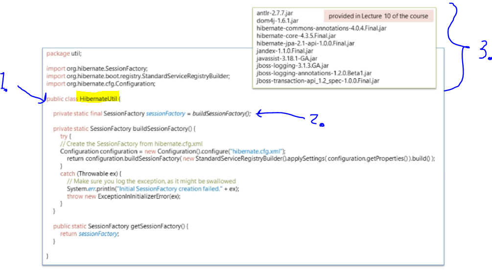

# Section 3: Getting Started with Hibernate and JPA Annotations.

Getting Started with Hibernate and JPA Annotations.

# What I Learned.

# 8. What is Hibernate.

1. This mapping shit will be solved by **Hibernate**.
    - Idea is that Java developers, are using **POJOS** rather than **SQL** language to persist objects.

- If **Object Mode** mapping is done correctly. We don't need to use low level languages or **JDBC** at all.

- **Hibernate** handles the 5 different mismatch problems.

# 9. Hello World with Hibernate and JPA Annotations.

1. We are going create **Java object** into memory and persist it with **Hibernate**.
    - **Primary Key** get auto-generated for us.
    - `ID` will be mapped to `id` in POJO.
    - `TEXT` will be mapped to `text` in POJO.

- We are going to need **JDBC** connection, if we want to persist the object.
    - **Hibernate** gives us **Session** object for us.
        - It represents communication between **Server and Client**.

1. We are using **Session** object to `persist` Message POJO to `Message Table`.

1. `Session` object is build by `SessionFactory` from configuration.
2. Configuration for hibernate to connect to database.
3. Tells hibernate to optimize SQL for specific database.

1. Finally, we provide **mapping** file, which tells how to map Java object to database table.
2. This file can hold many **configurations** for **Hibernate**.
3. `<session-factory></session-factory>` building **session-factory** is **resource intense** process, that why this is limited to **one instance per datasource**.

1. We will build **Session Factory** object in `HibernateUtil` helper class.
2. Only **single** instance of `SessionFactory` object is created.
3. We need to add these dependencies for `classpath` for Hibernate.

1. Mapping for `Message` class for the `Message` table. `package` tells where are the classes for mapping, we are having them in `domain` package.
2. `id` in Message class for `ID` in database table.
3. We have decide how values needs to be **generated**.
    - **Hibernate** support many ID generation strategies.
        - We are using `native` strategy here. Example in picture `<`
            - It gives **generation** responsibility for the underlying database.
            - **3.1**, `AUTO_INCREMENT` in database MySQL table, tells that `ID` is **auto incremented** by the database. So **unique** `ID` is **autogenerated** for every column.

1. Now, when new row is inserted into `Message` table.
    - **Unique primary key** is generated and this `ID` is mapped into `id` of Message object by **Hibernate**.
2. **NOTICE**, no `id` is given here in **Java object**, therefore it comes from **MySQL**.
3. `text` is mapped into `TEXT` of database.
4. **NOTICE** the `string` datatype is ❌not❌:
    - ❌ SQL datatype ❌.
    - ❌ Java datatype ❌.
    - ✔️ Its **Hibernate Mapping Type** ✔️.
        - Takes care of **mapping** from **Java datatype** to **MySQL datatype**.
            - In practical sense, takes care of `String` to `VARCHAR`.
5. Also, **Hibernate** is smart to map without configuration `long` to the `BIGINT` type.

> Why use `BIGINT` for `ID` in db and `Long` for `id` in Java object? One could use `INT` and `int`.

- Many relational databases use `BIGINT` (64-bit integer) for primary keys to support large-scale data.

- Using `Long` in Java ensures compatibility with `BIGINT` in SQL databases.

1. The mapping file is called `Object/Relational Mapping Metadata` file.
2. The Java class is called `Persistent class`

- ❌ Two classes needs to be in same **package**, here they are in `domain` **package** ❌.

