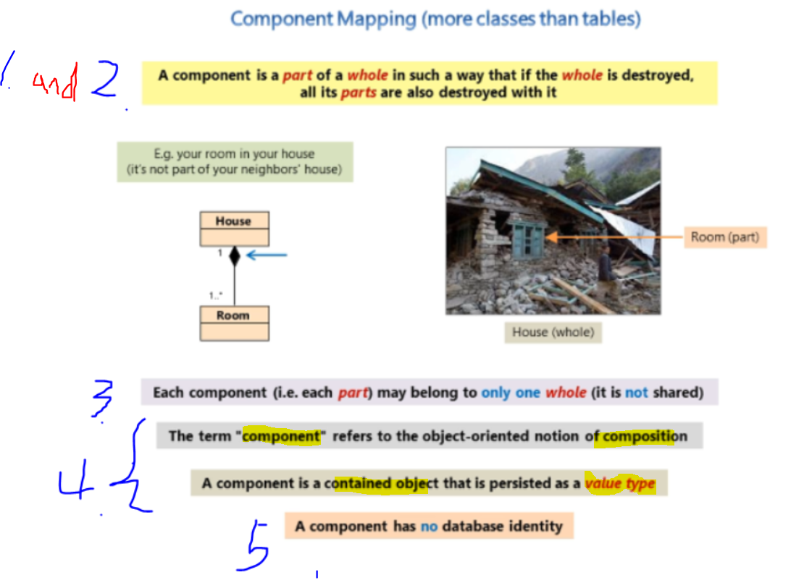
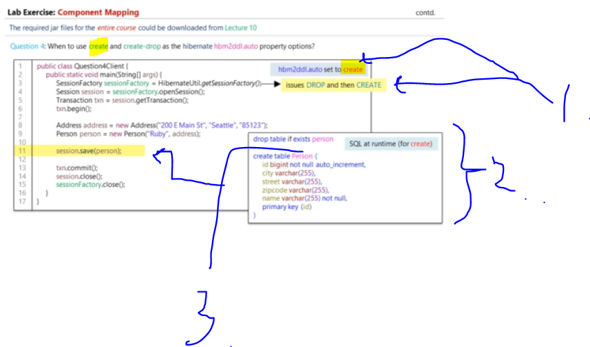

# Section 04: Mapping Concepts.

Mapping Concepts.

# What I Learned.

# Aggregation and Composition.


- **Aggregation** → **Whole** and **its Parts**.

1. **Band** is **whole** and is made from **Parts** of **Artists**.
2. **Aggregation**, when whole is **destroyed** its **children** are **NOT** destroyed.


1. In the **Composition**, when **whole** is **destroyed**, then its children **ARE** destroyed.

- This indicates **strong** form of **aggregation**.

2. When the **house** is destroyed then the **rooms** are also destroyed.
3. **NOTICE** the parts may not be shared. 
    - Example, the rooms are not shared with your neighbor.

- This is in general:
> This is an **object-oriented design concept**.
> It means building an entity out of smaller parts (components).

# Entities and Value Types.

> [!NOTE]
> How does the **Persistent classes** have the identity?


1. If in **Database** the **ID** is at present, how can this in **Java classes**. You could present whole table as full class, but its rather bad OOP design.
2. We would **brake** the class into **smaller pieces**.
3. Is the `id` part of `User` or `Address` field, which one **owns** the identity.
    - That depends, if user cares about **identifying** **User** uniquely or **Address**.

- Object that has **Database Identity Type**, are called `Entity` types.
    - And those who does **NOT** have **Database Identity Type**, are called **VALUE TYPE**. These belong to the entity.
- In this example, the **User** it has **Database Identity**, it's called **Entity** and the **Address** does not have **Identity**, so it's called **Value type**.


1. **Value types** are belonging, to the **Entity** type.
    - **Value types** are identified **thought** the **Entity**.

- If the **User** is deleted, then all the **Addresses** are deleted.

2. They cannot be **referenced** by other **Entity types**. Entity cannot reference **Entity**.
    - It can be done only by the Entity that its being owned by.

3. The Object of the **Entity** can be referenced.


1. Most simple **Values types** from Java are **String** and **Integer**.


1. If you would need, **UID** `Adress`, you would need add `id`.
    - So, its **designers** choice, whether you make Object **Value type** or **Entity type**.
2. You can ask yourself about `Does the database identity of an object matters?`


1. Example, the **Integer** is being owned by **Object**.


1. You could think that `Address` in the **Shopping App**, does not need `ID` it would be **Value Type**, but in **Real Estate Search Engine** this should be identified with `ID`, so it would be **Entity Type**.
    - In search engine it would be critical information.
    
# Component Mapping.



1. Component is **part** of a **whole**. 
2. If **whole** is destroyed the **parts** of it are also destroyed. 
3. These smaller one are not shared. Example the rooms cannot be shared with your neighbors.
4. `coponent` is referring to **Java composition relationship** from OOP concept. In this context this will be included to the whole **Java** object. In **Hibernate** this will be persisted as **value type**.
    - It exists only for the **Entity** who owns it.
5. **Notice** the component does not have **identity**!
    - It cannot be `Entity`.

- In **SQL** it's related to the `SQL columns` and in **Hibernate** it's related to the `classes` to make composition.


1. We are mapping **two classes** to the **one** database table.


1. So, we can notice that `Address` is included into the `Person` table.
2. We can also notice that, Entity outside cannot refer to the **Type object** inside it.


1. We mark the **persistence component class** with the `@Embeddable` for the Entity.
    - Notice no `ID` can be found here!
2. Also, we add this to the parent object who owns it `@Embedded`.


1. You just need to add the **configuration** for the file.


1. **Mapping** can be done just like in `.xml` mapping.


1. Who decided about **schema** about this database table?


1. We never instructed the mapping to the **Hibernate**!?


1. **Hibernate** uses **Reasonable Default Values**, for **XML**-mapping and **annotations**-based mapping.

- When **Hibernate** find information missing, it uses **Reasonable Default Values** for that. It acts like in the point `2.`, where these pieces of information would be present.
    - If there is no `name`, or `column` information provided, these informations will be used as the name.


1. We are using `<property name="hibernate.hbm2ddl.auto" value="update"/>` or the `update` strategy. It **creates** tables 
 and **updates** them for you, when **Hibernate** detect changes in your entity classes. **USE ONLY IN DEVELOPMENT ENV**.

2. It creates the mapping attribute of the `<mapping class="entity.Message"/>`. It creates and executes following **schema** against the `hello-world` database.

- Following client added Entity with `@Embedded` and `@Embeddable`, which we are using.

```
package client;

import org.hibernate.Session;
import org.hibernate.Transaction;

import util.HibernateUtil;
import entity.Address;
import entity.Person;


public class ComponentMappingClient {
	public static void main(String[] args) {
		
				Session session = HibernateUtil.getSessionFactory().openSession();
        		Transaction txn = session.getTransaction();
        		try {
        			txn.begin();
        			//Person having 1 Address    
        			
        			Address address = new Address("200 E Main St", "Seattle", "85123");
        			Person person = new Person("Ruby", address);
        	
        			session.save(person);   			
        			//---------------------------------------------------------------------------------------

        			//Person having 2 Address (homeAddress and billingAddress) using AttributeOverrides
        			/*
        			Address homeAddress = new Address("200 E Main St", "Seattle", "85123");
        			Address billingAddress = new Address("2751  Sigley Road", "Charlotte", "28273");
        			Person person = new Person("Ruby", homeAddress, billingAddress);      			
        	
        			session.save(person);
	        		*/
	        		txn.commit();
        		}	catch(Exception e) {
	        			if(txn != null) { txn.rollback(); }
	        			e.printStackTrace();
        		}	finally {
        				if(session != null) { session.close(); }
        		}
	
	}
}
```


1. If we want, we could specify the mapping for the columns.


1. Fields will be mapped with default name.


- You can see the **fields** getting mapped into following `COLUMNS` with customer names.
	- `address_stree`, `address_city` and `address_zipcode`.

1. You could use following code, with the `@AttributeOverrides`.

```
	@Embedded
	@AttributeOverrides( {
		@AttributeOverride(name="street", column=@Column(name="home_street")),
		@AttributeOverride(name="city", column=@Column(name="home_city")),
		@AttributeOverride(name="zipcode", column=@Column(name="home_zipcode"))
	} )
	private Address homeAddress;
```


1. When there are **TWO Addresses** in `1` and `2`, it becomes requirement for the use of `@AttributeOverrides`, for both `Home Address` and for `Billing Adress`.
    - You need both unique address rows names!


1. **Component** is also called, **Embeddable Object**, since it embedded inside `Entity` and **persisted** as **Value Type**.
2. When using **multiple** `Address` in same `Entity`, it comes **requirement**, to use the `@AttributeOverride()` for both addresses.
3. **Notice** these having different variables!

# Lab Exercise - Component Mapping.


1. **Question 1:**
	- **Answer:** Entity.

```
Question 1: If it mattered for your application to uniquely identify an Address object,
by a database identity for e.g., would you create it as an Entity or a Value Type ?
```


1. **Question 2:**
	- There are three objects here:
		- `Address object`.
		- `Order object`.
		- `User object`.
	- **Answer:** Address object.


```
Question 2: Looking at the Figure 1 given below, could you figure out which of the objects are Value Type?
```


1. **Question 3:**
	- **Answer:** My answer is **A**. When `Band` is destroyed, the `Artist` are **not** destroyed with it.

```
Question 3: Which of the relationships shown in the Figure 2 given below indicates the Aggregation relationship? Choose an option between (A) and (B)?
```


1. We talked about the `update` configuration in last session.


1. This case, we are using the `create` mapping.
	- When using the `create` mapping, following behavior is expected:



1. When we are using `create` config, the `DROP` statement is executed and then the `CREATE` statement is created.
2. Following **SQL** is created and executed.
3. The `Person` is being affected, from the config. This **SQL** is being executed once the `.save()` been executed.


1. `.commit()` is issued, the date is **persisted** into to the database.
2. With these the **session** is closed.

- Example of usage of in code:

```
package client;

import org.hibernate.Session;
import org.hibernate.SessionFactory;
import org.hibernate.Transaction;

import util.HibernateUtil;
import entity.Address;
import entity.Person;

public class Question4Client {
	public static void main(String[] args) {

		SessionFactory sessionFactory = HibernateUtil.getSessionFactory();
		Session session = sessionFactory.openSession();
		Transaction txn = session.getTransaction();
		txn.begin();

		Address address = new Address("200 E Main St", "Seattle", "85123");
		Person person = new Person("Ruby", address);

		session.save(person);

		txn.commit();
		session.close();
		sessionFactory.close();

	}
}

```


1. This case is with the `create-drop` mapping.
	- This will be the same, until the `sessionFacotory.close()` is called. 


1. The table will be dropped, with the `DROP` statement.

# Mapping Associations.


- In this example **Student** has **Guide**.

1. **Object mode** is associating the references with **object references**.
2. In **Relational Model** associating is done with the **foreign key**.


1. Guide is the `One side` and Student is the `Many side`.


1. We need to add mapping to the for **Object Model**.


1. To achieve this, we are using the `@ManyToOne` and `@JoinColumn(...)`


1. We just add the **Entities** to the configurations.


1. To save these to db, we need to call **two times** `session.save()`.

# Cascades.

- We want to **persist** all object in same time.


1. We want to call one method `session.persist(student)`.
2. These are can be called "cascading the `PERSIST` operation" or can be called **Transitive Persistence**.
	- We can use the `(cascade=CascadeType.PERSIST))` for mapping.
	


1. We are persisting the objects with the one `.persist()` line, and it will be persisted to the db.


# Lab Exercise - Cascades.


1. `session.delete()`, what will happen when this line will be executed.

```
Task 1: What will happen to the Student and Guide tables after executing the delete?
```

1. **Task 1:**
	- **Answer:** There will be exception will be thrown, `ConstraintViolationException`.


1. Once the `.delete()` is called, the following **SQL** will be generated and executed.
2. The following `ConstraintViolationException` will be thrown.


1. **Student** with `id` **2** will be deleted and its **Guide**, which were referred. There is no guide to refer with `id` **2**. 
2. You cannot have the following data in the database, where **2** is referring something that does not exist. This situation cannot exist **relational database**, for this reason **Hibernate** throws `ConstraintViolationException`.
	- This is called:
		- `Foreign-key Constraint`.
		- `Referential Integrity Constraint`.

> [!IMPORTANT]
> Then, how we can delete **Student**, without violating the Foreign-key constraint.


1. We need to setting `Guide` value to `null`.
2. You can see **Student** is deleted, and its **Guide** is not.
3. **Recommended**, not cascade the delete operation in the first place.
	- If that is not option, you know how to delete **Student** without getting exception thrown.

 # One-To-Many Relationship.
 


1. We can go from **Student** to the **Guide**, with the `getGuide()`, but there is no relationship, from **Guide** to the **Student**. This arrow tells us, that `Student` and the `Guide` is **uni-directional relationship**.


1. Now, when there are fields inside `Guide` for the `Student`'s, this relationship turns to be `bi-directional`.


1. `@OneToMany(mappedBy = "guide")` is telling Hibernate in what to map by.
	- In `bi-directional` relationship there needs to be **owner** of the relationship and this is needed to define with the `mappedBy` attribute.
	- **Owner** of the relationship is responsible for the association column(s) update. 

2. The **Many side** in **One-to-Many** bi-directional relational is (almost) always the **owner** side.
	- Meaning if the `Student` is update, then the `Student` reference is updated as well. At time of **dirty checking**.
	- In case of the `Guide` is updated, then references are **not** updated, which not the **owner** of the relationship. At time of **dirty checking**.


- **Reminder** that, in JPA (Java Persistence API), `CascadeType` controls how **operations** on a parent entity are **propagated** to its associated child entities. Currently there, were:

| Cascade Type   | Description |
|----------------|-------------|
| `PERSIST`      | When the parent is persisted, all associated child entities are also persisted automatically. |
| `MERGE`        | When the parent is merged (updated), all associated child entities are also merged. |
| `REMOVE`       | When the parent is deleted, all associated child entities are also deleted. |
| `REFRESH`      | When the parent is refreshed from the database, the child entities are also refreshed. |
| `DETACH`       | When the parent is detached from the persistence context, the child entities are detached too. |
| `ALL`          | Applies all of the above: `PERSIST`, `MERGE`, `REMOVE`, `REFRESH`, and `DETACH`. |


1. We are adding the `CascadeType.Persist` in to the `inverse end` or `not the owner of the relationship`, to make sure that, when the `Guide` is **persisted**. All its `Student`'s associated with it, are also **persisted**.

- Student Entity.

```
// Student.java
package entity;

import javax.persistence.*;

@Entity
public class Student {

    @Id
    @GeneratedValue(strategy = GenerationType.AUTO)
    private Long id;

    @Column(name = "enrollment_id", nullable = false)
    private String enrollmentId;

    private String name;

    @ManyToOne(cascade = {CascadeType.PERSIST, CascadeType.REMOVE})
    @JoinColumn(name = "guide_id")
    private Guide guide;

    public Student() {}

    public Student(String enrollmentId, String name, Guide guide) {
        this.enrollmentId = enrollmentId;
        this.name = name;
        this.guide = guide;
    }

    public Guide getGuide() { return guide; }

    public void setGuide(Guide guide) { this.guide = guide; }
}
```

- Guide Entity.

```
// Guide.java
package entity;

import javax.persistence.*;
import java.util.HashSet;
import java.util.Set;

@Entity
public class Guide {

    @Id
    @GeneratedValue(strategy = GenerationType.AUTO)
    private Long id;

    @Column(name = "staff_id", nullable = false)
    private String staffId;

    private String name;

    private Integer salary;

    @OneToMany(mappedBy = "guide", cascade = {CascadeType.PERSIST})
    private Set<Student> students = new HashSet<>();

    public Guide() {}

    public Guide(String staffId, String name, Integer salary) {
        this.staffId = staffId;
        this.name = name;
        this.salary = salary;
    }

    public Set<Student> getStudents() { return students; }
}
```


# Lab Exercise - One-To-Many Relationship.


