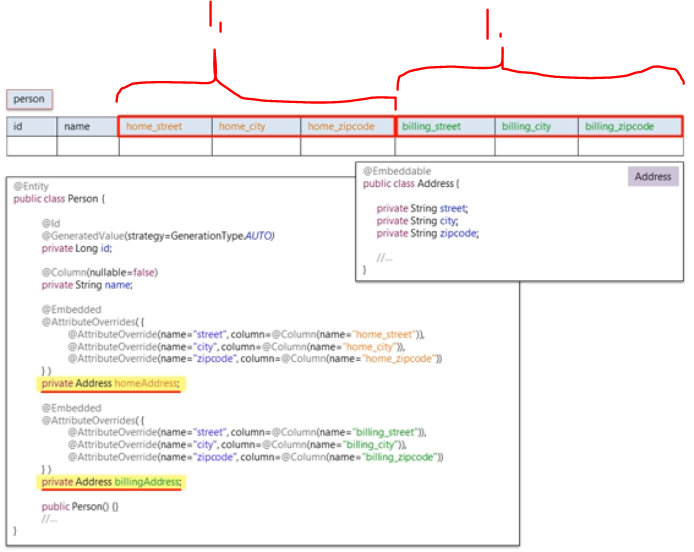
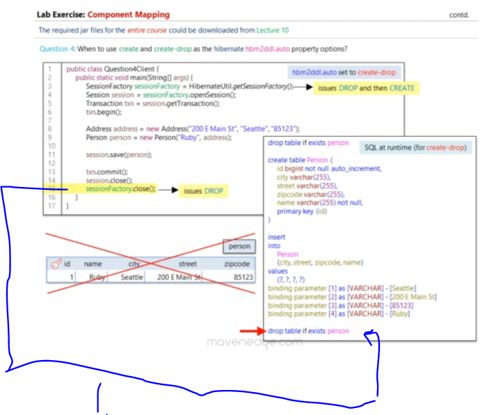
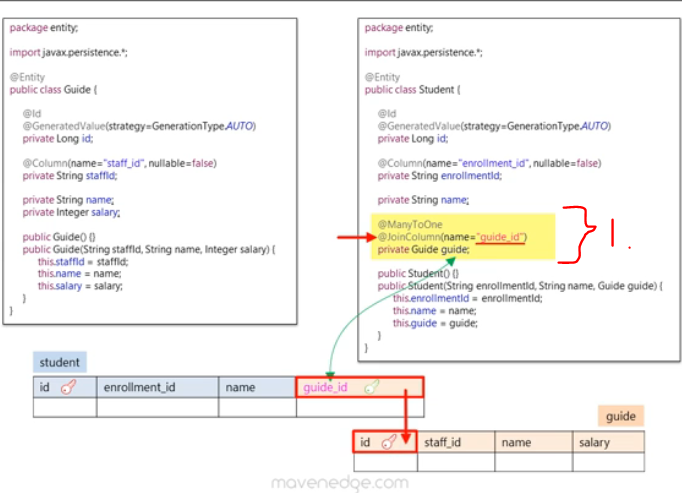
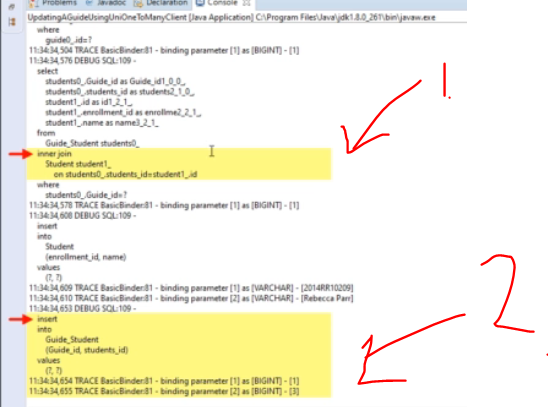
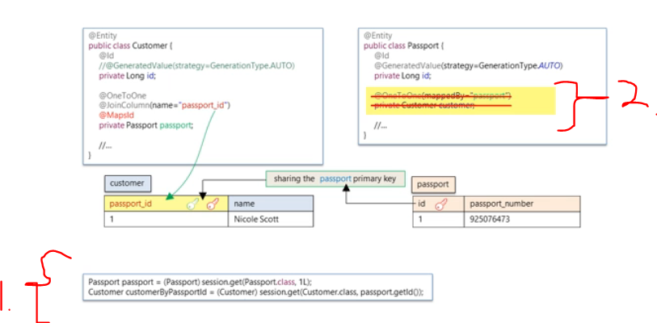
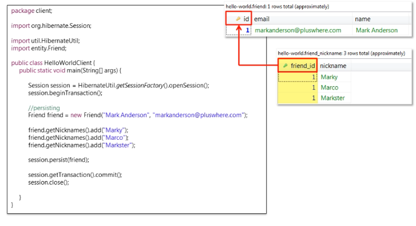
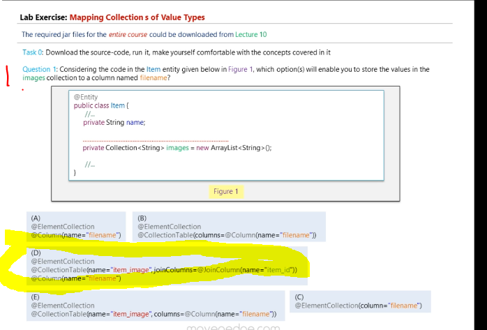
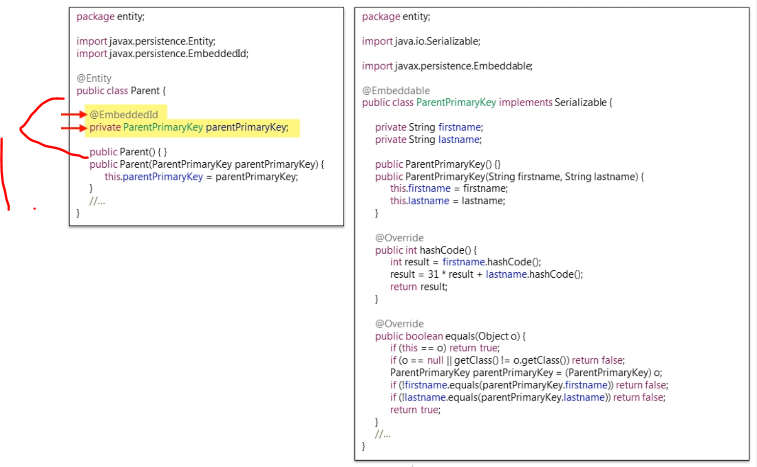

# Section 04: Mapping Concepts.

Mapping Concepts.

# What I Learned.

# Aggregation and Composition.


- **Aggregation** → **Whole** and **its Parts**.

1. **Band** is **whole** and is made from **Parts** of **Artists**.
2. **Aggregation**, when whole is **destroyed** its **children** are **NOT** destroyed.


1. In the **Composition**, when **whole** is **destroyed**, then its children **ARE** destroyed.

- This indicates **strong** form of **aggregation**.

2. When the **house** is destroyed then the **rooms** are also destroyed.
3. **NOTICE** the parts may not be shared. 
    - Example, the rooms are not shared with your neighbor.

- This is in general:
> This is an **object-oriented design concept**.
> It means building an entity out of smaller parts (components).

# Entities and Value Types.

> [!NOTE]
> How does the **Persistent classes** have the identity?


1. If in **Database** the **ID** is at present, how can this in **Java classes**. You could present whole table as full class, but its rather bad OOP design.
2. We would **brake** the class into **smaller pieces**.
3. Is the `id` part of `User` or `Address` field, which one **owns** the identity.
    - That depends, if user cares about **identifying** **User** uniquely or **Address**.

- Object that has **Database Identity Type**, are called `Entity` types.
    - And those who does **NOT** have **Database Identity Type**, are called **VALUE TYPE**. These belong to the entity.
- In this example, the **User** it has **Database Identity**, it's called **Entity** and the **Address** does not have **Identity**, so it's called **Value type**.


1. **Value types** are belonging, to the **Entity** type.
    - **Value types** are identified **thought** the **Entity**.

- If the **User** is deleted, then all the **Addresses** are deleted.

2. They cannot be **referenced** by other **Entity types**. Entity cannot reference **Entity**.
    - It can be done only by the Entity that its being owned by.

3. The Object of the **Entity** can be referenced.


1. Most simple **Values types** from Java are **String** and **Integer**.


1. If you would need, **UID** `Adress`, you would need add `id`.
    - So, it would be **designers** choice, whether you make Object **Value type** or **Entity type**.
2. You could ask yourself about following questin `Does the database identity of an object matters?`


1. One example: The **Integer** is being owned by **Object**.


1. You could think that `Address` in the **Shopping App**, does not need `ID` it would be **Value Type**, but in **Real Estate Search Engine** this should be identified with `ID`, so it would be **Entity Type**.
    - In search engine it would be critical information.
    
# Component Mapping.


1. Component is **part** of a **whole**. 
2. If **whole** is destroyed the **parts** of it are also destroyed. 
3. These smaller one are not shared. Example the rooms cannot be shared with your neighbors.
4. `coponent` is referring to **Java composition relationship** from OOP concept. In this context this will be included to the whole **Java** object. In **Hibernate** this will be persisted as **value type**.
    - It exists only for the **Entity** who owns it.
5. **Notice** the component does not have **identity**!
    - It cannot be `Entity`.

- In **SQL** it's related to the `SQL columns` and in **Hibernate** it's related to the `classes` to make composition.


1. We are mapping **two classes** to the **one** database table.


1. So, we can notice that `Address` is included into the `Person` table.
2. We can also notice that, Entity outside cannot refer to the **Type object** inside it.


1. We mark the **persistence component class** with the `@Embeddable` for the Entity.
    - Notice no `ID` can be found here!
2. Also, we add this to the parent object who owns it `@Embedded`.


1. You just need to add the **configuration** for the file.


1. **Mapping** can be done just like in `.xml` mapping.


1. Who decided about **schema** about this database table?


1. We never instructed the mapping to the **Hibernate**!?


1. **Hibernate** uses **Reasonable Default Values**, for **XML**-mapping and **annotations**-based mapping.

- When **Hibernate** find information missing, it uses **Reasonable Default Values** for that. It acts like in the point `2.`, where these pieces of information would be present.
    - If there is no `name`, or `column` information provided, these informations will be used as the name.


1. We are using `<property name="hibernate.hbm2ddl.auto" value="update"/>` or the `update` strategy. It **creates** tables 
 and **updates** them for you, when **Hibernate** detect changes in your entity classes. **USE ONLY IN DEVELOPMENT ENV**.

2. It creates the mapping attribute of the `<mapping class="entity.Message"/>`. It creates and executes following **schema** against the `hello-world` database.

- Following client added Entity with `@Embedded` and `@Embeddable`, which we are using.

```
package client;

import org.hibernate.Session;
import org.hibernate.Transaction;

import util.HibernateUtil;
import entity.Address;
import entity.Person;


public class ComponentMappingClient {
	public static void main(String[] args) {
		
				Session session = HibernateUtil.getSessionFactory().openSession();
        		Transaction txn = session.getTransaction();
        		try {
        			txn.begin();
        			//Person having 1 Address    
        			
        			Address address = new Address("200 E Main St", "Seattle", "85123");
        			Person person = new Person("Ruby", address);
        	
        			session.save(person);   			
        			//---------------------------------------------------------------------------------------

        			//Person having 2 Address (homeAddress and billingAddress) using AttributeOverrides
        			/*
        			Address homeAddress = new Address("200 E Main St", "Seattle", "85123");
        			Address billingAddress = new Address("2751  Sigley Road", "Charlotte", "28273");
        			Person person = new Person("Ruby", homeAddress, billingAddress);      			
        	
        			session.save(person);
	        		*/
	        		txn.commit();
        		}	catch(Exception e) {
	        			if(txn != null) { txn.rollback(); }
	        			e.printStackTrace();
        		}	finally {
        				if(session != null) { session.close(); }
        		}
	
	}
}
```


1. If we want, we could specify the mapping for the columns.


1. Fields will be mapped with default name.


- You can see the **fields** getting mapped into following `COLUMNS` with customer names.
	- `address_stree`, `address_city` and `address_zipcode`.

1. You could use following code, with the `@AttributeOverrides`.

```
	@Embedded
	@AttributeOverrides( {
		@AttributeOverride(name="street", column=@Column(name="home_street")),
		@AttributeOverride(name="city", column=@Column(name="home_city")),
		@AttributeOverride(name="zipcode", column=@Column(name="home_zipcode"))
	} )
	private Address homeAddress;
```



1. When there are **TWO Addresses** in `1` and `2`, it becomes requirement for the use of `@AttributeOverrides`, for both `Home Address` and for `Billing Adress`.
    - You need both unique address rows names!


1. **Component** is also called, **Embeddable Object**, since it embedded inside `Entity` and **persisted** as **Value Type**.
2. When using **multiple** `Address` in same `Entity`, it comes **requirement**, to use the `@AttributeOverride()` for both addresses.
3. **Notice** these having different variables!

# Lab Exercise - Component Mapping.


1. **Question 1:**
	- **Answer:** Entity.

```
Question 1: If it mattered for your application to uniquely identify an Address object,
by a database identity for e.g., would you create it as an Entity or a Value Type ?
```


1. **Question 2:**
	- There are three objects here:
		- `Address object`.
		- `Order object`.
		- `User object`.
	- **Answer:** Address object.


```
Question 2: Looking at the Figure 1 given below, could you figure out which of the objects are Value Type?
```


1. **Question 3:**
	- **Answer:** My answer is **A**. When `Band` is destroyed, the `Artist` are **not** destroyed with it.

```
Question 3: Which of the relationships shown in the Figure 2 given below indicates the Aggregation relationship? Choose an option between (A) and (B)?
```


1. We talked about the `update` configuration in last session.


1. This case, we are using the `create` mapping.
	- When using the `create` mapping, following behavior is expected:


1. When we are using `create` config, the `DROP` statement is executed and then the `CREATE` statement is created.
2. Following **SQL** is created and executed.
3. The `Person` is being affected, from the config. This **SQL** is being executed once the `.save()` been executed.


1. `.commit()` is issued, the date is **persisted** into to the database.
2. With these the **session** is closed.

- Example of usage of in code:

```
package client;

import org.hibernate.Session;
import org.hibernate.SessionFactory;
import org.hibernate.Transaction;

import util.HibernateUtil;
import entity.Address;
import entity.Person;

public class Question4Client {
	public static void main(String[] args) {

		SessionFactory sessionFactory = HibernateUtil.getSessionFactory();
		Session session = sessionFactory.openSession();
		Transaction txn = session.getTransaction();
		txn.begin();

		Address address = new Address("200 E Main St", "Seattle", "85123");
		Person person = new Person("Ruby", address);

		session.save(person);

		txn.commit();
		session.close();
		sessionFactory.close();

	}
}

```


1. This case is with the `create-drop` mapping.
	- This will be the same, until the `sessionFacotory.close()` is called. 



1. The table will be dropped, with the `DROP` statement.

# Mapping Associations.


- In this example **Student** has **Guide**.

1. **Object mode** is associating the references with **object references**.
2. In **Relational Model** associating is done with the **foreign key**.


1. Guide is the `One side` and Student is the `Many side`.


1. We need to add mapping to the for **Object Model**.



1. To achieve this, we are using the `@ManyToOne` and `@JoinColumn(...)`


1. We just add the **Entities** to the configurations.


1. To save these to db, we need to call **two times** `session.save()`.

# Cascades.

- We want to **persist** all object in same time.


1. We want to call one method `session.persist(student)`.
2. These are can be called "cascading the `PERSIST` operation" or can be called **Transitive Persistence**.
	- We can use the `(cascade=CascadeType.PERSIST))` for mapping.
	


1. We are persisting the objects with the one `.persist()` line, and it will be persisted to the db.


# Lab Exercise - Cascades.


1. `session.delete()`, what will happen when this line will be executed.

```
Task 1: What will happen to the Student and Guide tables after executing the delete?
```

1. **Task 1:**
	- **Answer:** There will be exception will be thrown, `ConstraintViolationException`.


1. Once the `.delete()` is called, the following **SQL** will be generated and executed.
2. The following `ConstraintViolationException` will be thrown.


1. **Student** with `id` **2** will be deleted and its **Guide**, which were referred. There is no guide to refer with `id` **2**. 
2. You cannot have the following data in the database, where **2** is referring something that does not exist. This situation cannot exist **relational database**, for this reason **Hibernate** throws `ConstraintViolationException`.
	- This is called:
		- `Foreign-key Constraint`.
		- `Referential Integrity Constraint`.

> [!IMPORTANT]
> Then, how we can delete **Student**, without violating the Foreign-key constraint.


1. We need to setting `Guide` value to `null`.
2. You can see **Student** is deleted, and its **Guide** is not.
3. **Recommended**, not cascade the delete operation in the first place.
	- If that is not option, you know how to delete **Student** without getting exception thrown.

 # One-To-Many Relationship.
 


1. We can go from **Student** to the **Guide**, with the `getGuide()`, but there is no relationship, from **Guide** to the **Student**. This arrow tells us, that `Student` and the `Guide` is **uni-directional relationship**.


1. Now, when there are fields inside `Guide` for the `Student`'s, this relationship turns to be `bi-directional`.


1. `@OneToMany(mappedBy = "guide")` is telling Hibernate in what to map by.
	- In `bi-directional` relationship there needs to be **owner** of the relationship and this is needed to define with the `mappedBy` attribute.
	- **Owner** of the relationship is responsible for the association column(s) update. 

2. The **Many side** in **One-to-Many** bi-directional relational is (almost) always the **owner** side.
	- Meaning if the `Student` is updated, then the `Student` reference is updated as well. At time of **dirty checking**.
	- In case of the `Guide` is updated, then references are **not** updated, which not the **owner** of the relationship. At time of **dirty checking**.


- **Reminder** that, in JPA (Java Persistence API), `CascadeType` controls how **operations** on a parent entity are **propagated** to its associated child entities. Currently there, were:

| Cascade Type   | Description |
|----------------|-------------|
| `PERSIST`      | When the parent is persisted, all associated child entities are also persisted automatically. |
| `MERGE`        | When the parent is merged (updated), all associated child entities are also merged. |
| `REMOVE`       | When the parent is deleted, all associated child entities are also deleted. |
| `REFRESH`      | When the parent is refreshed from the database, the child entities are also refreshed. |
| `DETACH`       | When the parent is detached from the persistence context, the child entities are detached too. |
| `ALL`          | Applies all of the above: `PERSIST`, `MERGE`, `REMOVE`, `REFRESH`, and `DETACH`. |


1. We are adding the `CascadeType.Persist` in to the `inverse end` or `not the owner of the relationship`, to make sure that, when the `Guide` is **persisted**. All its `Student`'s associated with it, are also **persisted**.

> [!IMPORTANT]
> If you add a Student to the students set without setting the guide field on the Student, the relationship **won’t** be persisted properly, because the inverse side doesn’t control the foreign key.

- Student Entity.

```
// Student.java
package entity;

import javax.persistence.*;

@Entity
public class Student {

    @Id
    @GeneratedValue(strategy = GenerationType.AUTO)
    private Long id;

    @Column(name = "enrollment_id", nullable = false)
    private String enrollmentId;

    private String name;

    @ManyToOne(cascade = {CascadeType.PERSIST, CascadeType.REMOVE})
    @JoinColumn(name = "guide_id")
    private Guide guide;

    public Student() {}

    public Student(String enrollmentId, String name, Guide guide) {
        this.enrollmentId = enrollmentId;
        this.name = name;
        this.guide = guide;
    }

    public Guide getGuide() { return guide; }

    public void setGuide(Guide guide) { this.guide = guide; }
}
```

- Guide Entity.

```
// Guide.java
package entity;

import javax.persistence.*;
import java.util.HashSet;
import java.util.Set;

@Entity
public class Guide {

    @Id
    @GeneratedValue(strategy = GenerationType.AUTO)
    private Long id;

    @Column(name = "staff_id", nullable = false)
    private String staffId;

    private String name;

    private Integer salary;

    @OneToMany(mappedBy = "guide", cascade = {CascadeType.PERSIST})
    private Set<Student> students = new HashSet<>();

    public Guide() {}

    public Guide(String staffId, String name, Integer salary) {
        this.staffId = staffId;
        this.name = name;
        this.salary = salary;
    }

    public Set<Student> getStudents() { return students; }
}
```

- Hibernate config file will look like such. **No changes**.


1. We are **associating** one **Guide** with the both **Students**. 
	- Because we have **cascaded** the **persist** option.

- We are updating on the **Guide** side.


1. We are **updating** inverse side.
2. This should have been updated to id `2`!
	- Answer to this, `Guide` was not the **owner** of the relationship!


1. `guide_id` should have been updated to `2` in `Student`. It was due, the **Guide** is not owner of relationship!
	- In other terms: `Inverse-end does not care about the relationship!`


1. Value updates are **fine**.
2. The **reference** updates, still would **NOT** work!


1. If the **update** is happened from the side of **owner** of the relationship. This will update the references as well!


1. With **helper method**, we make **Guide** also responsible for the **relationship**.
	- When we add `Student` to the `Guide`'s collection of `Student`'s, it will also update students reference to this `Guide`.


1. Now, the **Guide** comes responsible for the relationship and update the appropriated column, as you can see!

- How to identify the **owner** of the relationship from the database?


1. You can look, which entity has the **foreign key** in it, so this one is the owner side of the relationship. In this example `student` table has `guide_id`.
	- Also, you can see in `Entity` that its have `mappedBy=guide` in the inverse end, to verify the other end.

# Lab Exercise - One-To-Many Relationship.


- **Bidirectional** mapping.


1. To make this **unidirectional**, we remove **Guide** references from **Student**.


1. In **uni-directional @OneToMany**. Hibernate generates **Join Table**.


1. How **Hibernate** archives this **uni-directional @OneToMany** mapping, is done using with `unique` constraint.
	- **uni-directional @OneToMany** is bad idea, from perspective of the **performance**.
		- We should **always** prefer **Bidirectional @OneToMany**.


1. Bidirectional `@OneToMany`, we are dealing with **foreign key** column.
2. Unidirectional `@OneToMany`, we are dealing with **extra** table.
	- This means, extra **insert** or **join** for statements.

- We will have following **uni-directional**, with the `@OneToMany()` mapping in the entities.


- **Persisting!**


1. We are having the following `Client` code executed.
2. For **persisting** you will have **5** different queries executed.
	- For every **persist**.
 


1. First **query** is for inserting the `Guide` into `guide` table.


1. Second **query** is for inserting the `Stundent` into `student` table.


1.  Third **query** is for inserting **relationships** for the `join` **table**.


1. With the **Bidirectional** `@OneToMany`, we would be executing **three** queries for inserting same `Student`. 

- **Updating!**


1. We are having the following `Client` code executed, when updating.
2. For `update`, we will execute **4** different **queries**.


1. When **updating**, it will create **new** entry in `student` table and also in the `join` table.


1. With the **Bidirectional** `@OneToMany`, the **update** will be having **tree** queries executed.
2. **Join** is also **unnecessary**.
	- `Joins` in **SQL** are in general **expensive**. One should minimize their usage to the **minimal** as possible.

- **Lab time**: Before executing the **client** code:

```
DROP DATABASE IF EXISTS unionetomany; 
CREATE DATABASE unionetomany; 
```

- The **Client** code for **Persisting**:

```
package client;

import org.hibernate.Session;

import entity.Guide;
import entity.Student;
import util.HibernateUtil;

public class PersistingAGuideUsingUniOneToManyClient {
	public static void main(String[] args) {
		
		Session session = HibernateUtil.getSessionFactory().openSession();
		session.getTransaction().begin();
	
		Guide guide1 = new Guide("2014NN10222", "Natalie Payne", 1000);			
		
		Student student1 = new Student("2014JE50324", "Julia Slater");
		Student student2 = new Student("2014JH10455", "Jason Wright");
		
		guide1.addStudent(student1);
		guide1.addStudent(student2);

		session.persist(guide1);

		session.getTransaction().commit();
		session.close();
	
	}
}
```

- You can see that there are **5** queries executed with previous code, with the **Persist** operation. Logs below:

```
Loading class `com.mysql.jdbc.Driver'. This is deprecated. The new driver class is `com.mysql.cj.jdbc.Driver'. The driver is automatically registered via the SPI and manual loading of the driver class is generally unnecessary.
13:26:06,905 DEBUG SQL:131 - 
    insert 
    into
        Guide
        (name,salary,staff_id) 
    values
        (?,?,?)
13:26:06,912 TRACE bind:28 - binding parameter [1] as [VARCHAR] - [Natalie Payne]
13:26:06,913 TRACE bind:28 - binding parameter [2] as [INTEGER] - [1000]
13:26:06,913 TRACE bind:28 - binding parameter [3] as [VARCHAR] - [2014NN10222]
13:26:06,932 DEBUG SQL:131 - 
    insert 
    into
        Student
        (enrollment_id,name) 
    values
        (?,?)
13:26:06,932 TRACE bind:28 - binding parameter [1] as [VARCHAR] - [2014JH10455]
13:26:06,933 TRACE bind:28 - binding parameter [2] as [VARCHAR] - [Jason Wright]
13:26:06,934 DEBUG SQL:131 - 
    insert 
    into
        Student
        (enrollment_id,name) 
    values
        (?,?)
13:26:06,935 TRACE bind:28 - binding parameter [1] as [VARCHAR] - [2014JE50324]
13:26:06,935 TRACE bind:28 - binding parameter [2] as [VARCHAR] - [Julia Slater]
13:26:06,952 DEBUG SQL:131 - 
    insert 
    into
        Guide_Student
        (Guide_ID,students_ID) 
    values
        (?,?)
13:26:06,952 TRACE bind:28 - binding parameter [1] as [BIGINT] - [1]
13:26:06,953 TRACE bind:28 - binding parameter [2] as [BIGINT] - [1]
13:26:06,955 DEBUG SQL:131 - 
    insert 
    into
        Guide_Student
        (Guide_ID,students_ID) 
    values
        (?,?)
13:26:06,955 TRACE bind:28 - binding parameter [1] as [BIGINT] - [1]
13:26:06,955 TRACE bind:28 - binding parameter [2] as [BIGINT] - [2]
```

- And same as from **instructor**


1. Notice the **Five** different **inserts** queries.

- Example of the **Update**. Below is the code for update:

```
package client;

import org.hibernate.Session;

import entity.Guide;
import entity.Student;
import util.HibernateUtil;

public class UpdatingAGuideUsingUniOneToManyClient {
	public static void main(String[] args) {
		
		Session session = HibernateUtil.getSessionFactory().openSession();
		session.getTransaction().begin();

		Guide guide1 = (Guide) session.get(Guide.class, 1L);	
		Student student3 = new Student("2014RR10209", "Rebecca Parr");
		guide1.addStudent(student3);

		session.persist(guide1);
  
		session.getTransaction().commit();
		session.close();
	
	}
}
```

- And logs from **Update**:
	- You can see the **extra** `insert` and the **extra** `join`.

```
Loading class `com.mysql.jdbc.Driver'. This is deprecated. The new driver class is `com.mysql.cj.jdbc.Driver'. The driver is automatically registered via the SPI and manual loading of the driver class is generally unnecessary.
13:34:09,433 DEBUG SQL:131 - 
    select
        g1_0.ID,
        g1_0.name,
        g1_0.salary,
        g1_0.staff_id 
    from
        Guide g1_0 
    where
        g1_0.ID=?
13:34:09,436 TRACE bind:28 - binding parameter [1] as [BIGINT] - [1]
13:34:09,464 DEBUG SQL:131 - 
    select
        s1_0.Guide_ID,
        s1_1.ID,
        s1_1.enrollment_id,
        s1_1.name 
    from
        Guide_Student s1_0 
    join
        Student s1_1 
            on s1_1.ID=s1_0.students_ID 
    where
        s1_0.Guide_ID=?
13:34:09,464 TRACE bind:28 - binding parameter [1] as [BIGINT] - [1]
13:34:09,483 DEBUG SQL:131 - 
    insert 
    into
        Student
        (enrollment_id,name) 
    values
        (?,?)
13:34:09,485 TRACE bind:28 - binding parameter [1] as [VARCHAR] - [2014RR10209]
13:34:09,486 TRACE bind:28 - binding parameter [2] as [VARCHAR] - [Rebecca Parr]
13:34:09,509 DEBUG SQL:131 - 
    insert 
    into
        Guide_Student
        (Guide_ID,students_ID) 
    values
        (?,?)
13:34:09,510 TRACE bind:28 - binding parameter [1] as [BIGINT] - [1]
13:34:09,510 TRACE bind:28 - binding parameter [2] as [BIGINT] - [3]
```
- And same as from **instructor**.



1. Extra `JOIN`.
2. Extra `INSERT`.

- Verifying the **updates** worked.

- Before students table.


- After students table.


- The **joined table** updated.


1. **Avoid** **uni-directional** `@OneToMany` and prefer **bidirectional**.

# orphanRemoval.


1. We will have the following **situation** where `Student`, with `Id` **2**, will be removed.


1. We will be having the following **exception thrown**. 
	- When the **Foreign key constraint fails**, it will be throwing `ConstraintViolationException`.


1. **Orphaned record**, is the record whose **foreign key** value references a **non-existent** primary key value.

- Database does not let this happened, because it brakes one of its **integrity** constraints.
	- This is what the `orphanRemoval` does!


1. `orphanRemoval=true`, will deal with `ConstraintViolationException` when **cascading** the remove operation, we delete **left behind orphan Student entries** as well!
	- In this **example**, Student with **Id** `3`, will be deleted.


- Notice the **order** the **SQL** gets executed.

1. First is the `DELETE` **Student** with id `2`.
2. Second is the `DELETE` **Student** with id `3`.
3. Third is the `DELETE` **Guide** with id `2`.

- **Notice** the **Student**s were first to be deleted and then the **Guide**.

# One-To-One Relationship.


1. Each `Customer` can only hold one `Passport`, and vice versa. This is called **One-to-one** relationship. 
2. Each can navigate to each other, this means its **bidirectional relationship**. 
3. **Owner** of the relationship is the pointed by the `mappedBy = "passport"`. This makes the `Customer` the **owner** of the relationship.
4. This makes the `Customer` the owner of the relationship, and it is **responsible** for the **association** column(s) update.
	- `passport_id` in Customer table.
5. Notice the `unique=true`, in the owner side.

> If you omit `unique=true`, the database treats the foreign key like a typical **many-to-one** relationship. That means **multiple rows** in the owning table (e.g., Customer) could point to the same Passport, **violating** the **one-to-one** rule.


1. Pretty **basic** operations, with the `.persist()`.

# Derived Identifiers with @MapsId.


1. These can be used only, with the **Single point associations**.
	- With `@OneToMany` and `@ManyToOne`.
2. One way to use `@OneToOne` annotation, is to use `@MapsId` annotation.
	- This is the case when you want to use **shared primary key** or **derived primary key**.
3. Because this is `one-to-one` relationship. We could make **Customer** `id` same as the **Passport** `id`. This is done with the `@MapsId`.
	- We can tell the **Passport** entity to share its `id` for the **customer** `id` as well.

- **Shared Primary** Key Design.
- Enforces **tight coupling** between two `Entities`.
- Example: A `Passport` should not exist without a `Customer`.
- Using the **same ID** makes the relationship clearer and more consistent.


1. We need to **enforce** the usage of `@GenerativeValue(strategy=GenerationType=AUTO)` in the `Passport` **Entity**, not in the `Customer` **Entity**.
	- Since we are getting the **Id** value from the **Passport Entity**.


1. Then we add the `@MappedId` in the **Passport**.


1. Now the these two **share** same `primary key` value.

-  `@MapsId` is telling the **JPA** following:
	- **Don't** generate a separate **primary key** for this entity — instead, **reuse** the primary key of the associated entity.


1. Since we are **sharing** the `id`. We could get it, without getting it, trough getters. We can use same **primary key** of the **passport** entity. 

- So with following **logic**, we would not need to get this, as this would **extra** logic.

```
Passport passport = (Passport).session.get(Passport.class, 1L);
Customer customer = passport.getCustomer();
```



1. We could use following logic to get same object, with same **ID**:  

```
Passport passport = (Passport).session.get(Passport.class, 1L);
Customer customerByPassportId = (Customer)session.get(Customer.class, passport.getId());
```

2. ❌ We don't need, **bi-direction** mapping anymore ❌. We could remove this!

- Todo, tee uudestaan.

# Many-To-Many Relationship.


1. We will have many **Movies** where there can be many **Actors**.
2. We can navigate form both side, the **Movies** and the **Actor**. This makes these `bi-directional`.
3. We will add for both side `@ManyToMany` annotation.
4. In `bi-directional` we need to tell the **owner** of the **relationship**, we can do this with the `mappedBy="actors"` **attribute**.
	- This makes the **Actor** entity, 


1. The `mappedBy` does make the `Actor` the **inverse end** of the **relationship** and the `Movie` side the **owner** of the relationship.
	- The **owner** will be **responsible** for updating the relationship.
2. The mapping in the `@ManyToMany` is done with **Linked table**. 
	- This can be called **Joined table**.
		- Both side are here!


1. The mapping is done with the `@JoinTable` in the **owner** of the relationship.
2. The name of the **Joined table**, will be form `name="SomeTableName"`.


1. **Both sides** need to be defined in mapping annotations.
	- `joinColumns={@JoinColumn(name="movie_id")},`
	- `inverseJoinComuns=inverseJoinColumns={@JoinColumn(name="actor_id")}`.


1. We want the **persisting** to be **cascading** to the `Actor` classes as well!


1. **Notice** `Actor1` is acting on the `Movie1` and the `Actor1` and `Actor2` are acting in `Movie2`.
2. We will have the following mapping in the **database**.
	- As mapped!


1. We are **updating** the inverse end.
2. Like here we can see that **movies** are not updated from the **inverse end**.


1. We are **updating** the owner end, and we can see, the **movies** get added!

# Lab Exercise - Many-To-Many Relationship.


1. **Update** did not happen from the inverse end.

2. **Question 1:**
	- **Answer:** Add utility methods, check **two** pics below.

```
Question 1: How to make the inverse-end (owned side, i.e., Actor) also responsible for the bi-directional relationship?
```


1. We can update, **both** sides of the relationship by using the **util function** `.addMovie`.


1. We can update, **both** sides of the relationship by using the **util function**. Remember to add `.remove` also.

# Mapping Enums.


1. Since these values are fixed, these can be `Enum`. 


1. All you need to map the **enum** column `employee_status` to the database table. 


1. If don't have the type with the `@Enumerated`, this will **default** to the **Enum Ordinal**.
2. Ordinal is position of the **constant** in the **enum**.
	- **0** = `FULL_TIME`.
	- **1** = `PART_TIME`.
	- **2** = `CONTRACT`.

> The **ordinal** is the zero-based position of an enum constant in its declaration.


1. If we are not specifying, the type. `@Enumerated(EnumType.ORDINAL)` will be the default.


1. We add the configuration as standard.


# Lab Exercise - Mapping Enums.


1. How we map the `enum` for the custom values.
2. We want such custom values persisted.
3. **Question 1:**
	- **Answer:** How to map an Enum value to a custom value?
	For example, how to map the Enum value:
    	`FULL_TIME` to **100**,
    	`PART_TIME` to **200**,
    	`CONTRACT` to **300**?


1. We can achieve this using **Converter** class.
	- This is taking place, when ever we are:
		- **Retrieving** the data.
		- **Saving** the data.


- This is having **three** main steps:


1. First is to implement `AttributeConverter`
    - **First** parameter is what we need, we want store 
    - **Second** parameter is the database column where we want to store the data.


1. We specify, when we **persist** to hibernate object, how we would want our data be **converted**.


1. We specify, the **database data** to the **entity** presentation of data.


1. We map **enum** value to custom **value**.

- The **Converter** code, below:

```
package converter;

import enums.EmployeeStatus;
import jakarta.persistence.AttributeConverter;

public class EmployeeStatusConverter implements AttributeConverter<EmployeeStatus, Integer>{

	public Integer convertToDatabaseColumn(EmployeeStatus attr) {
        if (attr == null) { 
            return null;
        }
        switch (attr) {
            case FULL_TIME:
                return 100;
            case PART_TIME:
                return 200;
            case CONTRACT:
                return 300;
            default:
                throw new IllegalArgumentException("The " + attr + " not supported.");
        }
	}

	public EmployeeStatus convertToEntityAttribute(Integer dbData) {
        if (dbData == null) {
            return null;
        }
        switch (dbData) {
            case 100:
                return EmployeeStatus.FULL_TIME;
            case 200:
                return EmployeeStatus.PART_TIME;
            case 300:
                return EmployeeStatus.CONTRACT;
            default:
                throw new IllegalArgumentException("The " + dbData + " not supported.");
        }
	}

}
```
- Todo do this one.


# Mapping Collections of Value Types.


1. Collection of basic data type **string**. 


1. We cannot have each row as its own database row, It's going to give same **id** value for every data row.


1. We **cannot** such, where it's saved as whole row!


1. To **hold** simple values types, we use `friend_nickname` table, this is called **Collection Table**.
    - We are joining the table.
2. We need to make the `friend_nickname` table having **composite key**, to make names **unique**.


- For **Collection Table**, we need to add **three** mappings to the entity.
1. We are mapping **simple value types** → `@ElementCollection`.
2. What is the properties for **Collection table** → `@CollectionTable`.
3. What holds the **Simple value type** → `@Column`.




1. Persisted correctly.


1. We need to add **composite key**, to make the **names** unique. 
2. You can see the **composite key**(`friend_id` and `nickname`).


1. We get the **nicknames**, with the **collection of value types** mapping.


1. We are **not** limited to map **simple** types, we can map our own **types** with `@Embeddable`.

- Reminded that `@Embeddable` value type class whose properties can be embedded into an entity.


1. We can **map** embeddable object.
    - This uses the **variable names**, in the database column.


1. We can even specify the names.

# Lab Exercise - Mapping Collections of Value Types.



1. **Question 1:**
	- **Answer:** **D**. 

Question 1:

```
Question 1: Considering the code in the Item entity given below in Figure
1, which option(s) will enable you to store the values in the images collection to a column named filename?
```

# Composite Keys.


1. `Composite Key` makes the table column to **identified** uniquely.
2. Is it good to make `firstname` and `lastname` as **composite key**?
    - **No it is not**, for reasons:
        - Many people share the same first and last names.
        -  Example: There could be many `John Smith` in the world.
        - You risk **duplicate key** violations or incorrect data overwriting.
3. There can be **multiple states**, where they can be identified, **non uniquely**.


1. It is not **recommended** to use `first_name` and `second_name` for **uniquely** identify record.
    - This refers to using **real-world data** (like names, emails, etc.) as keys.
    - It's better to know this since, **some legacy** system can have this **wrong** way to make **composite key**.

- **Record** in this context this means a **database row** or **inserter record into database**.


1. How we will make **composite key** from `firstName` and `lastName`?
    


1. We need to **encapsulate** the **composite key attributes**.
    - Call it similar to `ParentPrimaryKey.java` or some other name.
    - Implement the Serializable, example: `implements Serializable`.
2. Implements `.equals()` and the `hashCode()`.
    - These are implemented for the **comparing uniqueness** in the **memory** and in the **cache**!
        - These **implementations** are following certain logic. These will be covered later!
3. Annotate `@Embeddable`.



1. We need just add following mapping `@EmbeddedId` into to the parent class.

```
@EmbeddedId
private ParentPrimaryKey parentPrimaryKey;
``` 

- Now this `ParentPrimaryKey.java` can be used as **composite primary key** for the `Parent.java`.


1. The following the same configurations.
2. Straight forward to `.persist()` the **composite key** class.


1. We should not use **Business Key** or **Composite Key** for uniquely identify the record.
    - **Business Key** is also called **Natural Key**.
2. **Business Key** has not only **unique identifier** it also has **business meaning** associated to it!
    - **Uniquely** identified.
    - Has **Business meaning**.


- Here is the example of **Business Keys**.
    - **Business Keys** should not be used for the **primary key**.
1. For example **ISBN** in the book `Entity`.
2. For example **social security number** in the `Person` **Entity**.

- So make sure, when designing **Entity**, that the **primary key** does not have any **business** association. Below the updated version:


1. It's **recommended** to have **Synthetic Identifier** in your **entities**.
2. Synthetic identifier has no business meaning.

 > Using a synthetic auto-incremented key as the primary key is the default.


1. **Composite** **Foreign Key** needs to be defined in both sides.

> When using a **composite foreign key**, the referencing table must have the **same number of columns as the composite primary** (or candidate) key in the referenced table. 


1. Difference to the previous, with **synthetic primary keys**. We are using the **composite key**, `@EmbeddedId`. 
2. We are making multiple **foreign key** in the child entity to the parent Entity.
3. There are different annotations for the association, if the there is **Multiple Foreign Key** or single **Composite Foreign Key**
    - We are using here the `@JoinColumns()`.


1. Basic configurations.
2. Here you can see that the **two child** are associated with **one parent**.

- Go thought this concept again.

# Lab Exercise - Composite Keys.

- Todo this later.

1. **Question 1:**
	- **Answer:** 

```
Question 1: How to define a composite primary-key for the @Entity B using the name and age data-attributes of class A, without modifying the A?
```

# Foreign-Key in Composite Primary-Key using MapsId.


# Book Store with Hibernate and JPA Annotations.


# Mapping JSON.


1. We will be mapping **JSON** object into database column.
2. This is not **Entity**, but **POJO**.


1. To map **JSON** into database, we can use the `@JdbcTypeCode(SqlType.JSON)`.


1. We **execute** following client code. 
2. We will produce following **SQL** code. 
3. We can see the **JSON** values are persisted into the database.


1. This syntax is after **Hibernate 6**.
2. Form DB side, we need **MySQL 5.7+**.
3. **Book** object to be persisted. You need the getter and setters.


4. We need following **format mapper**. For to **hibernate**.

```
			<!-- FormatMapper for JSON format (required for mapping JSON types) -->
			<dependency>
			    <groupId>com.fasterxml.jackson.module</groupId>
			    <artifactId>jackson-module-jakarta-xmlbind-annotations</artifactId>
			    <version>2.14.0</version>
			</dependency>
```