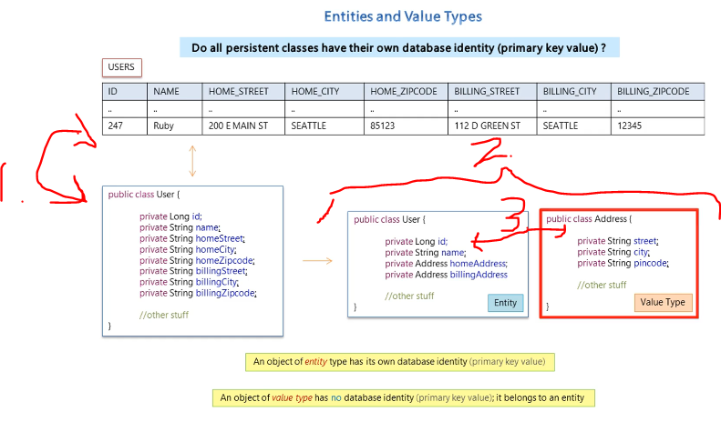

# Section 04: Mapping Concepts.

Mapping Concepts.

# What I Learned.

# 19. Aggregation and Composition.

- **Aggregation** → **Whole** and **its Parts**.

1. **Band** is **whole** and is made from **Parts** of **Artists**.
2. **Aggregation**, when whole is **destroyed** its **children** are **NOT** destroyed.

1. In the **Composition**, when **whole** is **destroyed**, then its children **ARE** destroyed.

- This indicates **strong** form of **aggregation**.

2. When the **house** is destroyed then the **rooms** are also destroyed.
3. **NOTICE** the parts may not be shared. 
    - Example, the rooms are not shared with your neighbor.

- This is in general:
> This is an **object-oriented design concept**.
> It means building an entity out of smaller parts (components).

# 20. Entities and Value Types.

> [!NOTE]
> How does the **Persistent classes** have the identity?

1. If in **Database** the **ID** is at present, how can this in **Java classes**. You could present whole table as full class, but its rather bad OOP design.
2. We would **brake** the class into **smaller pieces**.
3. Is the `id` part of `User` or `Address` field, which one **owns** the identity.
    - That depends, if user cares about **identifying** **User** uniquely or **Address**.

- Object that has **Database Identity Type**, are called `Entity` types.
    - And those who does **NOT** have **Database Identity Type**, are called **VALUE TYPE**. These belong to the entity.
- In this example, the **User** it has **Database Identity**, it's called **Entity** and the **Address** does not have **Identity**, so it's called **Value type**.

1. **Value types** are belonging, to the **Entity** type.
    - **Value types** are identified **thought** the **Entity**.

- If the **User** is deleted, then all the **Addresses** are deleted.

2. They cannot be **referenced** by other **Entity types**. Entity cannot reference **Entity**.
    - It can be done only by the Entity that its being owned by.

3. The Object of the **Entity** can be referenced.

1. Most simple **Values types** from Java are **String** and **Integer**.

1. If you would need, **UID** `Adress`, you would need add `id`.
    - So, its **designers** choice, whether you make Object **Value type** or **Entity type**.
2. You can ask yourself about `Does the database identity of an object matters?`

1. Example, the **Integer** is being owned by **Object**.

1. You could think that `Address` in the **Shopping App**, does not need `ID` it would be **Value Type**, but in **Real Estate Search Engine** this should be identified with `ID`, so it would be **Entity Type**.
    - In search engine it would be critical information.
    
# 21. Component Mapping.

1. Component is **part** of a **whole**. 
2. If **whole** is destroyed the **parts** of it are also destroyed. 
3. These smaller one are not shared. Example the rooms cannot be shared with your neighbors.
4. `coponent` is referring to **Java composition relationship** from OOP concept. In this context this will be included to the whole **Java** object. In **Hibernate** this will be persisted as **value type**.
    - It exists only for the **Entity** who owns it.
5. **Notice** the component does not have **identity**!
    - It cannot be `Entity`.

- In **SQL** it's related to the `SQL columns` and in **Hibenrate** it's related to the `classes` to make composition.

1. We are mapping **two classes** to the **one** database table.

1. So, we can notice that `AdDress` is included into the `Person` table.
2. We can also notice that, Entity outside cannot refer to the **Type object** inside it.

1. We mark the **persistence component class** with the `@Embeddable` for the Entity.
    - Notice no `ID` can be found here!
2. Also, we add this to the parent object who owns it `@Embedded`.

1. You just need to add the **configuration** for the file.

1. Just like in `.xml` mapping.

1. Who decided about **schema** about this database table?

1. We never instructed the mapping to the **Hibernate**.

# 22. Lab Exercise - Component Mapping.