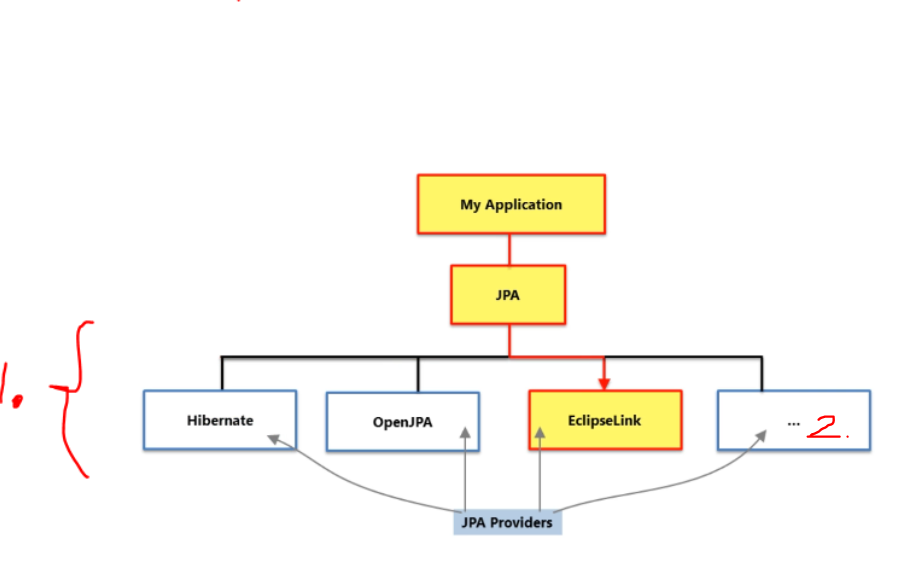
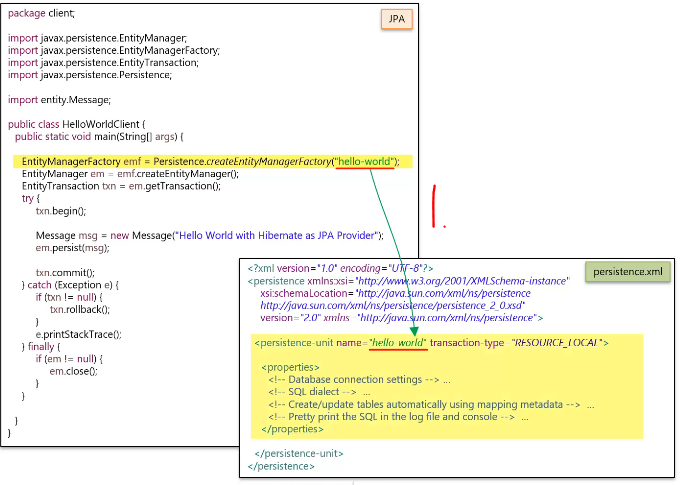

# Section 05: Getting Started with JPA.

Getting Started with JPA.

# What I Learned.

# What is JPA.


1. **JPA** is just **specification** that frameworks tries to implement, to called **JPA compatible**.
2. **Hibernate** is object relational mapping framework. Hibernate provides **both** `interface` and `implementation`.
3. **JPA** provides interfaces, but **NO** implementation.
4. Any framework, who implements **JPA** is **JPA provider**.
    - **Hibernate** is one of such! So **Hibernate** has two ways to call framework related things:
        - **Hibernates API**.
        - **Hibernates JPA implementation API**.


1. There are multiple **non JPA** things in **Hibernate** that are quite useful!
2. We can get ultimate usefulness of the **Hibernate** using `unwrap()`.



- You could ask yourself what is the role of **JPA** if to **hibernate** provides all the functions?
    - If you **JPA** as interface provider, you could easily change to another vendor!

1. These vendors cans be seen here!
    - **DataNucleus** is a **JPA** provider!

# Hibernate as JPA Provider.

- We are going to use **Hibernate** as JPA provider.

- We want to get rid of following old notations. Example `Session session = HibernateUtil.getSessionFactory().openSession();`.
    - These are **Hibernate** specific things and to make **JPA** complaint, we would use `EntityManager` from **JPA**.


1. These are provided by **Hibernate**.
2. These are provided by **JPA**.
3. These are **replaced**, by the things that are provided by **JPA**.



1. We are using **Hibernates** way **Persistence Unit**, which is loaded and called `hello-world` is loaded.


1. With **Hibernate** we need to load `persistance.xml` from `META-INF` folder.

- Example of `Persistance.xml`.

```
<?xml version="1.0" encoding="UTF-8"?>
<persistence xmlns="https://jakarta.ee/xml/ns/persistence"
					xmlns:xsi="http://www.w3.org/2001/XMLSchema-instance"
					version="3.0"
					xsi:schemaLocation="https://jakarta.ee/xml/ns/persistence 
													 https://jakarta.ee/xml/ns/persistence/persistence_3_0.xsd">

	<persistence-unit name="hello-world" transaction-type="RESOURCE_LOCAL">
		<properties>
		
			<!-- Database connection settings -->
			<property name="jakarta.persistence.jdbc.driver" value="com.mysql.jdbc.Driver" />
			<property name="jakarta.persistence.jdbc.url" value="jdbc:mysql://localhost:3306/hello-world" />
			<property name="jakarta.persistence.jdbc.user" value="root" />
			<property name="jakarta.persistence.jdbc.password" value="password" />

			<!-- SQL dialect -->
			<property name="hibernate.dialect" value="org.hibernate.dialect.MySQLDialect" />
			
			<!-- Create/update tables automatically using mapping metadata -->
			<property name="hibernate.hbm2ddl.auto" value="update" />
			
			<!-- Pretty print the SQL in the log file and console -->
			<property name="hibernate.format_sql" value="true" />
		</properties>

	</persistence-unit>
</persistence>
```

- **JTA** allows the framework or container to provide and manage transactions for you.
    - We could provide the **JTA**.

- **Notice** also that there is no need to provide the **entities** here.
    - These are **automatically** identified.

- How was the **Hibernate** internals before `5.2`.


1. **Composition** - `EntityManagerImpl` contains the `Session`. Example in Java:

```
public class EntityManagerImpl {
    private Session session; // This is the "has a" relationship.
    ... Other variables here.
}
```

- How was the **Hibernate** internals after `5.2`.


1.  Example in Java `Session extends EntityManager`.
2. `SessionImpl` would implement both, `Session` and `EntityManager` interfaces.

> **Since Hibernate 5.2**, the **SessionImpl** class implements both **Session** and **EntityManager**,
meaning a Hibernate Session now has **all** EntityManager methods too.

- This would mean, with example:


1. You would need to cast Object.
2. Now the `EntityManager` would have inherited the into the `Session` Object. 

# Working with Objects.

- We will explore the lifestyle of the methods.
 


- Will be using following object.


1. **Transient object**, with `ID` value is `null`.


1. Soon as the `.persist()` is called. The object will be **Persistent Object**, and its will have database identity.


1. **Persistent Object** can be also created thought calling **lookup method**.
	- Example. `em.find(Message.class, 2L);`


1. Soon as the **Entity** is persisted it will turn into the **Persistent Object** and these, will be managed by **Entity Manager**.

2. What is this **Persistence Context**?
	- It is **First-level Cache**.
	- In this **Context** it will have also **Automatic Dirty Checking** feature.
3. What is the **Cache**?
	- It is **copy of data**, where its data have been **pulled** from the database, but it's **living outside the database**.


1. Every time `EntityManager` or `Session object` has **Persistent Context**.
2. **Persistent Context** is represented as **First-level Cache**.


1. Once the `.getTransaction().commit()` is **committed** the database connection is closed.
	- It's still in **Persistent state** and managed by the **Persistent Context** or in **JPA** world its managed by the **Entity Manager**.


1. When `.close` is called, the state will become **detached** and no longer handled by the **Entity Manger**.


1. After the `EntityManger` is `.closed()` and `Message`field gets
 **updated**, it will only update in **Java memory** and does not have any connection to the database. 
	- We will only modify its state in **Detached mode**.


1. We can **attach** a detached entity, with the `.merge(message)`.
	- Pass the **reference** to it.


1. If **detached object** `id` is `1L`, it will first check from **Persistence Context** if its present there.


1. It will **perform** lookup method, for given `id` is `1L`.
2. **Notice** the **content** of messages, another has `"hi"` and another one `"hello"`. 


1. The **message** is copied to the object inside **Persistence Context**.


1. When the `.commit()` is executed, the state will be **dirty checked**, and it will be noticed that `Message` **Object** has been changed.
2. The **update** will be executed to for that.


1. New **value** is updated in database.

- We can manually **Detach Objects**, with the `detach()` method. Below example:


1. We get `1L` from **database**.


1. Soon as we call the `.detach()`, the `Message` object changes to the **Detached State**.
	- ❌NEVER❌ **Delete** Detached Object. Example Below:


1. We call `em.remove(message)`, it will throw `IllegalArgumentException`.
	- **Detached Object** ❌cannot❌ be **deleted**!
		- To delete object it needs to be in **Persistence State**.

# Lab Exercise - Working with Objects.


# Caching Objects.