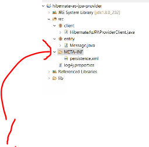
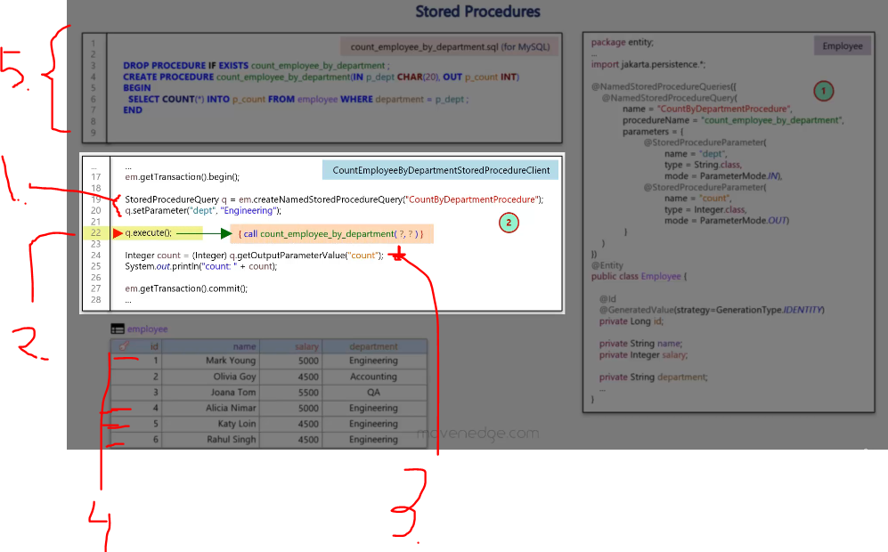
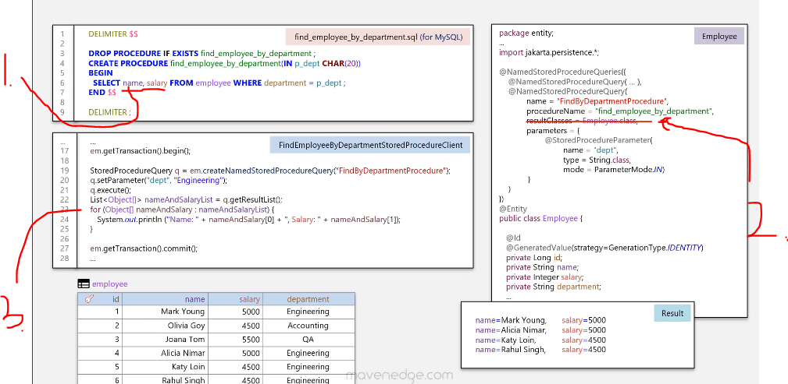
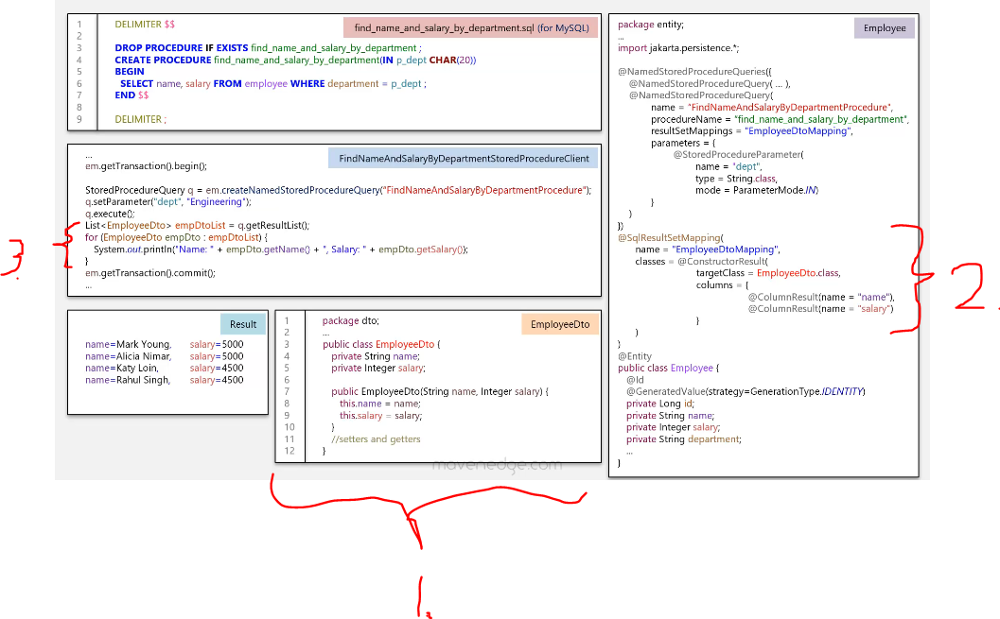
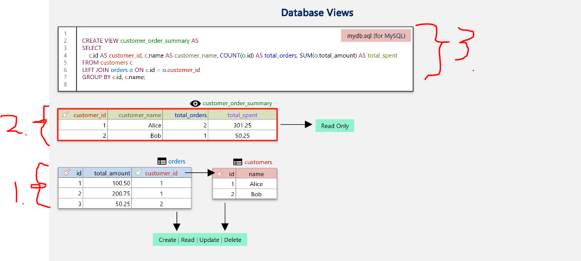
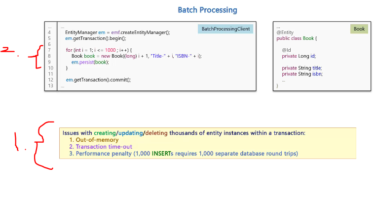
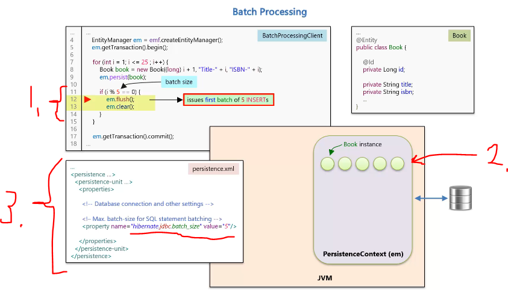
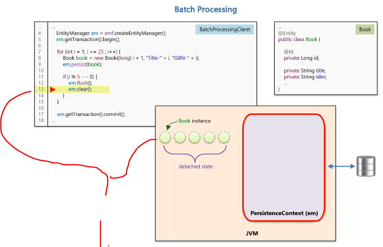
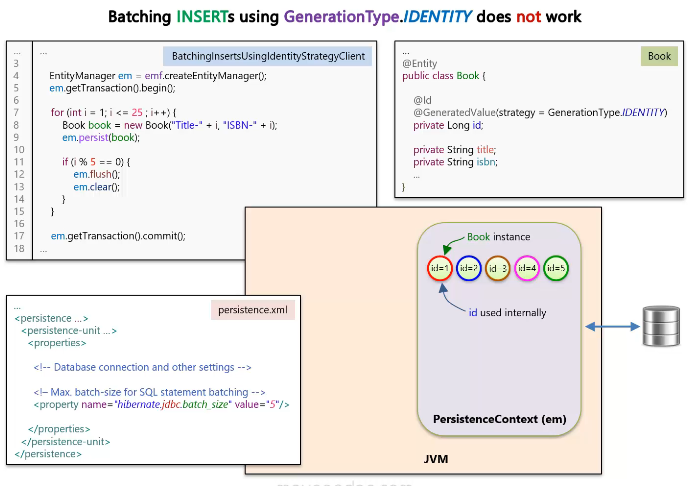

# Section 05: Getting Started with JPA.

Getting Started with JPA.

# What I Learned.

# What is JPA.


1. **JPA** is just **specification** that frameworks tries to implement, to called **JPA compatible**.
2. **Hibernate** is object relational mapping framework. Hibernate provides **both** `interface` and `implementation`.
3. **JPA** provides interfaces, but **NO** implementation.
4. Any framework, who implements **JPA** is **JPA provider**.
    - **Hibernate** is one of such! So **Hibernate** has two ways to call framework related things:
        - **Hibernates API**.
        - **Hibernates JPA implementation API**.


1. There are multiple **non JPA** things in **Hibernate** that are quite useful!
2. We can get ultimate usefulness of the **Hibernate** using `unwrap()`.


- You could ask yourself what is the role of **JPA**, if the **Hibernate** provides all the functions already?
    - If you implement the **JPA** as **interface provider**, you could easily change to another vendor, when there is need to change underlying **JPA provider**!
		- Since they follow same **marking** style.

1. These are some vendors, that can be seen here!
2. There can be **DataNucleus** as **JPA** provider! Keep going **Kide systems**.
	- [Home Page](https://www.datanucleus.org/).

> [!IMPORTANT]  
> **Kide** taught me practical usage of the **JPA**(**DataNucleus**).

<div align="center">
	
</div>


# Hibernate as JPA Provider.

- We are going to use **Hibernate** as JPA provider.

- We want to get rid of following old notations. Example `Session session = HibernateUtil.getSessionFactory().openSession();`.
    - These are **Hibernate** specific things and to make **JPA** complaint, we would use `EntityManager` from **JPA**.


1. These are provided by **Hibernate**.
2. These are provided by **JPA**.
3. These are **replaced**, by the things that are provided by **JPA**.


1. We are using **Hibernates** way **Persistence Unit**, which is loaded and called `hello-world` is loaded.



1. With **Hibernate** we need to load `persistance.xml` from `META-INF` folder.

- Example of `Persistance.xml`.

```
<?xml version="1.0" encoding="UTF-8"?>
<persistence xmlns="https://jakarta.ee/xml/ns/persistence"
					xmlns:xsi="http://www.w3.org/2001/XMLSchema-instance"
					version="3.0"
					xsi:schemaLocation="https://jakarta.ee/xml/ns/persistence 
													 https://jakarta.ee/xml/ns/persistence/persistence_3_0.xsd">

	<persistence-unit name="hello-world" transaction-type="RESOURCE_LOCAL">
		<properties>
		
			<!-- Database connection settings -->
			<property name="jakarta.persistence.jdbc.driver" value="com.mysql.jdbc.Driver" />
			<property name="jakarta.persistence.jdbc.url" value="jdbc:mysql://localhost:3306/hello-world" />
			<property name="jakarta.persistence.jdbc.user" value="root" />
			<property name="jakarta.persistence.jdbc.password" value="password" />

			<!-- SQL dialect -->
			<property name="hibernate.dialect" value="org.hibernate.dialect.MySQLDialect" />
			
			<!-- Create/update tables automatically using mapping metadata -->
			<property name="hibernate.hbm2ddl.auto" value="update" />
			
			<!-- Pretty print the SQL in the log file and console -->
			<property name="hibernate.format_sql" value="true" />
		</properties>

	</persistence-unit>
</persistence>
```

- **JTA** allows the framework or container to provide and manage transactions for you.
    - We could provide the **JTA**.

- **Notice** also that there is no need to provide the **entities** here.
    - These are **automatically** identified.

- How was the **Hibernate** internals before `5.2`.


1. **Composition** - `EntityManagerImpl` contains the `Session`. Example in Java:

```
public class EntityManagerImpl {
    private Session session; // This is the "has a" relationship.
    ... Other variables here.
}
```

- How was the **Hibernate** internals after `5.2`.


1.  Example in Java `Session extends EntityManager`.
2. `SessionImpl` would implement both, `Session` and `EntityManager` interfaces.

> **Since Hibernate 5.2**, the **SessionImpl** class implements both **Session** and **EntityManager**,
meaning a Hibernate Session now has **all** EntityManager methods too.

- This would mean, with example:


1. You would need to cast Object.
2. Now the `EntityManager` would have inherited the into the `Session` Object. 

# Working with Objects.

- We will explore the lifestyle of the methods.
 


- Will be using following object.


1. **Transient object**, with `ID` value is `null`.


1. Soon as the `.persist()` is called. The object will be **Persistent Object**, and its will have database identity.


1. **Persistent Object** can be also created thought calling **lookup method**.
	- Example. `em.find(Message.class, 2L);`


1. Soon as the **Entity** is persisted it will turn into the **Persistent Object** and these, will be managed by **Entity Manager**.

2. What is this **Persistence Context**?
	- It is **First-level Cache**.
	- In this **Context** it will have also **Automatic Dirty Checking** feature.
3. What is the **Cache**?
	- It is **copy of data**, where its data have been **pulled** from the database, but it's **living outside the database**.


1. Every time `EntityManager` or `Session object` has **Persistent Context**.
2. **Persistent Context** is represented as **First-level Cache**.


1. Once the `.getTransaction().commit()` is **committed** the database connection is closed.
	- It's still in **Persistent state** and managed by the **Persistent Context** or in **JPA** world its managed by the **Entity Manager**.


1. When `.close` is called, the state will become **detached** and no longer handled by the **Entity Manger**.


1. After the `EntityManger` is `.closed()` and `Message`field gets
 **updated**, it will only update in **Java memory** and does not have any connection to the database. 
	- We will only modify its state in **Detached mode**.


1. We can **attach** a detached entity, with the `.merge(message)`.
	- Pass the **reference** to it.


1. If **detached object** `id` is `1L`, it will first check from **Persistence Context** if its present there.


1. It will **perform** lookup method, for given `id` is `1L`.
2. **Notice** the **content** of messages, another has `"hi"` and another one `"hello"`. 


1. The **message** is copied to the object inside **Persistence Context**.


1. When the `.commit()` is executed, the state will be **dirty checked**, and it will be noticed that `Message` **Object** has been changed.
2. The **update** will be executed to for that.


1. New **value** is updated in database.

- We can manually **Detach Objects**, with the `detach()` method. Below example:


1. We get `1L` from **database**.


1. Soon as we call the `.detach()`, the `Message` object changes to the **Detached State**.
	- ❌NEVER❌ **Delete** Detached Object. Example Below:


1. We call `em.remove(message)`, it will throw `IllegalArgumentException`.
	- **Detached Object** ❌cannot❌ be **deleted**!
		- To delete object it needs to be in **Persistence State**.


1. When we delete this in the **Persistence Context**.


1. The `Message` object gets removed from the **Persistence Context** and its state turns into **removed state**.


1. Once the `em.getTransaction().commit();` the **delete statement** gets executed and following line will be deleted form the database.


- TODO make notes about this state transfer.

# Lab Exercise - Working with Objects.

- Todo. 


# Caching Objects.

> [!NOTE]
> What is the cache?

- **Cache** is **internal thing**, it is hard to grasp from the **coding perspective**.
	- This is not exposed trough **JPA API**.


1. Cache is a **copy of data**, outside the database.
	
- The principle of **caching persistence object** is when the **Object** is queried first time from the database, the **copy** of it will be stored in the **cache**.
	- **Subsequent** reading of such object will be read from the cache.

2. When **querying** the `Message` object from the database, following **SQL** will be executed. 


1. When `.find(Message.class, 7L)` will be executed for the **second time**, the **Object** is not queried from the database. Rather than its retrieved from **Cache**.
	- **EntityManager** has cache.


1. There will be **two separate** select statements issued, for each a`EntityManger`.
	- Notice the same `ID` values `7L`.


1. **Hibernate** by default does not cache **persistent objects** between `EntityManagers`.
	- This is called **First-level Caching**.

# Lab Exercise - Caching Objects (covers more on PersistenceContext).


- **Question 1:**
	- **Answer:** Entity.

```
Question 1: What will be the result of executing the following Question1Client given below? Choose the correct option(s).
```

# Stored Procedures.

- How to **map** and **call Stored Procedure** from `EntityManger`.


1. We want to call **Stored Procedure**. 
2. How can we call the `count_employee_by_department` stored procedure.


1. We are using the following block of code to define **stored procedure**.
2. We are using the `@NamedStoredProcedureQueries({})`
	- This for mapping or **storing procedures**.
		- We can map multiple **stored procedures**.

3. `@NameStoredProcedureQuery()` here the following configurations.
	- `name = "CountByDepartmentProcedure",` // Java-side name
    - `procedureName = "count_employee_by_department",` // DB-side procedure name
	- `@StoredProcedureParameter` Is defining what parameters are going to be used.


2. We're mapping **input** parameter, **SQL** `p_dept` into the Java to `dept`.
1. We're mapping **input** parameter, **SQL** `p_count` into the Java to `count`.



1. We are calling the procedure with the Java signature and we are setting the **input parameter**.
2. Then we are calling the procedure. **Notice** it would call the `count_employee_by_department` not the `CountByDepartmentProcedure`.
3. We are reading input parameter from the procedure.
4. This would return **4** from the procedure.
5. If this would be **executed** in SQL client, it would throw exception, for `;` delimiter it would interpret as it would end of the query.


1. To **MySql**, we are telling this as it would be "one line of code", with the `DELIMETER` keyword.
	- Notice the **before**:
		- `DELIMETER $$`.
	- And **after**:
		- `DELIMETER ;`.

- The **stored procedure**, what we are going to save into the database:
	- This example is `count_employee_by_department`.

```
DELIMITER $$


DROP PROCEDURE IF EXISTS count_employee_by_department;

CREATE PROCEDURE count_employee_by_department(IN p_dept CHAR(20), OUT p_count INT)
BEGIN  
  SELECT COUNT(*) INTO p_count FROM employee WHERE department = p_dept;    
END $$


DELIMITER ;

```

- And the calling client code as following:

```
package client;

import entity.Employee;
import jakarta.persistence.EntityManager;
import jakarta.persistence.EntityManagerFactory;
import jakarta.persistence.ParameterMode;
import jakarta.persistence.Persistence;
import jakarta.persistence.StoredProcedureQuery;

public class CountEmployeeByDepartmentStoredProcedureClient {
	public static void main(String[] args) {

		EntityManagerFactory emf = Persistence.createEntityManagerFactory("hello-world");
		EntityManager em = emf.createEntityManager();
		em.getTransaction().begin();		
		
		Employee emp1 = new Employee("Mark Young", 5000, "Engineering");
		Employee emp2 = new Employee("Olivia Goy", 4500, "Accounting");
		Employee emp3 = new Employee("Joana Tom", 5500, "QA");
		Employee emp4 = new Employee("Alicia Nimar", 5000, "Engineering");
		Employee emp5 = new Employee("Katy Loin", 4500, "Engineering");
		Employee emp6 = new Employee("Rahul Singh", 4500, "Engineering");
		
		em.persist(emp1);
		em.persist(emp2);
		em.persist(emp3);
		em.persist(emp4);
		em.persist(emp5);
		em.persist(emp6);
		
		em.getTransaction().commit();
		em.close();
		
		EntityManager em2 = emf.createEntityManager();
		em2.getTransaction().begin();
		
		//using named-stored-procedure (CountByDepartmentProcedure)
		StoredProcedureQuery q = em2.createNamedStoredProcedureQuery("CountByDepartmentProcedure");
		q.setParameter("dept", "Engineering");
		q.execute();
		Integer count = (Integer) q.getOutputParameterValue("count");
		System.out.println("count: " + count);
	
		
		//using stored-procedure (count_employee_by_department)
		/*
		StoredProcedureQuery q = em2.createStoredProcedureQuery("count_employee_by_department");
		q.registerStoredProcedureParameter("p_dept", String.class, ParameterMode.IN);
		q.registerStoredProcedureParameter("p_count", Integer.class, ParameterMode.OUT);
		q.setParameter("p_dept", "Engineering");
		q.execute();
		Integer count = (Integer) q.getOutputParameterValue("p_count");
		System.out.println("count: " + count);
		*/
		em2.getTransaction().commit();
		em2.close();		

	}

}
```

- We can see this client have been called the **stored procedure** and returning the number of engineering students correctly, `4`.

```
16:34:13,951 DEBUG SQL:131 - 
    {call count_employee_by_department(?,?)}
16:34:13,966 TRACE bind:28 - binding parameter [1] as [VARCHAR] - [Engineering]
count: 4
```

- We can also, use `named-stored-procedure`, this takes the **procedure** mapping out of the **Entity** and puts into the **client code**. 
	- We are defined it here.

```
	//using named-stored-procedure (CountByDepartmentProcedure)
		
		
		
		//using stored-procedure (count_employee_by_department)
		/*
		StoredProcedureQuery q = em2.createStoredProcedureQuery("count_employee_by_department");
		q.registerStoredProcedureParameter("p_dept", String.class, ParameterMode.IN);
		q.registerStoredProcedureParameter("p_count", Integer.class, ParameterMode.OUT);
		q.setParameter("p_dept", "Engineering");
		q.execute();
		Integer count = (Integer) q.getOutputParameterValue("p_count");
		System.out.println("count: " + count);
		*/
```

- We notice we get same answer:

```
16:54:23,931 DEBUG SQL:131 - 
    {call count_employee_by_department(?,?)}
16:54:23,947 TRACE bind:28 - binding parameter [1] as [VARCHAR] - [Engineering]
count: 4
```

- **Why use Stored Procedures**? We have **JDBC** programming!
	- **RDBMS highly optimized** for large volumes of data.
		- So if you are dealing with a lot of data, you might consider making the logic as **stored procedure**.
	- Data heavy complex operations.
	- Save database round trips.
		- Also, save one round trip to database.
	- Performance.

- Example of `find_employee_by_department` procedure.

```
DELIMITER $$
DROP PROCEDURE IF EXISTS find_employee_by_department;
CREATE PROCEDURE find_employee_by_department(IN p_dept CHAR(20))
BEGIN
    SELECT * FROM employee WHERE department = p_dept;
END $$
DELIMITER ;
```


1. We are returning **result set**.
2. We want to map this result to the `Employee.class`.
3. Here is the result what we are going to get. 

> [!TIP]
> The **Result Set**, is called such, because result set refers to the set of **rows** (or "records") returned by a query.


- The client code what we are executing:

```
package client;

import java.util.List;

import entity.Employee;
import jakarta.persistence.EntityManager;
import jakarta.persistence.EntityManagerFactory;
import jakarta.persistence.ParameterMode;
import jakarta.persistence.Persistence;
import jakarta.persistence.StoredProcedureQuery;

public class FindEmployeeByDepartmentStoredProcedureClient {
	@SuppressWarnings("unchecked")
	public static void main(String[] args) {

		EntityManagerFactory emf = Persistence.createEntityManagerFactory("hello-world");
		EntityManager em = emf.createEntityManager();
		em.getTransaction().begin();		
		
		Employee emp1 = new Employee("Mark Young", 5000, "Engineering");
		Employee emp2 = new Employee("Olivia Goy", 4500, "Accounting");
		Employee emp3 = new Employee("Joana Tom", 5500, "QA");
		Employee emp4 = new Employee("Alicia Nimar", 5000, "Engineering");
		Employee emp5 = new Employee("Katy Loin", 4500, "Engineering");
		Employee emp6 = new Employee("Rahul Singh", 4500, "Engineering");
		
		em.persist(emp1);
		em.persist(emp2);
		em.persist(emp3);
		em.persist(emp4);
		em.persist(emp5);
		em.persist(emp6);
		
		em.getTransaction().commit();
		em.close();
		
		EntityManager em2 = emf.createEntityManager();
		em2.getTransaction().begin();
		
		//using named-stored-procedure (FindByDepartmentProcedure)
		StoredProcedureQuery q = em2.createNamedStoredProcedureQuery("FindByDepartmentProcedure");
		q.setParameter("dept", "Engineering");
		q.execute();
		List<Employee> empList = q.getResultList();
		for (Employee employee : empList) {
			System.out.println(employee);
		}
		
		//using stored-procedure (find_employee_by_department)
		/*
		StoredProcedureQuery q = em2.createStoredProcedureQuery("find_employee_by_department", Employee.class);
		q.registerStoredProcedureParameter("p_dept", String.class, ParameterMode.IN);
		q.setParameter("p_dept", "Engineering");
		q.execute();
		List<Employee> empList = q.getResultList();
		for (Employee employee : empList) {
			System.out.println(employee);
		}		
		*/
		em2.getTransaction().commit();
		em2.close();
	}

}
```

- We are getting same amount of people from the **Engineering department**.


```
17:29:03,816 DEBUG SQL:131 - 
    {call find_employee_by_department(?)}
17:29:03,835 TRACE bind:28 - binding parameter [1] as [VARCHAR] - [Engineering]
Employee [id=1, name=Mark Young, salary=5000, department=Engineering]
Employee [id=4, name=Alicia Nimar, salary=5000, department=Engineering]
Employee [id=5, name=Katy Loin, salary=4500, department=Engineering]
Employee [id=6, name=Rahul Singh, salary=4500, department=Engineering]
```

- Example of `find_name_and_salary_by_department`. 

```
DELIMITER $$


DROP PROCEDURE IF EXISTS find_name_and_salary_by_department;

CREATE PROCEDURE find_name_and_salary_by_department(IN p_dept CHAR(20))
BEGIN  
  SELECT name, salary FROM employee WHERE department = p_dept;    
END $$


DELIMITER ;
```

- If we want to return `name` and `salary` data, not the whole list. 



1. We **Define** the two fields what we are returning.
2. We cannot have **Result.class** anymore. 
	- The result of **query** will be `Object[]`.
3. We need to change the return type.

- We are getting same amount of people from the **Engineering department**, but the query is **partial**.

```
18:32:58,990 DEBUG SQL:131 - 
    {call find_name_and_salary_by_department(?)}
18:32:59,020 TRACE bind:28 - binding parameter [1] as [VARCHAR] - [Engineering]
Name: Mark Young, Salary: 5000
Name: Alicia Nimar, Salary: 5000
Name: Katy Loin, Salary: 4500
Name: Rahul Singh, Salary: 4500

```

- There is a better way to deal with the `Object[]` returning.



1. This is done using **DTO Objects**. It is used to **transfer data** from another palace to another. 
2. We are using following **mapping** for the **DTO**:

```
@SqlResultSetMapping(
		name = "EmployeeDtoMapping",
		classes = @ConstructorResult(
							targetClass = EmployeeDto.class,
							columns = {
												@ColumnResult(name = "name"),
												@ColumnResult(name = "salary")
							}
					)
)
```

- And add this, for the query in **DTO**: 

```
    @NamedStoredProcedureQuery(
            name = "FindNameAndSalaryByDepartmentProcedure",
            procedureName = "find_name_and_salary_by_department",
            resultSetMappings = "EmployeeDtoMapping",
            parameters = {
                    @StoredProcedureParameter(
                            name = "dept",
                            type = String.class,
                            mode = ParameterMode.IN)
            }
    )
```

3. We could operate thought **DTO**, as such. 

# Database Views.



1. Current situation in the **Database**
	- **Create**, **Read**, **Update** and **Delete** for the database operations.
		
2. We will have the following data coming out for the **View**.
	- Summary could be expanding multiple tables.
		- Read only for the **views**
3. The **View** is **pre-defined** query, saved in the **database**.
	- **Query Execution** can be **optimized** by the database engine. 

# Batch Processing.



1. We want to use **batch processing**, when there is **huge amount** of queries to be processed **within transaction**. This helps with:
	- **Out-of-memory** issues.
	- **Transaction time-out**.
	- **Performance penalty** `(1,000 INSERTs requires 1,000 separate database round trips)`.
		- You would want to **lower** this number!

- Idea here is that, we don't want to process in **one go**, we rather use **smaller batches**.
	- Batches contains part of the data.
2. We process here one by one!


1. All the **25** `Book` Objects are **persisted** into the **PersistenceContext**, and we can only hope that:
	- Java memory does **not** run out. `Point 1.`.
	- Transaction does **not** time out, when all this is happening. `Point 2.`.

2. At line `12` all the **25** gets issued together.	
	- Each will have their own database trip.



1. When we are dealing within **Transaction**.
2. There will be **5** objects is going to be loaded into **PeristenceContext**, after the **Batch** is going to be inserted into the database. 
3. We should batch in **JDBC** level.
	- Batching in **JDBC** level means:

- **Without** batching:

```
INSERT INTO book (id, title, isbn) VALUES (1, 'A', 'ISBN-A');
--> Sent to DB
INSERT INTO book (id, title, isbn) VALUES (2, 'B', 'ISBN-B');
--> Sent to DB
INSERT INTO book (id, title, isbn) VALUES (3, 'C', 'ISBN-C');
--> Sent to DB
```

- **3** different trips for the database.

- **With** batching:

```
INSERT INTO book (id, title, isbn) VALUES (1, 'A', 'ISBN-A');
INSERT INTO book (id, title, isbn) VALUES (2, 'B', 'ISBN-B');
INSERT INTO book (id, title, isbn) VALUES (3, 'C', 'ISBN-C');
```

- **1** trip only, this is done in one trip.



1. `em.flush()` when the flush is getting executed the **PersistenceContext** is going to be **cleared** and the **Object** are moved into the **detached state**.
	- This is repeated till all the object are **persisted**

- In general the `em.flush()` **synchronizes** the **persistence context** to the database.

- The database code:

```
DROP DATABASE IF EXISTS batchprocessing; 
CREATE DATABASE batchprocessing; 
```

- We will have the following client code for the **batch processing**.

```
package client;

import entity.Book;
import jakarta.persistence.EntityManager;
import jakarta.persistence.EntityManagerFactory;
import jakarta.persistence.Persistence;

//Before running this example, enable IDENTITY id generation strategy in Book entity
public class BatchingInsertsUsingIdentityStrategyClient {
	public static void main(String[] args) {

		EntityManagerFactory emf = Persistence.createEntityManagerFactory("hello-world");
		EntityManager em = emf.createEntityManager();
		em.getTransaction().begin();		
		
	    for (int i = 1; i <= 25; i++) {
	    	Book book = new Book("Title-" + i, "ISBN-" + i);
	        em.persist(book);
	        
	        if (i % 5 == 0) {
	            em.flush();
	            em.clear();
	            System.out.println();
	        }
	    }
		
		em.getTransaction().commit();
		em.close();	
		
	}
}
```

- We can see that the **batch** have been executed **5** times.

```
17:36:56,284 DEBUG SQL:131 - insert into Book (isbn,title,id) values (?,?,?)
17:36:56,288 DEBUG SQL:131 - insert into Book (isbn,title,id) values (?,?,?)
17:36:56,288 DEBUG SQL:131 - insert into Book (isbn,title,id) values (?,?,?)
17:36:56,289 DEBUG SQL:131 - insert into Book (isbn,title,id) values (?,?,?)
17:36:56,289 DEBUG SQL:131 - insert into Book (isbn,title,id) values (?,?,?)

17:36:56,301 DEBUG SQL:131 - insert into Book (isbn,title,id) values (?,?,?)
17:36:56,302 DEBUG SQL:131 - insert into Book (isbn,title,id) values (?,?,?)
17:36:56,303 DEBUG SQL:131 - insert into Book (isbn,title,id) values (?,?,?)
17:36:56,303 DEBUG SQL:131 - insert into Book (isbn,title,id) values (?,?,?)
17:36:56,304 DEBUG SQL:131 - insert into Book (isbn,title,id) values (?,?,?)

17:36:56,309 DEBUG SQL:131 - insert into Book (isbn,title,id) values (?,?,?)
17:36:56,309 DEBUG SQL:131 - insert into Book (isbn,title,id) values (?,?,?)
17:36:56,310 DEBUG SQL:131 - insert into Book (isbn,title,id) values (?,?,?)
17:36:56,310 DEBUG SQL:131 - insert into Book (isbn,title,id) values (?,?,?)
17:36:56,311 DEBUG SQL:131 - insert into Book (isbn,title,id) values (?,?,?)

17:36:56,318 DEBUG SQL:131 - insert into Book (isbn,title,id) values (?,?,?)
17:36:56,318 DEBUG SQL:131 - insert into Book (isbn,title,id) values (?,?,?)
17:36:56,319 DEBUG SQL:131 - insert into Book (isbn,title,id) values (?,?,?)
17:36:56,320 DEBUG SQL:131 - insert into Book (isbn,title,id) values (?,?,?)
17:36:56,320 DEBUG SQL:131 - insert into Book (isbn,title,id) values (?,?,?)

17:36:56,327 DEBUG SQL:131 - insert into Book (isbn,title,id) values (?,?,?)
17:36:56,328 DEBUG SQL:131 - insert into Book (isbn,title,id) values (?,?,?)
17:36:56,329 DEBUG SQL:131 - insert into Book (isbn,title,id) values (?,?,?)
17:36:56,330 DEBUG SQL:131 - insert into Book (isbn,title,id) values (?,?,?)
17:36:56,330 DEBUG SQL:131 - insert into Book (isbn,title,id) values (?,?,?)

17:36:56,341  INFO StatisticalLoggingSessionEventListener:261 - Session Metrics {
    748500 nanoseconds spent acquiring 1 JDBC connections;
    634000 nanoseconds spent releasing 1 JDBC connections;
    24897700 nanoseconds spent preparing 5 JDBC statements;
    0 nanoseconds spent executing 0 JDBC statements;
    22780700 nanoseconds spent executing 5 JDBC batches;
    0 nanoseconds spent performing 0 L2C puts;
    0 nanoseconds spent performing 0 L2C hits;
    0 nanoseconds spent performing 0 L2C misses;
    89812700 nanoseconds spent executing 5 flushes (flushing a total of 25 entities and 0 collections);
    0 nanoseconds spent executing 0 partial-flushes (flushing a total of 0 entities and 0 collections)
}
```




- Todo tee tämä loppuun.