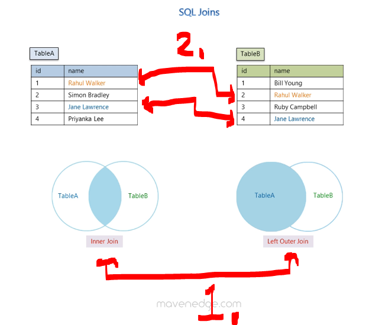
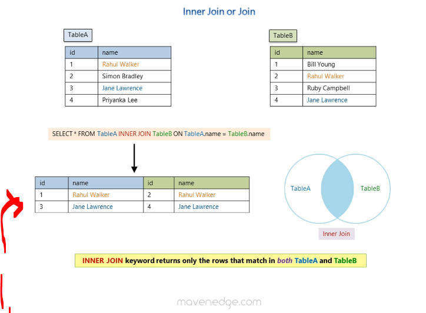
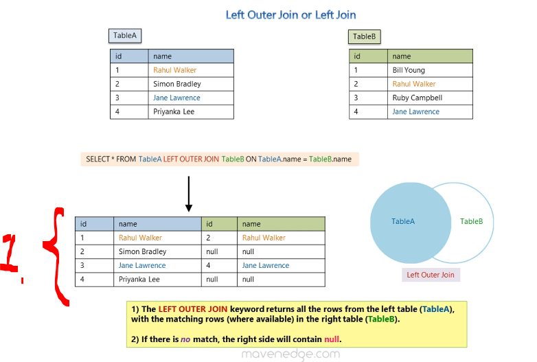
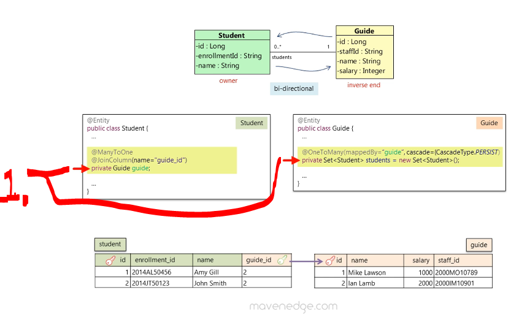

# Section 06: Fetching Strategies, Bytecode Enhancement and Equality.

Fetching Strategies, Bytecode Enhancement and Equality.

# What I Learned.

# SQL Joins (optional).

	

1. The **Inner Join** and **Left Outer Join** is the most common join!
2. There is also, some matching data in both columns!

	

1. **Inner Join** return matching data!

	

1. The Left Join container data from left table and matching data form the right table! 

	

1. Bidirectional relationship!

# Lazy Fetching.

# Lab Exercise - Lazy Fetching.

# @OrderBy.

# Bytecode Enhancement (Lazy Fetching Basic Attributes).

# Equals and HashCode.

# Lab Exercise - Equals and HashCode.

