# Section 13: N+1 SELECTs Problem, Batch Fetching and Entity Graphs.

N+1 SELECT's Problem, Batch Fetching and Entity Graphs.

# Learned what the N+1 Selects Problem is and why it causes unnecessary database queries and performance issues.

<div align="center">
    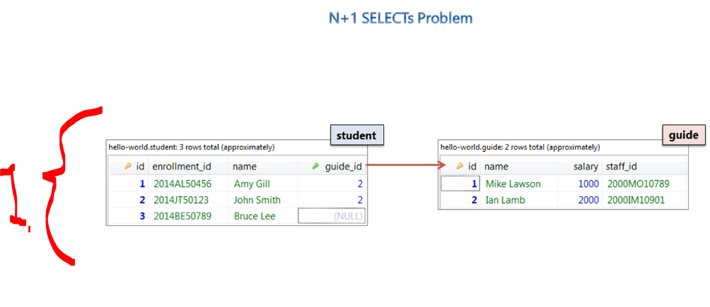
</div>

1. We will be covering the `n+1` problem. This is **very common** problem in the database field!
    - We will be having the following **data** inside the **table**!

### **student** table.

| id | enrollment_id | name       | guide_id |
|----|---------------|------------|----------|
| 1  | 2014AL50456   | Amy Gill   | 2        |
| 2  | 2014JT50123   | John Smith | 2        |
| 3  | 2014BE50789   | Bruce Lee  | NULL     |

### **guide** table.

| id | name         | salary | staff_id   |
|----|--------------|--------|------------|
| 1  | Mike Lawson  | 1000   | 2000MO10789 |
| 2  | Ian Lamb     | 2000   | 2000IM10901 |


<div align="center">
    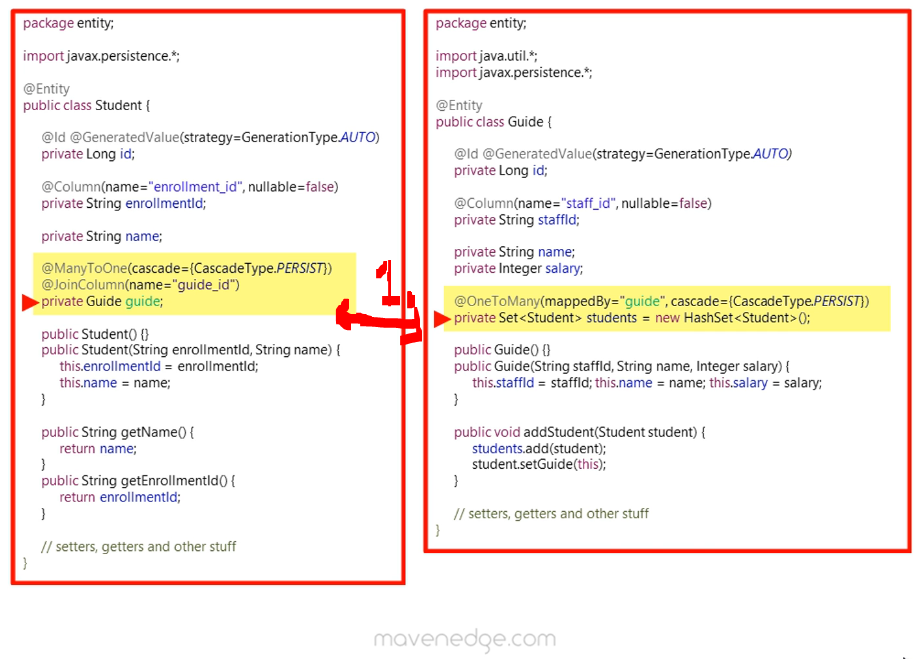
</div>

1. We have **one-to-many** relation shit!

<div align="center">
    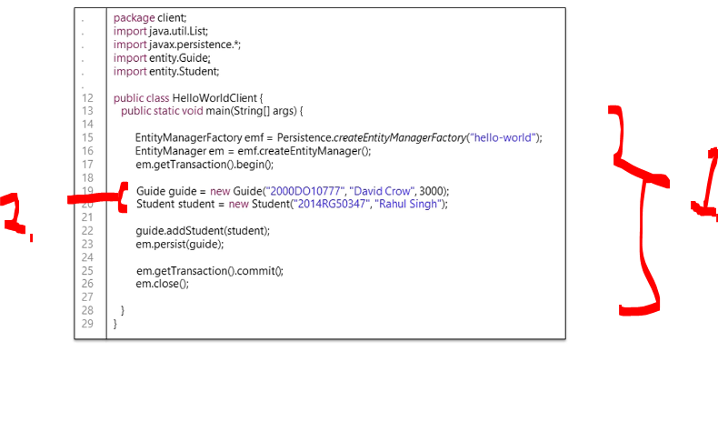
</div>

1. We will be having following **client** code:
    ````Java
    package client;
    import java.util.List;
    import javax.persistence.*;
    import entity.Guide;
    import entity.Student;

    public class HelloWorldClient {

        public static void main(String[] args) {

            EntityManagerFactory emf =
                    Persistence.createEntityManagerFactory("hello-world");
            EntityManager em = emf.createEntityManager();
            em.getTransaction().begin();

            Guide guide = new Guide("2000DO10777", "David Crow", 3000);
            Student student = new Student("2014RG50347", "Rahul Singh");

            guide.addStudent(student);
            em.persist(guide);

            em.getTransaction().commit();
            em.close();
        }
    }
    ````
2. We associate the **student** is added to the **guide**! 
    - At `.perisist(...)`, we have the **Guide** is persisted, with the associated **Student**'s with it!


- We will be having the following data persisted!

<div align="center">
    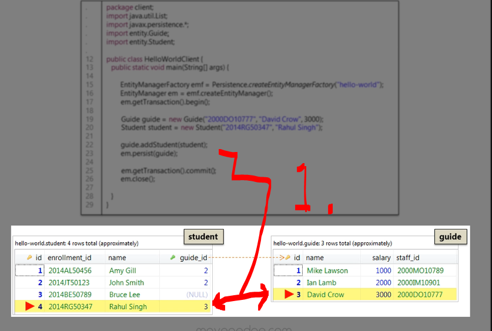
</div>

- Notice the current **data associations**!

<div align="center">
    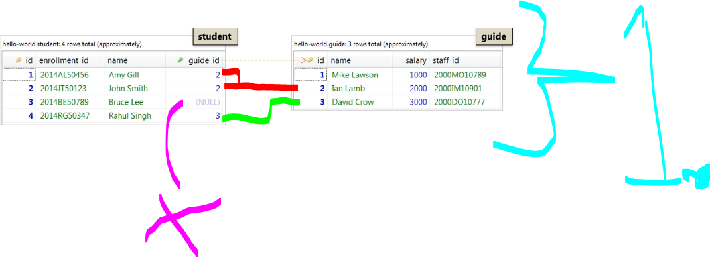
</div>

1. See the assignations:
    | Student     | guide_id | Associated Guide |
    | ----------- | -------- | ---------------- |
    | Amy Gill    | 2        | Ian Lamb         |
    | John Smith  | 2        | Ian Lamb         |
    | Bruce Lee   | NULL     | No Guide         |
    | Rahul Singh | 3        | David Crow       |

> [!NOTE]
> Let's have the following thought **experiment**:
> &nbsp;&nbsp;&nbsp;&nbsp; How would we **query** all the data from the **student** table? We would need the `name` of the student and the `enrollment_id`?

<div align="center">
    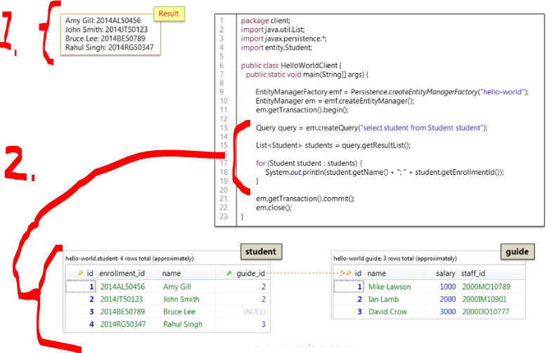
</div>

1. We would be wanting following data as **end result**!
    - We would need the `name` and `enrollment_id` from the table for retrieving all the data!
2. We will be asking every **student** form the `Student` table!
    - **JPQL** query fetches data from the student table and prints it.
        ````Java
        Query query = entityManager.createQuery(
            "SELECT student FROM Student student"
        );
        ````
    - We will be processing these **one by one**:
        ````Java
        List<Student> students = query.getResultList();

        for (Student student : students) {
            System.out.println(student.getName() + ":" + student.getEnrollmentId());
        }
        ````

<details>
<summary id="Deadlock_Fixed_Railroad_Traffic_Control_Example" open="true"> <b>Code illustrating the FetchType.EAGER in action!</b> </summary>

````Java
package client;

import java.util.List;
import javax.persistence.*;
import entity.Student;

public class HelloWorldClient {

    public static void main(String[] args) {

        EntityManagerFactory emf =
                Persistence.createEntityManagerFactory("hello-world");
        EntityManager em = emf.createEntityManager();
        em.getTransaction().begin();
        Query query =
                em.createQuery("select student from Student student");
        List<Student> students = query.getResultList();

        for (Student student : students) {
            System.out.println(
                student.getName() + " : " + student.getEnrollmentId()
            );
        }

        em.getTransaction().commit();
        em.close();
    }
}
````
</details> 

<div align="center">
    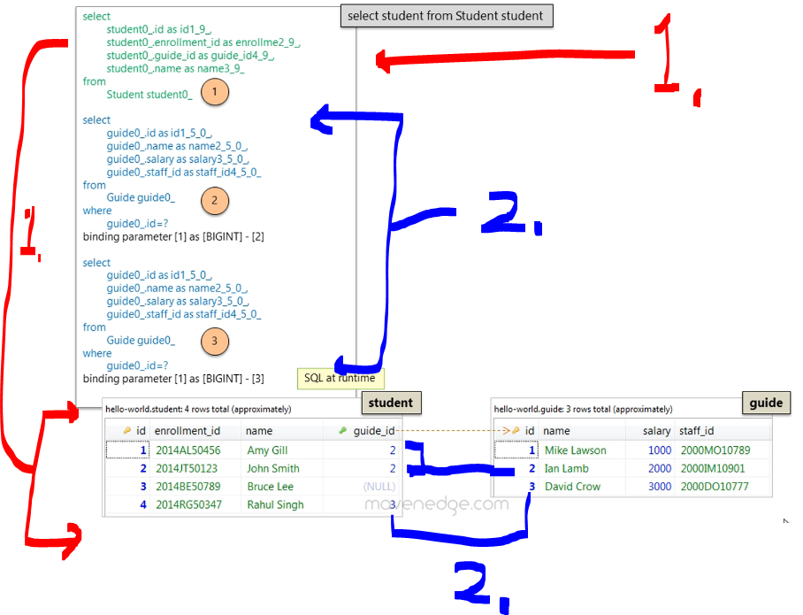
</div>

1. We can see to hibernate is creating internally the select statement!
    - We would be satisfied the first statement data, against the `Student` table!
2. Why would we need these two select queries more?
    - `2.` Is querying the `Guide` table with **ID 2**.
    - `3.` Is querying the `Guide` table with **ID 3**.

> [!CAUTION]
> There is nothing wrong with our statement `select student from Student student`, which we have written! Then why we are getting these **two** extra statements `2.` and `3.`!

<div align="center">
    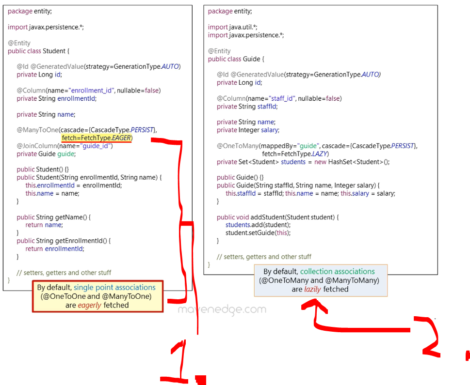
</div>

<details>
<summary id="Deadlock_Fixed_Railroad_Traffic_Control_Example" open="true"> <b>Code for the Entities, where we are seeing the different FETCH types!</b> </summary>

````Java
package entity;
import javax.persistence.*;

@Entity
public class Student {

    @Id
    @GeneratedValue(strategy = GenerationType.AUTO)
    private Long id;

    @Column(name = "enrollment_id", nullable = false)
    private String enrollmentId;

    private String name;

    @ManyToOne(
        cascade = { CascadeType.PERSIST },
        fetch = FetchType.EAGER
    )
    @JoinColumn(name = "guide_id")
    private Guide guide;

    public Student() {
    }

    public Student(String enrollmentId, String name) {
        this.enrollmentId = enrollmentId;
        this.name = name;
    }

    public String getName() {
        return name;
    }

    public String getEnrollmentId() {
        return enrollmentId;
    }

    // setters, getters and other stuff
}

package entity;

import java.util.*;
import javax.persistence.*;

@Entity
public class Guide {

    @Id
    @GeneratedValue(strategy = GenerationType.AUTO)
    private Long id;

    @Column(name = "staff_id", nullable = false)
    private String staffId;

    private String name;
    private Integer salary;

    @OneToMany(
        mappedBy = "guide",
        cascade = { CascadeType.PERSIST },
        fetch = FetchType.LAZY
    )
    private Set<Student> students = new HashSet<Student>();

    public Guide() {
    }

    public Guide(String staffId, String name, Integer salary) {
        this.staffId = staffId;
        this.name = name;
        this.salary = salary;
    }

    public void addStudent(Student student) {
        students.add(student);
        student.setGuide(this);
    }

    // setters, getters and other stuff
}
````
</details> 


1. By writing following `fetch = FetchType.EAGER`, when a **Student** is fetched from the database, its associated **Guide** is fetched immediately as well! In practice this would mean:
    ````Java
    Student student = entityManager.find(Student.class, 101L);
    ````
    - This would mean that, there will be **SQL executed**
    ````SQL
    SELECT * FROM Student WHERE id = 101;
    SELECT * FROM Guide WHERE id = 1;
    ````
2. `FetchType.LAZY` is to **load related data** is fetched only when you **first access it**. Rather than when the Data Object was queried!
    ````Java
    Order order = orderRepository.findById(1L).get();
    ````
    - This would mean that, there will be **SQL executed**
    ````SQL
    SELECT * FROM orders WHERE id = 1;
    ````

<div align="center">
    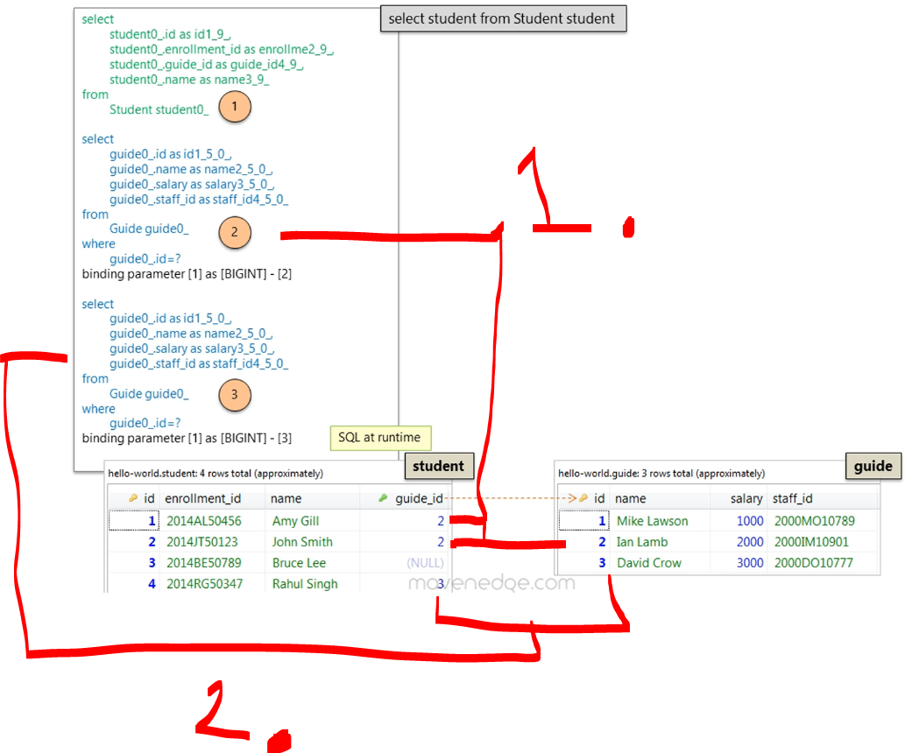
</div>

1. The reason why the **Guide** details are fetched since the there is `guide_id` with `2`, so this query gets executed when the **Student** get queried!
2. The reason why the **Guide** details are fetched since the there is `guide_id` with `3`, so this query gets executed when the **Student** get queried!


- Let's look these queries from **EntityManager** perspective: 

<div align="center">
    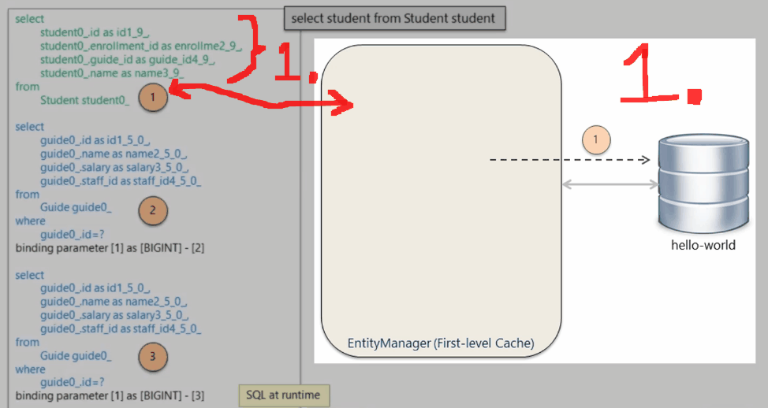
</div>

1. When **FIRST** JPQL is executed, the all the students are retrieved. This is managed by the **EntityManager**!
2. When **SECOND**, JPQL is executed, we are getting **Guide** with **ID** `1`. This is associated with the **Student** with **ID** `1`!
3. The **Student** with **ID** `2`, this is **NOT** making query to the database, since we have this present in the **First-level cache**! We will just associate with **Guide** with **ID** `2`.
4. When **THIRD**, JPQL is executed, we are getting **Guide** with **ID** `3`. This is associated with the **Student** with **ID** `4`!

<div align="center">
    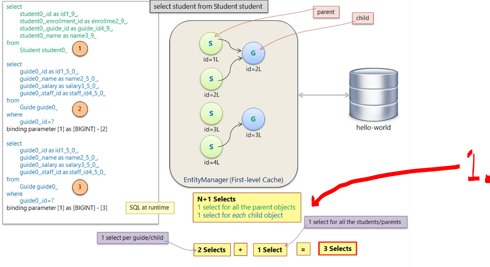
</div>

1. About selects:
    - We have **1 select** for **parent objects**.
    - We have **N select** for **child objects**.

<div align="center">
    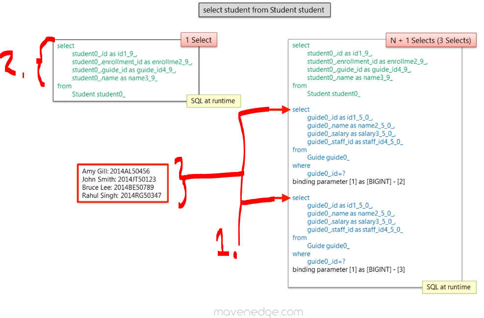
</div>

1. **N+1** problem is when we have to do **1 plus N** statements to retrieve same data! 
2. Which we could have done with **one select statement**!

<div align="center">
    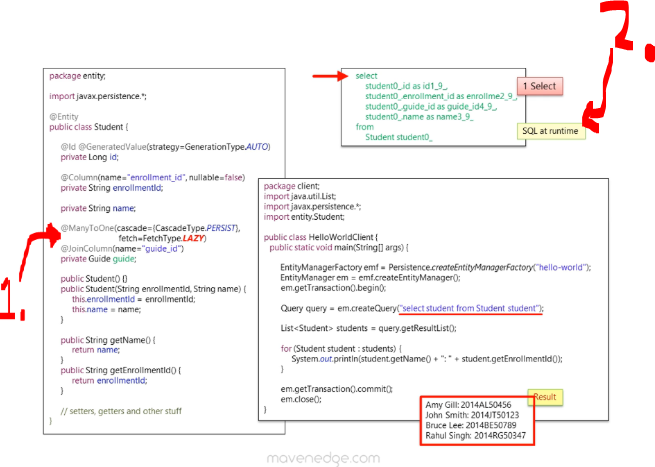
</div>

1. To fix this, we can change the `FetchType.EAGER` to `FetchType.LAZY`!
2. Now its loading only **one select statement**!

<div align="center">
    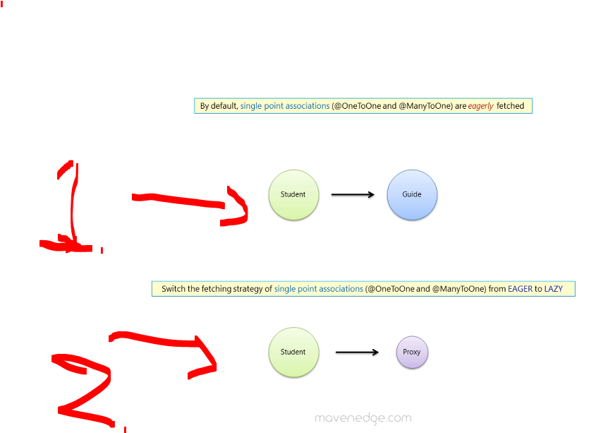
</div>

1. This is default behavior of fetching!
2. When changed we will be getting proxy of that **Guide**!

<div align="center">
    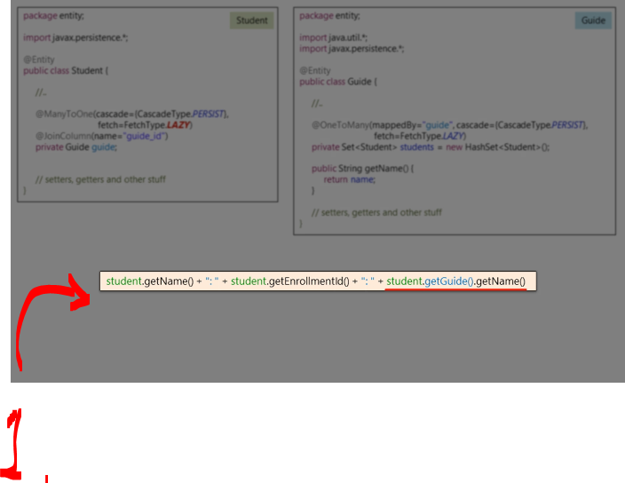
</div>

1. When we will be having the following data being retrieved, we will be having the same **n+1** problem!

<div align="center">
    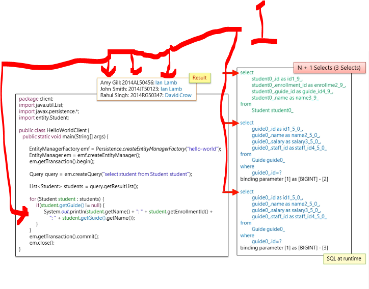
</div>

1. We will have same **n+1** problem, with this approach!
    - How we will be solving this one?
        - We cannot do the **Fetch** strategy problem!


- Cheeck the query language  chapter, get back here!

- add the chapter from the book here


<!-- - Fix the iD -->


<!-- 

ADd this to the end of the cpahter

<details>
<summary id="Deadlock_Fixed_Railroad_Traffic_Control_Example" open="true"> <b>Code from for the client, where we will illustrate the FetchType.EAGER!</b> </summary>

````Java
package client;

import java.util.List;
import javax.persistence.*;
import entity.Student;

public class HelloWorldClient {

    public static void main(String[] args) {

        EntityManagerFactory emf =
                Persistence.createEntityManagerFactory("hello-world");

        EntityManager em = emf.createEntityManager();
        em.getTransaction().begin();

        Query query = em.createQuery("select student from Student student");

        List<Student> students = query.getResultList();

        for (Student student : students) {
            System.out.println(
                    student.getName() + " : " + student.getEnrollmentId()
            );
        }

        em.getTransaction().commit();
        em.close();
    }
}
````
</details> -->

# Practiced identifying and reproducing the N+1 Selects Problem through a hands-on lab exercise.

# Learned how Batch Fetching reduces the number of SQL queries by loading related entities in batches.

# Implemented Batch Fetching in a lab exercise to optimize data retrieval.

# Learned how to useEntity Graphs to explicitly control entity fetching and avoid over-fetching or under-fetching.

# Applied Entity Graphs in a practical lab exercise.

# Reinforced my understanding of solving performance issues using N+1 prevention techniques, Batch Fetching, and Entity Graphs through the section quiz.