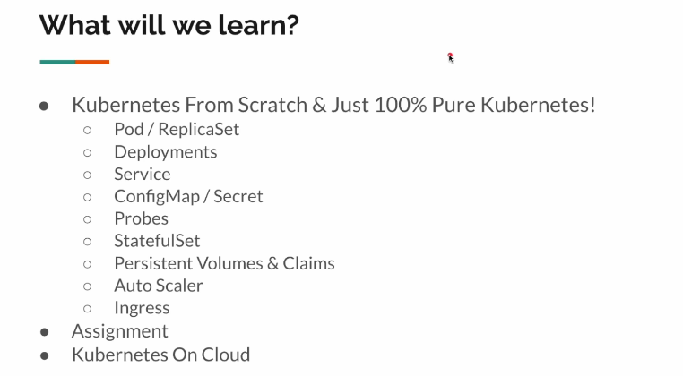
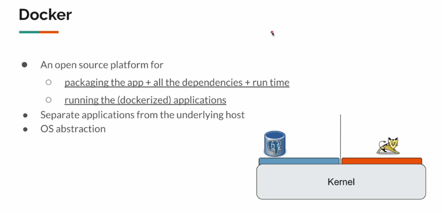
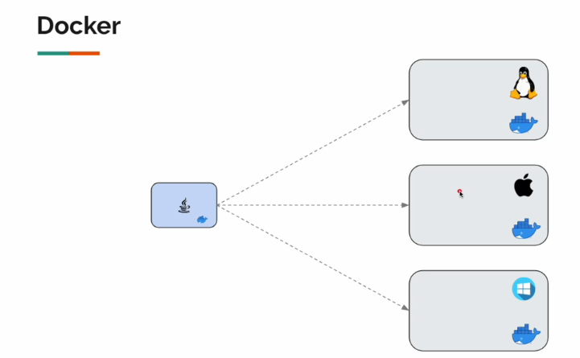
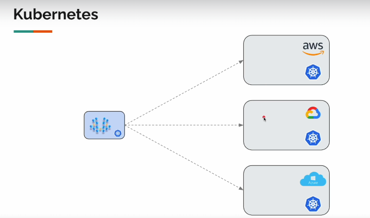
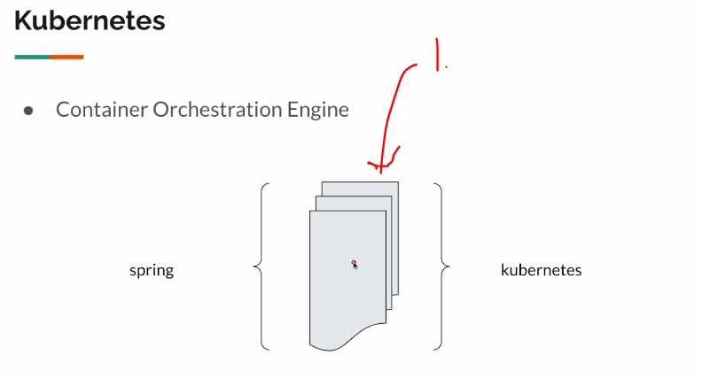
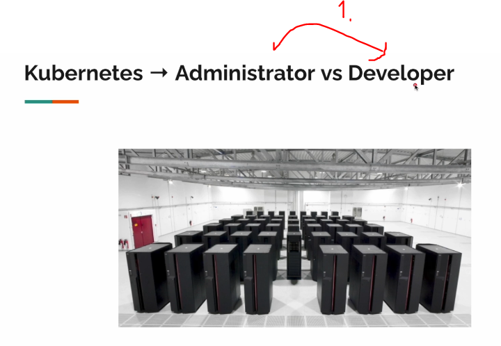

# Section 01: Introduction

Introduction.

# What I Learned.

# 1. Introduction.

- This is for Java Spring developers.
    - Docker improves development speed. 

1. This is mindset for developing applications.

1. You need to know these to proceed!

# 2. What is Kubernetes?

- Docker can be run, on any platform.

- **Local** to **Global**.
    - In seconds.

1.  Each is **service**.   
    - Kubernetes manages of these **services**. 

1. **Kubernetes** has two main roles.
    - **Administrator**.
    - **Developer**.