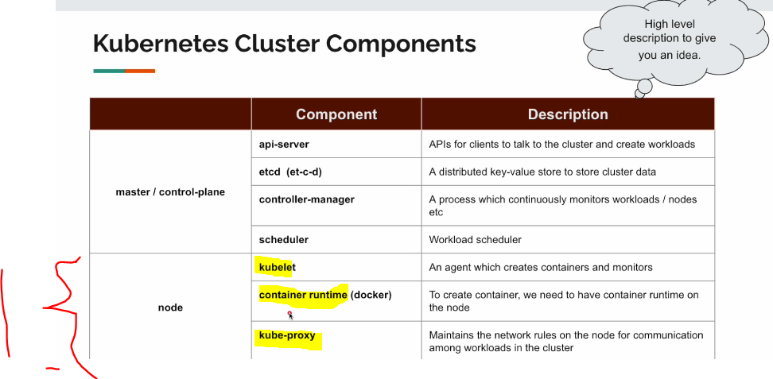
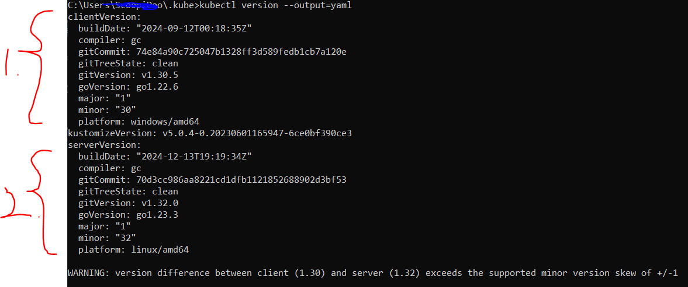
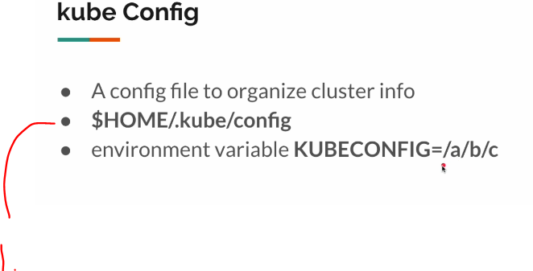

# Section 02: Kubernetes Cluster. 

Kubernetes Cluster.

# What I Learned.

# 4. Introduction.

- Kubernetes is big and complex.

# 5. Kubernetes Architecture - Master.


1. Kubernetes is cluster of machines.
    - We will run our application inside our cluster.
    


1. Usually you will have **one or more** **master/control-plane**. 
2. Many nodes.


1. **Master** has 4 **Components**.
    - Every of these will have different role.


Master node with the **4 components**:
1. **api-server**.
2. **etcd**.
3. **controller-manager**.
4. **scheduler**.

- We will always talk to the **api-server** as entry point.

- When sending request to **api-server**.
    1. **Validate** the request.
    2. **Etcd** will be saved the request.
        - This contains **cluster** information.
    3. **Scheduler** will be asked for the help.
        - **Scheduler** will be picking up nodes for the request.
    4. **controller-manager** will be managing the load.
        - Example, if there is some error with running nodes.

# 6. Kubernetes Architecture - Nodes.



1. Components of the **nodes**. You can think of operations that mimics **JRE world** of Java.


- Example of **request** where **app A** will be talking **app B**. 

1. **Scheduler** has decided to run **app A** and **app B** inside these two **nodes**. 
    - **Api-server** will firstly send information to this two **kublet** that it will be running application inside these. Small gray box represents **kublet** that are running inside these nodes.
2. **Kublets** are running inside **nodes**. This agent is running each **node** waiting for instruction from master/api-server.
    - **Kublet** will immediately create **containers-runtime** with health check.


1. Two instances of app **B**.
2. One instance of app **A**.

- When **A** wants to talk to **B**, it needs to go thought **kube-proxy**.

3. This **kube-proxy** will balance between these **two**.
    - Its kinda acts like **load balancer**.

# 7. Tools Install.


- We are not using Docker Kubernetes add-on.
    - We are using **kinds**.

- Installing tool like **Kinds** in **windows**. [Tool](https://kind.sigs.k8s.io/docs/user/quick-start/).


1. We are using the **kind** for setting up Kubernetes.
    - Kind is for **local cluster**.


1. **Kind** is for creating cluster.
    - Uses docker containers for packing.
2. These are **docker containers**.
    - **Master** is docker container.
    - **Worker nodes** are docker containers.

- So this will be like **docker inside docker**. 


1. These **clusters** will be hosted by big companies.

- We communicate **trough** **kubectl**.

- We are going to create **cluster** with this config with this `.yaml` file.
    - One **master**.
    - Two **workers**.

```
# three node (two workers) cluster config
kind: Cluster
apiVersion: kind.c
nodes:
- role: control-plane
- role: worker
- role: worker
```

# 9. Kind Cluster - Part 2.

- We need to check if we have Kubernetes folder on the system, one of such is `ls ~/.kube`.
    - Like folder `kube` folder.

- We are using following command to **local cluster** configurations `kind create cluster --config 01-cluster.yaml`.
    - We have created before this config file.
    - This will have two **workers** node.
    - One **Master** node.


1. As you can see the **kind** has created cluster.
    - And master is exposing some **ports**.

- You can see the file from:ish `C:\Users\ScoopiDoo\.kube`
    - There cluster configuration file, and you can see the docker `docker network` mapping are the same port.

- This will usually be created with some tool. In this example we created with **kind**.

- You can see the cluster configuration with **kubectl** command: `kubectl version --output==yaml` with this **k8** can talk the cluster master.



1. There is for configuration for client.
2. There is for configuration for server.

- You can see also the **node** from `kubectl`
    - `kubectl get nodes`.

# 10. Kube Config.



1. K8 will be looking for the configuration, usually this is found from `home` directly.


1. When `kubectl` wants to talk to **master**, it will look for the `config` file.

- When using the big companies, these config files will be provided.

# 11. Exploring Kind Cluster.

- Before this one, explore `docker ps` and get the **id** for the **master**.

- We are going to explore inside **master** file, which was created by **kind**. `docker exec -it aa7e`.

- We can explore difference processes with, **worker** and **master** `ps -aux`.

- Deleting **cluster** `kind delete cluster --name dev-cluster`.
    - This will remove old config file from the cluster configuration file `:\Users\ScoopiDoo\.kube`

- After deleting, we cannot find the server version. `kubectl version --output=yaml`.


1. Server version not found.

# 12. Summary.


1. Master is managing the work.


