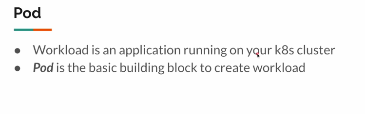
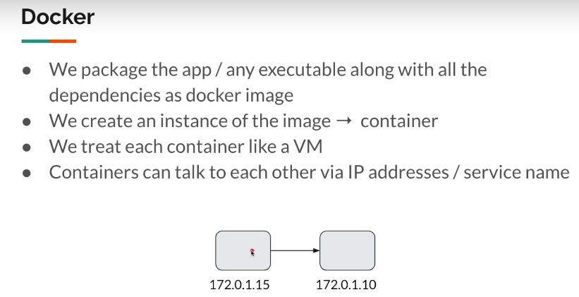
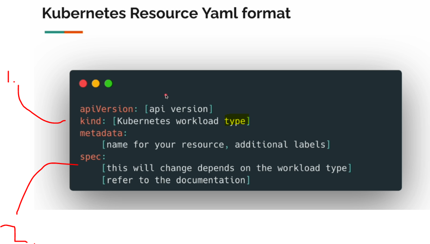

# Section 03: Pod. 

Pod.

# What I Learned.

# 13. Introduction.



- In Java basic building block would be **Java** class.




1. Smallest of unit of k8.
2. Pod can **run one or more containers**.
3. Pod can have **IP-address**, which in return run **multiple containers** inside, which return have their own addresses.
4. Communicating inside **Pod** the docker containers, does not need IP-address, only the ports is needed.

# 14. Simple Pod Creation



1. `kind` what **kind/type** of Kubernetes resource you will be creating.
2. `spec` will have parameters for creating of the **type/resource**.

- How to use pod. [Pods](https://kubernetes.io/docs/concepts/workloads/pods/#using-pods).

- Example of pod.
    - In here `containers:` is array of containers, check the URL. [Example of array](https://kubernetes.io/docs/reference/kubernetes-api/workload-resources/pod-v1/#Container)

```
apiVersion: v1
kind: Pod
metadata:
  name: 
spec:
  containers:
  - name: nignx
    image: nginx
```

# 15. Creation & Deletion.


# Our pod configuration
```
apiVersion: v1
kind: Pod
metadata:
  name: my-pod
spec:
  containers:
    - name: nginx
      image: nginx

```

- **Kind** has some deprecated way for creating cluster
    - Should be used `kubectl apply -f my-pod.yaml`.

> [!CAUTION]
> Use kubectl.

- To check information about the resource `kubectl get pod`.

- We don't need to use `watch` command.

- TOdo jäin 3:000