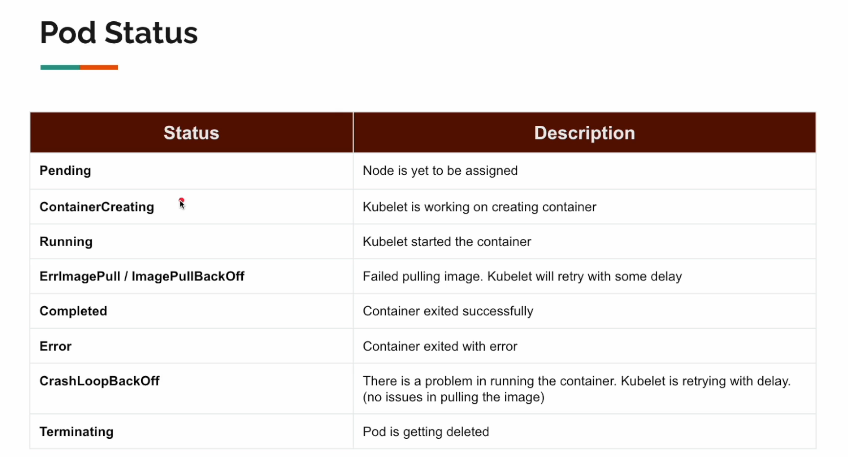

# Section 03: Pod. 
Pod.
# What I Learned.

# 13. Introduction.


- In Java basic building block would be **Java** class.


1. Smallest of unit of k8.
2. Pod can **run one or more containers**.
3. Pod can have **IP-address**, which in return run **multiple containers** inside, which return have their own addresses.
4. Communicating inside **Pod** the docker containers, does not need IP-address, only the ports is needed.

# 14. Simple Pod Creation


1. `kind` what **kind/type** of Kubernetes resource you will be creating.
2. `spec` will have parameters for creating of the **type/resource**.

- How to use pod. [Pods](https://kubernetes.io/docs/concepts/workloads/pods/#using-pods).

- Example of pod.
    - In here `containers:` is array of containers, check the URL. [Example of array](https://kubernetes.io/docs/reference/kubernetes-api/workload-resources/pod-v1/#Container)

```
apiVersion: v1
kind: Pod
metadata:
  name: 
spec:
  containers:
  - name: nignx
    image: nginx
```

# 15. Creation & Deletion.


# Our pod configuration.

```
apiVersion: v1
kind: Pod
metadata:
  name: my-pod
spec:
  containers:
    - name: nginx
      image: nginx

```

- **Kind** has some deprecated way for creating cluster.
    - Or use **kind** if it works, use `kind create cluster --config 01-cluster.yaml`.

> [!CAUTION]
> Use kubectl. If kind does not work.

- Get **any** resource from kubectl with `kubectl get pod`.

- We don't need to use `watch` command, since my **OS** won't support.

- Applying pod for cluster`kubectl apply -f my-pod.yaml`.

- Delete resource `kubectl delete -f 01-simple-pod.yaml`.

# 16. Describing Pod.

- To get information about the **resource**, we can use the command `resource` example of such. `kubectl describe pod`
    - If we don't have **pod** created, we can create such with following command `kubectl create -f 01-simple-pod.yaml`.


1. This part is one super important when debugging.


1. **First** (the **scheduler**) we assign `worker node` to run the **pod**. 
2. **Second** (the **kubelet**) Kubelet got the work, "the pod". What it needs to get it to work?
    - **Pull** the nginx image.
    - **Create** container.
    - **Start** the container.

- So this field tells what is going on.

# 17. [Quick-Note] - apply Command.


1. We can change the version of pod, or update its fields using `apply` command.

- Usually **we don't** usually deal with such commands ourselves.
    - We won't be creating **pods** ourselves.
        - We have other programs for managing different version.

# 18. Image Pull Backoff.


1. We can see from **describe** that there was error pulling error!
2. You can see the first step have been made, and how long it took `scheduler` to execute! 

# 19. Crash Loop Backoff.


1. You can tell that, pulling off this image is having problem.

2. You can watch the **Age** of the logs.

# 20. Pod Status.


1. In Happy case, **1/1** is running.
2. Failed case, **0/1**.

- This is what you mostly see.



1. This is when the **workload** has been run successfully. 
2. **Kubelet** is retrying the connection. There were error in running container.

# 21. Pod Labels - Part 1.

- Normally there can be multiple **pods**.
    - We could use the label to identify with queries.

```
apiVersion: v1
kind: Pod
metadata:
  name: pod-1
  labels: # These can be anything.
    dept : dept-1
    team: team-1
spec:
  containers:
    - name: nginx
      image: nginx
---
apiVersion: v1
kind: Pod
metadata:
  name: pod-2
  labels: # These can be anything.
    dept : dept-3
    team: team-3
spec:
  containers:
    - name: nginx
      image: nginx
---
apiVersion: v1
kind: Pod
metadata:
  name: pod-3
  labels: # These can be anything.
    dept : dept-3
    team: team-3
spec:
  containers:
    - name: nginx
      image: nginx

```

# 22. Pod Labels - Part 2.

- We create deploy these **pods**. `kubectl create -f 03-multiple-pods.yaml`.

- When we use `kubectl describe pod`.
    - This print all pods.

- We can **describe** one pod using command with label. `kubectl get pod pod-1`.

- This will print the labels, which have been registered `kubectl get pod --show-labels`.

- We use where **dept=dept-1**. Like this `kubectl get pod -l dept=dept-1`.
    - We can also use exclusion `kubectl get pod -l dept!=dept-1`.

# 23. Formatting Output.

- Getting information about **pod** in `yaml` format.
    - `kubectl get pod pod-1 -o yaml`.

# 24. Deleting A Pod.

- Deleting one particular pod. `kubectl delete pod pod-2`.

# 25. Port Forward.


