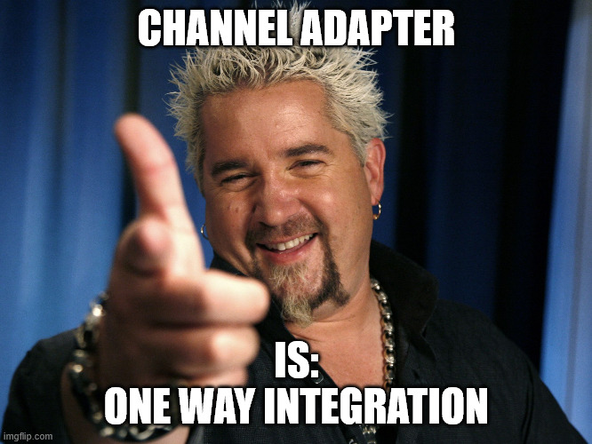

# Section 01: Introduction.

# What I learned.

# Introduction.

- Some cool music here! La la la la.

# What is Spring Integration?

    

    

1. **Spring Integration** is open source framework for the **enterprise application integrations**.

- **Spring Integrations**, supports **external systems** and other spring beans applications.

    

1. **Producer** (Sender) sends message thought the **Channel/Pipe**.
2. This goes to the **Consumer** (Receiver).

    

1. **Transformer** converts the content of the message.
2. **Filter** decides does the message continue to the output channel!

    

1. **Input channel** inputting into the **Component**.
2. **Component** is outputting the message to the **output channel** with the **Filter** or the **Transformer** logic.

    

1. The **Router** decides, to which **channel** to sends the message. 

    

1. The **Router** in the **component** gets the message. It will **decide**, to which **channel** it sends it. This is based on the criteria. 

    

1. **Splitter splits** the message into the **several** parts.
2. **Aggregator combines** several messages into the **single one**.

    

1. **Splitter** splits into message into **multiple parts**.
2. **Aggregator** combines several messages into **singe one**.

    

    

1. **Service Activator** can be used to `invoke` operations on the **Service Bean**.
    - Or in the other words, **Service class**.

- Additional link to refresh the [Service Activator](https://www.youtube.com/watch?v=vK71__HgN4E).

    

1. **Input Channel** send message to the **Service Activator**. It will be **redirects** it to the **Service Bean** or **Service Class**.
2. If, the **Service Bean** or **Service Class** decides to output message, it sends it to back to the **Service Activator** and then to **Output Channel**.

    

1. **Channel adapter** connects the application to **external system**. Flow here is to both ways (**unidirectional)**. 

    

    

1. Flow goes from **outside** to **inside**.
2. Flow goes from **inside** to **outside**.

