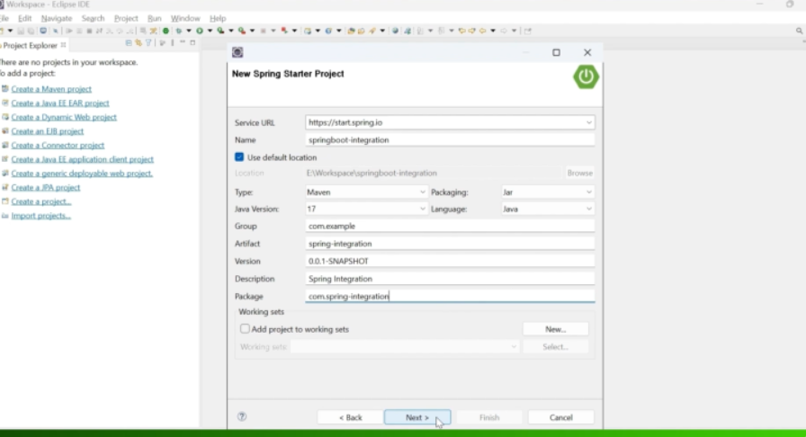
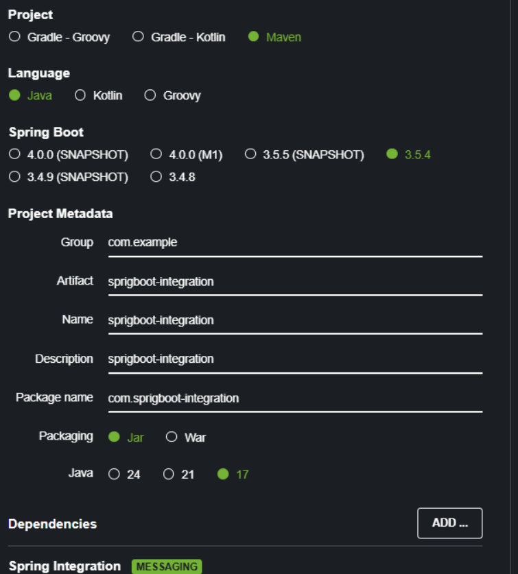

# Section 02: Create Project.

# What I learned.

# Create Project.

- We can make the project in the **Eclipse** or like in my case this will be in the **Spring Intializer**.
    - Remember to add **spring integration** package.


<div align="center">
    
</div>

- My settings.

<div align="center">
    
</div>

# Project Structure.

- We are creating the base project here.

- The **EmployeeGateway** interface.

```
package com.sbi.gateway;

import org.springframework.integration.annotation.MessagingGateway;

@MessagingGateway
public interface EmployeeGateway {

	
}
```

- The **EmployeeController** class.

```
package com.sbi.controller;

import org.springframework.web.bind.annotation.RestController;

@RestController
public class EmployeeController {


}
```

- The **Employee** model class.

```
package com.sbi.model;

public class Employee {
	

}
```

- The **EmployeeService** Service class.  

```
package com.sbi.service;

import org.springframework.stereotype.Service;

@Service
public class EmployeeService {

}
```