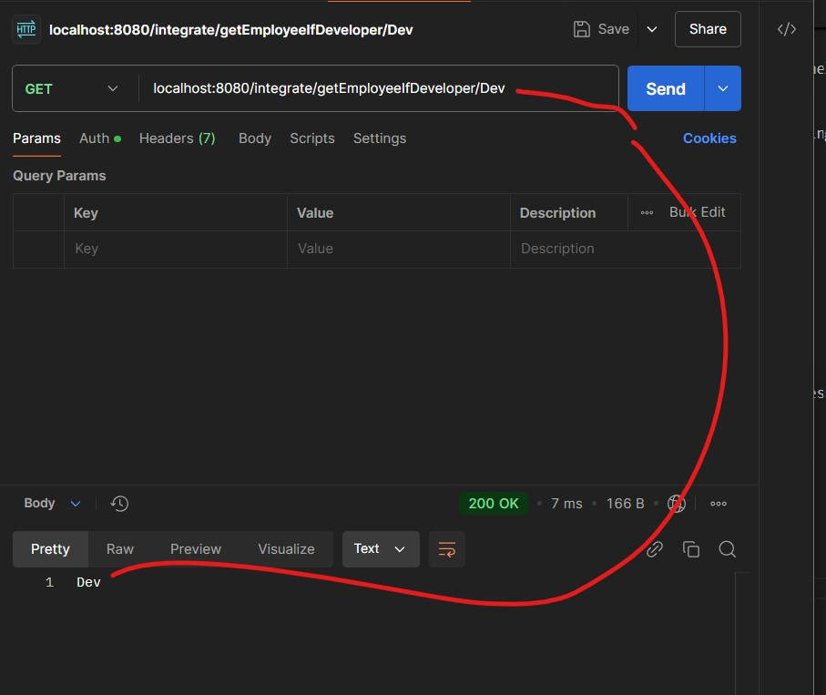

# Section 03: Spring Integration Components.

# What I learned.

# Service Activator - Get Mapping.

<div align="center">
    
</div>

- We're using the **Gateway interface**, with this we need to call just **one method call**!
    - Spring Integration **turn that method call into a message**, sends it to
     the **right channel** and **optionally waits for a reply**. Service Activator or other endpoint consumes it. 

```
@MessagingGateway
public interface EmployeeGateway {

    @Gateway(requestChannel = "request-emp-name-channel")
	public String getEmployeeName(String name);
}
```

<div align="center">
    
</div>

- A `Message` in **Spring Integrations** is like **Envelope**.
    - It has **Payload**, data goes here! Like `JSON`, `String`, `Bussiness objects` ... etc.
    - It has **Headers**, meatadata about the message. Like `ID`, `timestamp` ... etc.


- todo check this one.

<div align="center">
    
</div>

- We will write the **Service Activator**.
    - The **request** goes from **Gateway(request channel)** to **Service Activator**.

```

package com.sbi.service;

import org.springframework.integration.annotation.ServiceActivator;
import org.springframework.messaging.Message;
import org.springframework.messaging.MessageChannel;
import org.springframework.stereotype.Service;

@Service
public class EmployeeService{

    @ServiceActivator(inputChannel = "request-emp-name-channel")
    public void getEmployeeName(Message<String> name) {
        MessageChannel replyChannel = (MessageChannel) name.getHeaders().getReplyChannel();
        replyChannel.send(name);
    }
}
```

- The **Controller** class that, will call this service. This is for the **GET**.

```
package com.sbi.controller;

import com.sbi.gateway.EmployeeGateway;
import org.springframework.beans.factory.annotation.Autowired;
import org.springframework.web.bind.annotation.GetMapping;
import org.springframework.web.bind.annotation.PathVariable;
import org.springframework.web.bind.annotation.RequestMapping;
import org.springframework.web.bind.annotation.RestController;

@RestController
@RequestMapping("/integrate")
public class EmployeeController {

    @Autowired
    public EmployeeGateway employeeGateway;

    @GetMapping(value = "{name}")
    public String getEmployeeNameFromService(@PathVariable("name") String name)
    {
       return employeeGateway.getEmployeeName(name);
    }

}
``` 

# Service Activator - Post Mapping.

<div align="center">
    
</div>

- The **Spring Integration Channels** are primary designed for **internal communication** inside you spring application.

- The **Controller** for the `/integrations` part.

```
package com.sbi.controller;

import com.sbi.gateway.EmployeeGateway;
import com.sbi.model.Employee;
import org.springframework.beans.factory.annotation.Autowired;
import org.springframework.messaging.Message;
import org.springframework.web.bind.annotation.GetMapping;
import org.springframework.web.bind.annotation.PathVariable;
import org.springframework.web.bind.annotation.PostMapping;
import org.springframework.web.bind.annotation.RequestBody;
import org.springframework.web.bind.annotation.RequestMapping;
import org.springframework.web.bind.annotation.RestController;

@RestController
@RequestMapping("/integrate")
public class EmployeeController {

    @Autowired
    public EmployeeGateway employeeGateway;

    @GetMapping(value = "{name}")
    public String getEmployeeNameFromService(@PathVariable("name") String name)
    {
       return employeeGateway.getEmployeeName(name);
    }

    @PostMapping("/hireEmployee")
    public Employee hireEmployee(@RequestBody Employee employee)
    {
        Message<Employee> reply = employeeGateway.hireEmployee(employee);
        Employee empResponse = reply.getPayload();
        return empResponse;
    }


}
```

- The **Gateway** looks like such:
    - We wil call the method `hireEmployee(Employee employee)`, which in regards call the **channel** `request-hire-emp-channel`. 

```
package com.sbi.gateway;

import com.sbi.model.Employee;
import org.springframework.integration.annotation.Gateway;
import org.springframework.integration.annotation.MessagingGateway;
import org.springframework.messaging.Message;

@MessagingGateway
public interface EmployeeGateway {

    // Get call.
    @Gateway(requestChannel = "request-emp-name-channel")
	public String getEmployeeName(String name);

    // Post call.
    @Gateway(requestChannel = "request-hire-emp-channel")
    public Message<Employee> hireEmployee(Employee employee);
}
```

- The service code, for the **POST**.

```
package com.sbi.service;

import com.sbi.model.Employee;
import org.springframework.integration.annotation.Gateway;
import org.springframework.integration.annotation.ServiceActivator;
import org.springframework.messaging.Message;
import org.springframework.messaging.MessageChannel;
import org.springframework.stereotype.Service;

@Service
public class EmployeeService{


    // For the GET call.
    @ServiceActivator(inputChannel = "request-emp-name-channel")
    public void getEmployeeName(Message<String> name) {
        MessageChannel replyChannel = (MessageChannel) name.getHeaders().getReplyChannel();
        replyChannel.send(name);
    }


    // For the POST call.
    @ServiceActivator(inputChannel = "request-hire-emp-channel", outputChannel = "process-emp-channel")
    public Message<Employee> hireEmployee(Message<Employee> employee) {
        return employee;
    }

    @ServiceActivator(inputChannel = "process-emp-channel", outputChannel = "get-emp-status-channel")
    public Message<Employee> processEmployee(Message<Employee> employee) {
        employee.getPayload().setEmployeeStatus("Permanent Role");
        return employee;
    }

    @ServiceActivator(inputChannel = "get-emp-status-channel")
    public void getEmployeeStatus(Message<Employee> employee) {
        MessageChannel replyChannel = (MessageChannel) employee.getHeaders().getReplyChannel();
        replyChannel.send(employee);
    }
}
```

- The **channel** flow goes like such `hireEmployee` -> `processEmployee` -> `getEmployeeStatus`.

- The answer from the **POST**.


<div align="center">
    
</div>

1. You can see that `Permament Role` is changed into the `employeeStatus`.

# Transformer.

> **Transformer** takes message from channel and creates new message containing converted payload.


- The controller for **Transformer** logic.


```
package com.sbi.controller;

import com.sbi.gateway.EmployeeGateway;
import com.sbi.model.Employee;
import org.springframework.beans.factory.annotation.Autowired;
import org.springframework.messaging.Message;
import org.springframework.web.bind.annotation.GetMapping;
import org.springframework.web.bind.annotation.PathVariable;
import org.springframework.web.bind.annotation.PostMapping;
import org.springframework.web.bind.annotation.RequestBody;
import org.springframework.web.bind.annotation.RequestMapping;
import org.springframework.web.bind.annotation.RestController;

@RestController
@RequestMapping("/integrate")
public class EmployeeController {

    @Autowired
    public EmployeeGateway employeeGateway;


    // TRANSFORMERS

    @GetMapping(value = "/processEmployeeStatus/{status}")
    public String processEmployeeStatus(@PathVariable("status") String status)
    {
        return employeeGateway.processEmployeeStatus(status);
    }


}
```

- The gateway interface for **Transformer** logic.

```
package com.sbi.gateway;

import com.sbi.model.Employee;
import org.springframework.integration.annotation.Gateway;
import org.springframework.integration.annotation.MessagingGateway;
import org.springframework.messaging.Message;

@MessagingGateway
public interface EmployeeGateway {

    // TRANSFORMERS.

    @Gateway(requestChannel = "emp-status-channel")
    public String processEmployeeStatus(String status);
}
```

- The service class for **Transformer** logic.

```

package com.sbi.service;

import com.sbi.model.Employee;
import org.springframework.integration.annotation.Gateway;
import org.springframework.integration.annotation.ServiceActivator;
import org.springframework.integration.annotation.Transformer;
import org.springframework.messaging.Message;
import org.springframework.messaging.MessageChannel;
import org.springframework.messaging.support.MessageBuilder;
import org.springframework.stereotype.Service;

@Service
public class EmployeeService{

    // TRANSFORMERS.

    @Transformer(inputChannel = "emp-status-channel", outputChannel = "output-channel")
    public Message<String> convertToUpperCase(Message<String> message) {
        String payload = message.getPayload();
        Message<String> messageInUppercase = MessageBuilder.withPayload(payload.toUpperCase())
                .copyHeaders(message.getHeaders())
                .build();
        return messageInUppercase;
    }

    // COMMON OUTPUT CHANNELS.

    @ServiceActivator(inputChannel = "output-channel")
    public void consumesStringMessage(Message<Employee> message) {
        System.out.println("Received message from output channel: " + message.getPayload());
        MessageChannel replyChannel = (MessageChannel) message.getHeaders().getReplyChannel();
        replyChannel.send(message);
    }


}
```

- You can see that, the `replyChannel.send(message);` reply channel is set by the **gateway**. Thats how it knows who the **caller** is.

- My humble answer from the **GET**.

<div align="center">
    
</div>

1. The **Transformer** transforms the message and returns it!

# Assignment 1: Create a demo Transformer application.


```
Create a Spring Integration application that transforms message as follows by appending a prefix and suffix as dollor sign.


old message:

new message: $$

Questions for this assignment
Create a Spring Integration application that transforms message as follows by appending a prefix and suffix as dollor sign.


old message:
new message: $$
```

- My answer:

- Controller:

```
    // Assignment 01: Create a demo Transformer application.
    @GetMapping(value = "/assigement-01/{message}")
    public String addPrefixAndPostFix(@PathVariable("message") String message)
    {
        return employeeGateway.addingPrefixAndPostFix(message);
    }
```

- Service:

```
//    Assignment 01: Create a demo Transformer application

    @Transformer(inputChannel = "assigment-01", outputChannel = "output-channel")
    public Message<String> addingPrefixAndPostFix(Message<String> message) {
        String payload = message.getPayload();

        Message<String> messageWithThePrefixAndPostFix = MessageBuilder.withPayload("$$".concat(payload.concat("$$")))
                .copyHeaders(message.getHeaders())
                .build();


        return messageWithThePrefixAndPostFix;
    }

```

- Gateway Interface:

```
    // Assignment 01: Create a demo Transformer application.

    @Gateway(requestChannel = "assigment-01")
    public String addingPrefixAndPostFix(String message);
```

# Splitter.

- Controller:

```

package com.sbi.controller;

import com.sbi.gateway.EmployeeGateway;
import com.sbi.model.Employee;
import org.springframework.beans.factory.annotation.Autowired;
import org.springframework.messaging.Message;
import org.springframework.web.bind.annotation.GetMapping;
import org.springframework.web.bind.annotation.PathVariable;
import org.springframework.web.bind.annotation.PostMapping;
import org.springframework.web.bind.annotation.RequestBody;
import org.springframework.web.bind.annotation.RequestMapping;
import org.springframework.web.bind.annotation.RestController;

@RestController
@RequestMapping("/integrate")
public class EmployeeController {

    @Autowired
    public EmployeeGateway employeeGateway;

    // SPLITTER

    @GetMapping(value = "/getManagerList/{managers}")
    public String getManagerList(@PathVariable("managers") String managers)
    {
        return employeeGateway.getManagerList(managers);
    }

}

```

- Service:

```


package com.sbi.service;

import com.sbi.model.Employee;
import org.springframework.integration.annotation.Gateway;
import org.springframework.integration.annotation.ServiceActivator;
import org.springframework.integration.annotation.Splitter;
import org.springframework.integration.annotation.Transformer;
import org.springframework.messaging.Message;
import org.springframework.messaging.MessageChannel;
import org.springframework.messaging.support.MessageBuilder;
import org.springframework.stereotype.Service;

import java.util.ArrayList;
import java.util.List;

@Service
public class EmployeeService{


    // SPLITTER.

    @Splitter(inputChannel = "emp-managers-channel", outputChannel = "output-channel")
    public List<Message<String>>splitMessage(Message<?> message) {

        List<Message<String>> messages = new ArrayList<Message<String>>();

        String[] messageSplitted = message.getPayload().toString().split(",");


        for (String stringBeingSplitted : messageSplitted) {
            Message<String> messageBuilded = MessageBuilder.withPayload(stringBeingSplitted)
                    .copyHeaders(message.getHeaders())
                    .build();

            messages.add(messageBuilded);
        }

        return messages;
    }


    // COMMON OUTPUT CHANNELS.

    @ServiceActivator(inputChannel = "output-channel")
    public void consumesStringMessage(Message<Employee> message) {
        System.out.println("Received message from output channel: " + message.getPayload());
        MessageChannel replyChannel = (MessageChannel) message.getHeaders().getReplyChannel();
        replyChannel.send(message);
    }


}


```

- Gateway Interface:

```

package com.sbi.gateway;

import com.sbi.model.Employee;
import org.springframework.integration.annotation.Gateway;
import org.springframework.integration.annotation.MessagingGateway;
import org.springframework.messaging.Message;

@MessagingGateway
public interface EmployeeGateway {

    // SPLITTER.

    @Gateway(requestChannel = "emp-managers-channel")
    String getManagerList(String managers);
}

```

- We can see `@Splitter(inputChannel = "emp-managers-channel", outputChannel = "output-channel")` at working, the provided list is being splitted into several return calls!

<div align="center">
    
</div>

- You can see the logs:

```
2025-08-04T17:44:33.116+03:00  INFO 3636 --- [sprigboot-integration] [nio-8080-exec-2] o.a.c.c.C.[Tomcat].[localhost].[/]       : Initializing Spring DispatcherServlet 'dispatcherServlet'
2025-08-04T17:44:33.116+03:00  INFO 3636 --- [sprigboot-integration] [nio-8080-exec-2] o.s.web.servlet.DispatcherServlet        : Initializing Servlet 'dispatcherServlet'
2025-08-04T17:44:33.117+03:00  INFO 3636 --- [sprigboot-integration] [nio-8080-exec-2] o.s.web.servlet.DispatcherServlet        : Completed initialization in 1 ms
Received message from output channel: Pekka
Received message from output channel: Simo
Received message from output channel: Ville
```

# Filter.


- Controller:

```

package com.sbi.controller;

import com.sbi.gateway.EmployeeGateway;
import com.sbi.model.Employee;
import org.springframework.beans.factory.annotation.Autowired;
import org.springframework.messaging.Message;
import org.springframework.web.bind.annotation.GetMapping;
import org.springframework.web.bind.annotation.PathVariable;
import org.springframework.web.bind.annotation.PostMapping;
import org.springframework.web.bind.annotation.RequestBody;
import org.springframework.web.bind.annotation.RequestMapping;
import org.springframework.web.bind.annotation.RestController;

@RestController
@RequestMapping("/integrate")
public class EmployeeController {

    @Autowired
    public EmployeeGateway employeeGateway;

    // FILTER.

    @GetMapping(value = "/getEmployeeIfDeveloper/{empDesignation}")
    public String getEmployeeIfADeveloper(@PathVariable("empDesignation") String empDesignation)
    {
        return employeeGateway.getEmployeeIfADeveloper(empDesignation);
    }


}
```

- Gateway Interface:

```
package com.sbi.gateway;

import com.sbi.model.Employee;
import org.springframework.integration.annotation.Gateway;
import org.springframework.integration.annotation.MessagingGateway;
import org.springframework.messaging.Message;

@MessagingGateway
public interface EmployeeGateway {

    @Gateway(requestChannel = "dev-emp-channel")
    String getEmployeeIfADeveloper(String empDesignation);
}

```


- The Service code:

```
    // FILTER.

    @Filter(inputChannel = "dev-emp-channel", outputChannel = "output-channel")
    boolean filter(Message<?> message) {
        String messageLocal = message.getPayload().toString();
        return messageLocal.contains("Dev");
    }


    // COMMON OUTPUT CHANNELS.

    @ServiceActivator(inputChannel = "output-channel")
    public void consumesStringMessage(Message<Employee> message) {
        System.out.println("Received message from output channel: " + message.getPayload());
        MessageChannel replyChannel = (MessageChannel) message.getHeaders().getReplyChannel();
        replyChannel.send(message);
    }
```

- We can see the logs are working when the **filter** is **true**.


<div align="center">
    
</div>

- You can see the logs:

```
2025-08-04T18:11:22.883+03:00  WARN 11216 --- [sprigboot-integration] [io-8080-exec-10] o.s.integration.filter.MessageFilter     : The message [GenericMessage [payload=Dsev, headers={replyChannel=org.springframework.messaging.core.GenericMessagingTemplate$TemporaryReplyChannel@6ef7e500, errorChannel=org.springframework.messaging.core.GenericMessagingTemplate$TemporaryReplyChannel@6ef7e500, id=3dfde42c-d58c-1063-19ee-99a9d18a81a8, timestamp=1754320282883}]] has been rejected in filter: bean 'employeeService.filter.filter.handler' for component 'employeeService.filter.filter'
Received message from output channel: Dev
```

# Aggregator.

- We are going to **Aggregate** following **keywords**. These came from the `splitter` method, as following `localhost:8080/integrate/getManagerList/Pekka,Simo,Ville`.
    - [Check the document](https://docs.spring.io/spring-integration/reference/aggregator.html).

```
Received message from output channel: Pekka
Received message from output channel: Simo
Received message from output channel: Ville
```


- Gateway Interface:
    - We use **splitter** gateway point.

```
    // SPLITTER.

    @Gateway(requestChannel = "emp-managers-channel")
    String getManagerList(String managers);

```

- We are using splitter endpoint **Controller**:

```
// SPLITTER.

    @GetMapping(value = "/getManagerList/{managers}")
    public String getManagerList(@PathVariable("managers") String managers)
    {
        return employeeGateway.getManagerList(managers);
    }
```
- We are using **StringJoiner**, explanation:
    - **StringJoiner**:
        - This is **specialices** for **strings** where there is `prefixes`, `suffixes` and `delimiters` **etc...**.
    - **StringBuilder**:
        - This is more **general-purpose** version for combining for **strings**.

- The Service code:

```
    // AGGREGATOR.

    @Aggregator(inputChannel = "managers-channel", outputChannel = "output-channel")
    Message<String> getAllManagers(List<Message<String>> messages)
    {
        StringJoiner joiner  = new StringJoiner(" & ", "[ ", " ]");

        for (Message<String> message : messages)
        {
            joiner.add(message.getPayload());
        }

        String managers = joiner.toString();

        Message<String> updateMessage = MessageBuilder.withPayload(managers)
                .build();

        return  updateMessage;
    }

    // COMMON OUTPUT CHANNELS.

    @ServiceActivator(inputChannel = "output-channel")
    public void consumesStringMessage(Message<Employee> message) {
        System.out.println("Received message from output channel: " + message.getPayload());
        MessageChannel replyChannel = (MessageChannel) message.getHeaders().getReplyChannel();
        replyChannel.send(message);
    }
```

- You can see the logs:

```
2025-08-04T19:34:07.190+03:00  INFO 13428 --- [sprigboot-integration] [nio-8080-exec-1] o.a.c.c.C.[Tomcat].[localhost].[/]       : Initializing Spring DispatcherServlet 'dispatcherServlet'
2025-08-04T19:34:07.190+03:00  INFO 13428 --- [sprigboot-integration] [nio-8080-exec-1] o.s.web.servlet.DispatcherServlet        : Initializing Servlet 'dispatcherServlet'
2025-08-04T19:34:07.192+03:00  INFO 13428 --- [sprigboot-integration] [nio-8080-exec-1] o.s.web.servlet.DispatcherServlet        : Completed initialization in 2 ms
Received message from output channel: [ Pekka & Simo & Ville ]
```

<div align="center">
    
</div>

1. We can see that, The **Splitter** splits and **Aggrigator** aggrigates.

# Router.

- Gateway Interface:
    - We use **splitter** gateway point.

```
    // ROUTER.

    @Gateway(requestChannel = "emp-dept-channel")
    String getEmployeeDepartment(Employee employee);
```

- We are using splitter endpoint **Controller**:

```
    // ROUTER.

    @GetMapping(value = "/getEmployeeDepartment")
    public String getEmployeeDepartment(@RequestBody Employee employee)
    {
        return employeeGateway.getEmployeeDepartment(employee);
    }

```

- The Service code:

```
    // ROUTER.

    @Router(inputChannel = "emp-dept-channel")
    public String getEmployeeDepartment(Message<Employee> message) {
        String deptRoute = null;

        switch (message.getPayload().getEmployeeDepartment()) {
            case "SALES":
                deptRoute = "sales-channel";
                break;
            case "MARKETING":
                deptRoute = "marketing-channel";
                break;
        }
        return deptRoute;
    }
```

<div align="center">
    
</div>

1. We can see that `Routing` component, is routing the call based on the criteria and returning it to the service!

# Assignment 2: Create a demo router application.

```
Create a Spring Integration application that routes messages based on different social media apps like Whatsapp, Instagram, Facebook and Twitter.

Questions for this assignment
Create a Spring Integration application that routes messages based on different social media apps like Whatsapp, Instagram, Facebook and Twitter.
```

- The Controller:

```

    // Assignment 02: Create a demo Transformer application.
    @GetMapping(value = "/assigement-02")
    public String addPrefixAndPostFix(@RequestBody Employee employee)
    {
        return employeeGateway.getSocialMediaApp(employee);
    }
```

- The Gateway:

```

    // Assignment 2: Create a demo router application.

    @Gateway(requestChannel = "assigment-02")
    public String getSocialMediaApp(String message);

```

- The Service:

```
    // Assignment 2: Create a demo router application.

    @Router(inputChannel = "assigment-02")
    public String getSocialMediaApp(Message<Employee> message) {
        String deptRoute = null;

        switch (message.getPayload().getEmployeeSocialApp()) {
            case "WHATSAPP":
                deptRoute = "whatsapp-channel";
                break;
            case "INSTAGRAM":
                deptRoute = "instagram-channel";
                break;
            case "FACEBOOK":
                deptRoute = "facebook-channel";
                break;
            case "TWITTER":
                deptRoute = "twitter-channel";
                break;
        }

        return deptRoute;

    }


    @ServiceActivator(inputChannel = "whatsapp-channel")
public void getWhatsappMsg(Message<Employee> employee){
	Message<String> whatsapp = MessageBuilder.withPayload("WHATSAPP MESSAGE").build();
	System.out.println("Received message from : " + whatsapp.getPayload());
	MessageChannel replyChannel = (MessageChannel) employee.getHeaders().getReplyChannel();
	replyChannel.send(whatsapp);
}

@ServiceActivator(inputChannel = "instagram-channel")
public void getInstagramMsg(Message<Employee> employee){
	Message<String> instagram = MessageBuilder.withPayload("INSTAGRAM MESSAGE").build();
	System.out.println("Received message from : " + instagram.getPayload());
	MessageChannel replyChannel = (MessageChannel) employee.getHeaders().getReplyChannel();
	replyChannel.send(instagram);
}

@ServiceActivator(inputChannel = "facebook-channel")
public void getFacebookMsg(Message<Employee> employee){
	Message<String> facebook = MessageBuilder.withPayload("FACEBOOK MESSAGE").build();
	System.out.println("Received message from : " + facebook.getPayload());
	MessageChannel replyChannel = (MessageChannel) employee.getHeaders().getReplyChannel();
	replyChannel.send(facebook);
}

@ServiceActivator(inputChannel = "twitter-channel")
public void getTwitterMsg(Message<Employee> employee){
	Message<String> twitter = MessageBuilder.withPayload("TWITTER MESSAGE").build();
	System.out.println("Received message from : " + twitter.getPayload());
	MessageChannel replyChannel = (MessageChannel) employee.getHeaders().getReplyChannel();
	replyChannel.send(twitter);
}
```

<div align="center">
    
</div>

1. You can see that the **assigment 2** is working.