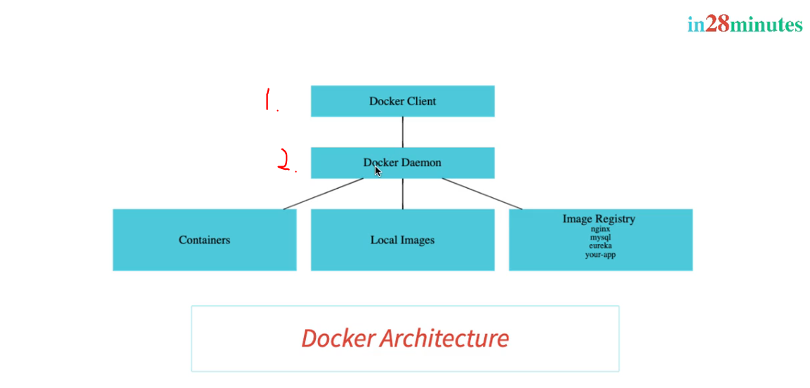

# Section 07: Docker with Microservices using Spring Boot and Spring Cloud - V2.

 Docker with Microservices using Spring Boot and Spring Cloud - V2.

# What I Learned

# 182. Step 00 - Match made in Heaven - Docker and Microservices

 

1. Containers makes all **Microservice** work with same language.

# 183. Step 01 - Installing Docker - Docker - V2

- Docker in past.

- Default options is recommended.

# 184. RECOMMENDATION : Use PowerShell in Windows!

- ✅.

# 185. Step 02 - Your First Docker Usecase - Deploy a Spring Boot Application

- Docker for this image `https://hub.docker.com/r/in28min/todo-rest-api-h2`.

- You can launch image in place where there is not all decencies. Example with `docker run in28min/todo-rest-api-h2:1.0.0.RELEASE`

- We would need all other layers before would be able launch the `.jar` file.

# 186. Step 03 - Docker Concepts - Registry, Repository, Tag, Image and Containers

- Images is retrieves from **Image Registry**.

- Docker for this image `https://hub.docker.com/r/in28min/todo-rest-api-h2`.

- This contains all the what you need to run.

- Image is **set of bytes**.
    - When its running its calling **Container**.

- We need to run docker image with ports, since by **default** these are ran inside **bridge network**.
    - `docker run -p 5000:5000 in28min/todo-rest-api-h2:1.0.0.RELEASE`.

# 187. Step 04 - Playing with Docker Images and Containers

- Detach mode `-d` and with command. `docker run -p 5000:5000 -d in28min/todo-rest-api-h2:1.0.0.RELEASE`.

- After running in detach mode you get **Container Id**. Tailing the logs for docker with **Container Id**, `docker logs -f 3fe681bb2fb0a38394c0037942c7c1eac20309f2b4ef9696d1468ee666045336`.

- Docker images, which has been pulled. `docker images`.

- Docker containers running, `docker container ls -a`.

- Seeing what containers are running. `docker container ls`.

- We can run multiple version of this one docker image.

- Stopping container `docker container stop c9b5` last one is container id.

# 188. Step 05 - Understanding Docker Architecture - Docker Client, Docker Engine

1. Command are executed in **Docker Client**.
2. **Docker Daemon** or **Docker Image** is Containers, Local Images, Image Registry. 

# 189. Step 06 - Why is Docker Popular

- We can install these on cloud and in local system.

# 190. Step 07 - Playing with Docker Images

- You can give multiple **tags**  to different containers.

- Example `docker pull mysql`, pulling latest mysql container.

- Docker can have offal's or un officials images.

- `docker image history` for how image was build.

- `docker image inspect` for inspecting the image.

- `docker image delete` deleting image locally.

# 191. Step 08 - Playing with Docker Containers