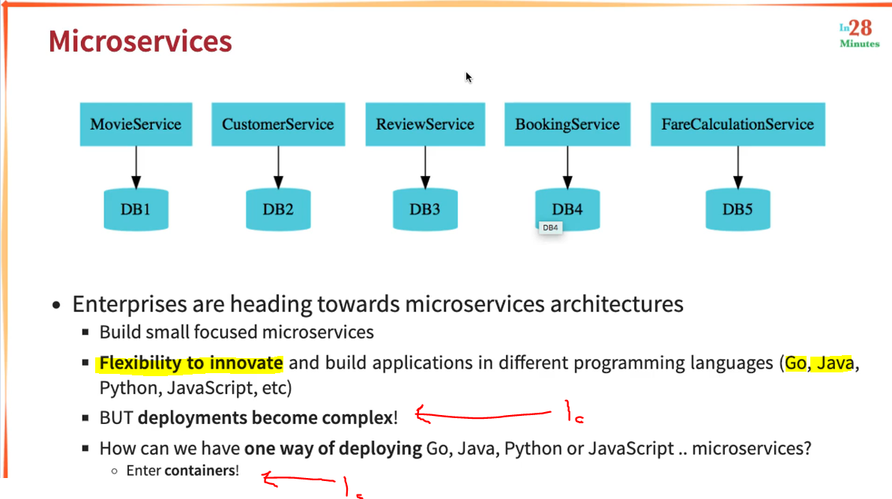
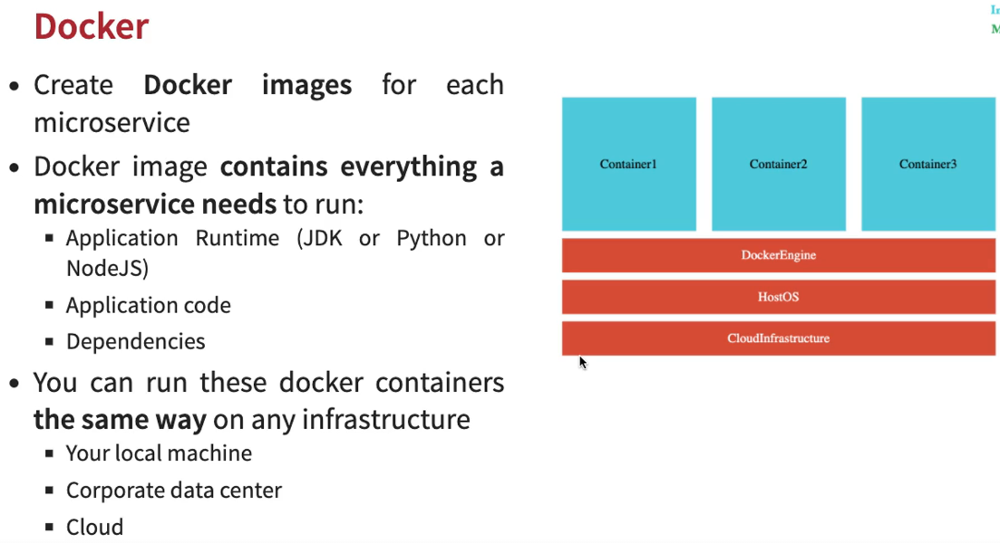
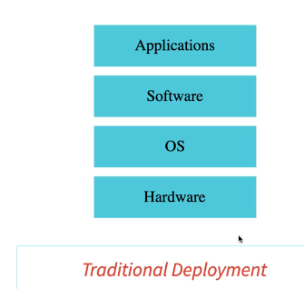

# Section 07: Docker with Microservices using Spring Boot and Spring Cloud - V2

 Docker with Microservices using Spring Boot and Spring Cloud - V2

# What I Learned

# 182. Step 00 - Match made in Heaven - Docker and Microservices

 

1. Containers makes all **Microservice** work with same language.

# 183. Step 01 - Installing Docker - Docker - V2

- Docker in past.

- Default options is recommended.

# 184. RECOMMENDATION : Use PowerShell in Windows!

- ✅.

# 185. Step 02 - Your First Docker Usecase - Deploy a Spring Boot Application

- You can launch image in place where there is not all decencies. Example with `docker run in28min/todo-rest-api-h2:1.0.0.RELEASE`

- We would need all other layers before would be able launch the `.jar` file.

# 186. Step 03 - Docker Concepts - Registry, Repository, Tag, Image and Containers