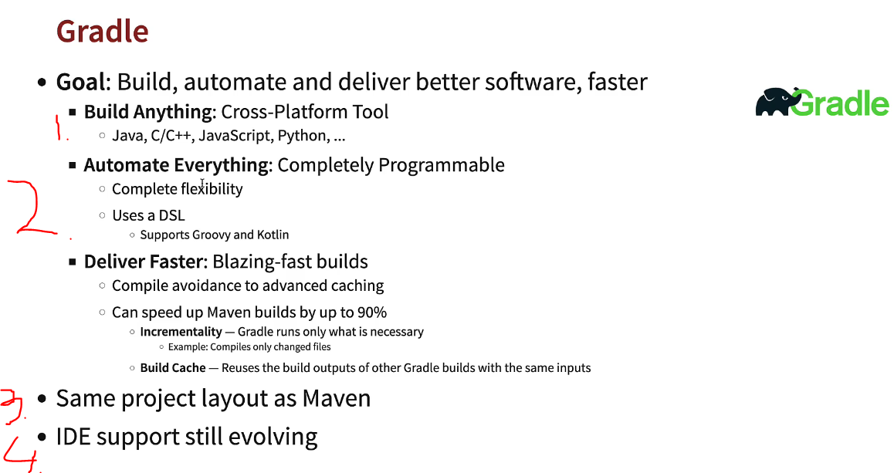

# Section 14: Appendix - Introduction To Gradle  

Section 14: Appendix - Introduction To Gradle  

# 287. Gradle Step 01 - Getting Started with Gradle



1. **Maven** is **Java** specific tool. Where **Gradle** is **Cross-Platform** tool.
2. Where **Maven** uses **POM.xml**, Cradle uses DSL.
3. It has same project layout as Maven.
4. **Big minus** is that the IDE support is still evolving.

# 288. Gradle Step 02 - Creating a Spring Boot Project with Gradle

- Importing Gradle will take long time.

- **Maven** has **pom.xml** **Gradle** has **build.gradle**.

### build.gradle

```
plugins {
	id 'java'
	id 'org.springframework.boot' version '3.3.1'
	id 'io.spring.dependency-management' version '1.1.5'
}

group = 'com.in28minutes'
version = '0.0.1-SNAPSHOT'

java {
	toolchain {
		languageVersion = JavaLanguageVersion.of(17)
	}
}

repositories {
	mavenCentral()
}

dependencies {
	implementation 'org.springframework.boot:spring-boot-starter'
	testImplementation 'org.springframework.boot:spring-boot-starter-test'
	testRuntimeOnly 'org.junit.platform:junit-platform-launcher'
}

tasks.named('test') {
	useJUnitPlatform()
}

```
- Other important thing is **settings.gradle**.

### settings.gradle

```
rootProject.name = 'learn-gradle'
```
