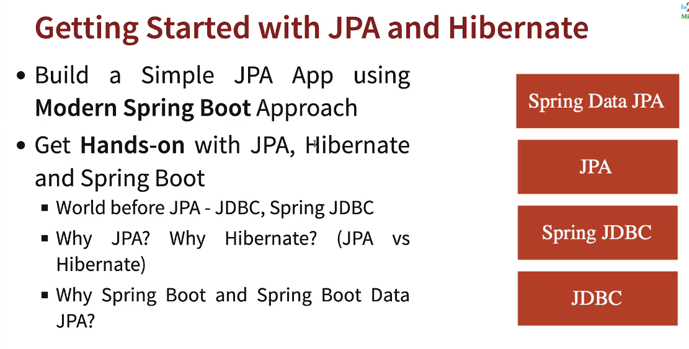
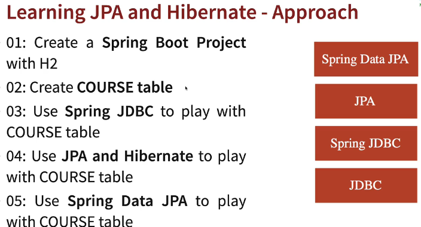
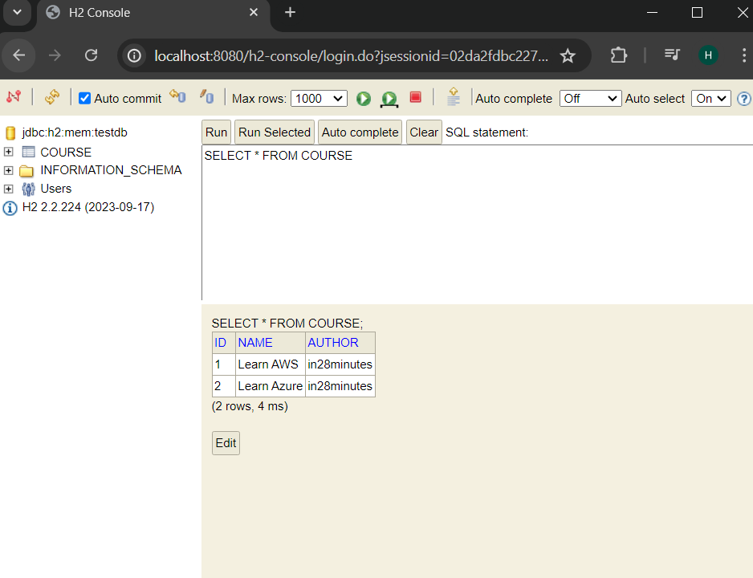
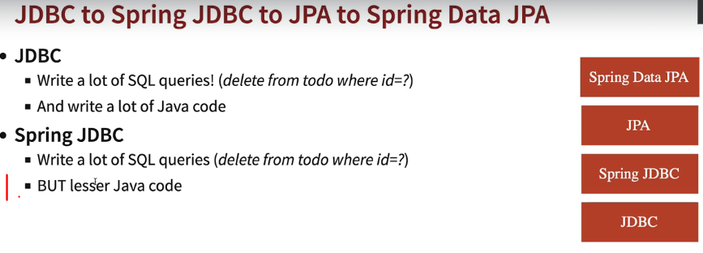
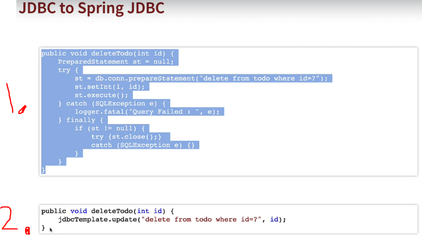
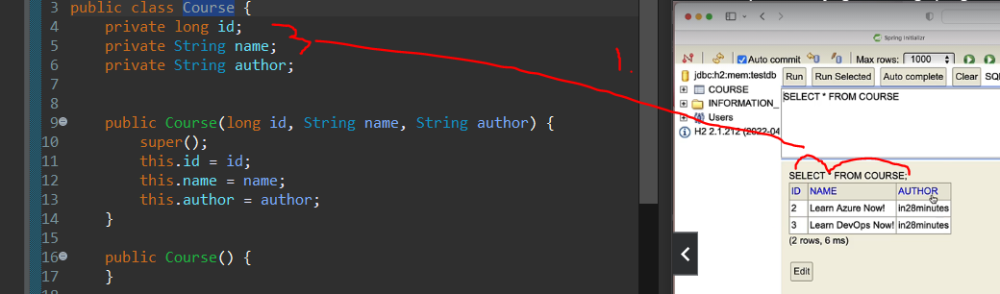
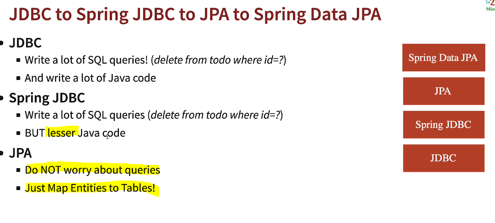
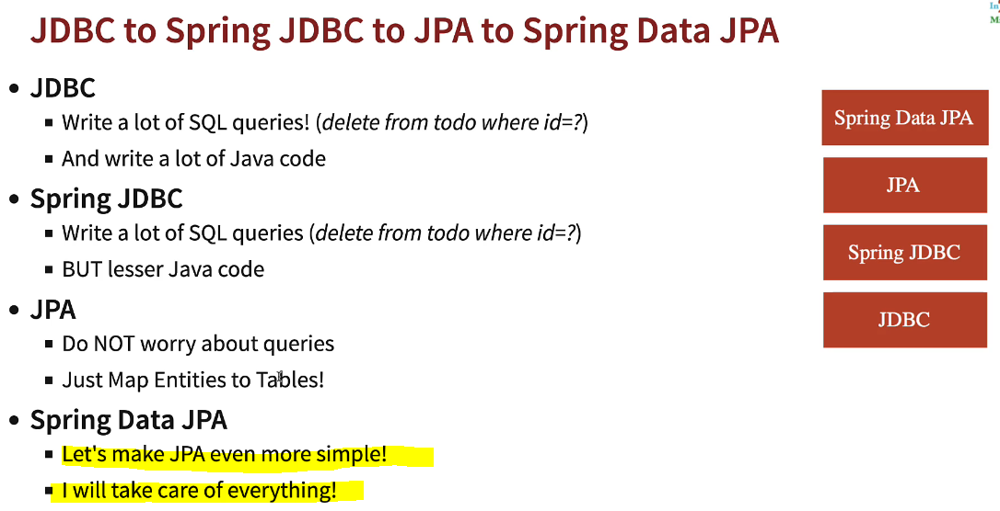
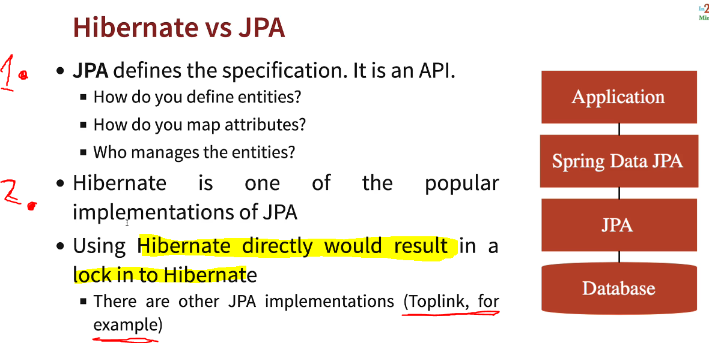
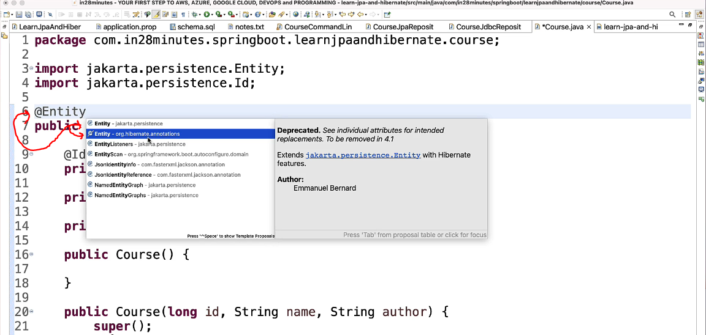

# Section 15: Appendix - Introduction to JPA in 10 Steps - V2

Introduction JPA.

# What I Learned

# 293. Step 01 - Getting Started with JPA and Hibernate - Goals

- Plan here.





# 294. Step 02 - Setting up New Spring Boot Project for JPA and Hibernate

- Got working Spring app with Spring Initializer ✅ 

# 295. Step 03 - Launching up H2 Console and Creating Course Table in H2

- We enable **h2** console via configuration. With configuration, no need to copy from console every time.

# application.properties
```
spring.application.name=learn-jpa-and-hibernate
spring.h2.console.enabled=true
spring.datasource.url=jdbc:h2:mem:testdb
```

- For creating tables in **H2**, we create following **schema**. This this file automatically picked up by **H2**.

```
create table course
{
	id bigint not null, 
	name varchar(255) not null,
	author varchar(255) not null,
	primary key (id)
};
```

- **Long** in Java translate into **bigint** in **H2**.
- **String** in Java translate into **varchar()** in **H2**.

- **H2** working below.




# 296. Step 04 - Getting Started with Spring JDBC

- We are writing **SQL queries** in **JDBC** and **Spring JDBC**. 



1. With **Spring JDBC** you need write **less java code**. 



1. In **JDBC**.
2. In **Spring JDBC**.

# 297. Step 05 - Inserting Hardcoded Data using Spring JDBC

- In **Spring** class which talks to database is usually **Repository**.

```

//Class talks to repository
@Repository
public class CourseJdbcRepository {
	
	@Autowired
	JdbcTemplate springJdbcTemplate;

	private static String INSERT_QUERY =
			"""
				insert into course (id, name, author)
				values(1, 'Learn AWS', 'in28minutes');
			""";
	

	public void insert() {
		springJdbcTemplate.update(INSERT_QUERY);
	}

}

```

- **.update** can be used to execute **insert**, **update** or **delete** queries.

- We can use query at startup. **SpringBoot** provides concept like **CommandLineRunner**. Example below as following:

```

@Component
public class CourseJdbcCommandLineRunner implements CommandLineRunner {

	@Autowired
	private CourseJdbcRepository repository;
	
	
	@Override
	public void run(String... args) throws Exception {
		repository.insert();
	}

}

```

- With Spring JDBC, you would write queries, but the Java code would be simple.

# 298. Step 06 - Inserting and Deleting Data using Spring JDBC

- We wrote following to delete with bean.

```
package com.inw8minutes.springboot.learn_jpa_and_hibernate.course.jdbc;

import org.springframework.beans.factory.annotation.Autowired;
import org.springframework.jdbc.core.JdbcTemplate;
import org.springframework.stereotype.Repository;

import com.inw8minutes.springboot.learn_jpa_and_hibernate.course.Course;

//Class talks to repository
@Repository
public class CourseJdbcRepository {
	
	@Autowired
	JdbcTemplate springJdbcTemplate;

	private static String INSERT_QUERY =
			"""
				insert into course (id, name, author)
				values(?, ?, ?);
			""";
	private static String DELTE_QUERY =
			"""
				delete from course
				where id = ?;
			""";

	public void insert(Course course) {
		springJdbcTemplate.update(INSERT_QUERY, course.getId(), course.getName(), course.getAuthor());
	}
	
	public void deleteById(long id) {
		springJdbcTemplate.update(DELTE_QUERY, id);
	}

}

```

# 299. Step 07 - Querying Data using Spring JDBC

- How to map **ResultSet** to **Bean**.


 
 1. Since **database tables** match with **bean**. We can use concent like **bean mapper**. Example here `new BeanPropertyRowMapper<>(Course.class)`.

- This is using **Spring JDBC**.

 ```
 	public Course findById(long id) {
		// Mapping the ResultSet to Bean 
		// Mapping is happening using Row Mappers
		return springJdbcTemplate.queryForObject(SELECT_QUERY, new BeanPropertyRowMapper<>(Course.class), id);
	}
 ```

- And with following bean.

```
public class Course {
	private long id;
	private String name;
	private String author;
	
	
	public Course(long id, String name, String author) {
		super();
		this.id = id;
		this.name = name;
		this.author = author;
	}

	public Course() {
	}

	public long getId() {
		return id;
	}

	public void setId(long id) {
		this.id = id;
	}

	public String getName() {
		return name;
	}

	public void setName(String name) {
		this.name = name;
	}

	public String getAuthor() {
		return author;
	}

	public void setAuthor(String author) {
		this.author = author;
	}

	@Override
	public String toString() {
		return "Course [id=" + id + ", name=" + name + ", author=" + author + "]";
	}

}
```

# Step 08 - Getting Started with JPA and EntityManager

- At the moment we write our own  **SQL** queries. This is simple for small queries, but gets **troublesome** when there is multiple statements and with complex logic. We could fix this using **JPA**.

```
//Class talks to repository
@Repository
public class CourseJdbcRepository {
	
	@Autowired
	JdbcTemplate springJdbcTemplate;

	private static String INSERT_QUERY =
			"""
				insert into course (id, name, author)
				values(?, ?, ?);
			""";
	
	private static String DELTE_QUERY =
			"""
				delete from course
				where id = ?;
			""";

	private static String SELECT_QUERY =
			"""
				select * from course
				where id = ?;
			""";
	
	public void insert(Course course) {
		springJdbcTemplate.update(INSERT_QUERY, course.getId(), course.getName(), course.getAuthor());
	}
	
	public void deleteById(long id) {
		springJdbcTemplate.update(DELTE_QUERY, id);
	}

	public Course findById(long id) {
		// Mapping the ResultSet to Bean 
		// Mapping is happening using Row Mappers
		return springJdbcTemplate.queryForObject(SELECT_QUERY, new BeanPropertyRowMapper<>(Course.class), id);
	}
}

```

- To make it other way. We would **map** whole **table** to an Java bean called **Entity**. When **JPA** Entity manager get hold of this, it knows where to map this **Entity** without needing of **SQL** written relationship.

- This needs to `@Entity` maps from database **Table** and `@Column(name="name")` these matcher for table name. They are not needed this case, they match with database table.

```

@Entity
public class Course {
	
	@Id
	private long id;
	
	@Column(name="name") // These not needed, because these matcher for table name.
	private String name;
	
	@Column(name="author") // These not needed, because these matches for table name.
	private String author;
	
	
	public Course(long id, String name, String author) {
		super();
		this.id = id;
		this.name = name;
		this.author = author;
	}

	public Course() {
	}

	public long getId() {
		return id;
	}

	public void setId(long id) {
		this.id = id;
	}

	public String getName() {
		return name;
	}

	public void setName(String name) {
		this.name = name;
	}

	public String getAuthor() {
		return author;
	}

	public void setAuthor(String author) {
		this.author = author;
	}

	@Override
	public String toString() {
		return "Course [id=" + id + ", name=" + name + ", author=" + author + "]";
	}

}

```

- And the **repository** which talks to database is changed to **JPA** version.

```
@Repository
@Transactional //When using JPA, this is needed
public class CourseJpaRepository {
	
//	@PersistenceContext not @Autowired. @Autowired is good, but @PersistenceContext is more specific  
	@PersistenceContext
	//JPA talks to database, we need to use EntityManager
	private EntityManager entityManager;
	
	public void insert(Course course) {
		entityManager.merge(course);
	}
	
	public Course findById(long id) {
		return entityManager.find(Course.class, id);
	}
	
	public void deleteById(long id) {
		Course course = entityManager.find(Course.class, id);
		entityManager.remove(course);
	}
}

```

- As you can see there is no hardcoded SQL anymore!

- We can tell JPA to log into console `spring.jpa.show-sql=true`.

- Now we just focus calling right **Entity Manager method** rather than writing SQL.

# 301. Step 09 - Exploring the Magic of JPA


 
 - Behind **JPA** is **SQL** queries fired.

 # 302. Step 10 - Getting Started with Spring Data JPA

- So what **Spring Data JPA** solves?.

 
 
 - With **Spring Data JPA** we would write.

 ```
@Component
public class CourseCommandLineRunner implements CommandLineRunner {

// JDBC way to communicate database
//	@Autowired
//	private CourseJdbcRepository repository;

//JPA way to communicate database
//	@Autowired
//	private CourseDataSpringDataJpaRepository repository;

	//This one with Spring Data JPA
	@Autowired
	private CourseDataSpringDataJpaRepository repository;
	
	@Override
	public void run(String... args) throws Exception {
		repository.save(new Course(1,"Learn AWS Jpa!", "in28minutes"));
		repository.save(new Course(2,"Learn Azure Jpa!", "in28minutes"));
		repository.save(new Course(3,"Learn DevOps", "in28minutes"));
	
		repository.deleteById(3l);
		
		System.out.println(repository.findById(1l));
		System.out.println(repository.findById(2l));
	}

}

 ```

 - And write **interface** for exposing methods from **JpaRepository**. As following.

```

public interface CourseDataSpringDataJpaRepository extends JpaRepository<Course, Long>{

}

```

# 303. Step 11 - Exploring features of Spring Data JPA

- Spring Data JPA provides way to write custom queries. It follows naming convention.

- Below example some custom method names.

```
public interface CourseDataSpringDataJpaRepository extends JpaRepository<Course, Long>{

	List<Course>findByAuthor(String author);
	List<Course>findByName(String name);
}
```

- Spring follow naming convection for these [methods](https://www.baeldung.com/spring-data-derived-queries).


# 304. Step 12 - Understanding difference between Hibernate and JPA

- JPA and Hibernate are different. They are example imported from different **.jar** packages.


 
 1. **JPA** defines the specification. Its like **Interface**.
	- How you can **map** the objects.
2. **Hibernate** implements **JPA**. **Hibernate** is most popular nowadays of the implementation.



- When we do annotations, we want to stick with **JPA implementation**. Not with the **Hibernate** ones.

# 305. How to Decide Your Goals

- ✅ 