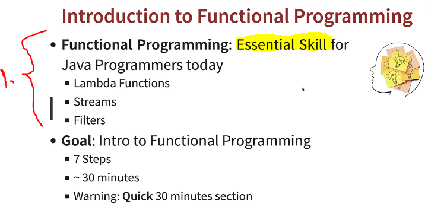

# Section 16: Appendix - Introduction to Functional Programming in 30 Minutes

Appendix - Introduction to Functional Programming in 30 Minutes 

# 306. Step 00 - Introduction to Functional Programming - Overview

1. Are expected to to know about functional programming.

# 307. Getting Started with Functional Programming with Java

- **Functional programming** is **Paradigm Shift**.