# Section 2: Introduction To Web Services

Introduction.

# What I Learned

# 6. What is a Web Service?

- Web apps in web, is fb web service?

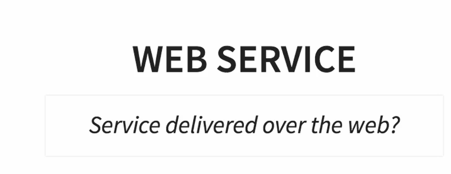

- HTML is not for designed for **application** to **application**

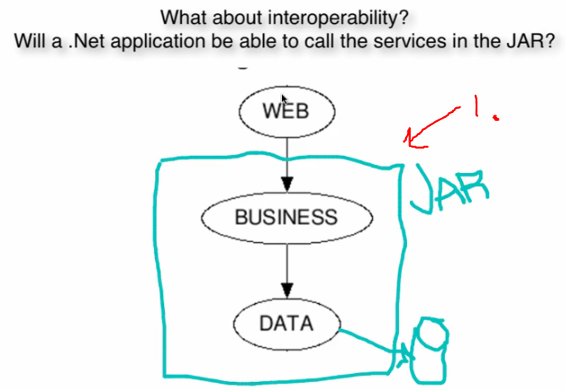

1. I could separate business logic and data to serve new consumers. Wrong way to deploy app. We would need always to publish new **.jar** in enterprise environment.

> **WEB SERVICE - W3C DEFINITION**
> Software system designed to support
> interoperable machine-to-machine
> interaction over network.

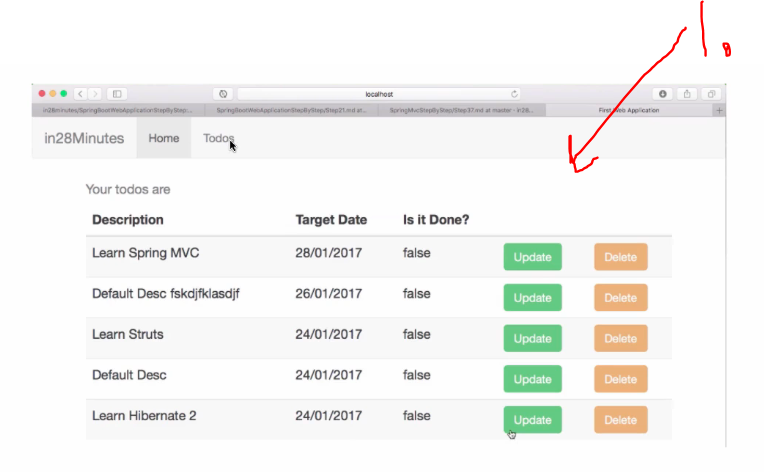

1. This application is **not** designed for **web services**!
    - It is designed for **human** to **human** interaction!

### Web service should be having

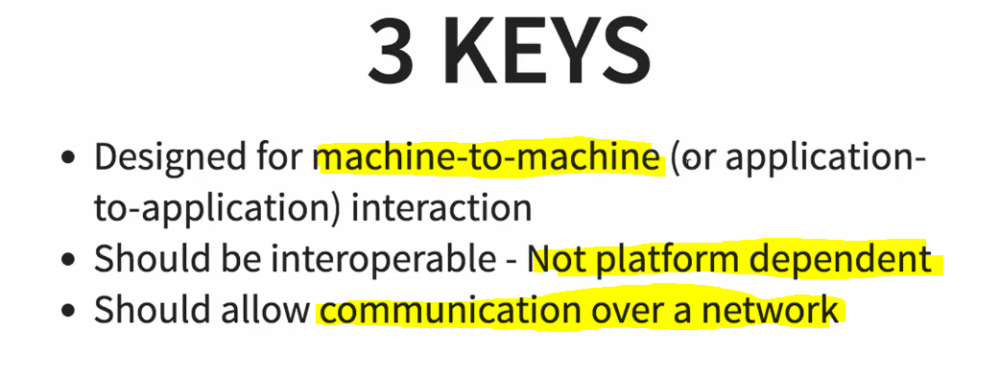

# 7. Important How Questions related to Web Services

- **Application** calling **Web Service** and its responding.

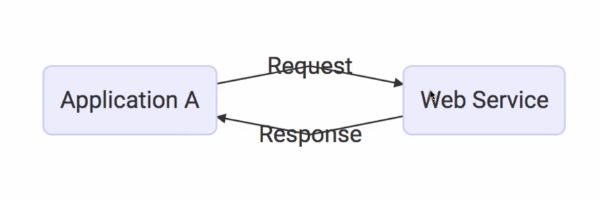

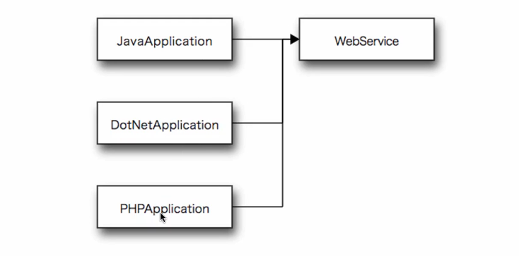

- Not platform independent.

# 7. Important How Questions related to Web Services

- **Request** and **Response** should be data exchange independent.

- There is **two** popular data exchange format.

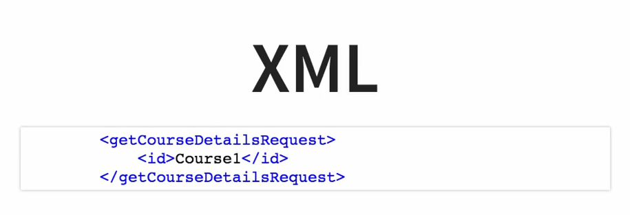

 

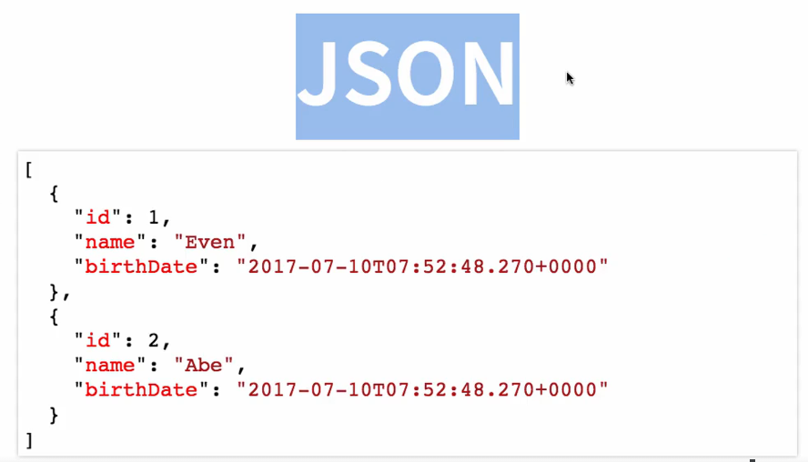

 

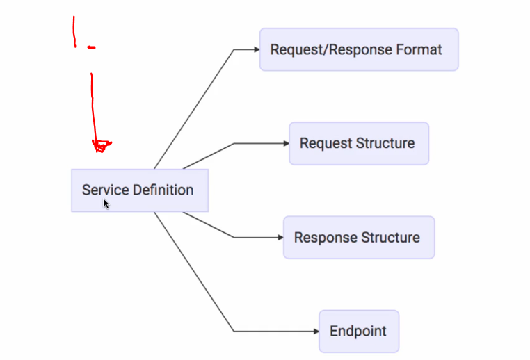

1. **Service definition** is telling request, response, format of response, where to send.

# 8. Web Services - Key Terminology

- **Transport**. How service is called.
    - Is over internet  **HTTP** or over **MQ**.

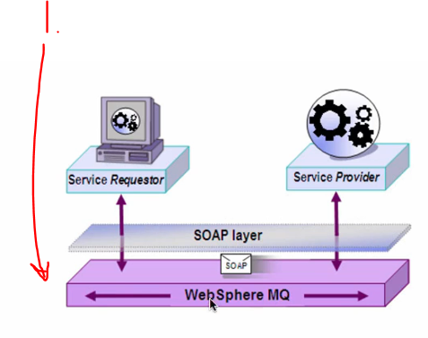

1. MQ can be any provider.

# 9. Introduction to SOAP Web Services

- There is two main groups of web services.

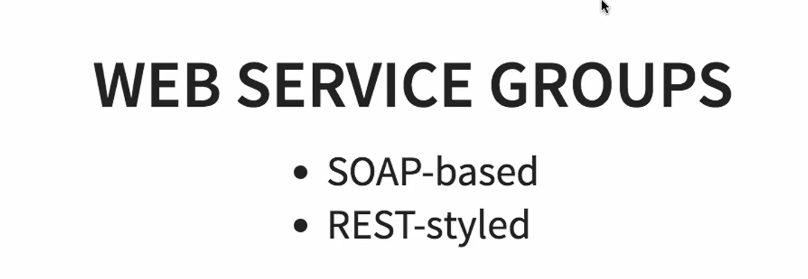

- These two are **not** comparable.
    - REST architectural approach.
    - Restrictions on **XML** which is exchanged between service and consumer.

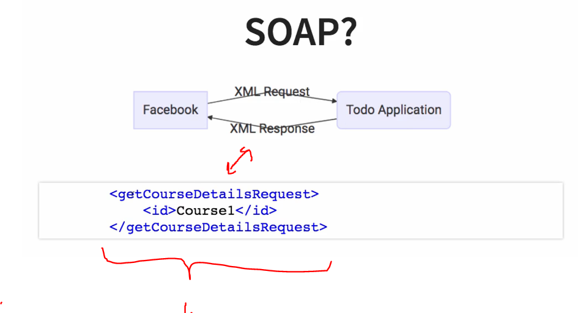

1. SOAP using **XML** for request and responses.

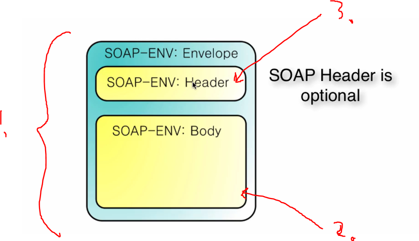

1. Defines the structure.
2. Message is inside body.
3. Header has authentication information etc.

- Example SOAP response below.

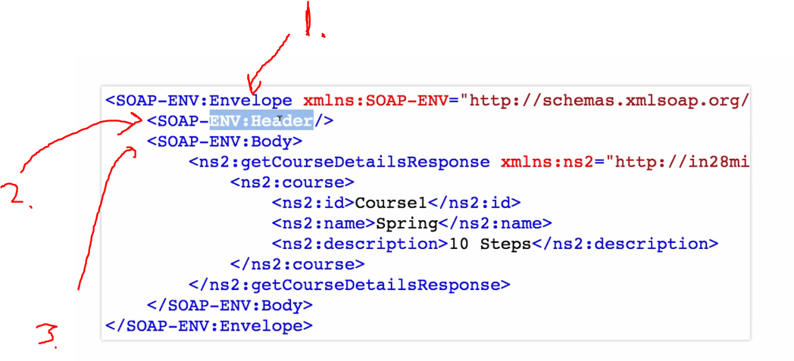

1. We can see **Envelope**.
2. We can see **Header**.
3. We can see **Body**.

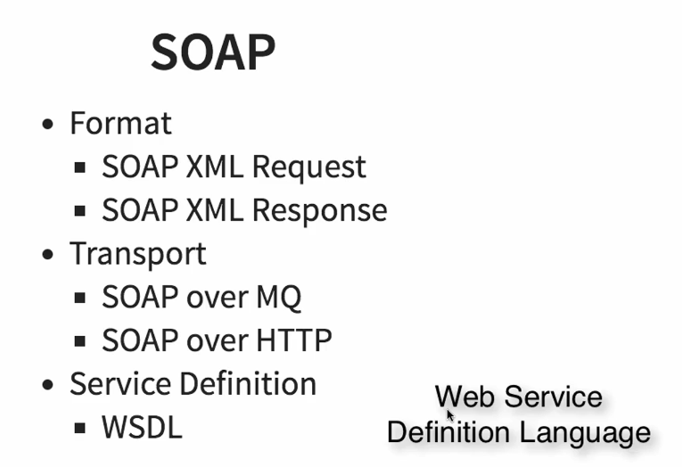

 

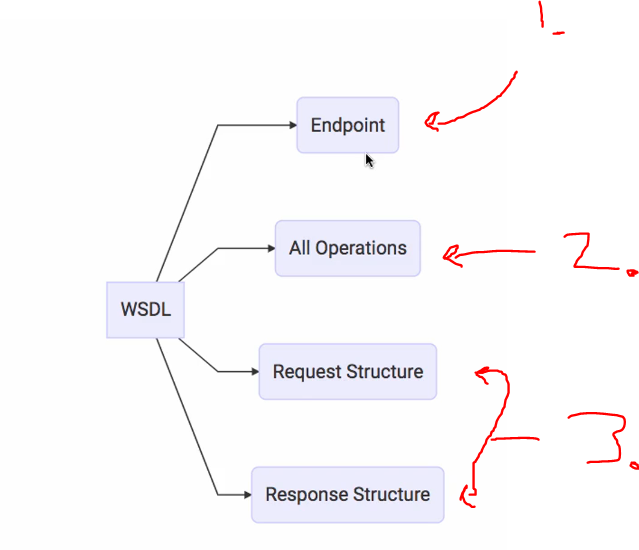

1. Where endpoint is exposed.
2. All the operations allowed.
3. **Response** and **Response** structures.

# 10. Maximizing Learning Efficiency with Playback Speed

- Time is money 

# 11. Introduction to RESTful Web Services

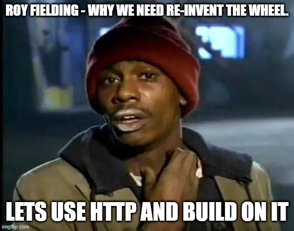

- **Roy Field** why we need re-invent the wheel.

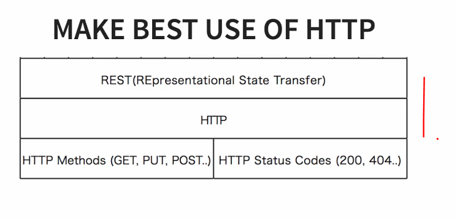

1. REST is wanted to be best usage of HTTP.

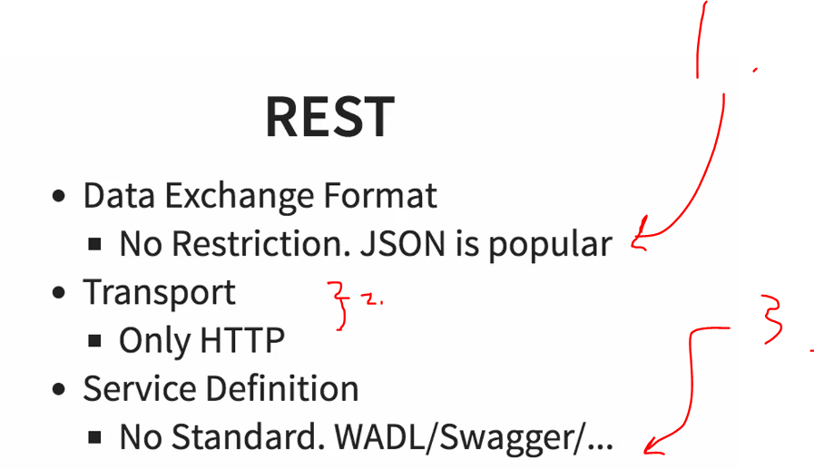

1. There is no contract for data format like in **SOAP**.
2. In **REST** it needs to happen in **HTTP**.
3. **Service Definition** there is no one standard for **REST**. **SWAGGER** is getting popular.

# 12. SOAP vs RESTful Web Services

- REST vs SOAP is not apple to apple comparison.

- **REST**:full services are usually more easily implemented than **SOAP**. 

# 13. How to remember things for long time

- Review chapters.